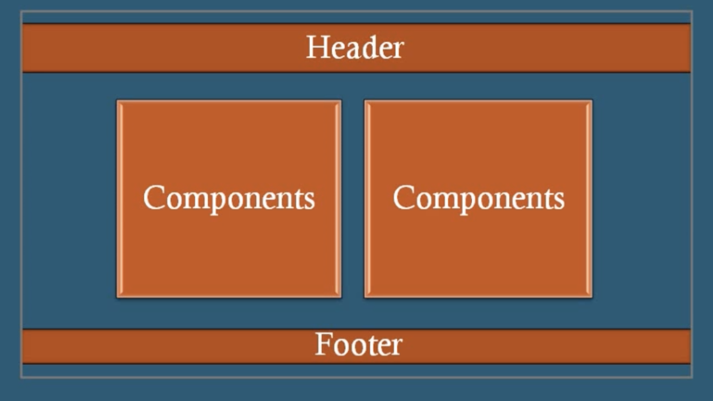
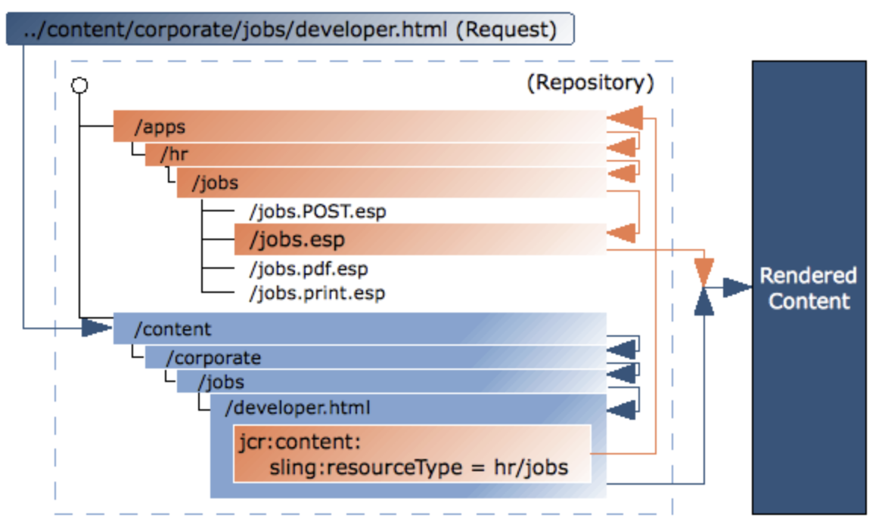
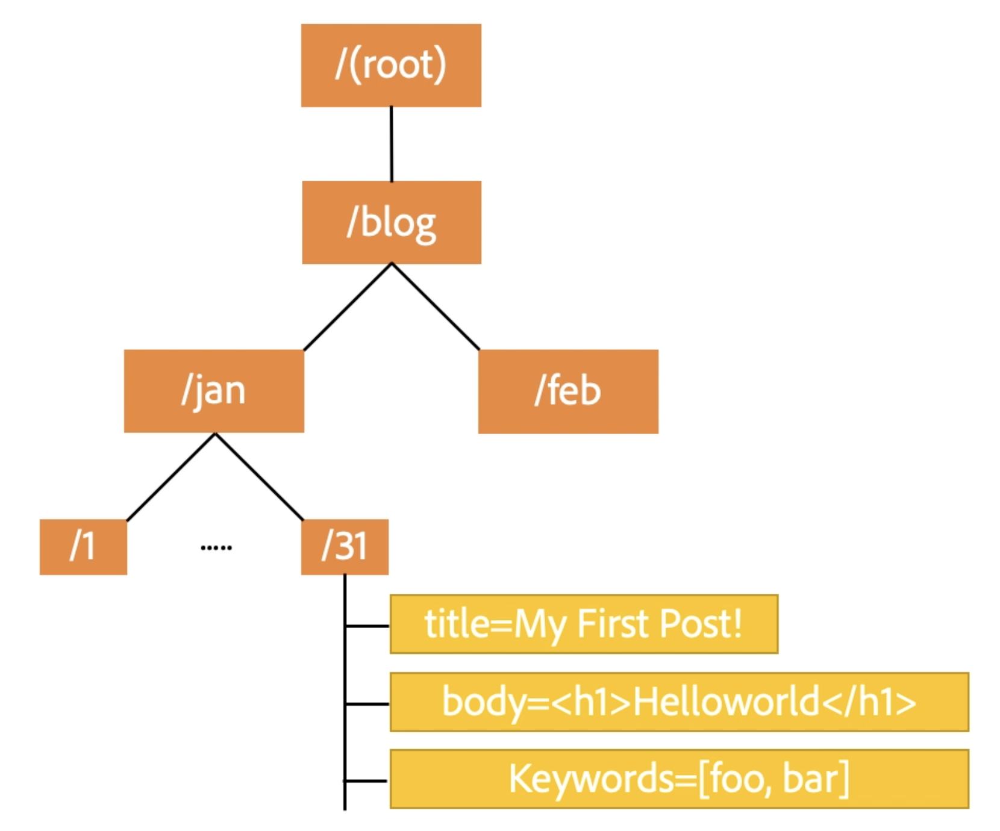
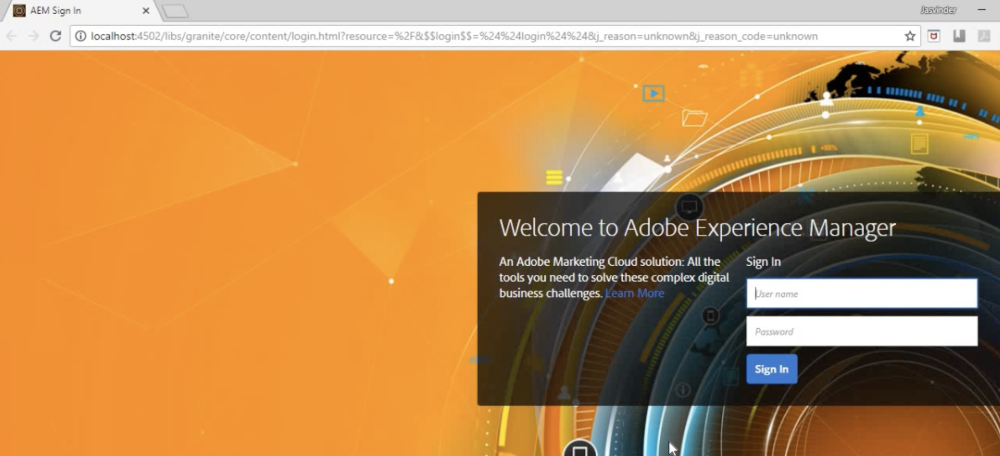

> AEM 을 소개함에 있어 해당 과정은 Udemy의 https://www.udemy.com/course/adobe-experience-manager-63 과정을
> 영어가 어려운 사람들을 위해 한국어로 정리하는 데 목적이 있음을 밝힌다. AEM 관련해서 체계적으로 정리해둔 블로그를 찾지 못했기 때문이기도 하다.

 

## AEM 소개

- AEM은 'Adobe Experience Manager' 의 약어이며, 어도비 사에서 만든 Java 기반의 CMS 솔루션이다.
  AEM은 상용 웹 사이트를 만드는 데 많이 사용되며 웹 사이트의 콘텐츠와 asset 들을 관리하기에 용이하며 배포까지 지원한다.

 

> ### 웹사이트와 CMS
>
> 웹 사이트에는 3가지 종류가 있다.
>
> 1. Static 웹 사이트
>    : 정적 리소스로만 이루어진 웹 사이트이다.
> 2. Dynamic 웹 사이트
>    : 클라이언트/서버의 스크립트를 통해 동적으로 웹 사이트의 콘텐츠를 관리하는 웹 사이트이다.
> 3. CMS
>
> - template을 생성할 수 있다
> - 재사용 가능한 Component를 생성하고 publish할 수 있다.
>   AEM은 CMS의 한 종류이며 아래와 같은 구조를 통해 페이지를 구성한다.
>
> 

 

### 1. AEM의 컨셉

- 파일 시스템과 유사한 JCR repository라는 곳에 모든 것을 저장하는데 이게 무엇인 지는 이후에 살펴보자.
- 2가지 방식의 UI가 있고 주로 Touch UI 방식을 사용한다.
  - Touch UI
    - 디폴트 UI이며 반응형 기능을 제공한다.
  - Classic UI
    - 반응형이지 않고 Desktop 페이지만을 지원한다 .
- OSGI, JCR, Apache Sling 을 기반으로 한다.

### 2. Author와 Publish

- Author
  - 콘텐츠와 페이지를 CRUD할 수 있으며 해당 작업이 Publish에 **Activate** 하기 전에는 웹 사이트에 연동되지 않는다.
- Publish

  - Public에 공개된 was로 보면 되며, publish에 반영된 내용은 웹 사이트에서 바로 반영된다.
  - Author의 내용은 activate을 통해 publish에 반영되고 deactivate을 통해 삭제된다.

- Replication
  - Content를 Author -> Publisher 로 복사하는 것인데 개념 상 Activate을 통해서 replication을 구현 한다고 보면 될 것 같다.
  - Publihser -> Author로 복사하는 것은 Reverse replication이라고 한다.
  - Replication Agent
    - replication을 자동화 하기 위한 기능인 것 같다. Author에서 Activate을 하면 Replication queue에 쌓이고 publish는 queue에 있는 변경사항을 가져와서 반영한다.

### 3. Sling이란?

AEM에서 콘텐츠의 저장소로 사용되는 JCR을 이해하기에 앞서 Apache Sling(줄여서 그냥 Sling)이 무엇인지 알아야 한다.
Sling의 목표는 콘텐츠 저장소의 콘텐츠를 HTTP 리소스로 나타내 RESTful한 애플리케이션을 개발하는 것이다.
AEM에서 JCR은 Sling을 통해 Web에 노출된다고 이해할 수 있다.

URL로 AEM에 요청이 들어오면, ( ex. req: /content/corporate/jobs/developer.html)

1. 가장 먼저 JCR의 node를 찾고,
2. 해당 node의 sling:resourceType 값을 통해 렌더링 시 사용할 스크립트를 찾는다.
3. 찾은 스크립트의 실행을 거쳐 콘텐츠를 화면에 렌더링한다.

- 모든 Sling 스크립트는 /apps 또는 /libs 하위 폴더에 저장한다.

### 4. JCR (Java Content Repository) 란?

JCR은 Contents를 Repository로서 사용하기 위한 Java에서 제공하는 인터페이스라고 정의할 수 있으며,
JCR은 아래와 같은 트리구조의 저장소로서 Node와 Property로 구성된다.
/blog/jan/31/title/ 과 같이 url로서 리소스에 접근 가능하다.

JCR의 Node와 Property는 다음과 같은 정보를 지닌다.

- node type
  - 노드의 타입이 folder인지, file인지, unstructured 인지를 정의한다.
- mixin type
  - versionable, lockable 과 같은 버전과 잠금 여부에 대한 정보
- value property : 1개일 수도 있고 여러 개 일 수 있다.
- child nodes : 자식 노드에 대한 정보를 담고 있다.

JCR은 RDBMS와 File system의 특징을 모두 가지고 있으며 다른 여러가지 기능을 지원한다.

- RDBMS의 특징인 Transaction, query, 정형 데이터 저장, 무결성
- File system의 특징인 계층구조, 리소스 잠금, 접근 제어
- 뿐만 아니라 풀텍스트검색, 버져닝, 비정형데이터 저장 등을 지원한다.

 

## AEM 설치

- AEM은 Author와 Publishe라는 것이 있는데, 이에 대해서는 나중에 다룰 것이다.
  지금은 Author와 Publishe는 둘다 AEM 인스턴스이지만, 역할을 나눈 것으로 이해하면 될 것 같다.

- 서버에 Author, Publisher를 설치할 때
  cq-author-p4502.jar, cq-publish-p4503.jar 과 같은 /aem/author/ 또는 /aem/pubilhser 경로에 jar파일을 설치한다.
  이렇게 하면 localhost:4502 에는 Author가 실행되고, localhost:4503에는 publisher가 실행된다.
- 각 인스턴스의 디렉토리에는 위의 jar파일과 함께 license.properties가 존재해야 하며, jar파일은 처음 실행될 때 crx-quickstart라는 디렉토리를 자동으로
  생성하게 된다.
- jar가 실행되고 crx-quickstart 디렉토리가 생성되었다면 localhost:4502에서 아래와 같이 확인할 수 있다.

 

## AEM 콘솔의 종류

AEM 콘솔은 5가지 종류가 있으며 각 콘솔의 경로는 https://localhost:4502/ 에 각 콘솔의 경로를 추가해주면 접속할 수 있다.

1. Admin 콘솔
   : /siteadmin
2. CRX 콘솔
   : /crx/explorer/index.jsp
3. OSGI management 콘솔
   : /system/console
4. CRXDE Lite 콘솔
   - 경로: /crx/de
   - template, component를 생성하는 등 개발자가 사용하는 AEM의 IDE 역할을 한다.
5. Package 매니저 콘솔
   - 경로 : /crx/packmgr/index.jsp
   - 배포 관련하여 패키지를 관리하는 콘솔
   - 'Upload package'를 통해 zip파일인 패키지를 업로드할 수 있고, 업로드 되고 나면 install 버튼을 눌러 설치가능하다.
