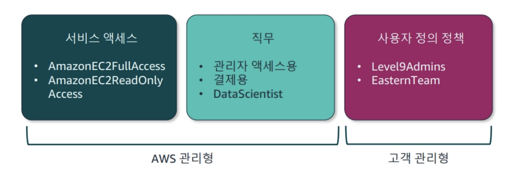

### 보안 주체와 자격증명
보안주체란 AWS리소스에 대한 작업을 요청할 수 있는 엔티티
- root user
- IAM user 
- IAM group
- Role 

### IAM 구성요소
- User
- Group : user는 여러 그룹에 속할 수 있다. 
- Policy : json으로 구성된 권한을 담은 document
- Role : 임시 권한 부여(안전모)할 떄 사용

## 보안 정책
- IAM 자격증명 기반 정책 ( 열쇠 들고 따고 들어가는 유형 )
- IAM리소스 기반 정책 ( 경비원이 문 열어주는 유형 ) 

### IAM 자격 증명 기반 정책
자격 증명 기반 정책의 경우 아래와 같다. 

1. 서비스 액세스
  - AmazonEC2FullAccess
  - AmazonEC2ReadOnlyAccess
2. 직무 
  - AdministratorAccess
  - Billing
3. 사용자 정의 정책
  - DiChaTeam ...

자격증명 기반 정책은 다음과 같이 작성할 수 있다.

### IAM 리소스 기반 정책 
리소스 기반의 정책은 S3버킷이나 Lambda함수와 같은 단일 리소스에 연결되며 어떤 사용자가 무슨 작업을 수행할 수 있는 지를 명세한다. 
리소스 기반 정책은 자격증명 기반 정책과 함께 평가되며, 상호 보완적이며 거부 우선적이고 교집합이다. 

### 정책 요소
- Effect (필수)
- Principal : 리소스 기반 정책에서는 반드시 작성해줘야 한다.
- Action (필수)
- Resource (필수)
- Condition

### 명시적 허용 및 명시적 거부 
: 기본적으로는 거부이며, 명시적으로 허용된 경우에만 허용된다. 

### 다중 계정 사용
- AWS organization

### 프로그램 방식의 access에 사용되는 인증방식
- accessKey
- secretAccessKey