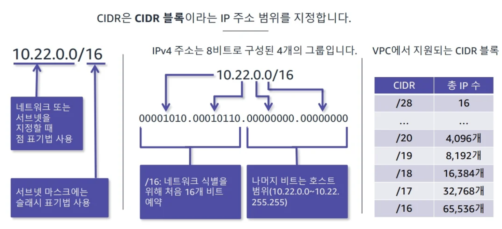
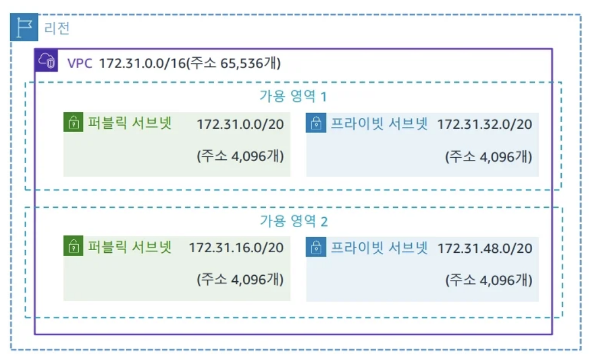

## 개요
- 워크로드를 지원하기 위해 충분한 IP주소가 네트웍에 있는 지를 어떻게 확인하는가?
- AWS 계정에 안전한 동적 네트워크 인프라륵 구축하는 방법은 무엇인가?
- 네트워크의 리소스 보호를 위해 인/아웃바운드 트래픽을 필터링하는 방법은 무엇인가? 

### IP 주소 지정 
-> 워크로드를 지원하기 위해 충분한 IP주소가 네트웍에 있는 지를 어떻게 확인하는 하는가? 
 
-> 즉 데이터 센터를 얼마나 크게 지을 것인가와도 관련이 있다.
 
ip주소는 네트워크와 호스트를 식별한다. IPV4는 고갈되었기 때문에 NAT 대역을 사용하며 **RFC1918**규약에 따라 보통 10.대역, 192. ,172. 대역을 사용한다.

### CIDR ( classless inter-domain routing ) 
IP를 예전에는 클래스 단위로 나누었지만 해당 방법은 비효율적이어서 CIDR방법을 요즘에는 사용한다.

VPC에서 지원되는 CIDR블록
- /16 : 65536개
...
- /28 : 16개 

## VPC(Virtual Private Cloud)
default VPC는 사용하지 않고 사용자가 직접 VPC를 구성하여 사용하는 것이 권장된다.

### Amazon VPC
- 워크로드를 논리적으로 격리할 수 있으며 리소스에 사용자 정의 액세스 제어 및 보안 설정 사용 가능하다.
- 단일 AWS 리전에 연결된다. 
- VPC는 모든 가용영역을 포함한다.
- 인터넷 게이트웨이가 VPC에 에 있어야 외부와 통신가능하다.

### 서브넷
서브넷은 VPC CIDR 블록의 하위 집합이다. 각 서브넷은 하나의 가용영역 내에 포함되며 하나의 가용 영역에서는 여러 서브넷을 가질 수 있다. 
앞에서 4개 뒤에서 1개 주소는 aws에서 관리 목적으로 가져가기 때문에 사용불가하다. 
서로 다른 서브넷에 서버를 두어 여러 가용영역을 활용하는 것이 HA관점에서 좋다. 

> #### public 서브넷
>  서브넷과 associate된 라우팅 테이블에 인터넷 게이트웨이를 타고 가도록 기록한다. 
>  - Route table
>     
>    0.0.0.0/0 | IGW-XYZ1234....
>     
>    172.31.0.0/16 | local

  AWS route table에 라우팅을 설정하면, AWS 내부적으로 VPC내에는 router가 실제 존재하여 서브넷 사이의 routing을 처리해준다.

> #### private 서브넷
>  기본적으로 서브넷을 만들면 private이다. 서브넷이 public subnet이 되기 위해서는, 
>  - subnet 설정에서 자동 public ip 설정이 되어 public ip가 instance에 할당되도록 해야 하고, 
>  - associate route table에서 IGW로 라우팅되도록 설정해야 한다.
>
>  그러나 private subnet도 외부와 통신(outbound)할 수 있는 방법이 있는데 NAT gateway를 구성(NAT gateway는 public subnet에 locate한다)하여 associate route table에 아래와 같이 구성해주면 된다.
>   
>  0.0.0.0/0 | nat-xxxxxxyyyzyzzz  <- 외부로 outbound시 routing
>   

### 탄력적 IP주소
- 기본적으로 리전/계정 당 5개로 제한되지만, 요청하면 늘려준다.
- BYOIP 지원 : 기존 보유 ip가져오기

### 탄력적 네트워크 인터페이스
VPC내의 논리적 네트워킹 구성 요소이다. 
- 같은 가용 영역의 리소스 간에 이동이 가능하다. 
- private ip주소, 탄력적 ip주소 및 MAC address가 그대로 유지된다. 

---

## VPC 네트워크 보안
기본적으로 2가지이다.
-  NACL
- 보안그룹
[다중 방어 계층이 있는 인프라 설계 이미지]

### 네트워크 엑세스 제어 목록(NACL)
- 서브넷이 경계에서 방화벽 역할을 한다.
- 인/아웃바운드 모두 해당되며 기본적으로는 모든 트래픽이 허용된다.

### 보안그룹
모든 인스턴스에는 보안그룹이 설정되어 있다.

### 보안 그룹 연결( chaining ) 
[체이닝 이미지] 

### 보안 그룹과 NACL 비교 
[표 이미지]