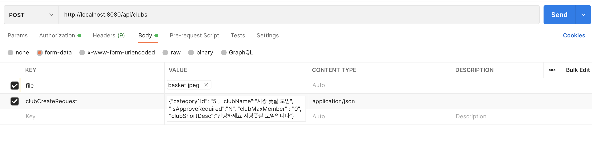

Spring boot 개발환경에서 AWS S3를 활용하여 파일을 업로드하고 이를 DB를 URL로 저장하는 방법과
파일 명을 이용해서 S3로부터 파일을 다운로드 하는 방법에 대해서 알아보자. 

### 1. Spring boot 의존성, 환경 설정

- build.gradle

    ```
    implementation 'io.awspring.cloud:spring-cloud-starter-aws:2.3.1'
    ```

- app.properties

    ```
    #AWS 접근 키
    cloud.aws.credentials.accessKey=accesskey값
    cloud.aws.credentials.secretKey=secretkey값
    # AWS S3 버킷정보
    cloud.aws.s3.bucket=onyou-bucket
    cloud.aws.region.static=ap-northeast-2
    cloud.aws.stack.auto=false
    # 파일 업로드 크기 설정
    spring.servlet.multipart.max-file-size=20MB
    spring.servlet.multipart.max-request-size=20MB

    ```

### 2. S3 Config 클래스 설정

위 application.properties에서 설정한 accessKey, secretkey, region값을 @Value 어노테이션을 활용하여 
AwsS3Config 클래스에서 가져와서 AWSCredential을 설정한다. 

이 때 나는 jasypt를 활용해서 key값을 보호하도록 했는데 해당 내용은 [이 글](https://jjunyong.github.io/aws_jasypt/)을 참고하자.

```java
@Configuration
public class AwsS3Config {

    @Value("${cloud.aws.credentials.accesskey}")
    private String accessKey;

    @Value("${cloud.aws.credentials.secretkey}")
    private String secretKey;

    @Value("${cloud.aws.region.static}")
    private String region;

    @Bean
    public AmazonS3Client amazonS3Client() {

        BasicAWSCredentials awsCreds = new BasicAWSCredentials(decryptAccessKey,decryptSecretKey);
        return (AmazonS3Client) AmazonS3ClientBuilder.standard()
                .withRegion(region)
                .withCredentials(new AWSStaticCredentialsProvider(awsCreds))
                .build();
    }
}
```

### 3. S3 업로드 Controller 설정

나는 본 글의 title처럼 Club이라는 entity를 생성할 때 S3에 썸네일 이미지가 업로드 됨과 동시에 DB에 S3에 업로드된 이미지의 URL도
저장되도록 설정하도록 하였다. 

그리고 그러기 위해서 @RequestPart 어노테이션을 활용하여

controller 단에서 createClub이라는 API를 호출 시에 file과 함께 clubCreateRequest DTO를 함께 전달 받도록 하였다.

이 때 클라이언트에서 요청 시에 clubCreateRequest의 content-type을 반드시 application/json으로 지정해준 form data로 전송해야 함에 유의하자. 

controller의 구조는 다음과 같다.

- form-data로 DTO와 File값을 함께 받아온다.
- 받아온 파일이 존재하는 지 확인 
- awsS3servce.uploadFile에 파일을 넘겨서 업로드를 수행한 후 업로드 한 url을 리턴받음
- 리턴받은 url을 thumbnailUrl이라는 DTO의 필드에 저장한후 DTO를 createClub에 전달하여 Club 생성할 때 url도 함께 반영되도록 함 

```java
@RestController
@RequestMapping("/api/clubs")
public class ClubController {

    @Autowired
    private ClubService clubService;
    @Autowired
    private AwsS3Service awsS3Service;
    }

    @PostMapping("")
    public Header<String> createClub(@RequestPart(value = "file", required = false) MultipartFile thumbnail,
                                     @Valid @RequestPart(value = "clubCreateRequest")
                                             ClubCreateRequest clubCreateRequest,
                                     HttpServletRequest httpServletRequest){

        if(thumbnail.isEmpty()){
            throw new CustomException(ErrorCode.FILE_EMPTY);
        }


        String thumbnailUrl = awsS3Service.uploadFile(thumbnail); //s3에 저장하고 저장한 image url 리턴
        clubCreateRequest.setThumbnailUrl(thumbnailUrl);

        Club club = clubService.createClub(clubCreateRequest);

        return Header.OK("club_id: "+ club.getId());
    }
```

### 4. S3 Service 설정

S3 service 에서는 controller에서 전달받은 image를 업로드해주고 반환값으로 업로드한 url을 리턴하는 과정을 수행한다. 

프로세스는 다음과 같다.

- s3에 업로드할 파일명 생성
  - original파일명(업로드된 파일명)으로 확장자 존재여부 체크 ( getFileExtension 메소드 )
  - key 값으로 original파일명으로 파일명 랜덤값 생성 ( createFileName 메소드 ) 후 뒤에 '_original파일명' 붙여줌

- S3에 파일업로드
  - bucket, key, objectMetadata 으로 pubObject 메소드 통해서 s3에 업로드 수행 

- return값으로 url 리턴 

```java
@Service
@RequiredArgsConstructor
public class AwsS3Service {

    @Value("${cloud.aws.s3.bucket}")
    private String bucket;

    private final AmazonS3 amazonS3;

    public String uploadFile(MultipartFile file,  Long userId) {

        String fileName = createFileName(file.getOriginalFilename());
        ObjectMetadata objectMetadata = new ObjectMetadata();
        objectMetadata.setContentLength(file.getSize());
        objectMetadata.setContentType(file.getContentType());

        String key = fileName+"_"+file.getOriginalFilename();
        try (InputStream inputStream = file.getInputStream()) {
            amazonS3.putObject(new PutObjectRequest(bucket, key, inputStream, objectMetadata)
                    .withCannedAcl(CannedAccessControlList.PublicRead));
        } catch (IOException e) {
            throw new ResponseStatusException(HttpStatus.INTERNAL_SERVER_ERROR, "파일 업로드에 실패했습니다.");
        }

        return amazonS3.getUrl(bucket, key).toString();
    }

    private String createFileName(String fileName) { // 파일명 random값 생성
        return UUID.randomUUID().toString().concat(getFileExtension(fileName));
    }

    private String getFileExtension(String fileName) { //  파일 명에 '.' 의 존재 여부 체크 
    
        try {
            return fileName.substring(fileName.lastIndexOf("."));
        } catch (StringIndexOutOfBoundsException e) {
            throw new ResponseStatusException(HttpStatus.BAD_REQUEST, "잘못된 형식의 파일(" + fileName + ") 입니다.");
        }
    }
}

```

<br>
여기까지 S3 파일 업로드를 위한 모든 환경설정이 끝났다. 

이렇게 해주고 나서 postman을 활용해서 아래와 같은 형태로 설정하고 테스트 하면 정상적으로 파일 업로드가 되고, 
DB에 URL이 저장됨을 확인 할 수 있다. 물론 당연히, clubService.createClub메소드에서 DTO를 통해 DB에 데이터를 저장하는 로직과
DB에 해당하는 테이블과 컬럼이 존재해야 한다. 



----


