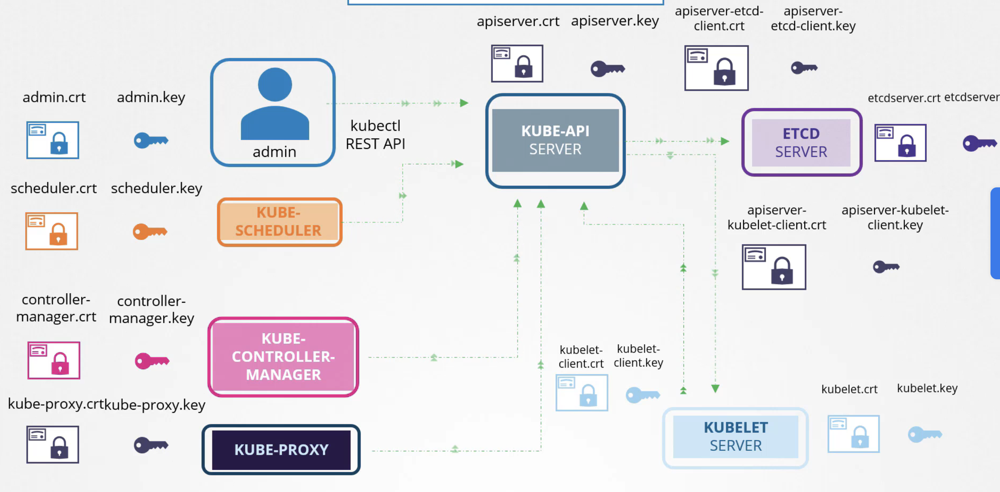
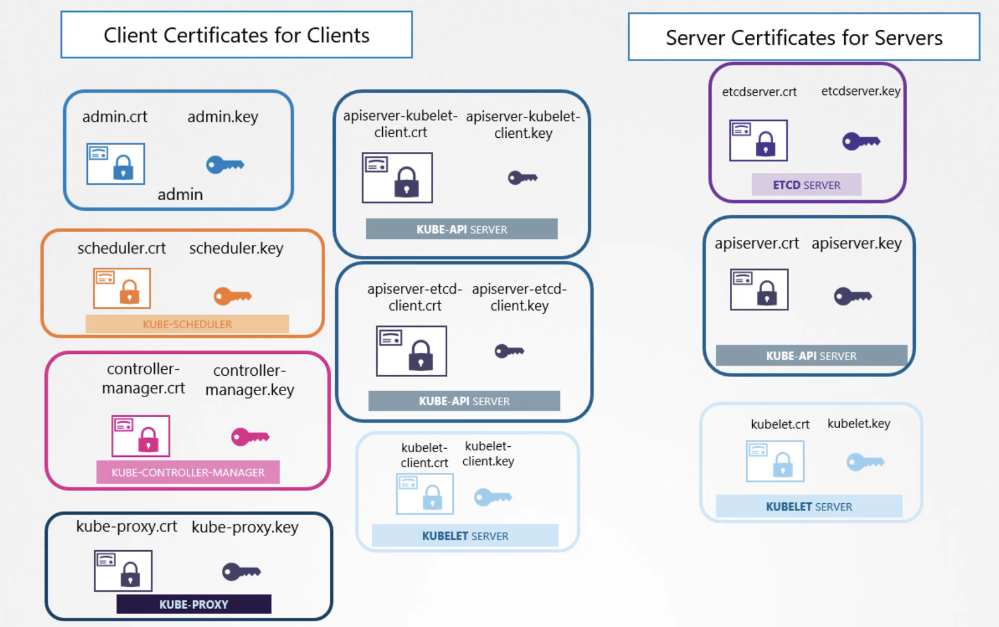
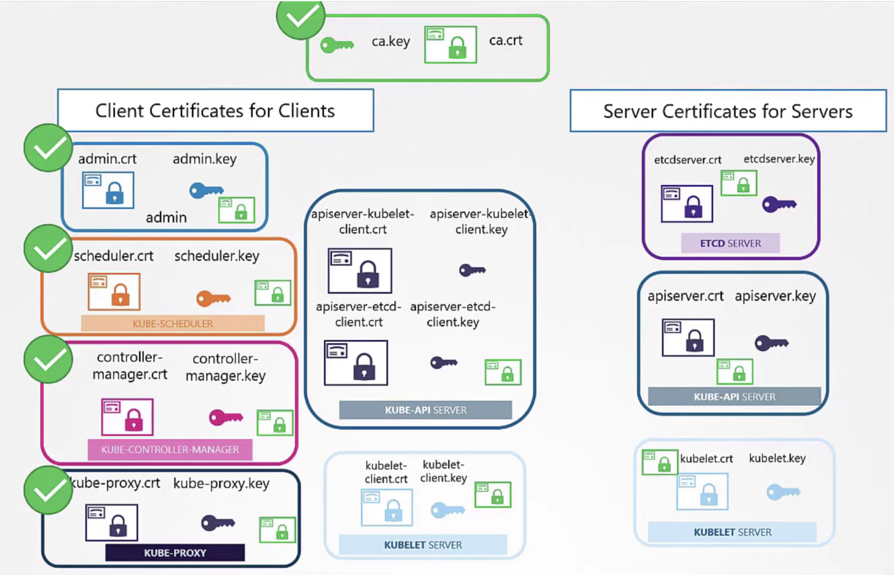
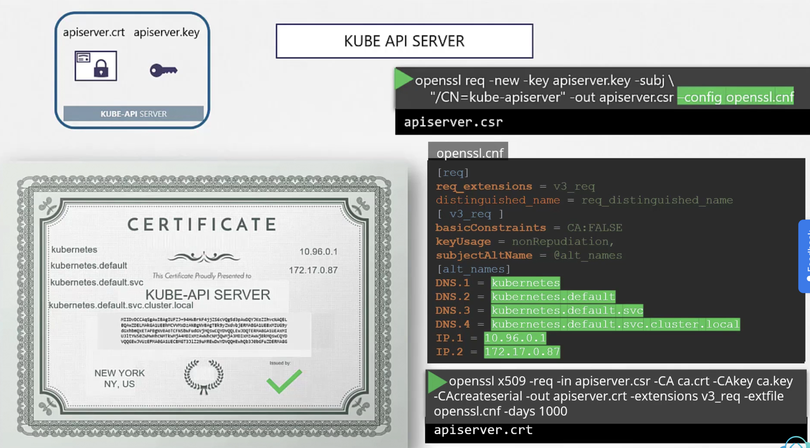
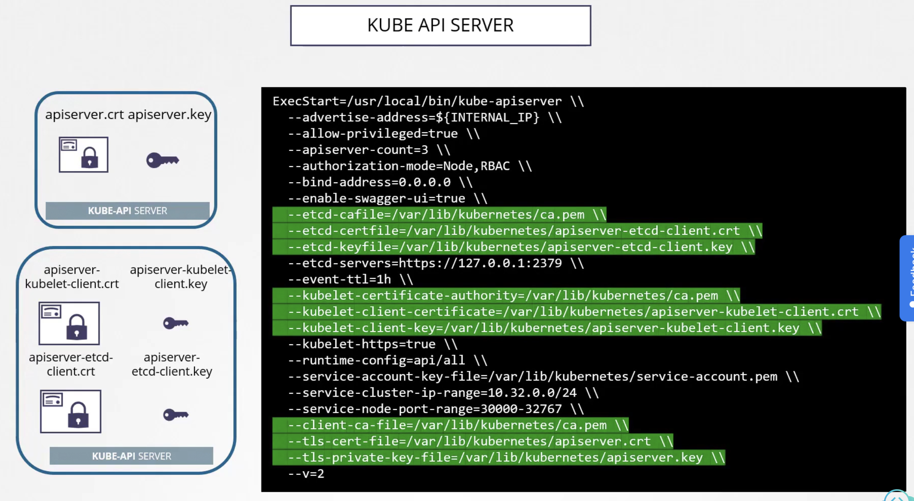
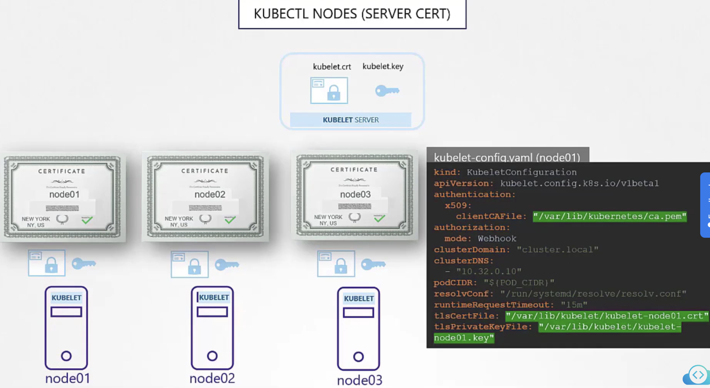
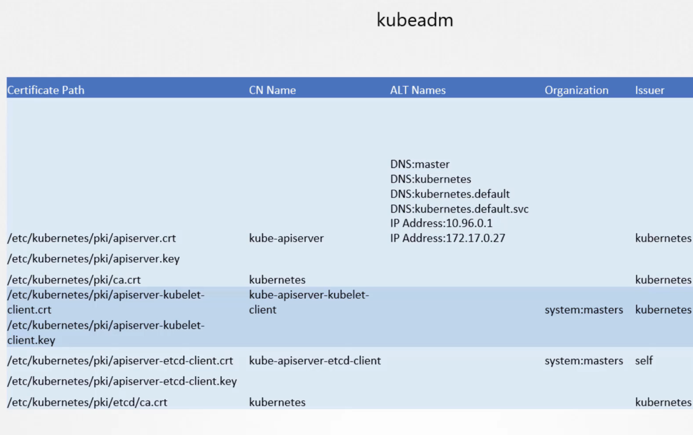

### Cloud Native 보안의 4C
- Cloud : Datacenter, network, servers
- Cluster : Auth, Admission, NP
- Container : Restrict image, supply chain, sandboxing, privileged
- Code : Code security

### CIS Benchmark
- CIS는 커뮤니티 기반의 오픈소스 단체로서 세상의 사이버 보안을 향상하는 데 기여한다. 
- CIS는 k8s 뿐만 아니라 다양한 IT 표준 기술들( web, was, db, OS, network )에 대해서 보안에 대한 best practice를 제공한다.
- CIS-CAT을 사용하면 현재 k8s 클러스터의 취약점을 html로 생성해준다. 
  - 그러나 CIS-CAT pro만 k8s assessment를 지원하며 유료이다. 

### Lab : CIS benchmark on Ubuntu OS (CIS-CAT)
- CIS-CAT 실행 
  - `sh ./Assessor-CLI.sh -i -rd /var/www/html/ -nts -rp index`
  - OS 선택 Ubuntu 20.04 LTS 
  - Profile 선택 : Level1 - server
이렇게 하면 /var/www/html 경로에 index.html 파일로 현재 설치된 OS인 ubuntu 20.04 에 대한 취약점 보고서가 생성되며 보고서의 remediation을 참고하여 보안에 필요한 설정을 조치하면 된다. 

### Lab : Kube-bench
- kube-bench 설치 
```bash
curl -L https://github.com/aquasecurity/kube-bench/releases/download/v0.4.0/kube-bench_0.4.0_linux_amd64.tar.gz -o kube-bench_0.4.0_linux_amd64.tar.gz
tar -xvf kube-bench_0.4.0_linux_amd64.tar.gz
```
- kube-bench test
```bash
./kube-bench --config-dir `pwd`/cfg --config `pwd`/cfg/config.yaml
```
  - controlplane, worker, master, etcd 등 k8s 주요 컴포넌트에 대한 security 항목 pass/fail 결과를 알 수 있다. 

- kube-bench test 결과의 가이드에 따른 취약점 조치 
  - 주로 static pod ( kube-scheduler, kube-controller-manger)
  

## K8S Security Primitive 
Kube-apiserver가 거의 대부분의 cluster 작업이 가능하기 때문에 이것으로의 접근을 제어하고 권한을 관리하는 것이 매우 중요하다. 

### Authentication ( who can access ?)
#### Users
- k8s는 직접 'user'라는 리소스를 관리하지는 않는다. 
- username, password/token 에 대한 파일을 kube-apiserver가 참조하여 인증하도록 할 수 있지만 권장되지는 않는 방법이며 최신 k8s에서는 지원되지 않는다.  
#### serviceaccount
- Prometheus, Jenkins, k8s dashboard와 같이 다른 application에서 kube-apiserver와 상호작용이 필요할 때 serviceaccount를 생성하여 사용한다. 
- serviceaccount를 생성하면 secret으로 토큰값을 관리하며, sa는 이를 참조한다. curl로 api-server에 접속 시에는 이 토큰 값을 header authorization에 bearer로 넣어주면 인증이 가능해진다. 
- 3rd party application이 클러스터 내에 존재한다면, pod에 volume으로서 sa의 secret을 mount해주면 자동 인증이 된다. 
- 모든 k8s의 namespace에는 'default serviceaccount' 가 자동 생성되며 pod를 띄우게 되면 별도 명시해주지 않아도 pod에 sa의 secret과 token이 자동으로 마운트 되었다. 

#### Serviceaccount의 변화 : v1.22, v1.24
- v1.22 
  - v1.22 이전에는 serviceaccount가 생성 시 secret이 자동 생성되며 secret은 token 값을 내포하고 있었다. 이것은 expiration이 따로 없고 특정 사용자에 귀속된 것도 아니었다. pod를 생성하면 자동으로 default serviceaccount의 secret이 pod에 마운트 되어서 인증에 사용되는 방식이었다. 
  - 그러나 v1.22 부터는 'Token request API' 를 사용하는 방식으로 개선되었다. 
    
  - serviceaccount admission controller가 Token request API로부터 얻은 토큰을 projected volume으로 pod에 위와 같이 마운트 시켜 주게 되었다.
- v1.24   
  - 그리고 나아가서 v1.24 부터는 serviceaccount를 생성 시에 secret과 token이 생성되지 않고, `kubectl create token <sa-name>` 을 해야 해당 sa에 대한 token이 expiry를 가지고 생성되게 되었다. 
  - 예전 방식 대로 secret을 사용하기 위해서는 아래와 같이 하면 된다.
    

아래와 같이 serviceaccount를 설정하면 7일 동안 토큰이 유지되고 7일 뒤 자동으로 새로운 토큰으로 갱신하게 된다. 그리고 automountServiceAccountToken 설정을 true로 하면 자동으로 pod에 토큰을 마운트하게 된다. 

```yaml
apiVersion: v1
kind: ServiceAccount
metadata:
  name: my-service-account
automountServiceAccountToken: true
expirationSeconds: 604800 # 7일 동안 토큰을 유지
```

> 참고: ( https://kubernetes.io/docs/concepts/configuration/secret/#service-account-token-secrets )
>Kubernetes 버전 1.22 이전에서는 Kubernetes API에 액세스하기 위한 자격 증명을 자동으로 생성했습니다. 이전 메커니즘은 실행 중인 Pod에 마운트할 수 있는 토큰 Secrets를 >생성하는 것을 기반으로 했습니다. 더 최근 버전인 Kubernetes v1.28을 포함한 Kubernetes의 최신 버전에서는 API 자격 증명을 직접 TokenRequest API를 사용하여 얻고, 프로젝트된 >볼륨을 사용하여 Pods에 마운트합니다. 이 방법으로 얻는 토큰은 제한된 수명을 가지며, 해당 Pod가 삭제될 때 자동으로 무효화됩니다.
>
>여전히 토큰이 만료되지 않는 토큰이 필요한 경우 수동으로 서비스 계정 토큰 Secret을 생성할 수 있습니다. 그러나 API에 액세스하기 위한 토큰을 얻기 위해 TokenRequest 하위 리소스를  >사용하는 것이 권장됩니다. kubectl create token 명령을 사용하여 TokenRequest API에서 토큰을 얻을 수 있습니다.

### TLS 
- 비대칭키 방식을 사용하여 암호화한다. 
  - private key 와 public Lock 으로 생각하면 쉽다.
- SSH의 비대칭키 암호화 방식 활용예 
  - 자물쇠인 공개키를 서버에 두고 서버에 접속하려는 사용자는 개인키를 가지고 서버에 접근한다. 
  
- https의 경우 이보다 다소 복잡하다. 대칭키, 비대칭키 암호화 방식을 모두 사용한다.
  - 대칭키를 전달하기 위해서 비대칭키 암호화 방식을 사용한다.
  - 메시지를 전달할 때는 클라이언트/서버에서 동일한 개인키로 암/복호화한다. 

### HTTPS의 TLS 동작 원리 


1. ssh-keygen에서 했던 것과 유사하게 openssl 명령을 활용하여 서버에서 개인키/공개키를 생성한다. 
2. 사용자가 처음 웹 서버에 접근 할 때 사용자는 서버로부터 1에서 생성한 공개키를 전달받는다. 
  - 이 때 공개키를 전달 받을 때 '인증서'안에 담아서 전달 받도록 한다. 그 이유는 뒤에 나온다. 
3. 사용자는 대칭키를 서버로부터 받은 공개키로 암호화하여 서버로 전달한다. 
4. 해커는 공개키에 대한 개인키가 없을 것이므로 대칭키를 알아낼 수 없고, 서버는 가지고 있는 개인키로 복호화하여 대칭키를 득한다.

그러나 또 다른 문제가 남아 있다. 만약에 해커가 신뢰할 만한 서버인 것처럼 사이트 UI등을 속여서 사용자가 해당 시스템에 접속하는 데 성공하게 했다고 가정하자.
그렇다면 사용자는 해커 서버로부터 공개키를 전달받게 된다. 이 때 앞서 언급했듯이 인증서를 통해 해당 공개키를 전달함으로써 신뢰할 수 있는 시스템으로부터 온 것인지를 검증할 수 있다. 
인증서에는 아래와 같은 정보가 담겨 있다.


그러나 또 여전히 문제가 남아있다. 해커가 certificate 까지 자기 임의로 만들어서 속일 수 있기 때문이다. 이를 self-signed certificate이라고 한다. 모든 브라우저는 인증서가 신뢰할만한 CA로부터 sign된 인증서인지를 체크하도록 만들어져 있다. 

그래서 아래와 같이 Symantec과 같은 CA(Certificate Authority) 기관에 CSR(Certificate Signing Request)을 통해 인증서를 sign받게 된다.  


브라우저는 어떻게 가짜 CA가 아닌 신뢰할 수 있는 CA로부터 sign된 것인지를 알 수 있는가? CA들은 모두 각자 개인키/공개키 쌍을 지니고 있고 **인증서를 sign할 때는 CA자체 개인키를 사용한다.** 그리고 모든 CA들의 공개키는 브라우저에 빌트인되어 있기 때문에 이를 이용하여 인증서가 정말로 신뢰할 수 있는 CA로부터 사인되었는지를 검증한다. 


> 엔터프라이즈 환경에서는 private CA 서버를 구축하여 CA의 공개키를 직원들의 브라우저에 빌트인 시키고 인증서를 private CA로부터 sign받게 하는 등 자체적으로 CA를 구축할 수도 있다. 

이러한 모든 일련의 환경와 구조를 가리켜 PKI라고 한다. 


#### Naming convention
- 공개키를 지니는 인증서는 보통 .pem, .crt 확장자를 지닌다. 
- 개인키는 보통 .key, -key.pem의 확장자를 지닌다. 

<br>

---
<u>**HTTPS 암호화 통신의 원리를 정리하면 다음과 같다.**</u>
1. openssl 명령을 활용하여 서버에서 개인키/공개키를 생성한다. 여기서 공개키는 곧 인증서를 의미한다. 
2. CA에서도 개인키/공개키를 가지고 있으며 서버에서는 CSR을 통해 1에서 생성한 자신의 인증서(공개키)를 sign해줄 것을 CA 서버에 요청한다.
3. CA서버에서는 CA개인키를 통해 인증서를 sign하여 요청한 웹 서버에 전달해준다. 
4. 이후 클라이언트가 웹 서버에 접근 하려고 할 때 사용자는 서버로부터 sign된 인증서(공개키)를 전달받게 된다.
5. 모든 브라우저에서는 CA공개키를 지니고 있기에 이를 활용하여 4에서 전달받은 인증서가 유효한지를 체크한다. 
6. 클라이언트에서 메시지 암복호화를 위한 대칭키를 생성한다. 
7. 클라이언트는 대칭키를 서버로부터 받은 인증서(공개키)로 암호화하여 서버로 전송한다.
8. 서버는 지니고 있는 개인키로 (1에서 생성한) 복호화하여 대칭키를 득한다.
9. 사용자는 앞으로 서버와 통신할 때 개인키로 암호화해서 메시지를 전송하며 서버는 7에서 최종적으로 득한 대칭키를 활용하여 복호화함으로써 안전한 보안 통신이 가능하게 되었다. 
---

### Kubernetes에서의 TLS
#### Server 인증서
- Kube-api server
  - apiserver.crt
  - apiserver.key
- ETCD server
  - etcdserver.crt
  - etcdserver.key
- Kubelet server
  - kubelet.crt
  - kubelet.key

#### Client 인증서
- Admin 유저
  - admin.crt
  - admin.key
- Kube-scheduler
- Kube-controller-manager
- Kube-proxy
- kube-apiserver는 ETCD server에 대한 유일한 client이며 kubelet에 대한 client이기도 하다.
- kubelet은 또한 kube-apiserver에 대한 client 이기도 하다. 




이러한 인증서를 생성하기 위해서는 CA가 필요한데, k8s에서는 최소 1개 이상의 CA를 요구한다. ETCD 서버를 위한 별도의 CA를 두기도 한다. 
그리고 CA는 CA만의 certificate(공인키)와 key(개인키)를 지닌다. 

#### 인증서 생성하기 
openssl 명령을 사용한다.

- CA에서의 작업 
  - 1) Key 생성
    ```bash
      openssl genrsa -out ca.key 2048
    ```
  - 2) CSR ( Certificate Signing Request ) 생성
    ```bash
      openssl req -new -key ca.key -subj "/CN=KUBERNETES-CA" -out ca.csr
    ```
  - 3) Certificate Sign하기 ( self-sign )
    ```bash
      openssl x509 -req -in ca.csr -signkey ca.key -out ca.crt
    ```
이제 CA는 private key와 root 인증서를 가지게 되었다.

- Admin 사용자에서의 작업 ( Client )
  - 1) Key 생성
    ```bash
      openssl genrsa -out adin.key 2048
    ```
  - 2) CSR 생성
     ```bash
      openssl req -new -key admin.key -subj "/CN=kube-admin/O=system:masters" -out admin.csr
    ```
      - /O=system:masters는 admin 사용자의 권한 부여를 위해 필요한 구문이다. 

    - kube-admin 이라고 적어준 것은 admin에 대한 네이밍을 한 것이며 어떤 이름이든 상관없다.
  - 3) Certificate Sign ( CA-sign )
    ```bash
      openssl x509 -req -in admin.csr -CA ca.crt -CAkey ca.key -out admin.crt
    ```

admin 유저 뿐만 아니라 kube-proxy, scheduler 등의 다른 컴포넌트도 동일한 방식으로 client certificate을 발급한다. 

앞서 웹브라우저의 TLS에 대해서 얘기할 때 모든 브라우저는 CA의 공개키(public certificate)을 지니고 있어서 서버로부터 받은 certificate을 클라이언트 단에서 유효한지 검증할 수 있다고 한 것처럼, k8s에서도 kuberenets-CA가 발급한 public certificate을 모든 client들이 가지고 있어야 한다.
  

- Kube-apiserver 에서의 작업 ( Server )  : 아래 그림 참조 
  - 1) Key 생성
  - 2) CSR 생성
  - 3) Certificate Sign ( CA-sign )


  - kube-apiserver에서 이렇게 생성된 key들은 어떻게 설정되는가? 
    
    <br>
    - 위 그림의 설정에서 볼 수 있는 것처럼 apiserver는 ETCD, Kubelet에 대하여는 client이기 때문에 각각의 컴포넌트에 접근하기 위한 client certificate, key를 가지고 있어야 한다
    - client-ca-file에서는 apiserver로 접근하려는 client가 가지고 있어야 할 ca인증서에 대한 정보를 설정하고 있다.
    - ETCD, kubelet 관련한 ca 설정에서도 동일한 경로의 ca인증서 정보로 설정하고 있음을 알 수 있다. 동일 클러스터에서 CA 인증서는 모두 동일하기 때문이다.
    - tls-cert-file,, tls-private-key에서는 apiserver의 서버 crt, 서버 key에 대해서 설정한다.

- Kubelet에서의 작업, 설정 
  - kubelet-config에서 yaml로 설정하여 관리하며 kube-apiserver에 대한 kubelet의 client certificate도 마찬가지로 여기서 관리한다. 
    
  
#### Cluster 내의 인증서 확인하기 
- 직접 설정하기 vs kubeadm
- kubeadm으로 프로비저닝 했을 때 인증서 관련된 설정이 어디에 있는 지는 아래와 같다.

- kubeadm 환경으로 했을 때는 static pod의 log를 보고 설정을 확인할 수 있다. 
- kube-apiserver, etcd같은게 죽었을 때는 docker 명령으로 컨테이너를 들여다 봐야 할 수 있다. 

#### Certificate API
- k8s는 csr object를 사용하여 k8s 리소스로서 사용자 별로 csr를 관리하고 그 역할을 controller-manager가 한다.
- k8s에서 CA란 CA key, crt 파일 그 자체이며 이 파일들을 보관하고 있는 master node가 곧 CA 서버이다.
