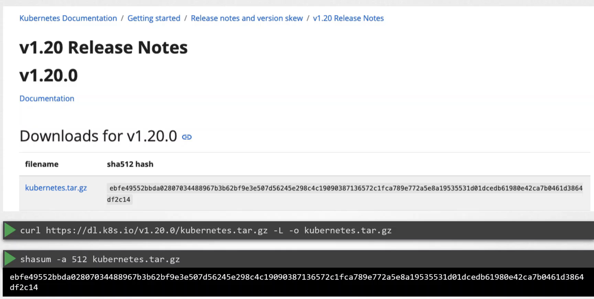
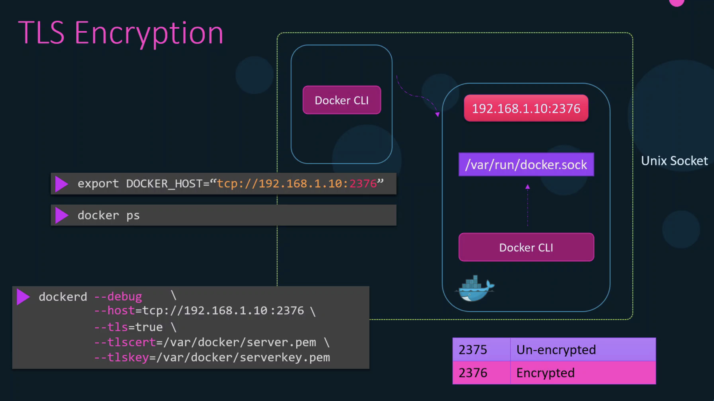

### KubeConfig 
~/.kube/config 에 config 파일로서 certification 에 대한 경로 등을 저장하는 것을 통해 kubectl 시 별도의 인증서 명시 또는 apiserver에 대한 주소 명시 등을 할 필요가 없게 된다. KubeConfig 파일은 세 부분으로 구성된다.
- Cluster
- Contexts : Context는 어떤 유저가 어떤 Cluster를 사용할 것인지에 대해 정의한다. 
- Users

### API Groups

<br>
아래 명령을 통해 어떤 리소스가 어떤 API Group에 속했는지 확인 가능하다. RBAC에서 리소스에 대한 apiGroup을 명시해야 하는데, 이 때 아래 명령을 활용하여 참고하면 좋다. 또한 어떤 리소스가 namespace에 국한되지 않는 cluster 리소스인지도 확이할 수 있다. 
```bash
kubectl api-resources 
```
### Authorization
- Node Authorizor
  - kubelet과 같이 **system:node**:node01 'system:node'라는 이름이 client certificate에 명시되어 있으면 Node Authorizor가 승인한다. 
- ABAC
  - 일일히 유저 별로 권한 나열
- RBAC
  
  - 권한 체크 명렁어
    - kubectl auth can-i 
      - ex) kubectl auth can-i create deployments
    - kubectl auth can-i --as '{username}'

- Webhook 
  - 써드파티 인증을 위해 사용 

#### Authorization Mode
- kube-apiserver의 Authorization mode 설정에 명시한 순서대로 인증한다. 아래의 경우 Node Authorizor -> RBAC -> Webhook 순서로 인증한다. 


### Roles & Rolebinding / ClusterRole & ClusterRoleBinding

### Kubelet 보안
K8S 아키텍처와 kubelet 


- kubelet 설치 시에 kubeadm이 kubelet을 설치해주지 않으며 직접 kubelet을 설치해야 한다.
- 그러나 kubeadm join 명령을 통해 node들에 kubelet-config 파일을 자동 설정해주는 역할은 한다. 과거에는 kubelet.service에 직접 config를 설정해야 했지만 1.10버전 이후로 kubelet-config파일로서 대체되고 config파일 경로만 명시해주게 되었다.
  

- `ps -aux | grep kubelet` 명령을 통해 각 노드에서 kubelet의 config.yaml파일이 어디 존재하는지 알 수 있다. 

#### Kubelet Authentication
kubelet이 어떻게 Kube-apiserver로부터만 통신하도록 설정할 수 있는가?
- 기본적으로 kubelet은 해당 노드의 10250, 10255 포트에서 누구나 접속 가능하도록 api 서버를 열고 있다. 
- 따라서 kubelet-config.yaml에서 authentication.anonymous.enabled = false로 설정해주어야 한다. 
- 그리고 앞서 공부한 것처럼 kube-apiserver는 kubelet client certificate,key를 가지고 있어서 그것으로 인증하게 된다. 

#### Kubelet Authorization
- `authorization.mode : Webhook`으로 설정하여 kube-apiserver의 RBAC와 통합할 수 있다
- `readOnlyPort: 0` 으로 설정하여 10255(read-only port)로의 접근을 막을 수 있다. 


### Kubectl Proxy

- `kubectl proxy &` 명령 실행하면 해당 localhost:8001에서 kubectl proxy가 실행된다. 
### Kubectl Port Forward


### Kubernetes Dashboard
- k8s dasahboard service는 ClusterIP 타입이다. 
  - 따라서 외부에서 접근이 불가능하며 kubectl proxy를 통해 신뢰할 수 있는 사용자들만 접근하도록 설정한다. 
- kuberenetes dashboard authentication
  - kubeconfig
  - node port open 
  - auth proxy

### 플랫폼 바이너리 verification
- 다운로드 받은 파일과 다운로드 페이지의 체크섬 비교를 통한 검증


### 클러스터 업그레이드
- kube-apiserver 보다 controller-manager, kube-scheduler, kubelet, kube-proxy, kubectl의 버전이 높을 수 없고, -1 또는 -2가 낮거나 같아야 한다.
- 언제 업그레이드 해야 하는가? 
  - 최근 3개 minor 버전까지만 지원한다. 즉 1.25가 최신 버전이라면 공식 지원 버전은 1.23~1.25이다. 

#### 업그레이드 방법
- 마스터 노드 먼저 다운하여 업그레이드 하고, 워커 노드를 업그레이드 한다. 
- 워커 노드 업그레이드 방법
  - 워커 노드 drain 후  1개 씩 업그레이드 하기 
  - 새로운 노드를 추가하는 방식으로 업그레이드 하기 
- kubeadm을 활용한 업그레이드 
  - 마스터 노드 
    - `kubeadm upgrade plan`
      - upgrade에 필요한 정보를 알려준다. 
    - `apt-get upgrade -y kubeadm=1.12.0-00`
    - `kubeadm upgrade apply v1.12.0`
    - `apt-get upgrade -y kubelet=1.12.0-00`
    - `systemctl restart kubelet`
  - 워커 노드
    - `kubectl drain node01`
    - `apt-get upgrade -y kubeadm=1.12.0-00`
    - `apt-get upgrade -y kubelet=1.12.0-00`
    - `kubeadm upgrade node config --kubelet-version v1.12.0`
    - `systemctl restart kubelet`
    - `kubectl uncordon node01`

### Network Policy, Ingress
내용 스킵

### Docker Service Configuration
- 도커 CLI는 도커를 호스팅하고 있는 서버의 /var/run/docker.sock이라는 유닉스 소켓을 통해서 도커 데몬에 명령을 전달하게 되는데, 도커 데몬 실행 시 이를 야래와 같이 외부 환경(예를 들어 개발자의 노트북) 의 docker CLI에서 접근 가능하도록 인터페이스를 만들어 줄 수 있고 tls설정도 여기에 할 수 있다. 원래는 host 서버에서만 도커 데몬에 접근 가능하다. 
- export DOCKER_HOST, export DOCKER_TLS=true 설정을 해줘야 한다. 
- dockerd 실행 시 아래와 같이 설정해줘도 되지만 /etc/docker/daemon.json에 설정을 명세할 수도 있다. 이는 디폴트로 생성되지 않는 파일이기에 직접 생성해주어야 한다. 


### Docker : 데몬 보안
도커 데몬에 공격자가 접근이 가능해진다면, 
- appication container, volume 삭제 가능
- bitcoin miner와 같은 공격자의 container 실행 가능
- privileged container 실행을 통해 서버의 root 권한 획득 가능
<br>
- 그러므로 도커 데몬을 host 서버가 아닌 외부에서 접근 가능하도록 해주려고 한다면 해당 host 서버는 반드시 인터넷이 아닌 내부망에 있는 서버여야 한다.
- 또한 tls 인증을 통해 보호해야 한다. tls 옵션만 해서는 안되고 tlsverify 설정을 client/server 양측에 모두 해줘야 인증서 기반의 authentication이 된다. 
  - tlsverify: true
  - export DOCKER_TLS_VERIFY=true
- client에서는 ~/.docker 디렉토리에 client certificate을 위치 시켜야 한다. 
