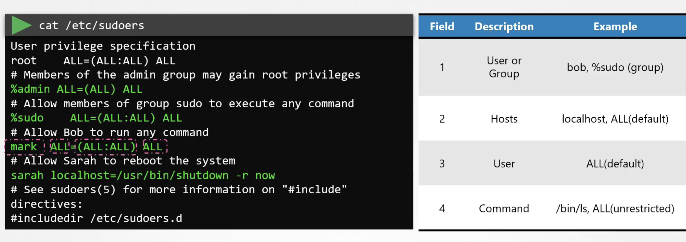
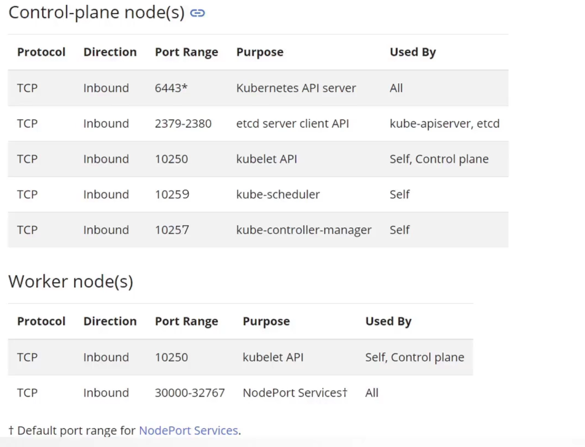

System Hardening 섹션에서는 하기의 내용들에 대해 다룬다.
- host OS foorprint 최소화
- Node 접근 제한
- SSH hardening
- Linux privilege escalation
- 불필요 패키지/서비스 제거
- 커널 모듈 제한
- 오픈 포트 제한 
- IAM role 
- UFW 방화벽
- Seccomp을 이용한 syscall 제한
- Seccomp 과 k8s
- AppArmor

### Least privilege principal
: 각 모듈은 필요한 최소한의 권한만을 지녀야 한다는 원칙으로, 리눅스, k8s를 포함한 모든 컴퓨터 시스템에 적용되는 원칙이며 k8s에서는 아래와 같은 작업에 충실함으로써 이 원칙을 지키게 된다. 
- 노드 접근 제한
- RBAC 
- 불필요 패키지/서비스 제거
- 네트웍 접근 제한
- 불필요 커널 모듈 제거
- 오픈 포트 제한 


## Host OS foorprint 최소화
곧, attack surface를 최소화하는 것이다. 

### 1. 노드 접근 제한
- 인터넷 접근이 안되는 환경을 택하고, VPN과 같은 솔루션을 통해 내부망에 접근하게 한다. 
- 방화벽에서 지정된 ip, ip range만 접근가능하도록 설정한다. 
- OS 계정으로 제한
  - 리눅스 계정은 4가지가 존재한다. 
    - user account
      - bob, john ... 
    - superuser account
    - system account
      - ssh, mail
    - service account
      - nginx, http
  - 리눅스의 접근 컨트롤 파일 
    - /etc/passwd : 유저의 이름, uid, gid, 홈 디렉토리, bash shell 에 대한 정보
    - /etc/shadow : 유저의 패스워드가 hash로 저장됨 
    - /etc/group : OS 내 모든 그룹과 그룹에 속한 유저들에 대한 정보 
  - `usermod -s /bin/nologin michael`과 같이 쉘 정보를 바꿈으로써 해당 유저가 로긴이 불가하게 만들 수도 있고 `userdel micheal` 과 같이 유저를 삭제할 수도 있다. 
  - sam이라는 유저를 생성하되, /opt/sam을 홈 디렉토리로 하고, /bin/bash를 로그인 쉘로 하고, admin 그룹에 속하면서 uid는 2328인 유저로 생성하는 명령어
    ```bash
      useradd -d /opt/sam -s /bin/bash -G admin -u 2328 sam
    ```

### 2. SSH hardening
- 개인키/공개키 기반 authentication
  - `ssh-copy-id -i <로컬 인증서 경로> {username}@{host server}` 명령으로 공개키 서버로 전송
- root계정으로 ssh를 막아두기
  - /etc/ssh/sshd_config에서 `PermitRootLogin no` 로 설정하기 
- 패스워드 기반 로그인 막아두기
  - /etc/ssh/sshd_config에서 `PasswordAuthentication no` 로 설정하기 
- `systemctl reload sshd` 명령을 통해 sshd_config의 변경사항을 적용

### 3. Privilege Escalation
privilege escalation (권환 확대)는 취약점이다. Linux에서는 sudo와 같은 명령을 통해 관리자 권한을 가져올 수 있다.
- /etc/sudoers 파일

- `jim    ALL=(ALL:ALL) ALL` 과 같이 sudoers 파일에 설정하면 jim이라는 유저에게 sudoer 권한을 줄 수 있다. 
- `jim  ALL=(ALL) NOPASSWD:ALL` 과 같이 설정하면 jim이라는 유저가 sudo 명령 사용시 비밀번호 입력을 하지 않게 설정할 수 있다. 
- `usermod jim -G admin` 과 같이 설정하면 sudoer 그룹인 admin에 jim이라는 유저를 등록할 수 있다. 

### 4. 불필요 패키지/서비스 제거
- systemctl stop {서비스}
- systemctl disable {서비스}
- apt remove {서비스}
- `systemctl list-units --type service` 명령은 서비스 중 active 한 것에 대해서 모두 리스트해주는 명령어이다. 
- `apt install {패키지명} -y` 명령은 해당 패키지를 최신 버전으로 업데이트 또는 설치한다.

### 5. 커널 모듈 제한 (restritiction)
- OS 부팅 시에 특정 커널 모듈을 로드 되지 않게 하려면 /etc/modprobe.d/blacklist.conf 파일에 `blacklist sctp`와 같이 blacklist 등록을 하면 된다. 
  - 등록 후 재부팅하면 `lsmod` 명령을 실행했을 때 커널 모듈이 존재하지 않음을 확인할 수 있다. 
  - k8s에서는 sctp와 dccp 프로토콜이 blacklist에 추가되어야 한다. 

### 6. 오픈 포트 
- netstat 명령을 통해 OS가 어떤 포트가 오픈 되어 있는 지를 확인할 수 있다. 
  - `netstat -an | grep -w LISTEN
- `cat /etc/services | grep -w {port번호}` 명령을 통해 특정 포트가 어떤 서비스에서 사용 중인 지 확인할 수 있다. 
- k8s의 각 컴포넌트가 필요로 하는 port 정보는 아래와 같다.
  