System Hardening 섹션에서는 하기의 내용들에 대해 다룬다.
- host OS foorprint 최소화
- Node 접근 제한
- SSH hardening
- Linux privilege escalation
- 불필요 패키지/서비스 제거
- 커널 모듈 제한
- 오픈 포트 제한 
- IAM role 
- UFW 방화벽
- Seccomp
- AppArmor

### 7. IAM role
public cloud의 IAM policy, role을 최소화해야 한다. 
- IAM user 관련 권한 관리는 group 활용하여 IAM policy를 그룹에 부여한다. 
- IAM service 관련 관한 관리는 IAM policy를 service(ec2같은) 에 직접 부여할 수 없기에 IAM role을 활용한다. 
  - S3BucketAccessRole과 같은 role을 만들고 IAM policy를 해당 role에 부여한다. 그리고 이 role을 ec2에 부여한다. 

### 8. UFW 방화벽/네트워크

#### 네트웍 외부 접속의 최소화 
- 앞서 보았듯, /etc/services 에서 port와 service 의 매핑 관계를 확인할 수 있다. 
- `netstat -an | grep 22 | grep -w LISTEN`의 결과로 0.0.0.0로 listen 중이라면 같은 네트웍에서 어떤 device든 ssh로 접근 가능한 상태를 의미한다.
- 엔터프라이즈 환경에서는 대부분 방화벽 솔루션을 사용하지만 linux의 UFW를 통해서도 방화벽 설정을 할 수 있다. 
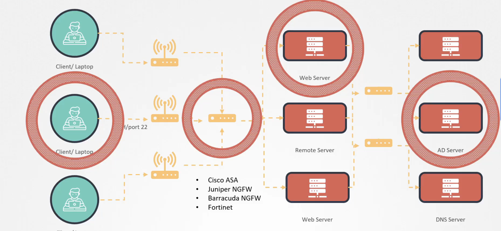

#### UFW Firewall 기본
- Linux 커널에는 netfilter라는 패킷 필터링 기능이 존재한다. 그리고 iptable은 netfilter의 가장 많이 사용되는 interface이다. 근데 iptable을 활용해서 방화벽을 설정하는 것은 러닝커브가 존재한다. 
- 따라서 UFW(Uncomplicated Firewall는 iptable을 위한 interface이고 매우 간단하게 방화벽 rule을 적용할 수 있다.
- UFW 설치 
  - `apt-get update`, `apt-get install ufw`
  - `systemctl enable ufw`, `systemctl start ufw`
- 시나리오 케이스에 대한 조치
  - **<u>시나리오 : A로부터의 22/80 접근만 허용하고 대역으로부터는 80포트만 열어준다. 그 외 8080 포트 등의 모든 접근은 block한다.</u>**
  - 우선, in/outbound에 대한 디폴트 설정으로 모든 outbound는 열어주고 inbound는 막아준다.
    ```
    ufw default allow outgoing 
    ```
    ```
    ufw default deny incoming 
    ```
  - A ip로부터 22, 80 포트 접속 허용해준다.
    ```
    ufw allow from {A's ipaddress} to any port 22 proto tcp
    ```
    ```
    ufw allow from {A's ipaddress} to any port 80 proto tcp
    ```
  - 아래와 같이 대역으로도 허용할 수 있다.
    ```
    ufw allow from 10.2.3.0/28 to any port 80 proto tcp
    ``` 
  - 8080 포트를 모든 소스로부터 막아준다. 사실 이 부분은 defulat로 모두 막고 시작했기 때문에 안해도 되는 부분이긴 하다.
    ```
    ufw deny 8080
    ``` 
  - 마지막으로 rule 적용을 위해 ufw enable 을 해준다.
    ```
    ufw enable
    ```
    - 반대로, rule은 그대로 저장해두고 rule정책을 비활성화 하려면 `ufw disable`하면 된다. 
  - `ufw status` 명령으로 적용된 방화벽 정책을 확인할 수 있는데, 디폴트 설정은 안나오는 듯 하다. 
  - 아래와 같이 하여 rule을 삭제할 수 있다.
    ```
    ufw delete deny 8080
    ```
    ```
    # ufw status에서의 리스트된 위에서 부터 4번째 rule 삭제
    ufw delete 4
    ```
#### LAB
```
# tcp 1000~2000 사이의 포트 오픈
ufw allow 1000:2000/tcp
```
```
# ufw rule을 디폴트 rule로 reset
ufw reset
```

### 9. Seccomp
Seccomp에 대해 알아보기 전에 2가지에 대해서 먼저 알아보자 
- Linux syscalls
- AquaSec tracee

#### Linux syscalls
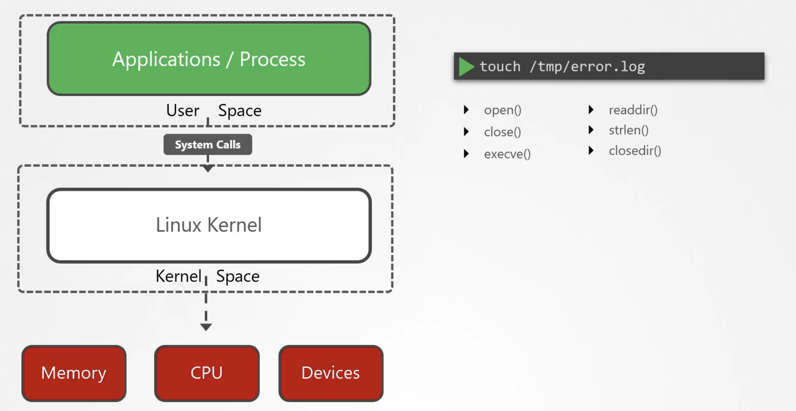
위와 같이 user space에서 동작하는 프로세스는 리소스를 사용하기 위해 kernel에 접근해야 하는데 이 때 system call이 Linux kernel에 대한 interface역할을 한다. 
- strace
  - /usr/bin/strace 에 보통 위치하며 애플리케이션에 의해서 호출된 syscall을 trace하기에 적합하다. 아래는 예시이다. 
    - execve가 호출된 syscall의 이름이다. 
    - 23 vars는 23개 변수가 systemcall에 전달되었음을 의미하며 여기서 23개 변수는 env의 환경변수를 의미한다. 
    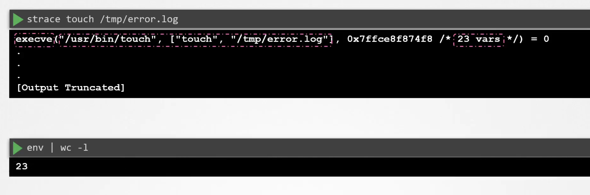
  - pid를 이용해서 strace를 활용할 수 있다. 아래는 예시이다.
    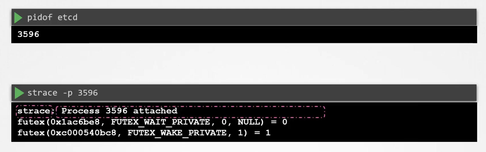
  - c 옵션을 사용하면 애플리케이션에서 사용된 모든 syscall 종류와 summary를 확인할 수 있다.
    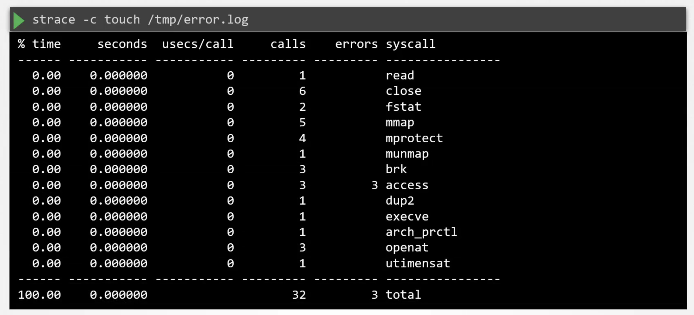

#### AquaSec tracee
AquaSec에서 만든 tracee는 리눅스 커널 트레이싱을 활용하여 컨테이너 환경에서의 시스템 활동을 감지하고 모니터링하는 데 사용된다.
- eBPF(extended Berkeley Packet Filter) 기술 사용
- eBPF와 커널 트레이싱을 활용하여 다양한 시스템 이벤트 및 시스템 콜을 캡처하고, 이를 실시간으로 분석하여 보안 이슈나 이상한 활동을 감지한다.
- 보통 도커 컨테이너 형태로 OS에 설치하여 활용된다. 

#### Seccomp 
앞서, touch와 같은 간단한 application도 여러가지의 system call을 호출하는 것을 확인할 수 있었다. 리눅스 커널에는 약 435개의 system call이 존재한다. 
그러나 실제로 우리가 사용하는 어플리케이션들은 모든 system call을 활용하지는 않으며, 반대로 모든 system call에 접근 가능한 것은 보안의 취약점으로써 attack surface를 줄여주어야 한다.
- 2016년, 'Dirty cow'라 불리는 보안 취약점은 ptrace라는 system call을 이용해서 read-only 파일에 쓰기를 하고 root 권한을 탈취할 수 있음을 증명했다. 
- 디폴트로는 리눅스 커널은 host/container 환경에서 기동 중인 application에 모든 system call에 대한 접근을 허용한다. 
- Seccomp는 'Secure computing'의 약자로서 리눅스 2.6.12부터 리눅스 커널의 기능 중 일부로 포함되었다. 
- Host에 Seccomp가 설치되었는 지 확인하기: Seccomp를 지원하는 리눅스 커널인지 확인하기 위해서는 하기와 같은 명령을 통해 boot config 파일에 seccomp 설정이 존재하는 지 확인함으로써 알 수 있다. 
    ```
    grep -i seccomp /boot/config-$(uname -r)
    
    # CONFIG_SECCOMP = y 라는 결과가 나와야 함
    ```
- Container에 Seccomp가 설치되었는 지 확인하기 
  - /proc/{pid}/status 를 grep 했을 때 Seccomp 값이 2가 나오면 Seccomp이 선택적으로 syscall을 filter 하고 있음을 의미한다.
    - mode 0 : disabled
    - mode 1 : strict( 4개의 syscall 만 허용 )
    - mode 2 : filtered ( Syscall을 선택적으로 필터함 )
  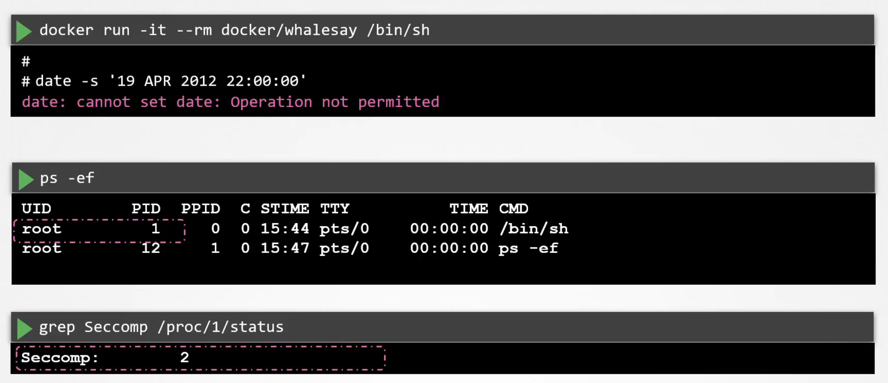

- Built-in Seccom filter 
  - 도커는 빌트인으로 seccomp Filter가 있어서 컨테이너가 생성될 때 디폴트로 적용된다. host환경에 seccomp를 지원함을 전제로 한다. 여기에는 기본적으로 60개 정도의 systemcall을 제한하는 정책이 설정되어 있다. ( ptrace 포함)
    - https://github.com/moby/moby/blob/master/profiles/seccomp/default.json

- SECCOMP profile 
  - Seccomp profile은 3가지 파트로 구성된다. 
    - defaultAction : syscalls 파트에서 정의되지 않은 나머지 syscall들을 어떻게 처리할 것인지에대 한 정의. whitelist profile은 기본적으로 `SCMP_ACT_ALLOW`로 설정하고 black list는 `SCMP_ACT_ERRNO`로 설정한다. 
    - architectures : 어떤 아키텍처에서 해당 프로파일이 지원되는 지에 대한 정보
    - syscalls 
      - name : syscall 명칭 나열
      - action : name에 나열된 syscall에 대해 ALLOW 할 것인지 ERRNO(DENY) 할 것인지에 대한 액션 설정.
  - 아래는 whitelist/blacklist SECCOMP profile에 대한 예시이다.
    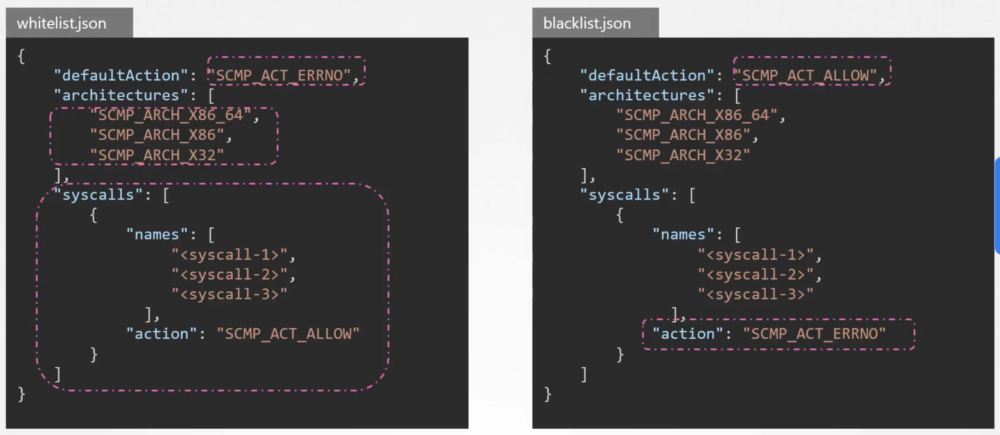
    - 디폴트 profile은 blacklist임을 알 수 있다. 커널 모듈 수정, 시스템 시간 설정, 시스템 재기동, file system 마운팅 등의 다양한 syscall이 제한되어 있다. 
  - 앞서 'whalesay' 컨테이너에서 system time에 대한 변경 명령이 동작하지 않았던 것은 도커에 기본으로 적용된 default.json SECCOMP profile에 의해 `clock_adjtime`, `clock_settime` syscall이 제한되었기 때문이다. 
  
  - custom profile 적용하기
    - 하기 예시에서는 mkdir syscall을 blacklist에서 제외한 custom.json을 docker 실행 시에 적용되도록 설정한 것이다. 
    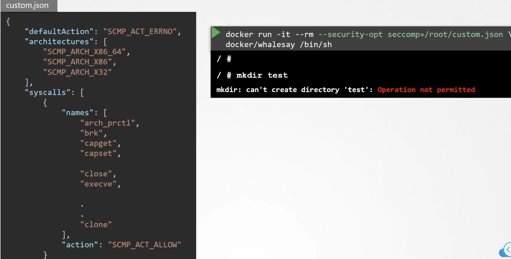
  - seccomp 사용하지 않기
    - `docker run --security-opt seccomp=unconfined` 로 실행하면 seccomp가 적용되지 않는다. 그러나 seccomp가 적용되지 않은 컨테이너도 도커가 기본적으로 system clock등 몇가지 syscall을 막아두고 있어서 seccomp 안 써도 system date 수정은 못한다. 

#### Seccomp in K8S
쿠버네티스에서 Seccomp는 디폴트로 적용되지 않는다. 'amicontained'를 pod로 실행시켜서 로그를 살펴보면 Seccomp는 disabled이고 blocked syscall도 21개 밖에 없음을 확인할 수 있다. 
- k8s에서는 pod definition에 하기와 같이 설정해야 seccomp가 default profile로 적용된다. 
  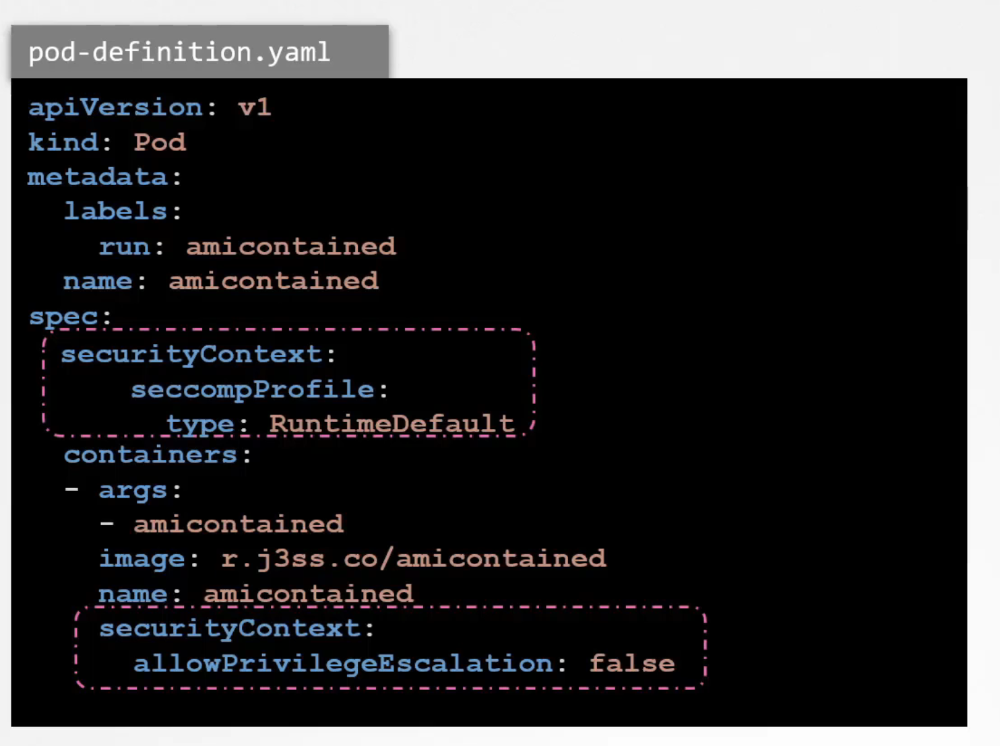
- host에 있는 custom profile을 적용하는 방법
  - 먼저 모든 노드의 `/var/lib/kubelet/seccomp/` 경로 하위에 seccomp profile을 위치시킨다. 
  - 하기와 같이 type을 Localhost로 설정하면 되는데 이 때 profile 파일의 경로는 위의 경로 하위의 상대 경로를 입력해주면 된다. 
    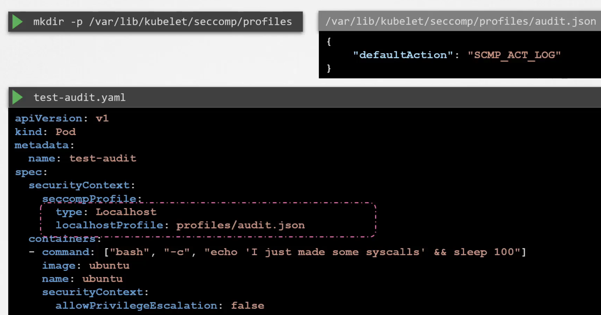
- `grep syscall /var/log/syslog`을 하면 실행된 syscall 번호와 pid등의 정보가 나온다. 
- 우분투에서는 `grep -w {syscall번호} /usr/include/asm/unistd_64.h` 명령을 실행하면 syscall 번호가 어떤 syscall name에 매핑되는지 알 수 있다. 
- tracee을 아래와 같이 활용하면 새로 생성된 'test-audit'이란 pod가 있다고 가정할 때 해당 pod가 어떤 syscall을 호출했는 지 알 수 있다. 
  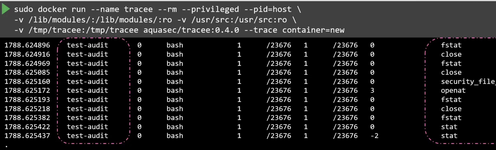

### 10. AppArmor
AppArmor는 Linux에서 내장되어 있고 프로세스에게 리소스에 대한 권한을 제한할 수 있도록 지원한다. 
- `systemctl status apparmor` 로 Linux에 설치되어있는 지 확인 가능 
- k8s에서 apparmor를 쓰기 위해서는 컨테이너가 구동될 모든 노드에 apparmor 커널 모듈이 Load되어 있어야 한다. 
  - `cat /sys/module/apparmor/parameters/enabled`의 결과가 Y여야 한다.
  - `cat /sys/kernel/security/apparmor/profiles`에는 load된 profile 정보가 명시되어 있다. 

#### AppArmor Profile 
- Profile 예시
  - 
      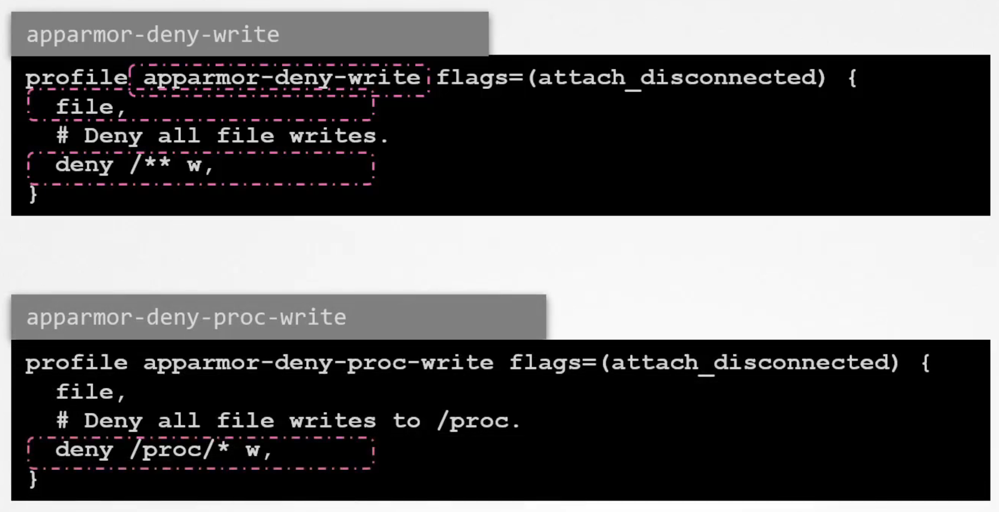
  - 
      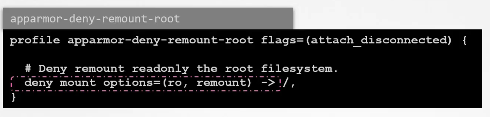
- Profile mode
  - enforce : profile의 rule을 application에 적용
  - complain : profile의 rule을 application에 실제 적용하지는 않고 logging만 함 
  - unconfined : profile을 application에 적용하지 않고 logging도 안함.

#### Apparmor profile 생성하기 
- Apparmor-utils 패키지 설치하기 
- 위를 통해 설치된 aa-genprof 커맨드 활용하여 profile 생성 
  - `aa-genprof /root/add_data.sh` 와 같은 명령을 통해 어플리케이션에 대한 apparmor에서 제공하는 일련의 질문에 대해서 모두 답하면 profile이 그에 상응하게 enforce모드로 생성된다.
  - `aa-status`로 확인 가능
- 이미 존재하는 Profile을 load하는 방법
  - ``apparmor_parser /etc/apparmor.d/root.add_data.sh
- profile disable 하는 법 
  - `apparmor_parser -R /etc/apparmor.d/root.add_data.sh`
  - `ln -s /etc/apparmor.d/root.add_data.sh /etc/apparmor.d/disable`

#### AppArmor in K8S
- AppArmor kernel module/profile이 모든 노드에서 load되어야 하고 컨테이너 런타임에서 지원해야 한다.
- ubuntu-sleeper라는 간단한 pod에 apparmor-deny-write라는 aa profile을 적용하려면..
  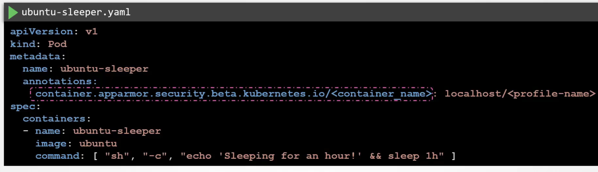

### Linux capabilities
리눅스 커널은 과거에는 privileged process, unprivileged process로 나뉘었지만 현재는 privileged process라도 Capability로 권한을 나눈다. 
- 어떤 app에서 어떤 capability가 필요한지 확인하는 방법 : getcap
  - 프로그램은 경로를, process는 pid로 capability를 확인한다. 
    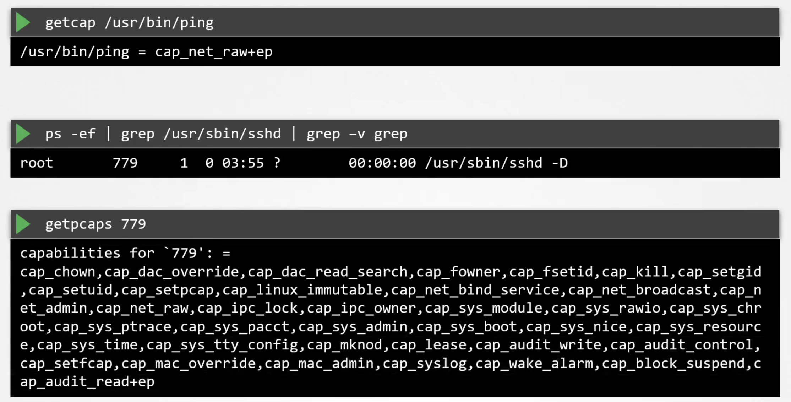
- Docker 런타임 환경에서는 14가지의 capability만을 디폴트로 지닌다.
- k8s pod 설정에서 securityContext 절에서 capability를 추가, 제거할 수 있다. 
  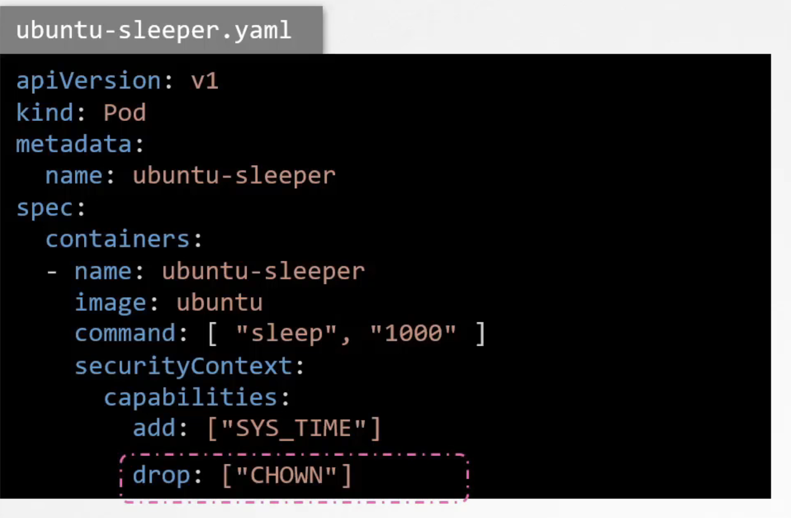