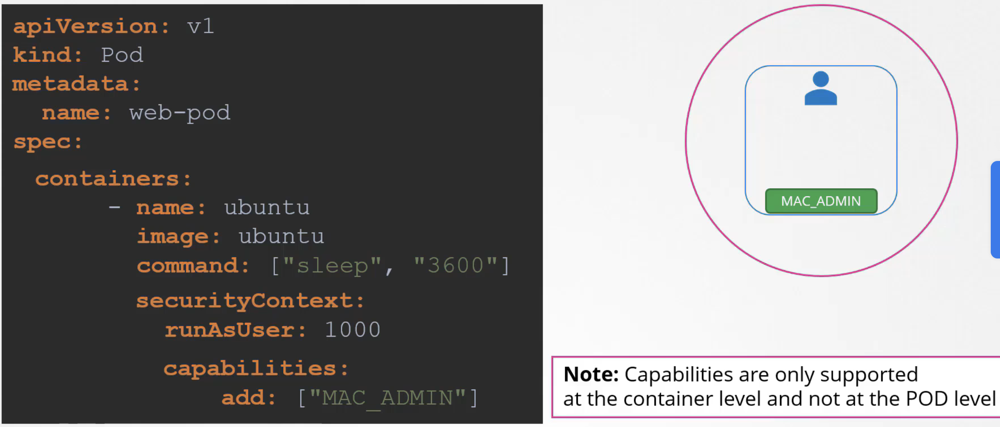

### Security context

#### Container Security
- 컨테이너를 실행할 때 하기와 같이 어떤 유저로 실행할지, 어떤 capability를 추가하거나 뺼 지 등 보안 설정을 할 수 있다. 
  ```
    docker run --user=1001 ubuntu sleep 100
    docker run --cap-add MAC_ADMIN ubuntu
  ```
- 이는 k8s pod definition에서도 Security context 절을 통해 설정할 수 있는데, pod 레벨에서 설정하면 pod 내의 모든 컨테이너에 적용되고 컨테이너 레벨에서 설정을 하면 그 설정으로 override된다.
- Pod 레벨 예시
  
- Container 레벨 예시
  