### Security context
- 컨테이너를 실행할 때 하기와 같이 어떤 유저로 실행할지, 어떤 capability를 추가하거나 뺼 지 등 보안 설정을 할 수 있다. 
  ```
  docker run --user=1001 ubuntu sleep 100
  docker run --cap-add MAC_ADMIN ubuntu
  ```
- 이는 k8s pod definition에서도 Security context 절을 통해 설정할 수 있는데, pod 레벨에서 설정하면 pod 내의 모든 컨테이너에 적용되고 컨테이너 레벨에서 설정을 하면 그 설정으로 override된다.
- Pod 레벨 예시
  
- Container 레벨 예시
  

- `kubectl exec <pod명> -- whoami` 명령을 통해 특정 pod를 실행시키고 있는 user가 무엇인지 알 수 있다. 
### Admission controller
admission controller는 authentication/authorization 단계에서 수행할 수 없는 보안조치를 위한 부가적인 기능들을 제공한다. 
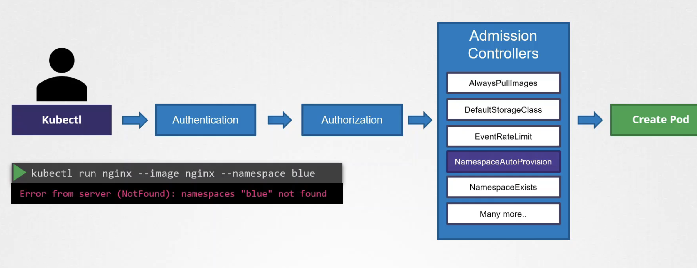

NamespaceExists와 같은 모듈은 디폴트로 적용되어 있어서 pod가 생성될 namespace가 실제 존재하는지 체크하고, NamespaceAutoProvision과 같은 모듈을 Enable하면 namespace가 존재하지 않는다면 생성하도록 설정된다. 
아래 명령을 통해 디폴트로 어떤 admission controller가 적용되어 있는 지 확인 할 수 있다.
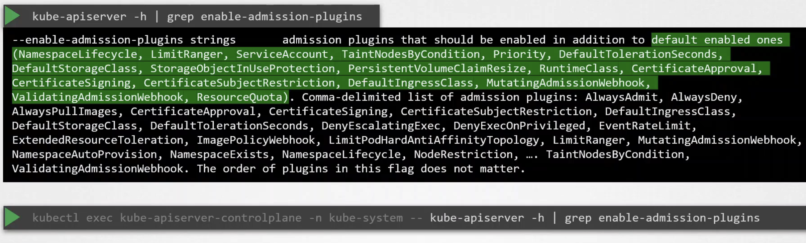

admission controller를 추가/제거 하기 위해서는 아래와 같이 kube-apiserver의 yaml파일에 작성해주면 된다.
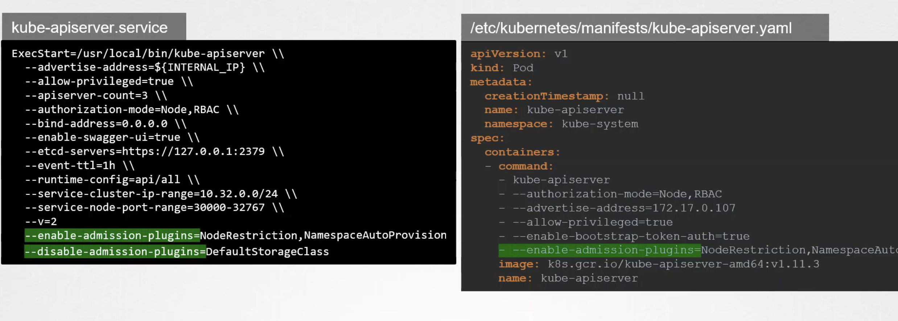

NamespaceAutoProvision, NamespaceExists 는 deprecated되었고 NamespaceLifecycle 로 대체되었다. 이는 존재하지 않는 ns 에 대한 request는 reject하고 default로 설정되는 ns는 삭제 되지 않도록 해준다. 

#### Admission controller의 종류
- Validating Admission controller : NamespaceExists와 같이 request에 대한 유효성을 검사하는 admission controller
- Mutating Admission controller : defaultStorageClass와 같이 request를 조작하여 default storageclass 등을 부여하는 admission controller
- 검증/조작 둘다 하는 것들도 있다. 

#### Admission webhook 
https://coffeewhale.com/kubernetes/admission-control/2021/04/28/opa1/

- webhook 서버 ( Dynamic admissoin controller ) 만들기
  - webhook 서버를 위한 tls type의 secret 만들기
    ```
    kubectl -n webhook-demo create secret tls webhook-server-tls \
        --cert "/root/keys/webhook-server-tls.crt" \
        --key "/root/keys/webhook-server-tls.key"
    ```
- validatingWebHookConfiguration은 api-server로 들어오는 요청을 webhook service로 전달해주기 위한 역할을 하며 어떤 request에 대해 webhook 서버로 보낼지에 대한 설정을 한다. 
  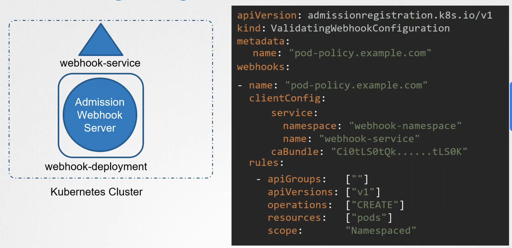
- `AdmissionReview` 라는 json 객체를 통해 webhook server 와 통신하게 되며 Validating admission에서는 response.allowed값만 설정해주면 되고 mutating admission에서는 response.patch값을 설정해주어야 한다. 

### Pod Security policy
- admission controller 중 `PodSecurityPolicy`라는게 있고 이건 default가 아니여서 enable해줘야 한다. 그러면 아래와 같은 취약한 SecurityContext와 같은 설정에 대해서 admission controller 레벨에서 요청을 차단하게 된다. 
  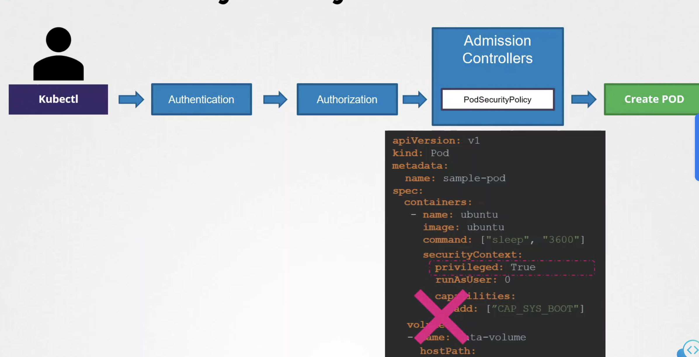
- policy를 커스텀하여 아래와 같이 생성할 수도 있으며 이를 위해서는 RBAC를 통해 serviceaacount가 pod security policy에 접근가능하도록 설정이 필요하다. 
  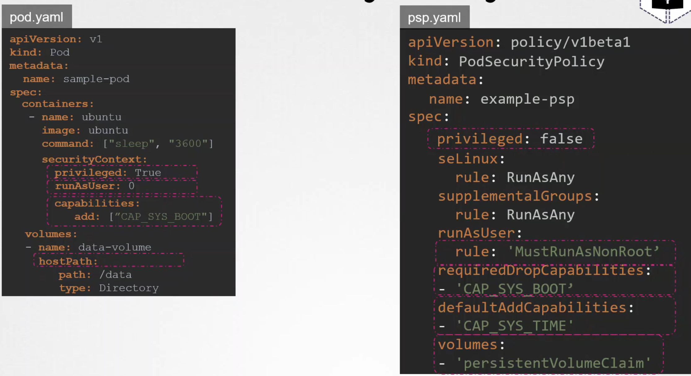

### OPA ( Open policy agent )
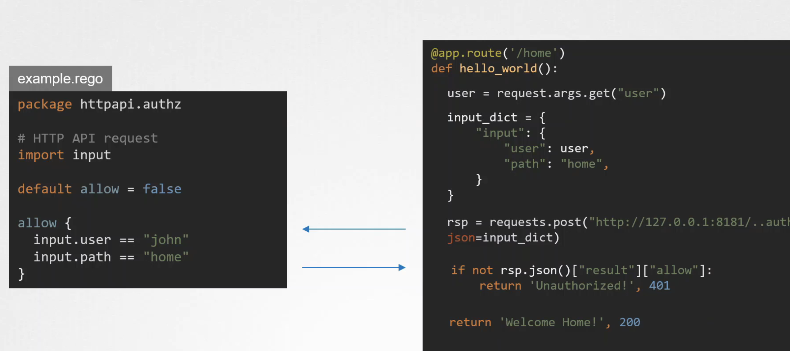

### OPA in K8S
OPA를 활용하면 앞서 webhook 서버를 만들었던 것처럼 직접 서버를 구축할 필요없이, validatingWebhookConfiguration, mutatingWebhookConfiguration이 OPA service를 바라보도록 할 수 있다. 
그리고 OPA는 로직의 구현없이 정책 설정만으로 원하는 mutate/validate을 가능하게 해준다. 
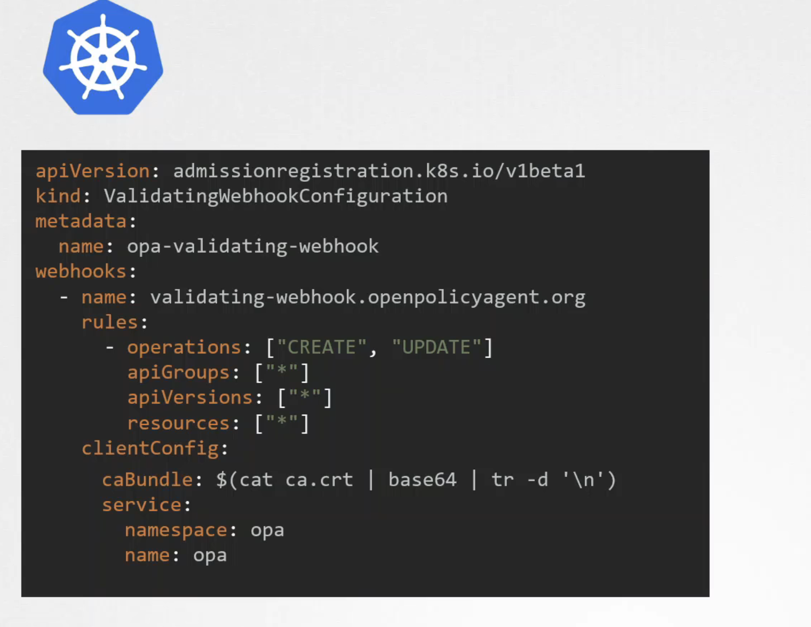
OPA는 webhook과 마찬가지로 AdmissionReview json객체를 통해 통신되며 .rego파일에 정책을 설정할 수 있다. 그리고 `import data.kubernetes.pods` 와 같이 클러스터의 object 정보들을 가져와서 validating에 활용할 수 있다. 
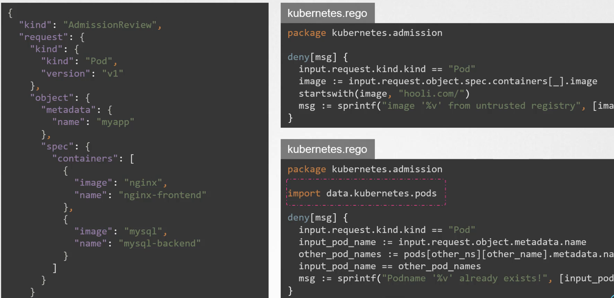
OPA는 어떻게 k8s 리소스를 알 수 있는가? `kube-mgmt`를 통해서다. kube-mgmt는 사이드카 컨테이너로서 OPA pod에 함께 존재하며 2가지 역할을 한다.
- OPA에게 k8s 리소스에 대한 정보를 제공
- configmap과 같은 K8s 리소스를 활용하여 OPA에 policy를 로드하는 역할
  - 원래는 .rego파일을 작성한 후에 `curl -X PUT --data-binary @kubernetes.rego http://localhost:8181/v1/policies/exmple1` 과 같이 OPA에 policy를 등록해줬어야 하지만 kube-mgmt는 아래와 같이 configmap에 rego 소스를 가져옴으로써 configmap으로 등록해서 사용하게 해준다. 
  - `k create configmap untrusted-registry --from-file=/root/untrusted-registry.rego` 와 같이 '--from-file' 옵션을 활용하여 쉽게 configmap을 .rego파일로부터 생성할 수 있다. 
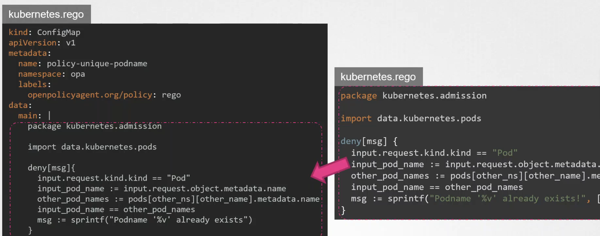

아래는 k8s와 OPA가 어떻게 integrate 되는 지에 대한 전체 그림이다. 새로운 버전에서는 OPA gatekeeper을 통해서 k8s 와 OPA과 연동된다는 것도 참고하면 좋다. 
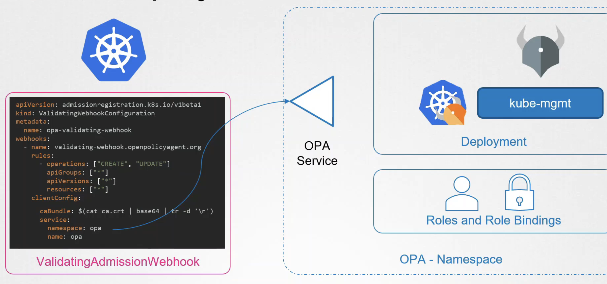

### Secret 관리하기 
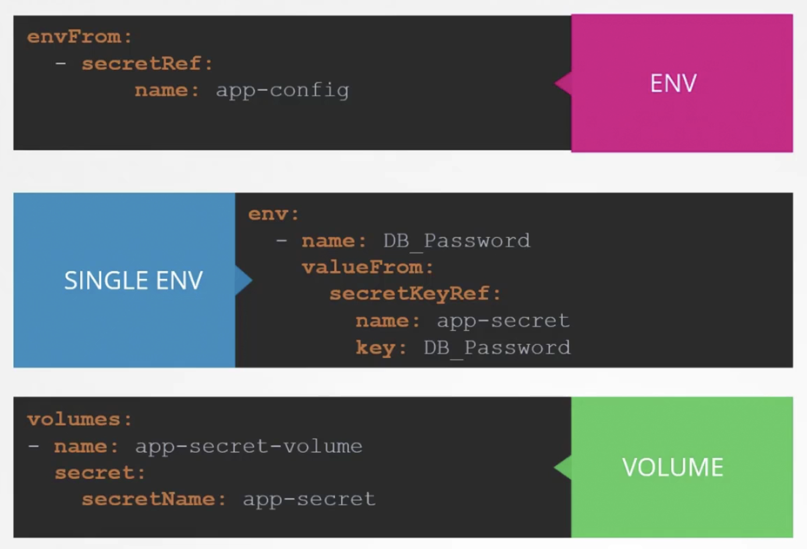
- RBAC를 사용하여 secret에는 최소한의 접근 권한만 부여하기 
- secret을 ETCD에 저장하지 않고 클라우드 환경에서는 AWS Provider, Azure provider에 별도 저장하기 
- Encrypting secret data at rest : secret 데이터를 etcd에 암호화해서 저장하는 방법 ( https://kubernetes.io/docs/tasks/administer-cluster/encrypt-data/ )
  - EncryptionConfiguration object

### gVisor
Seccomp, AppArmor 와 함께 container sandboxing을 위해 쓰이는 솔루션이다. syscall과 Linux kernel 사이에 gVisor를 두어 container sandboxing을 강화한다. 
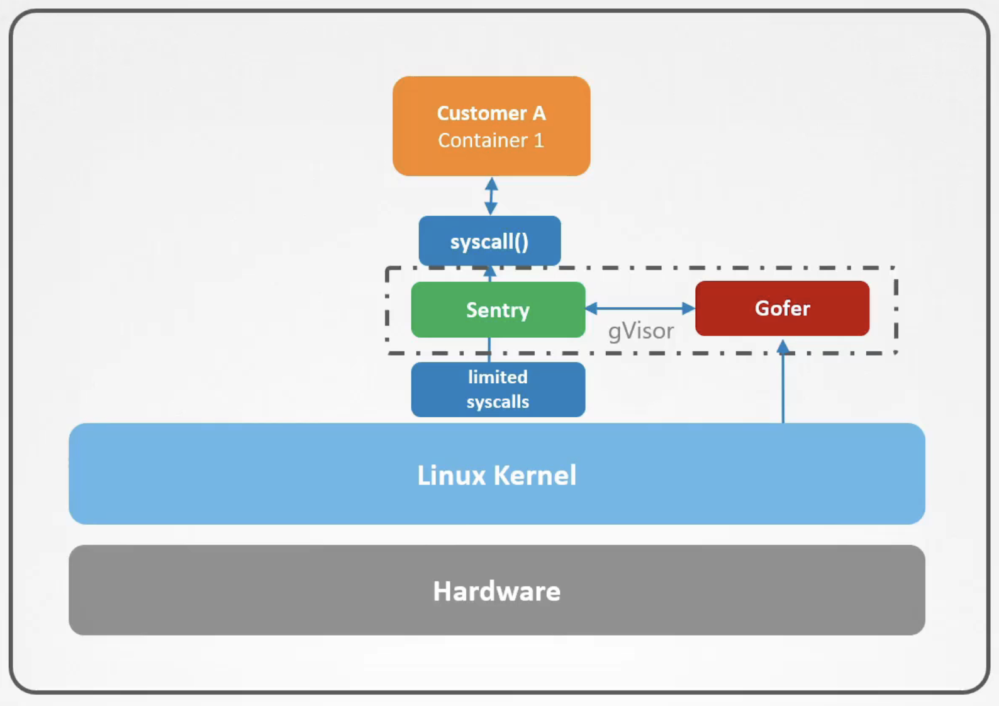
gVisor는 2개의 컴포넌트로 이루어진다.
- Sentry
  - 독립적인 application 레벨의 커널이며 linux kernel에 비해 훨씬 적은 function을 가지기 때문에 활용할 수 있는 container 앱이 활용할 수 있는 syscall의 개수도 줄어든다. 
- Gofer
  - Sentry는 직접적으로 linux kernel에 파일에 대한 요청을 하지 못하고 Gofer를 활용한다. Gofer을 Linux kernel에 대한 file proxy이다. 
- gVisor network stack 
  - Gofer와 마찬가지로 gVisor는 network stack을 proxy로 제공하여 app이 직접 Linux kernel의 network code를 건들지 않도록 한다. 
- gVisor 활용 시의 단점 : 모든 app이 gVisor 기반으로 동작하지는 않는다, 더 많은 instruction을 수행해야 하므로 app이 살짝 느려질 수 있다. 

### Kata container
gVisor와 달리 가벼운 kernel을 컨테이너에 포함시킴으로써 sandboxing을 하는 방법이지만 일반적인 컨테이너 앱에 비해 더 많은 리소스를 필요로 한다. 

### Runtime classes
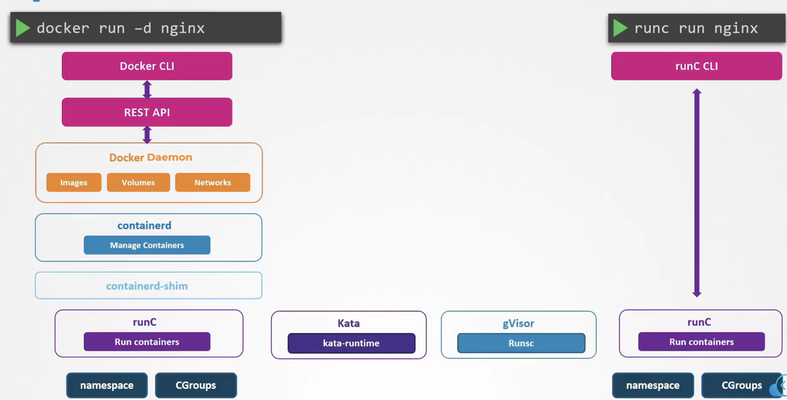
- 아래와 같이 runtimeclass 생성가
  ```
  apiVersion: node.k8s.io/v1
  kind: RuntimeClass
  metadata:
      name: secure-runtime
  handler: runsc
  ```
- 그리고 아래와 같이 pod에 적용 가능
  ```
  apiVersion: v1
  kind: Pod
  metadata:
      name: simple-webapp-1
      labels:
          name: simple-webapp
  spec:
    runtimeClassName: secure-runtime
    containers:
      - name: simple-webapp
        image: kodekloud/webapp-delayed-start
        ports:
          - containerPort: 8080
  ```

### Mutual SSL(mTLS)
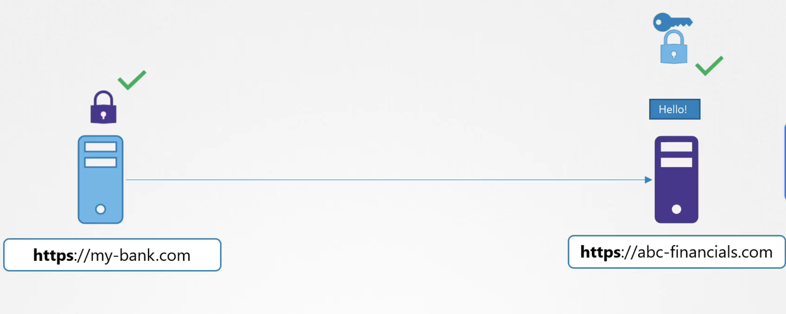

#### Pod 간의 통신의 보안에서 사용되는 mTLS
- istio
  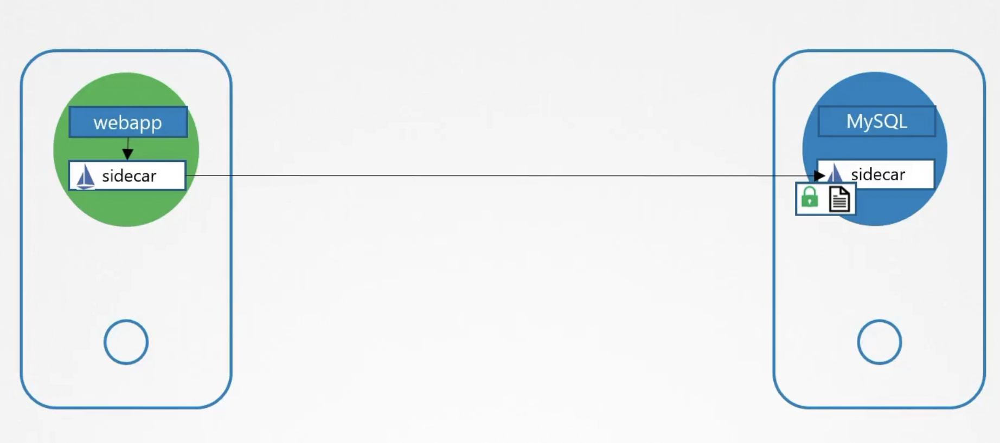
  - permissive / opportunistic 모드 : istio sidecar 컨테이너가 없는 외부 앱의 Plain text 통신도 허용
  - enforced / strict 모드 : mTLS 통신 만을 허용 