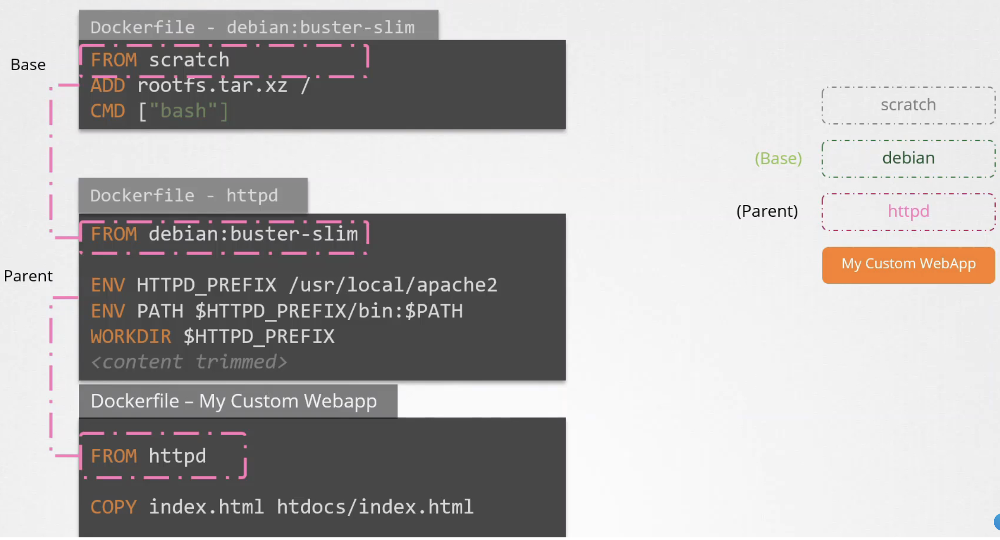
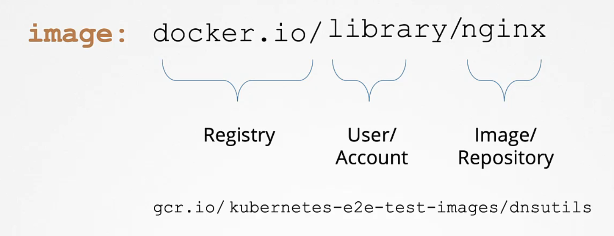
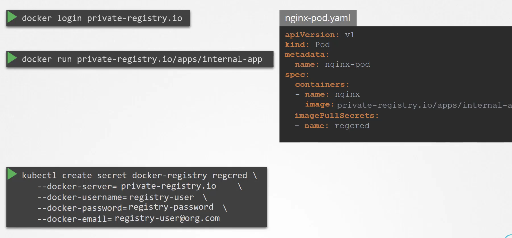
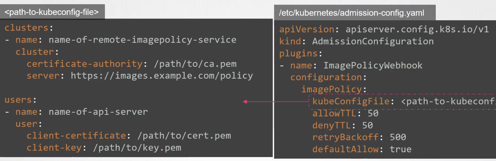
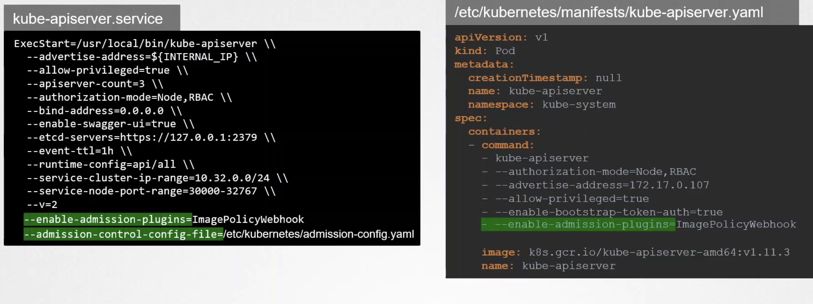
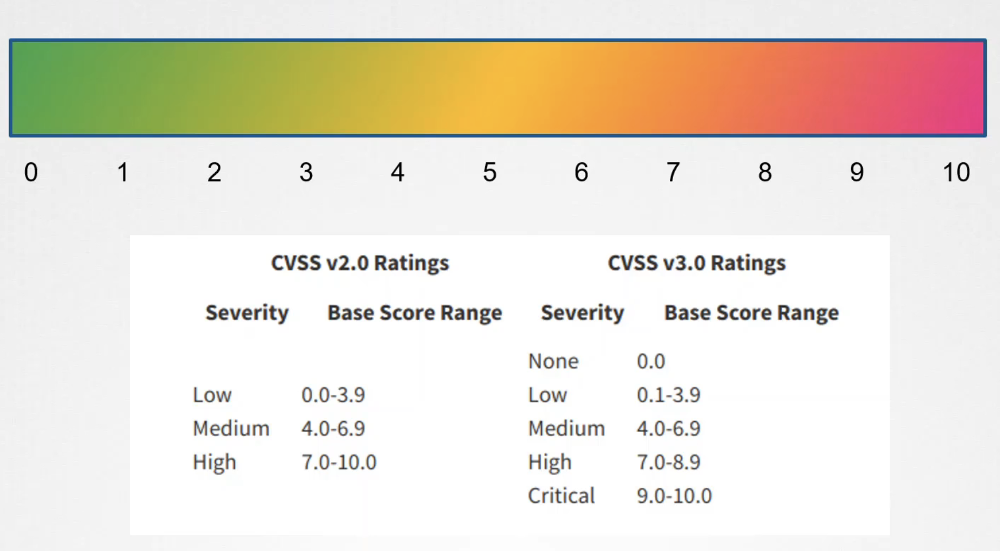

### Base image footpring 최소화하기 
- base image란 무엇인가? dockerfile의 `FROM` 절에서 명시하는 이미지는 parent 이미지이다. 가령 아래 예시에서 보는 것처럼 httpd 이미지는 debian이라는 이미지를 parent로 가진다. 그리고 debian 이미지는 `FROM scratch` 로 부터 생성되는데, 이렇게 scratch로 부터 생성되는 이미지를 base 이미지라고 하는데, parent 이미지라는 의미로 혼용되기도 한다. 


- Modularize : 각각의 이미지는 여러 기능을 하지않고 1개의 주요 역할만 하도록 모듈화되어야 한다. 
- Persist state : 데이터/state을 컨테이너내에 보관하지 않는다. 
- 'Official image' 사용하기 
- 이미지를 최소화하기 
  - yum, wget, curl 과 같이 공격자가 활용할 수 있는 명령어들을 image에 포함시키지 않아야 한다.
  - production 이미지와 dev/stg 이미지는 분리되어야 한다. 
  - 결국, 이미지에는 application + runtime dependency만 존재해야 한다. 

#### Vulnerability scanning
- trivy 툴을 활용해서 이미지의 vulnerability를 측정할 수 있다.
- alpine과 같이 image 내에 패키지가 적은 것은 vulnerability가 매우 적게 측정된다. 
```
trivy image httpd # 124개 취약점 존재
trivy image httpd:alpine # 0개 취약점 존재 
```

### image 보안 
- image 이름 규칙

- private registry
  - 'docker-registry' 타입의 secret으로 private registry에 대한 credential 정보를 보관. 
    

#### Registry에 대한 whitelist 등록하기
- 앞서 보았듯, ValidatingAdmissionWebhook을 webhook 서버 또는 OPA와 연동하여 registry 이름에 대한 검증을 할 수 있었다.
- 여기서는 ImagePolicyWebhook을 사용하는 방법을 추가로 알아본다. 
- `/etc/kuberenetes/admission-config.yaml` 경로에 아래와 같이 AdmissionConfiguration 파일을 생성하여 ImagePolicyWebhook plugin을 명시하고, kubeconfig 에 대한 경로를 작성해줘야 한다. 그리고 kubeconfig 파일에서는 registry를 검증해주는 api 서버에 대한 정보와 인증서 정보를 포함한다. 
  
- 그리고 kube-apiserver에서 아래와 같이 설정해줘야 한다.
  
- `k describe po <pod-name> | grep --registry-whitelist` 명령을 하면 

### kubesec을 활용한 resource-definition 정적 분석 
- `kubesec scan pod.yaml` 과 같이 하여 report를 받아볼 수 있다.
- 문제
  - `/root/node.yaml`를 스캔하고 그 결과를 `/root/kubesec_report.json` 에 저장하기 
    ```
      kubesec scan /root/node.yaml > /root/kubesec_report.json
    ```
### Image scan
- CVE ( Common vulnerability and exposures ) : 알려져있는 보안 취약점들을 CVE에서 등록하고 관리한다. 
  - CVE serverity scores
    
  - CVE Scanner : Trivy
- Trivy
  ```
  trivy image nginx:1.18.0
  trivy image --serverity CRITICAL,HIGH nginx:1.18.0 # CRITICAL, HIGH 구분의 CVE만 조회 
  trivy image --ignore-unfixed nginx:1.18.0 # s/w package upgrade 로 해결할 수 있는 CVE만 조회
  ```
  - Docker save 명령으로 저장된 .tar 파일도 검증할 수 있다. 
  ```
  trivy image --input archive.tar
  ```
  - 문제
    - `python:3.10.0a4-alpine` image를 pull받은 후에 trivy로 해당 이미지를 스캔하고 그 결과를 `/root/python_alpine.txt` 에 저장하라
      ```
        crictl pull python:3.10.0a4-alpine
        trivy image --output /root/python_alpine.txt python:3.10.0a4-alpine
      ```
    - `python:3.6.12-alpine3.11` image를 스캔하고 HIGH vulnerability에 대한 결과만 `/root/python.txt`에 저장하기
      ```
        trivy image --severity HIGH --output /root/python.txt 
      ```
    - trivy image --input /root/alpine.tar --format json --output /root/alpine.json

#### Best practice
- 추가적인 vulnerability가 report될 수 있으므로 지속적으로 image를 스캔하기
- admission controller를 활용하여 deploy될 때 scan단계를 추가하기
- 하지만 deploy 속도에 영향이 있을 수 있으므로 별도의 image repository를 활용하여 pre-scanned image만 사용하도록 하기 
- CI/CD 단계에서 image scan 단계 추가하기 