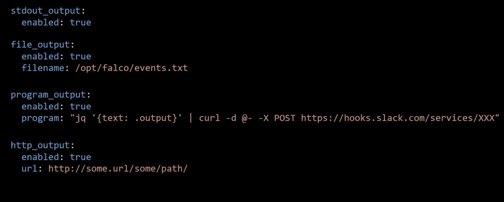
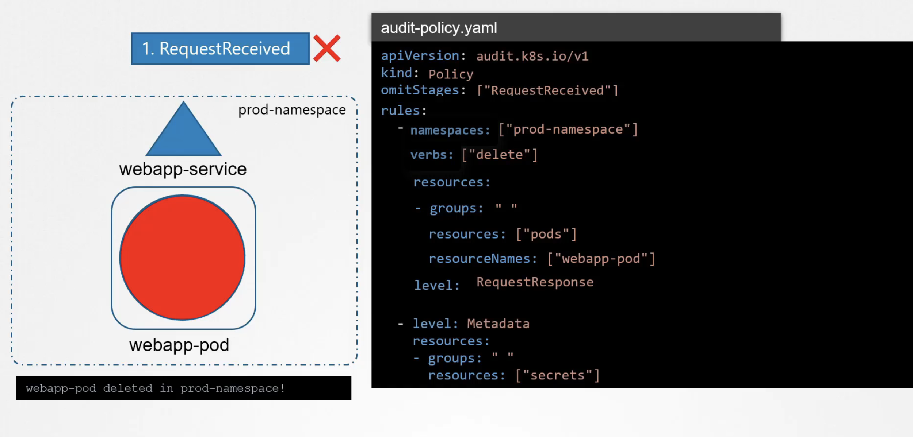
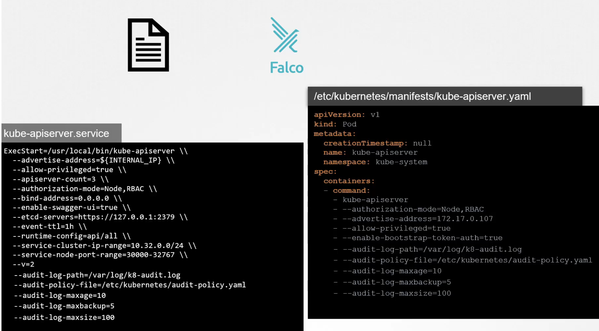
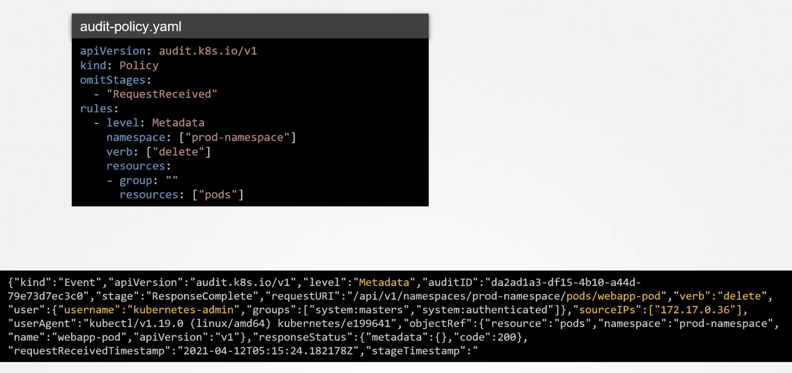

### Falco
- 아무리 보안이 강한 클러스터를 구축하여도 막상 공격 받았을 때는 어떻게 대처애햐 하는가? strace, Tracee 와 같은 툴로 application에서 사용된 syscall을 분석할 수 있지만 MSA 환경에서 수백개의 pod가 수만 개의 syscall을 생상하고 있는 환경에서 이를 일일히 분석하는 것은 쉬운 일이 아니다. 
- 대신 Faclo를 활용하면 /etc/shadow 에 접근한다거나 log파일을 편집/삭제 하는 등의 의심스러운 행동을 Falco가 모니터링 해준다.
- Falco Architecture

- Falco Kernel module을 허용하지 않는 Provider도 있어서 Aquasec tracee처럼 eBPF를 활용하기도 한다. 
- Syscall은 Falco module에 의해 감지되고 나서 library에서 분석되고 predefined된 Falco rule을 활용하여 policy engine에 의해 의심스러운 syscall인지 필터링된다. 
- output/alert 는 log파일이나 slack 등으로 나타난다. 

#### Falco install
- 모든 node에 설치해야 하지만, 그게 안될경우 k8s daemonset으로 설치할 수도 있다. helm chart로 설치하는게 가장 간편하다. 

#### Falco 활용
- journalctl 을 이용해서 host OS에 설치된 falco를 모니터링하고 있는 상태에서 새로운 터미널을 열어 pod에 --exec -it로 접속하거나 /etc/shadow파일을 접근하거나 하면 falco에서 의심스러운 syscall로 보고 감지하는 것을 확인할 수 있다.

- Falco rules
  
  - container.id ~ container.image.repository는 모두 condition에서 디폴트로 사용할 수 있게 해주는 변수(?) 들이다. 
  
  - macro 라는 걸 써서 특정 조건을 다 쓰는 대신 alias로 쓸 수 있다. 
- Falco 설정 파일 
  - 메인 config 파일은 `/etc/falco/falco.yaml` 이다. 이 파일엔 rule파일의 경로들과 log level, priority 등의 정보를 포함한다. priority는 해당 등급 이상의 rule에 대해서만 로깅하도록 하는 것이다.
  - `rule_file:` 부분에서 가장 마지막에 오는 rule이 앞에 있는 rule을 override한다. 
  
  
  - rule 파일
    - Falco는 기본적으로 builtin Rule들이 존재한다. 그 파일들은 /etc/falco/falco_rules.yaml에 존재한다.
    - custom rule들을 추가 적용하기 위해서는 위 파일이 아니라 falco_rules_local.yaml같은 걸 만들어서 추가해주는 것이 좋다. 
    
  - 변경한 rule을 적용하려면 Falco를 재기동하여 hot reload해줘야 한다. 
    `kill -1 $(cat /var/run/falco.pid)`를 하면 서비스가 자동으로 다시 재기동시키기 떄문에 hot reload가 된다. 

### Immutable 인프라
Mutable vs Immutable infrastructure
- Configuration Drift
- 런타임에서 container의 immutable 보장
  - 아래와 같은 행동을 하면 immutability가 깨진다.
    
  - 이런 행동을 미연에 방지하기 위해서 아래와 같이 securityContext에서 `readOnlyRootFilesystem: true` 와 같은 설정을 할 수 있으나 이렇게 하면 pod가 fail한다. nginx pod는 아래 2개 디렉토리에 write하는 작업이 필요하기 때문이다. 그래서 해당 경로에는 volume을 마운트함으로써 해결한다. 
    
  - 결과적으로 아래와 같이 설정되어 있어야 Immutable한 것이다. 
    

### Kubernetes Auditing
k8s에서는 auditing을 지원한다. 모든 request는 kube-apiserver를 통하게 되는데 request의 lifecycle에 따라 아래와 같은 stage를 거지게 된다.
- RequestReceived stage: request가 valid한 지 여부를 떠나서 발생하는 event
- ResponseStarted stage: request가 authenticated, authorized, validated 되고 나면 발생하는 event
  - --watch와 같이 시간이 소요되는 request에 적용하기에 좋다. 
- ResponseComplete stage : request가 처리되고 response가 응답될 때 발생하는 event 
- Panic stage: request가 invalid하거나 error가 있을 때 발생하는 event 
각 stage는 auditing이 enable되어 있을 때  kube-apiserver에서 의해서 기록될 수 있는 event를 발생시킨다. 

#### auditing Rules
- 모든 event를 로깅하게 되면 비효율적이기 때문에 아래와 같이 Rule을 만들어 관리한다. audit level은 `None`, `Metadata`, `RequestResponse`가 있으며 None은 아무것도 남기지 않고 RequestResponse는 Metadata보다 더 많은 데이터를 기록한다. 아래 rule에서 secret에 대해서는 metadata 레벨로 기록되며 따로 namespace나 verb, resourceNames 등이 설정되지 않았기 때문에 모든 secret에 대한 operation에 대해서 metadata레벨로 로깅되게 된다. 

- audit logging을 하기 위해서는 kube-apiserver에서 enable을 해줘야 하는데 아래와 같이 yaml파일에서 관리할 수 있으며 audit log를 어디에 저장할 지, 저장 공간과 기간은 얼마로 할 지에 대한 설정을 할 수 있다. 

- 설정을 하고 나서 kube-apiserver에 아래와 같이 audit log와 audit rule의 yaml파일에 대해서는 아래와 같이 volumes: , volumeMounts: 설정을 `/etc/kubernetes/manifests/kube-apiserver.yaml`에 해줘야 한다.
  ```yaml
  volumes: 
    - name: audit
      hostPath:
        path: /etc/kubernetes/prod-audit.yaml
        type: File
    - name: audit-log
      hostPath:
        path: /var/log/prod-secrets.log
        type: FileOrCreate
  ```
  ```yaml
  volumeMounts: 
    - mountPath: /etc/kubernetes/prod-audit.yaml
      name: audit
      readOnly: true
    - mountPath: /var/log/prod-secrets.log
      name: audit-log
      readOnly: false
  ```
- 아래 그림은 해당 rule로 설정했을 때 log파일에 어떻게 결과가 출력되는 지에 대한 예시이다. 
