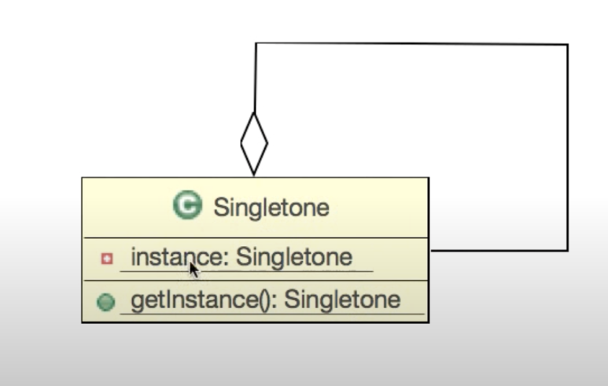

### 싱글톤 패턴의 정의와 UML은 아래와 같다.

> #### **_"소프트웨어 디자인 패턴에서 싱글턴 패턴(Singleton pattern)을 따르는 클래스는, 생성자가 여러 차례 호출되더라도 실제로 생성되는 객체는 하나이고 최초 생성 이후에 호출된 생성자는 최초의 생성자가 생성한 객체를 리턴한다. 이와 같은 디자인 유형을 싱글턴 패턴이라고 한다"_**



다르게 말하면 프로세스가 실행될 때 한 번만 메모리를 할당하고 해당 메모리에 인스턴스를 만들어서 전역에서 공유하기 위한 패턴이다. 클래스에 딱 하나의 인스턴스만 존재해야 되고, 어플리케이션 전역적인 접근이 필요한 경우에 이를 사용한다.

<br>
전역적으로 적용되어야 하는 앱의 Setting 클래스라던가, Logger, datasource 같은 것이 싱글톤의 예시이며 Spring에서 bean을 전역적으로 관리하고 Dependency Injection을 통해 필요한 곳에 빈을 주입하는 것도 싱글톤 패턴이 적용된 예이다.

---

정의에서는 '생성자가 여러 차례 호출되더라도' 라고 표현했지만, 실제 싱글톤 클래스(A 클래스라고 하자)를 구현할 때는 애초에 외부에서 인스턴스를 생성할 수 없도록 생성자를 private으로 두고, 클래스 안에서 A를 타입으로 하는 static 변수에 static 메소드인 getInstance 메소드를 통해 인스턴스를 생성하여 할당한다.

이렇게 하면 프로세스 실행 시에는 미리 할당된 정적 메모리에 A 타입의 변수가 할당되게 되고, (static 변수이기에)

외부에서는 객체의 생성(new) 없이도 static 메소드인 getInstance 메소드를 통해 기 할당된 static 변수의 공간에 인스턴스를 생성할 수 있게 된다.
<br>

Settings 클래스 예시를 보자.

```
@Getter
@Setter
public class Settings{
    private static Settings settings;
    private Settings(){}
    public static Settings getSettings(){
        if( settings == null ){
            settings = new Settings();
        }
        return settings;
    }

    private boolean darkMode = false;
    private int fontSize = 10;
    private String fontColor = 'black';
}
```

위와 같이 선언된 Settings 클래스는 이제 어디에서나 사용가능하며, 서로 다른 클래스에서 Setting 클래스의 변수를 getSetting 메소드를 통해 할당하면 darkMode, fontSize, fontColor값을 변경하더라도 공통으로 적용되게 될 것이다.
<br>

이는 결국 어디에서든 getSetting 메소드를 통해 반환된 동일한 인스턴스라는 것을 의미하기 때문에 아래 코드로 테스트를 해보면 true 값이 출력되는 것을 볼 수 있다.

```
public static void main(String[] args){
    Settings setting1 = Settings.getSettings();
    Settings setting2 = Settings.getSettings();

    System.out.println(setting1 == setting2);
}
```

<br>
별거 아닌 것 처럼 보이는 디자인 패턴이지만 늘 디자인 패턴을 공부할 때 가장 앞에 나오는 이유는 가장 유용하게 많이 쓰이는 패턴이기 때문이어서가 아닐까.

<br>

<br>
Spring과 같은 framework에서 bean으로 등록하는 어노테이션(@bean, @Service, @Controller, @Repository 등)을 통해 등록 해 두기만 하면 어디서든 @Autowired 를 통해 사용하고자 하는 곳 어디에서든 bean을 주입 받을 수 있는 것처럼.

---

<br>
* private 생성자 : 외부 생성 막기 위함

- 클래스 type static 변수 : 미리 정적 메모리에 인스턴스 할당을 위한 공간 마련하기 위함

- static getInstance 메소드 : 외부에서 인스턴스 생성 없이 마련된 정적 메모리 공간에 인스턴스를 생성하고, 이미 있을 경우 해당 인스턴스를 반환 받기 위함

<br>

### 멀티스레드 환경에서의 싱글톤

: 2개 이상의 스레드가 인스턴스를 얻기 위해 getInstance 메소드( 위에서는 getSettings메소드 )에 진입하게 되면 서로 다른 2개 이상의 인스턴스가 만들어질 수 있다. 따라서 멀티스레드 환경에서는 그냥 처음부터 인스턴스를 만들어 버리면 됨.

```
public class Settings{
    private Settings(){}
    private static Settings settings = new Settings();
    public static Settings getSettings(){
        return settings;
    }
}
```
