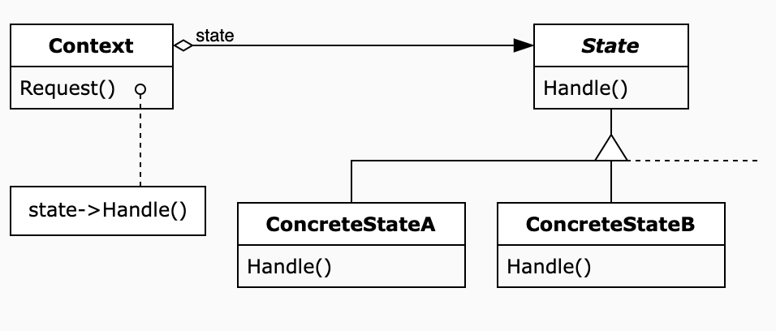

State 패턴에 대한 UML을 보자마자 든 생각은 '어? 이거 Strategy 패턴과 똑같은데?' 라는 생각이었고,

State 패턴에 대한 설명을 듣고 나서 든 생각은 '어? 이거 옛날에 Logic design 수업에서 배운 FSM(Finite State Machine)과 비슷하네?' 라는 생각이었다.
그리고 실제로 FSM 개념을 프로그래밍적으로 구현한 것이 State패턴이다.

UML은 Strategy패턴과 사실상 같다고 볼 수 있다.
Context 클래스에서 State interface 객체를 가지고 있고, State과 관련된 행동을 State class에게 위임한다.


<br>

그렇다면 Strategy와 다른 점은 무엇일까?

Strategy 패턴은 공통적 성격이 있는 여러가지 기능을 특정 메소드에서 모드에 따라 다르게 실행되도록 하는 것이라면,

State 패턴에서는 특정 메소드가 실행될 때 모드에 따라 다르게 실행되는 점은 동일하지만, 특정 조건에서 모드를 전환시킨다는 점에서 다르다.

즉 State 패턴은 상태에 따라 다른 동작을 수행하고 특정 조건이 되었을 때 다른 state로 넘어가길 원하는 경우에 사용한다.

이런 개념은 게임에서 많이 사용된다.

아래 이미지는 개임에서의 상태를 FSM 다이어그램 형태로 나타낸 것이다.

아래와 같이 복잡한 동작을 if, else, switch와 같은 분기 처리로 구현하려면 코드가 매우 복잡해 질 뿐더러 직관적으로 이해하기도 어려울 것이다.


---

### 선풍기 예제를 통해 보는 state패턴

전원버튼, 강약 조절 버튼과 회전 버튼이 있는 선풍기를 state 패턴으로 구현 해보자.
이 선풍기가 가질 수 있는 상태는 다음과 같다.

- Off 상태

  - 전원 버튼을 누르면 켜지면서 weak 상태로 변경

- Weak 상태

  - 전원 버튼을 누르면 Off 상태로 변경
  - 회전 버튼을 누르면 WeakAndRotate 상태로 변경
  - 강약 조절 버튼을 누르면 Powerful 상태로 변경

- WeakAndRotate 상태

  - 전원 버튼을 누르면 Off 상태로 변경
  - 회전 버튼을 누르면 Weak 상태로 변경
  - 강약 조절 버튼을 누르면 PowerfulAndRotate 상태로 변경

- Powerful 상태

  - 전원 버튼을 누르면 Off 상태로 변경
  - 회전 버튼을 누르면 Power 상태로 변경
  - 강약 조절 버튼을 누르면 Weak 상태로 변경

- PowerfulAndRotate 상태

  - 전원 버튼을 누르면 Off 상태로 변경
  - 회전 버튼을 누르면 Powerful 상태로 변경
  - 강약 조절 버튼을 누르면 WeakAndRotate 상태로 변경

다이어그램으로 보면 다음과 같다.
<br><br><br>


<br>
만약 이 선풍기의 동작을 if, else, switch 문으로 구현하려면 매우 케이스가 복잡해지고, 코드의 가독성은 떨어지게 될 것이다.
이를 State 패턴을 통해 구현해 보자. 
<br><br>

1. FanState interface 만들기
   <br>
   Context 클래스에서 접근점으로 사용할 Fanstate 인터페이스를 먼저 구현했다. powerButton, rotateButton, intensityButton 3개로
   전원, 회전, 강도를 조절할 수 있다.

   ```java
   public interface FanState {
     public void powerButton();

     public void rotateButton();

     public void intensityButton();
   }
   ```

2. Concrete State 클래스들 만들기
   <br>
   State클래스를 implement하는 5개의 상태 클래스를 만들어준다.
   예시로 FanPowerfulState 는 아래와 같이 구현했다.
   각 state 클래스들은 버튼이 눌렸을 때 어떤 버튼이냐에 따라 freshman이 composite하고 있는 state 멤버의 값을 변경한다.

   ```java
   public class FanPowerfulState implements FanState {

       private final Freshman freshman;

       public FanPowerfulState(Freshman freshman){
           this.freshman = freshman;
       }

       @Override
       public void powerButton(){
           System.out.println("선풍기 전원 off");
           freshman.setFanSate(new FanOffState(freshman));
           System.out.println("변경된 state: FanPowerfulState -> FanOffState");
       }

       @Override
       public void rotateButton() {
           System.out.println("선풍기 회전 On");
           freshman.setFanSate(new FanPowerfulAndRotateState((freshman)));
           System.out.println("변경된 state: FanPowerfulState -> FanPowerfulAndRotateState");
       }

       @Override
       public void intensityButton() {
           System.out.println("선풍기 강도 약");
           freshman.setFanSate(new FanWeakState((freshman)));
           System.out.println("변경된 state: FanPowerfulState -> FanWeakState");
       }
   ```

3. Context 클래스 구현: Freshman
   <br>
   군대에서 신병이 선풍기를 켜고 끄고 조절하는 걸 다 하게 된다는 의미에서 Context 클래스는 Freshman으로 했다.
   Freshman 클래스는 State 클래스를 멤버로 가지며, 각 버튼이 눌렸을 떄의 동작을 State클래스들에게 위임한다.

   ```java
   public class Freshman {
     private FanState fanState = new FanOffState(this);

     public void setFanSate(FanState state) {
       this.fanState = state;
     }

     public void powerButton() {
       this.fanState.powerButton();
     }

     public void rotateButton() {
       this.fanState.rotateButton();
     }

     public void intensityButton() {
       this.fanState.intensityButton();
     }
   }
   ```

---

#### 대표적인 State 패턴 사용 사례 : TCP connection

TCP 연결 프로토콜에서 이 패턴을 사용했는데, 이를 자바로 표현하면 다음과 같다.
이는 다음 상태로 넘어갈 수 있는 방법이 activeOpen, passiveOpen, clse, acknowledge, send 5가지란 의미이다.

```java
public interface TCPState {
  void activeOpen(TCPConnection tcpConnection);

  void passiveOpen(TCPConnection tcpConnection);

  void close(TCPConnection tcpConnection);

  void acknowledge(TCPConnection tcpConnection);

  void send(TCPConnection tcpConnection);
}
```

<br>

그리고 TCPState는 4가지 상태를 지닌다.

```java
TCPClosed implements TCPState
TCPEstablished implements TCPState
TCPListen implements TCPState
TCPClosed implements TCPState
```

---

#### State 패턴 사용 시의 고려사항

- 상태를 변수가 아닌 클래스로 표현 하는 것이 낫다면 State 패턴으로의 리팩토링을 고려할 수 있다.
- State 패턴은 if/else/switch를 효과적으로 제거한다. 그러나 State 패턴 사용 시 더 복잡해 지는 경우에는 사용을 지양한다.
- 각 State는 어떤 State가 다음 상태로 올 수 있는 지에 대해 알고 있어야 한다.
- 각 State가 똑같이 행동하는 메소드가 많다면 State 패턴이 필요하지 않을 수 있다.
- 각 State를 싱글톤으로 관리하는 것도 고려할 수 있다.

---

참고자료
: https://johngrib.github.io/wiki/pattern/state/
