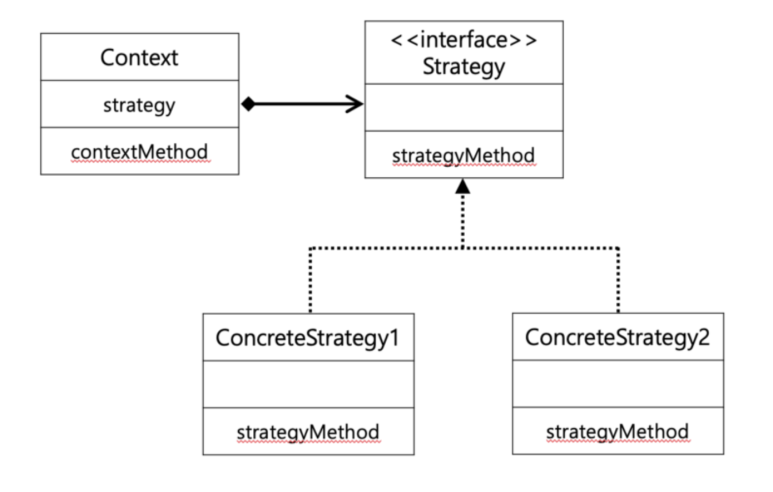

### Strategy(전략) 패턴의 정의와 UML은 아래와 같다.

> #### "여러가지 알고리즘을 하나의 추상적인 접근점(interface)을 만들어 접근점에서 교환 가능하도록 하는 패턴을 Strategy 패턴이라고 한다"



**Strategy 패턴을 이해하기 위해서는 먼저 interface에 대한 이해, 그리고 delegation에 대한 이해가 필요하다. interface는 객체지향 프로그래밍에서 기능에 대한 선언과 구현을 분리하며 기능을 사용하기 위한 통로를 제공한다**

<br>
1. Interface에 대한 이해 - 기능에 대한 선언과 분리
<br>
직관적으로 이해하자면 interface는 일종의 '자격증' 같은 것이다. fly()라는 메소드를 지닌 Flyable 이라는 인터페이스가 있을 때 Bird 클래스에서 이것을 implements 한다면 Bird클래스는 Flyable 의 fly() 기능을 사용하기 위한 자격을 갖춘 것으로 이해하면 좋을 것 같다. 물론 그 기능은 무조건 사용해야 한다. 이렇듯 기능에 대한 선은 Flyable 인터페이스해서 해두고, 그에 대한 직접적인 구현은 Bird, Airplane, Rocket 등 Flyable에 대한 "자격을 갖춘 클래스"에서 하는 것이다.

<br>
<br>
2. Interface에 대한 이해 - 기능을 사용하기 위한 통로

<br>
아래 코드에서 작성한 것처럼 Flyable 인터페이스 타입의 객체는 이를 implement한 클래스의 인스턴스를 할당 받을 수 있고, 이를 통해 각 클래스에서 각각 구체적으로 구현된 fly() 메소드를 사용하기 위한 통로로서 사용된다.

<br>

```

Flyable flyingObject1 = new Bird();
Flyable flyingObject2 = new Airplane();

flyingObject1.fly() // '훨훨~~
flyingObject2.fly() // '슝~'

```

<br>
3. Delegation(위임)

Delegation은 특정 객체의 기능을 사용하기 위해 다른 객체의 기능을 호출하는 것을 말한다. 아래 코드를 보면 금방 이해가 될 것이다.

```

public class Boss{
Employee employee = new Employee();

public void doCopy(){
employee.doCopy();
}
}
public class Employee{
public void doCopy(){
System.out.println("1000장 째 복사중");
}
public void makeDoc(){
System.out.println("쓸데없는 PPT 만드는 중");
}
}
```

<br>
위와 같이 Boss 클래스에서 doCopy를 하기 위해 Employee 인스턴스의 doCopy 메소드를 호출하는 것을 의미한다.

이제 interface와 delegation에 대해 이해 했으니 다시 돌아가서 Strategy 패턴이 무엇인지 예를 통해 알아보자.

### 예제 : 게임 캐릭터의 공격 구현 전략

```

public interface Weapon{
public void attack();
}

public class Knife implements Weapon{
@Override
public void attack(){
System.out.println("칼로 찌르기");
}
}

public class Shotgun implements Weapon{
@Override
public void attack(){
SYstem.out.println("샷건 쏘기");
}
}

```

<br>
Weapon이란 인터페이스는 Knife와 Shotgun에 외부에서 접근할 수 있는 '접근점'을 제공하며, 기능의 선언은 Weapon에서 구현은 Knife,Shotgun에서 하였다.

이제 이를 사용하는 게임 캐릭터 클래스를 만들어 보자. GameCharacter 클래스에서는 외부에서 '장착' 시켜준 weapon을 자기의 무기로 설정하고 이를 이용한 공격은 weapon 클래스에게 delegate(위임) 한다.

```

public class GameCharacter{
// 접근점인 인터페이스 타입의 객체 선언
private Weapon weapon;
// 무기 교체 가능
public void setWeapon(Weapon weapon){
this.weapon = weapon;
}

    //delagation GameCharacter 클래스에서 attack 메소드에 대한 동작을 Weapon클래스에 위임함
    public void attack(){
        if(weapon == null){
            System.out.println("맨손 공격");
        }
        else{
            weapon.attack();
        }
    }

}

```

<br>
이제 Main 메소드에서 게임캐릭터를 사용하여 공격해보자. 아래처럼 게임캐릭터에서는 attack이라는 동일한 메소드를 실행하지만 어떤 무기를 게임캐릭터에 장착시켜주냐에 따라 서로 다른 동작(알고리즘)을 하도록 구현할 수 있다.

```

public class Main{
public static void main(String[] args){
GameCharacter gameCharacter = new GameCharacter();
gameCharacter.attack(); // 맨손 공격
gameCharacter.setWeapon(new Knife());
gameCharacter.attack(); // 칼로 찌르기
gameCharacter.setWeapon(new ShotGun());
gameCharacter.attack(); // 샷건 쏘기
}
}

```

---

- Strategy 패턴의 장점은 Context 클래스의 수정 없이(위에서는 game character가 context 클래스이다) 쉽게 새로운 기능(전략)을 추가하거나 수정할 수 있다는 데에 있다. 예컨대 위 예제에서 새로운 무기인 Arrow를 추가한다고 하면, 단순히 Weapon 인터페이스를 implements해주는 클래스로만 작성하면 되고, GameCharacter 클래스는 건들 필요가 없다.

- 그래서 일일이 경우에 따른 else if 문이나 switch문을 추가할 필요가 없이 새로운 클래스를 만들어 객체지향적으로 해결할 수 있다는 장점을 지닌다.

- Strategy 패턴은 보통 하나의 메소드를 위임처리할 때 사용된다.

개인적으로 Strategy 패턴은 객체지향적 프로그래밍을 이해하는 데 좋은 예시라고 생각한다.
