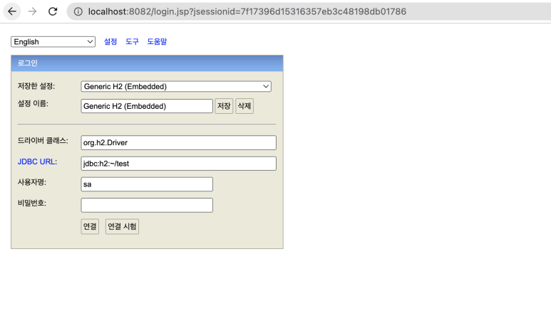

1. h2를 설치해서 bin폴더 내에서 ./h2.sh를 실행했으나 permission denied로 뜸.

-> chmod 755 h2.sh 또는 chmod +x h2.sh를 통해 해당 파일에 실행권한 부여.

2. ./h2.sh 하니깐 웹 브라우저 상에서 실행되었으나 아래와 같이 연결할 수 없다고 나옴.

url중 ip부분을 localhost:8082로 변경하고 테스트하면 아래와 같이 잘 나오는 걸 확인할 수 있었다.

