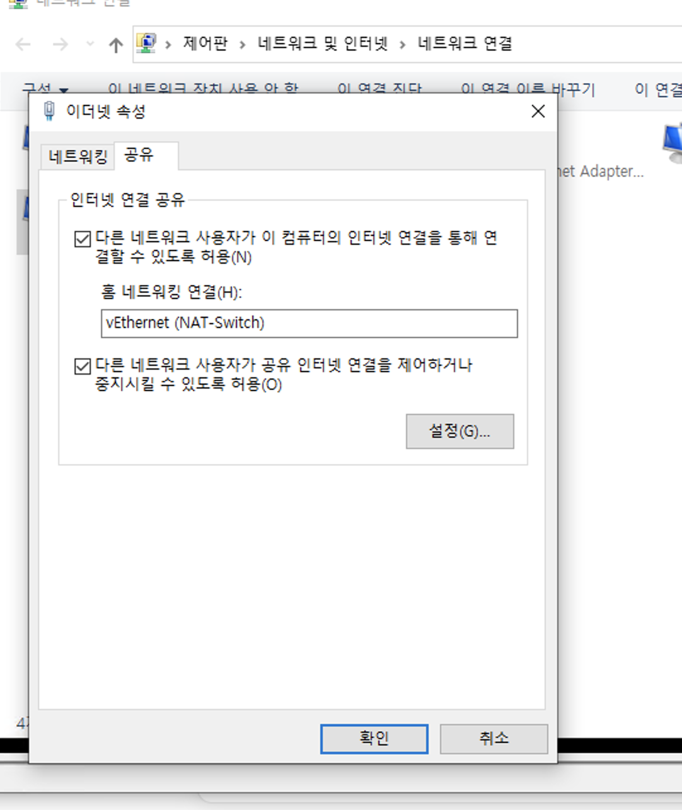

호스트 서버에서 평소에는 늘 VM에 SuperPutty로 접속하면 접속이 잘 됐었는데, 어느 날 갑자기 로그인 창에서 패스워드 입력하라고 나오지 않기 시작했다.
아주 오래 기다려 나오더라도 패스워드 입력도 제대로 안 먹혔다.
<br>

### 해결 방법 1
/etc/ssh/sshd_config 파일의 UseDNS 설정을 변경한다. 
UseDNS yes로 디퐅르 설정이 되어 있어 Reverse DNS를 하기 때문에
UseDNS no 로 변경해 한다. 변경 후 sshd 데몬 reload

```
systemctl restart sshd
```

### 해결 방법 2
해결 방법 1을 해도 안될 경우! 
호스트 서버에서 자동으로 ip를 할당 받도록 하지 않고, 8.8.8.8, 8.8.4.4 를 DNS서버로 지정해준다. 
그리고 VM에서도 /etc/sysconfig/network-scripts/ifcfg-eth0 파일의 설정에서도 아래와 같이 DNS 서버 정보가 호스트와 일치하도록 해주면 된다. 
```
DNS1=8.8.8.8
DNS2=8.8.4.4
```

### 해결 방법 3
이래 저래 해도 안 될 경우 호스트 서버의 '이더넷' - '속성' - '공유'에서 아래 설정을 해제하고 적용시킨 다음 다시 체크하고 적용시켜본다. 
그냥 껐다 켜보란 뜻이다. 그러면 되는 경우도 있다. 뭔가 VM의 eth0이 NAT-switch를 거쳐 인터넷으로 나가야 하는데 관련된 인터넷 연결이 공유가 안되었던 거겠지. 

