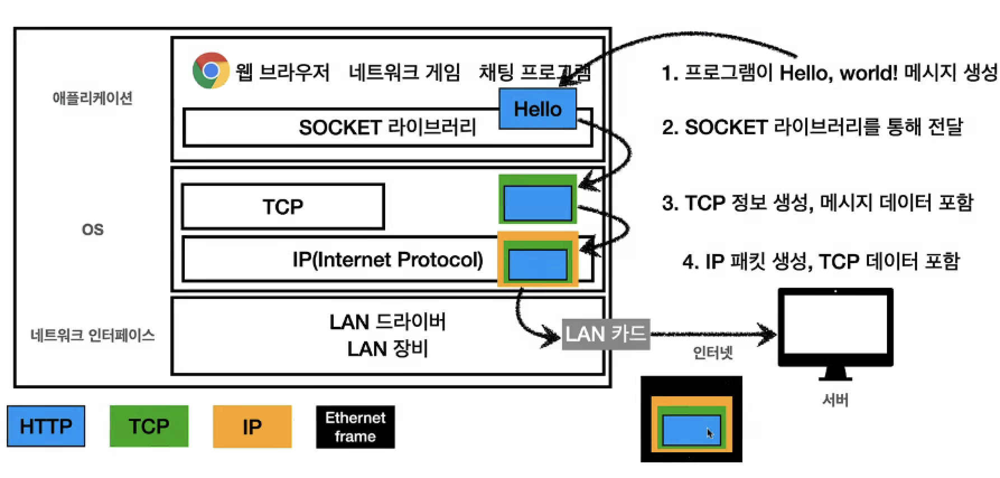

# 1. 인터넷 네트워크

어떻게 이렇게 복잡한 ‘인터넷’이라는 경로를 거쳐 컴퓨터는 통신하게 되는가? 

→ IP(internet protocol)을 통해서 가능하다.

## IP

지정한 IP 주소로 ‘packet’이라는 통신 단위로 데이터를 전달한다. 

패킷에는 출발지/목적지에 대한 정보가 들어있어서, 클라이언트 ↔ 서버 간에 통신이 가능해진다.

### Client → Sever

### Server → Client

## IP 프로토콜의 한계

그러나 IP프로토콜 만으로는 출발지 ↔ 목적지 사이의 원활하고 안정적인 통신이 불가능하다. 아래의 이유 때문에. 

### 1) 비연결성

패킷을 받을 수 없거나 서비스 불능 상태여도 패킷을 전송한다.

### 2) 비신뢰성

- 중간에 패킷이 소실 되는 것에 대한 대책이 없다.
- 패킷이 요청 순서대로 간다는 것을 보장할 수 없다.
    
    
    

### 3) 프로그램 구분

같은 IP를 사용하는 서버에서 통신하려는 애플리케이션이 2개 이상인 경우 구분할 수 없다. 

## TCP

이러한 IP 프로토콜의 한계를 TCP 프로토콜이 해결해준다. 

우선 인터넷 프로토콜 스택의 4계층을 살펴보자.

이와 같은 네트워크 계층 구조에서 실제 패킷이 전송되는 그림은 아래와 같다. 

1) 애플리케이션 단에서 HTTP 프로토콜에 전송할 데이터를 담은 후, 소켓 라이브러리를 통해서 OS 단의 network 스택에 전달한다.  ( application layer ) 

2) Network 스택은 메시지 데이터 + TCP 정보를 담아 TCP segment를 생성하고, 이어서 ip 정보들을 포함한 IP packet으로 encapsulate 한다.  ( tcp / ip layer ) 

3) Network 스택은 이어서 IP packet을 NIC로 보내서 NIC에서는 출발지/목적지 MAC 주소 + 오류검출을 위한 CRC 등의 정보를 포함시킨 ethernet frame을 만들고, 물리 계층을 통해 전송한다. ( network interface layer ) 

- Network stack
    
    Network stack은 프로토콜 처리, 패킷 분할 및 재조립, 라우팅 결정, 흐름 제어, 오류 검출 등의 작업을 처리한다. 응용 프로그램과 하드웨어 사이에서 데이터 전송을 관리하고 네트워크 통신을 가능하게 함 
    
- NIC(Network Interface Card , Network Adaptor)
    
    NIC는 컴퓨터의 네트워크 인터페이스를 제공하는 하드웨어 장치이다. NIC는 물리적인 전송 계층을 처리하며, 데이터를 전송 매체에 맞게 en/decapsylate한다. 예를 들어, 이더넷 NIC는 이더넷 프레임/Wifi 프레임을 생성하고, 데이터 링크 계층에서 패킷을 처리하며, 전송 매체(Fiber등) 등을 통해 데이터를 전송합니다.
    

### TCP/IP 패킷의 구조

- IP 패킷은 출발지ip, 목적지ip 정보를 중점적으로 담고 있다.
- TCP/IP 패킷은 IP패킷에 TCP를 위해 필요한 정보가 추가된 것으로 아래와 같은 데이터를 추가로 지닌다.
    - port정보
    - 전송 제어
    - 전송 순서
    - 검증 정보

TCP(Transmisttion Control Protocol) 는 이름 그 자체로 전송을 제어하기 위한 프로토콜이다. 

그 전송을 위한 특징은 아래와 같다. 

- 연결지향 ( 3-way handshaking을 통한 )
- 데이터 전달 보증 ( 패킷 소실 시 알 수 있음 )
- 순서 보장

→ 이와 같이 **TCP는 신뢰할 수 있는 프로토콜**이다. 

### 3-way handshaking - 연결지향

TCP 통신 시 가장 먼저 3-way handshaking이라는 과정을 거친다. 실제 클라이언트 ↔ 서버 간에 무언가 물리적인 연결을 맺는 것이 아니라, 3-way handshaking을 통해 ‘가상으로 연결된 것’ 이라고 간주할 뿐이다. 

SYN → SYN + ACK → ACK → 데이터 전송

이 때, 3번의 ACK과 함께 데이터를 전송할 수도 있다. 

### 데이터 전달 보증

데이터 전송 후 데이터를 잘 받았다는 response가 오도록 되어 있기 때문에 안오면 데이터 소실을 유추가능 

### 순서 보장

TCP 내의 순서정보에 의해서 패킷을 순서대로 못받으면 패킷을 다시 보내라고 송신측에 요청한다. 

## UDP

: IP + PORT + Checksum 정도의 프로토콜 
- 기능이 거의 없어 하얀 도화지에 비유됨
- 데이터 전달 보증, 순서 보장 X
- 단순하고 빠르다. 
- TCP의 3-hand shaking, 전달 보장 등을 하지 않기 때문에 가볍고, 더 최적화가 가능한 도화지와 같은 프로노콜 → HTTP3에서 채택해서 요즘에 뜨고 있음

## Port

한 번에 2개 이상의 컴퓨터와 연결해야 하면 어떻게 해야 하는가? 

→ 같은 IP 내에서 port로 프로세스를 구분한다.

- 목적지 뿐 아니라, 출발지의 port까지 서버에서 알 수 있다. (TCP segment )
- 0~1023 : Welll-known port

## URI와 웹 브라우저 요청 흐름 
URI의 뜻은 무엇인가? 
- Uniform : 리소스를 식별하는 통일된 방식
- Resource: 자원, URI로 식별할 수 있는 모든 것
- Identifier: 다른 항목과 구분하는데 필요한 정보 

URI는 URL과 URN의 합집합이지만 URN은 사실 상 쓰이지 않으므로 URI=URL이라고 볼 수 있다. 

### URL 구조
`scheme://host[:port][/path][?query][#fragment]` 형태로 구성됨 
- fragment는 서버에 전송하는 정보는 아니고 html 내부 북마크 등에 사용됨

### 웹 브라우저 요청 흐름 

TCP에서 설명했던 흐름과 동일하다. 단, HTTP request 메시지는 아래와 같은 형태로 정의된다. 

'GET /search?q=hello&hl=ko HTTP/1.1  
HOST: www.google.com' 

그러면 서버는 HTTP response 메시지를 아래와 같은 형태로 보내준다.  

'
HTTP/1.1 200 OK  
Content-Type: text/html;charset=UTF-8  
Content-Length:3423  
 
\<html>  
  \<body>...\<body>  
\<html>'

# HTTP 기본 
거의 모든 형태의 데이터를 HTTP 메시지에 담아서 전송한다. 
- HTML, TEXT, JSON, XML
- Image, 음성, 영상, 파일
- 서버 to 서버 데이터 전송에도 대부분 HTTP 사용 

## HTTP 역사
- HTTP/1.0 (1996) : 메소드, 헤더 추가
- HTTP/1.1 (1997) : **가장 많이 사용하고 중요한 버전이다.**
  - RFC2068 -> RFC2616 -> RFC7230~7235 (2014)
- HTTP/2 2015년 : 성능 개선
- HTTP/3 진행 중 : TCP 대신 UDP 사용, 성능 개선
  - application 레벨에서 성능 최적화 

크롬 network 탭에서 우클릭하여 'Protocol' 선택하면 상세 버전(h2,h3등)을 확인할 수 있다. 

### HTTP 특징
- 클라이언트 서버 구조
- stateless
- 비연결성
- 단순한 메시지 구조

### 클라이언트 서버 구조
: 클라이언트와 서버가 분리되어 있기 때문에 각자의 역할에 맞게 진화할 수 있게 되었다. 

#### statelss / stateful
- Stateless(무상태) : 서버가 클라이언트의 상태, context를 보관하지 않는다. 
- Stateless 인 경우 아무 서버나 호출해도 되기 때문에 무한한 서버 증설이 가능하다. 
- 실무 한계 
  - 로그인한 사용자의 경우 로그인 했다는 상태를 서버 세션에 유지해야 하므로 stateful하게 설계할 수 밖에 없다. 
  - 데이터를 서버에 많이 보내줘야 한다는 단점. 

#### 비연결성
- 클라이언트 <-> 서버 간에 연결을 유지하지 않는다. 
- 1시간 동안 수천명이 서비스를 이용해도 실제 서버에서 동시처리에 처리하는 것은 수십 개 이하로 매우 작다. 즉, 서버 자원을 매우 효율적으로 사용이 가능하다..
- 한계와 극복
  - 매번 3 way handshake에 대한 시간이 소요된다.
  - Persistent Connections 
    - 이 기술 덕분에 여러가지 리소르를 서버로 부터 내려받는 과정에서 매번 3 way handshake를 하지 않게 되었다. 
      
    - HTTP/2, HTTP/3에서 계속해서 최적화 되고 있음. 

#### HTTP 메시지 구성
단순하므로 확장이 가능하다!

1. 시작 라인
  - 요청 메시지: HTTP 메소드, 요청 대상, HTTP 버전
  - 응답 메시지: HTTP 버전, 상태 코드
2. HTTP 헤더
  - http 전송에 필요한 부가정보
  - 예시) 메시지 바디 크기, 압축, 인증, 클라이언트 정보, 서버 애플리케이션 정보, 캐시 관리 정보 등.. 
  - 표준 헤더가 많다.
  - 커스텀 헤더도 가능 
3. HTTP 메시지 바디
  - 실제 전송할 데이터

