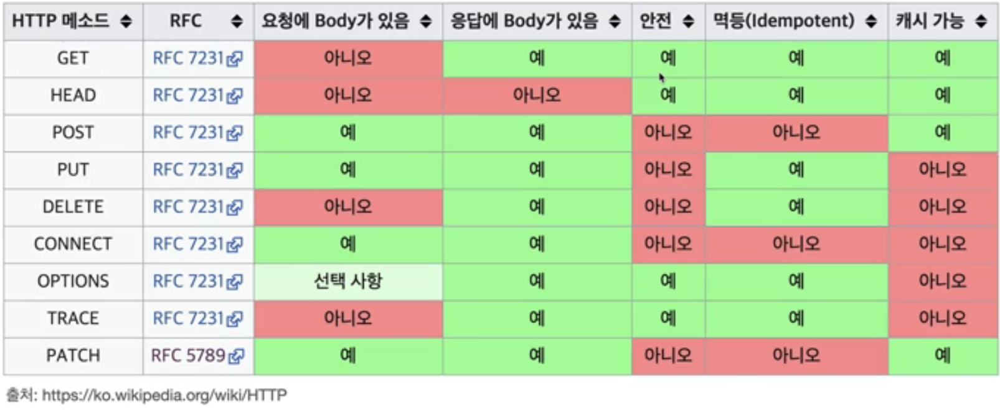
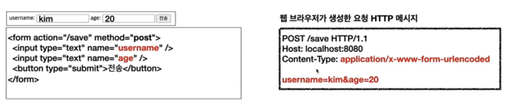
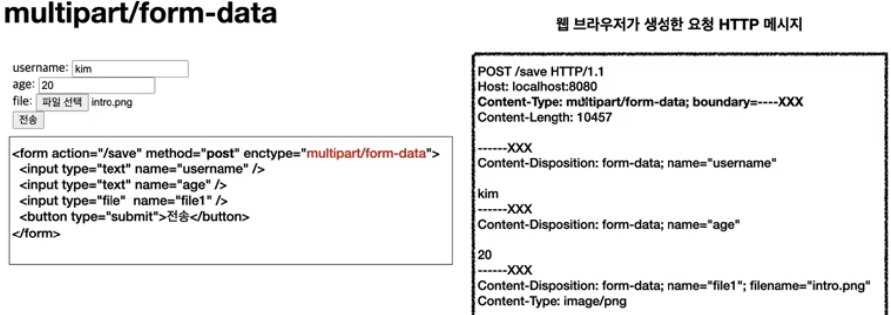
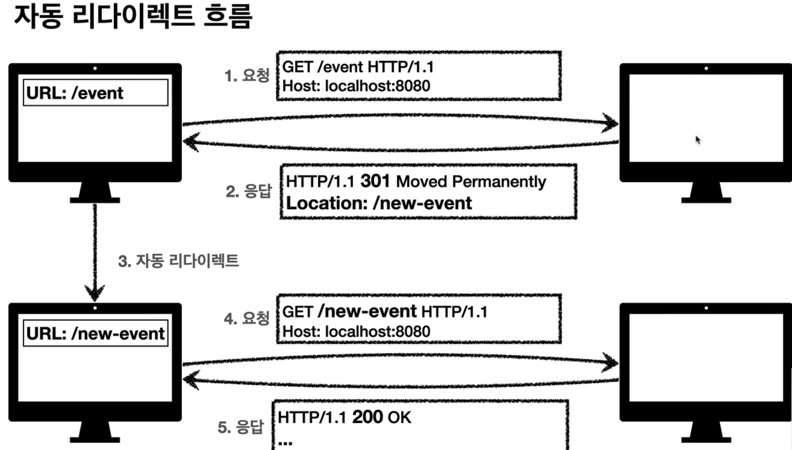
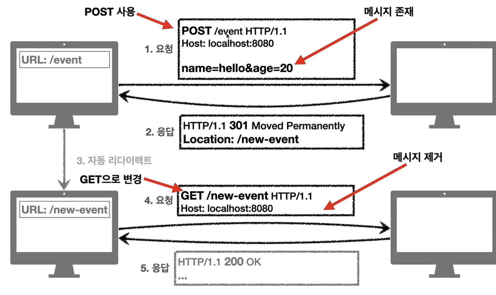
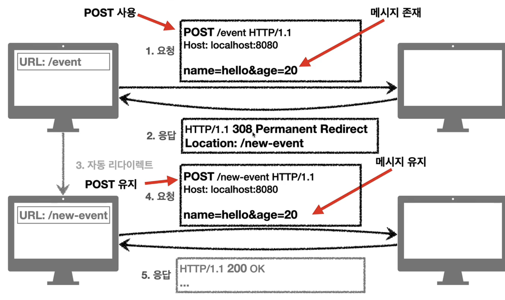
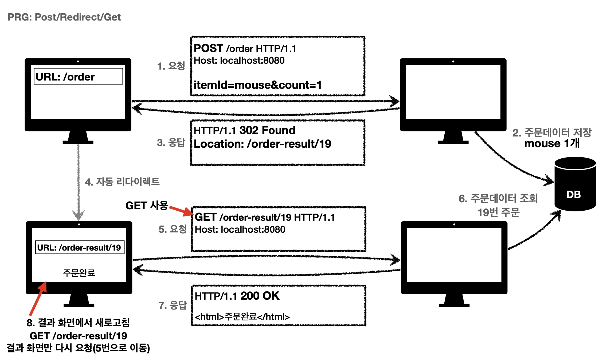

## 1. HTTP 메소드

### API URI에 대한 고민

- API URI를 고민할 떄 가장 중요한 기준은 '리소스의 식별' 이다.
  - ex) 회원을 조회한다고 할 때 '회원' 자체가 리소스이다.
  - 따라서 URI에 '회원'을 매핑 해주어야 한다.
- 리소스는 '복수형'으로 사용한다.
  - ex) members(O), member(x)
- 리소스와 행위를 구분한다.
  - 행위는 http 메소드를 통해 구분한다.

### HTTP 메소드 : GET, POST

#### HTTP 메소드 종류

- GET : 리소스 조회
- POST: 요청 데이터 처리, 등록에 사용
- PUT : 리소스를 대체
- DELETE : 리소스 삭제
- PATCH : 리소스 부분 변경

#### GET

- 리소스 조회
- 서버에 전달하고자 하는 데이터는 query param을 통해 전달
- GET에서도 body를 지원하긴 하지만 지원하지 않는 서버도 존재하여 권장되지 않음

#### POST

- 데이터 등록, 요청 데이터를 통한 프로세스 처리
- 메시지 body를 통해 서버로 데이터 전달
- 다른 메소드로 처리하기 애매할 경우에도 POST 사용
  - ex) json으로 조회 데이터를 넘겨야 하는데 GET 메소드를 사용하기 어려운 경우

#### PUT

- 리소스를 완전히 대체한다. 즉 기존 데이터를 삭제하고 다시 저장한다.
  - ex) member가 username, age라는 데이터를 가지고 있다고 할 때 클라이언트가 { username: jj } 라고 PUT 메시지를 보내게 되면 서버에서는 member의 age 데이터를 없애고 username을 'jj'로 덮어쓰는 방식으로 동작한다.
- 클라이언트가 리소스 위치를 알고 URI를 지정한다.
  - ex) 'PUT /members/**100** HTTP/1.1
- 완전히 덮어 쓰는 경우가 아닌 리소스 부분 수정일 경우 적합하지 않다.

#### PATCH

- 리소스 부분 변경
- ex) { age: 50 } 이렇게 클라이언트에서 요청하면 서버에서는 age 데이터에 대해서만 50으로 수정하는 방식으로 동작한다.

#### DELETE

- 리소스 삭제

### HTTP 메소드 속성

#### 안전

- 메소드 속성에서의 안전은 계속 호출해도 리소스에 대한 변경이 일어나지 않는 것을 말한다.

#### 멱등(idempotent)

- f(f(x)) = f(x)
- 즉, 한번 호출하든 여러 번 호출하든 결과가 동일한 것을 의미
  - GET, PUT, DELETE 는 멱등하다.
    - PUT은 결과를 완전히 대체(덮어씀)이기에 여러 번 호출해도 결과는 동일함
  - POST는 멱등하지 않다.
- 멱등의 개념이 필요한 이유로는 대표적으로 '자동 복구 매커니즘'이 있다.
  - ex) 서버가 timeout 등 정상 응답을 주지 못했을 때 클라이언트가 반복해서 호출해도 되는가에 대한 판단 근거가 된다.
- 멱등은 외부 요인으로 중간에 리소스가 바뀐 것 까지 고려하지는 않는다.

#### 캐시가능(cacheable)

- 응답 결과 리소스를 캐시해서 사용해도 되는가?
- GET, HEAD, POST, PATCH가 cacheable하지만, 실제로는 GET, HEAD 정도만 캐싱하여 활용한다.

## 2. HTTP 메소드 활용

### Client -> Server 데이터 전송

- 데이터 전달 방식은 query param, request body 2가지가 있음
- 일반적으로 4가지 상황이 존재한다.

#### 1) 정적 데이터 조회

: 이미지, 정적 텍스트 문서 등.

- 그냥 GET

#### 2) 동적 데이터 조회

- 주로 검색, 게시판 목록에서 정렬 필터 등 GET에 query param 붙여서 조회

#### 3) HTML Form 데이터 전송

- GET, POST만 지원
- Content-Type : application/x-www-form-urlencoded 를 사용한다.
- HTML form으로 데이터 전송할 때 'method=get'이면 query param에 input을 넣고, 'method=post'이면 'key=value' 형태로 body에 input을 넣는다.
  - 아래 그림은 form으로 post전송할 때의 도식
    
- multipart/form-data
  - 주로 binary 데이터를 전송할 떄 사용하며, boundary로 데이터 input 별로 파싱되도록 본문을 구성하여 전송한다.
    

#### 4) HTML API 데이터 전송

- Content-Type: application/json을 주로 사용
- 서버 to 서버, 앱 클라이언트, ajax 통신 등에 사용

### HTTP API 설계 예시

- POST 기반 등록 : 컬렉션
  - 대부분의 시스템은 컬렉션을 쓴다.
- PUT 기반 등록 : 스토어
- HTML FORM 사용
  - GET, POST만 지원하기 때문에 contron-uri를 명시할 수 밖에 없음
  - 폼을 가져오기 위한 GET의 URL과 POST의 URL을 동일하게 하는 것을 권장
- Control uri는 '동사' 여야 한다.

#### API URI best practice

- https://restfulapi.net/resource-naming/

## 3. HTTP 상태코드

### 2XX : 성공

보통 200만 사용하거나 200과 201만 사용한다.

#### 200 OK

- 요청 성공

#### 201 Created

- 요청 성공해서 새로운 리소스가 생성됨
- 생성된 리소스를 응답의 Location 헤더로 반환함

#### 202 Accepted

- 요청이 접수는 되었으나 처리가 완료되지 않았음
- 잘 안 쓰임

#### 204 No-content

- 서버가 요청을 성공적으로 수행했으나 응답 페이로드 본문에 보낼 데이터가 없는 경우

### 3XX : 리다이렉션

요청을 처리하기 위해 유저 agent의 추가 조치가 필요

- 웹 브라우저는 3XX 응답 결과에 Location 헤더가 있으면 Location 위치로 자동 이동되게 되어 있다.  
  

#### 리다이렉션의 종류

- 영구 리다이렉션
- 일시 리다이렉션
  - 예를 들어 주문 완료 후 주문 내역 화면으로 이동
  - PRG: Post/Redirect/Get
- 특수 리다이렉션
  - 결과 대신 캐시를 사용하도록 함

#### 영구 리다이렉션 : 301, 308

- 원래의 URL을 사용하지 않도록 응답하는 것. 이 경우 검색엔진에서도 변경 인지하게 됨
- **301 Moved Permanently**
  - 리다이렉트 요청 시 메소드가 GET으로 변하고 본문이 제거될 수 있음(may)
    
     
     
- **308 Permanent Redirect**
  - 리다이렉트 요청 시 새로운 url로 리다이렉트 시키되, 메소드와 본문을 유지
    

실무적으로는 url 변경이 필요하다고 하면 새로운 url에서 필요로 하는 body값도 변화될 것이기 때문에 308을 사용하는 경우는 거의 없고 301을 통해서 새로운 입력 페이지로 이동 시킨 뒤 다시 클라이언트에서 명시적으로 request를 보내도록 유도하는 것이 일반적이다.

#### 일시적 리다이렉션 : 302, 307, 303

- 리소스의 URI가 일시적으로 변경된 것으로, 검색엔진에서도 URL을 변경한 것으로 인지하지 않음
- **302 Found**
  - 리다이렉트 요청 시 요청 메소드가 GET으로 변하고 본문이 제거될 수 있음(may)
- **307 Temporary redirect**
  - 302와 기능은 같으나, 리다이렉트 요청 시 메소드와 본문을 유지
- **303 See other**
  - 302와 기능은 같으나, 요청 메소드가 '반드시' GET으로 변한다.
  - 이론적으로는 303과 307을 쓰는 것이 권장되지만, 302 Found도 GET으로 변하게 대부분 구현되어 있어서 실무에서 303이 잘 쓰이진 않음

**그렇다면 일시적 리다이렉트를 언제 쓰는가?**

#### PRG: Post/Redirect/Get

- POST로 주문 후 웹 브라우저를 새로고침하면 새로고침은 다시 요청을 의미하므로 '중복 주문'이 될 수도 있다.
- 이러한 문제를 방지하기 위해 PRG라는 개념이 사용된다.
- PRG를 사용하면 POST 주문 후 주문 결과 화면을 GET으로 리다이렉트 시키게 되므로 클라이언트 단에서 새로고침해도 POST가 아니라 결과 화면을 GET으로 요청하게 된다.
  

#### 기타 리다이렉션

- 300 : 안쓰임
- **304 Not Modified**
  - 캐시를 목적으로 사용되며, 클라이언트에게 리소스가 수정되지 않았음을 알려줌으로써 클라이언트가 로컬PC에 저장된 캐시를 사용하게 된다. ( 캐시로 리다이렉트 )
  - 로컬 캐시를 사용해야 하기 때문에 304 응답은 응답에 메시지 바디를 포함하면 안 된다.

### 4XX : 클라이언트 오류

- 오류의 원인이 클라이언트에 있는 경우
- **400 bad request**
  - API스펙이 안 맞거나 요청 파라미터가 맞지 않는 경우
- **401 Unauthorized**
  - 인증이 되지 않음
- **403 Forbidden**
  - 인가가 되지 않음
- **404 Not Found**
  - 요청 리소스가 서버에 존재하지 않음
  - 또는 클라이언트가 권한이 없는 리소스에 부족했을 때 권한을 숨기고 싶은 경우 사용하기도 함

### 5XX : 서버 오류

어지간해서는 서버에서는 500대 오류를 만들어서는 안된다. 비즈니스 오류가 있을 때 500을 내서는 안되고 진짜 서버에 문제가 있을 때 500대로 리턴되도록 설계해야 한다.
비즈니스 오류인 경우에는 400대 또는 200으로 해겷해야 한다.

- 서버 내부 문제로 오류 발생한 것으로, 애매하면 500으로 리턴하면 된다.
- **503 Service Unavailable**
  - 서버가 일시적으로 이용이 불가함
  - Retry-After 헤더 필드로 얼마 뒤 복구되는 지 보낼 수도 있으나 장애 상황에서 실용적이지는 않다.

## Reference

https://www.inflearn.com/course/http-%EC%9B%B9-%EB%84%A4%ED%8A%B8%EC%9B%8C%ED%81%AC/dashboard
