## 1. HTTP 일반 헤더

헤더에는 http 전송을 위해 필요한 모든 부가 정보를 담는다.

- 메시지 바디 내용, 크기, 압축, 인증, 요청 클라이언트, 서버 정보, 캐시 관리 정보 등..

### RFC2616에서 RFC723x로 변화

- entity 대신 representation으로 개념이 바뀜
- 표현 = 표현 메타 데이터 + 표현 데이터

### 표현

- 표현 헤더는, request, response 모두 사용한다.
- Content-Type
  - test/html; charset=UTF-8
  - application/json
  - image/png
- Content-Encoding
  - 표현 데이터를 압축하기 위해 주로 사용
  - gzip, deflate, identity
- Content-Language
  - 자연 언어 표현
  - ko, en, en-US
- Content-Length
  - 바이트 단위
  - Transfer-Encoding 을 사용하면 Content-Length 사용하면 안됨

### 콘텐츠 협상(contents negotiation)

협상 헤더는 클라언트가 요청 시에만 사용하는 헤더이며 클라이언트가 서버에 대해서 선호하는 표현을 요청하기 위해 사용된다.

- Accept : 클라이언트가 선호하는 미디어 타입
- Accept-Charset : 클라이언트가 선호하는 문자 인코딩
- Accept-Encoding : 클라이언트가 선호하는 압축 형식
- Accept-Language : 클라이언트가 선호하는 자연 언어

- Accept-Language:ko 이렇게 클라이언트가 보냈을 때 서버가 ko 언어에 대해서 Response를 주면 좋겠지만, 서버가 해당 언어를 지원하지 않는 경우 등 복잡한 케이스가 존재하여 협상 우선 순위를 통해 요청하면 서버가 해당 값을 기준으로 판단하여 응답을 준다.
  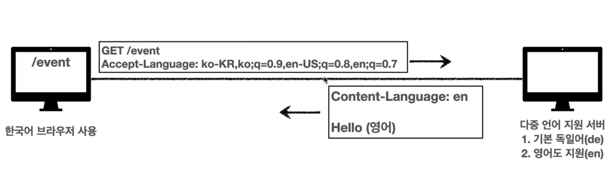

#### 협상 우선 순위1

- `Accept-Language: ko-KR,ko;q=0.9,en-US;q=0.8,en;q=0.7`
- q값은 우선순위를 의미하며 생략하면 1이다. 즉 위의 케이스에서 ko-KR의 q=1이라는 뜻

#### 협상 우선 순위2

- 구체적인 것이 우선한다
- `Accept: text/*, text/plain, text/plain;format=flowed, */*`

  - 이렇게 헤더 정보가 구성되었으면 우선순위는 3 -> 2 -> 1 -> 4 번째 값 순이다.

### 전송 방식

#### 1) 단순 전송

#### 2) 압축 전송

압축된 정보를 http로 전송하는 방법

- Content-Encoding 헤더 필요
  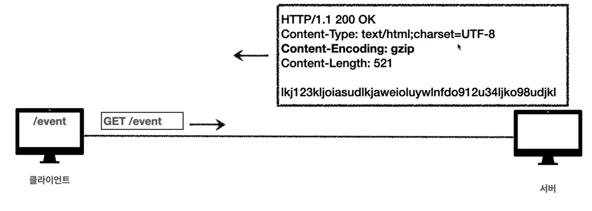

#### 3) 분할 전송

데이터를 분할하여 http로 전송하는 방법으로, Content-Length를 알 수 없기 때문에 쓰지 않는다.

- Transfer-Encoding: chunked 사용
  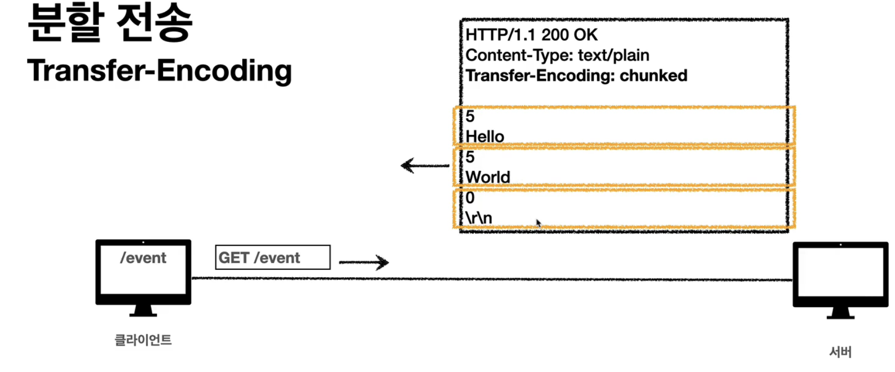

#### 4) 범위 전송

데이터의 범위를 명시하여 전송하는 방법

- Content-Range 헤더 사용
  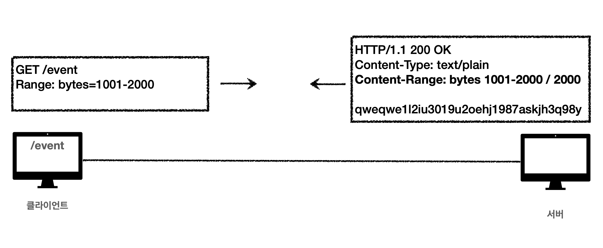

### 일반 정보

- From : 유저 agent의 이메일 정보이다. 잘쓰이지 않음
- Referer : 요청된 페이지의 이전 페이지 주소이며 이것을 활용하여 유입 경로 분석 가능
- User-Agent : 클라이언트의 애플리케이션 정보 ( 브라우저 정보, OS 정보 등 )
  - 어떤 종류의 브라우저에서 장애가 나는지 파악 가능
- Server : 요청을 처리하는 ORIGIN 서버의 소프트웨어 정보
- Date : 메시지가 발생한 날짜와 시간

### 특별한 정보

- Host: 요청한 호스트 도메인 정보
  - 요청에서 사용하며 필수 값이다.
  - 서버의 가상 host 중 어떤 host로 매핑해야 할 지 알 수 있기 위해 필요하다.
- Location
  - 응답에서 사용되며 3xx 에서는 리다이렉트를 시켜주고 201에서는 생성된 리소스의 위치를 알려주는 역할이다.
- Allow: 허용 가능한 HTTP 메소드
  - 405에서 응답에 포함해야 한다.
  - `Allow: GET, HEAD,PUT` 이런식으로,, 그러나 실제 구현되어 있는 서버는 별로 없다.
- Retry-After: 클라이언트가 다음 요청까지 기다려야 하는 시간
  - 503에서 서비스가 언제까지 불능인지 알려주는 용도이지만, 실제 사용하기는 어렵다.

### 인증

- Authorization : 클라이언트의 인증정보를 서버에 전달
- WWW-Authenticate : 리소스 접근 시 필요한 인증방법 정의
  - 401 응답과 함께 사용되며 인증을 위해서 어떻게 해줘야 하는 지에 대한 내용을 포함한다.

### 쿠키

- Set-Cookie
  - 서버에서 클라이언트로 쿠키 전달할 때 사용
- Cookie
  - 클라이언트가 서버로부터 받은 쿠키를 저장하고, HTTP 요청 시 서버로 전달 할 때 사용

HTTP는 Stateless 프로토콜이며 비연결성이기 때문에 인증 시에 쿠키를 사용한다.

#### 쿠키 일반

- ex) set-cookie: sessionId=abcde1234; expires=Sat 25 xxxx GMT; path=/; domain=.google.com; Secure
- 쿠키는 항상 서버에 전송되므로 네트워크 트래팩을 추가로 발생시킨다.
  - 세션Id, 인증 토큰 등 최소한의 정보만 저장하는 것이 좋다.
  - 서버에 전송하지 않고 브라우저 내부에서 데이터를 저장하면서 필요할 때만 서버에 전송하고자 한다면 웹 스토리지(localStorage, sessionStorage)를 사용하는 것이 좋다.
- 보안에 민감한 정보는 절대 브라우저 단에서 보관하면 안됨

#### 쿠키 로그인

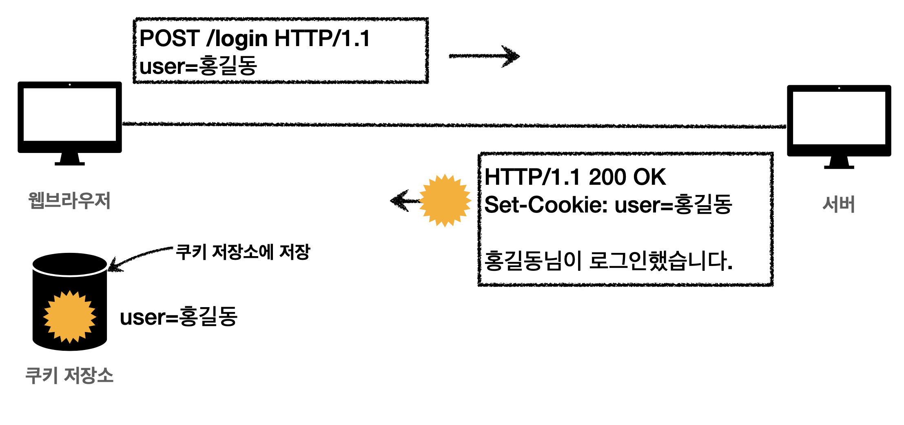

- 쿠키는 모든 요청 정보에 자동으로 포함된다.

#### 쿠키 생명주기

- expires : 만료일이 되면 쿠키 삭제
- max-age : 0이나 음수를 지정하면 쿠키 삭제
- 쿠키의 생명주기에 따른 분류
  - 세션 쿠키 : 만료 날짜를 생략하여 브라우저 종료시까지만 유지되는 쿠키
  - 영속 쿠키 : 만료 날짜를 입력하여 브라우저가 종료되더라도 해당 날짜까지 유지되는 쿠키

#### 쿠키 도메인

- `domain=example.org`라고 명시하여 쿠키를 생성하면 하위 도메인까지 쿠키가 전송이 되지만, 생략하면 서브 도메인에서는 쿠키에 접근(전송)이 안됨

#### 쿠키 경로

- `path=/home`
- 이 경로를 포함한 하위 페이지만 쿠지 접근 가능
- 일반적으로는 `path=/` 로 지정함

#### 쿠키 보안

- Secure : https인 경우에만 전송
- HttpOnly: 자바스크립트에서 접근(document.cookie 접근)을 불가하게 하여 XSS 공격 방지한다. HTTP 전송 때만 쿠키가 사용되도록 하는 것
- SameSite : XSRF 공격 방지. 요청 도메인과 쿠키에 설정된 도메인이 같은 경우에만 쿠키가 전송되도록 설정하는 것
  - Lax, None, Strict

---

 

## 2. HTTP 헤더 2 : 캐시와 조건부 요청

### 캐시 기본 동작

- 캐시가 없다면 매번 요청을 해야 한다.
  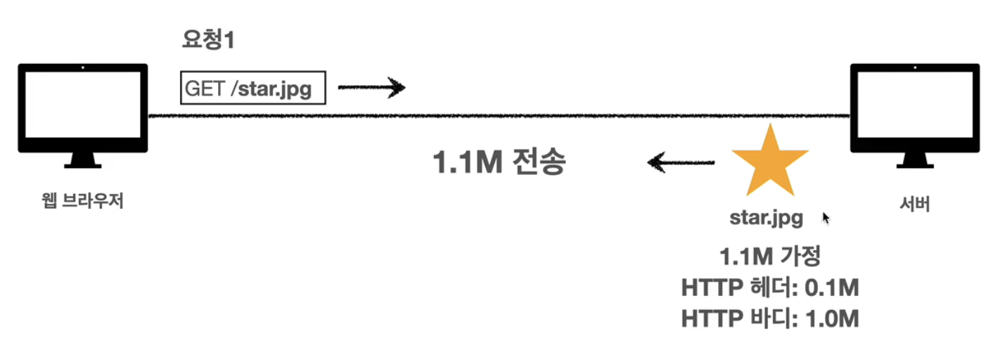
- 캐시가 적용되었다면,
  - 첫 번째 요청
    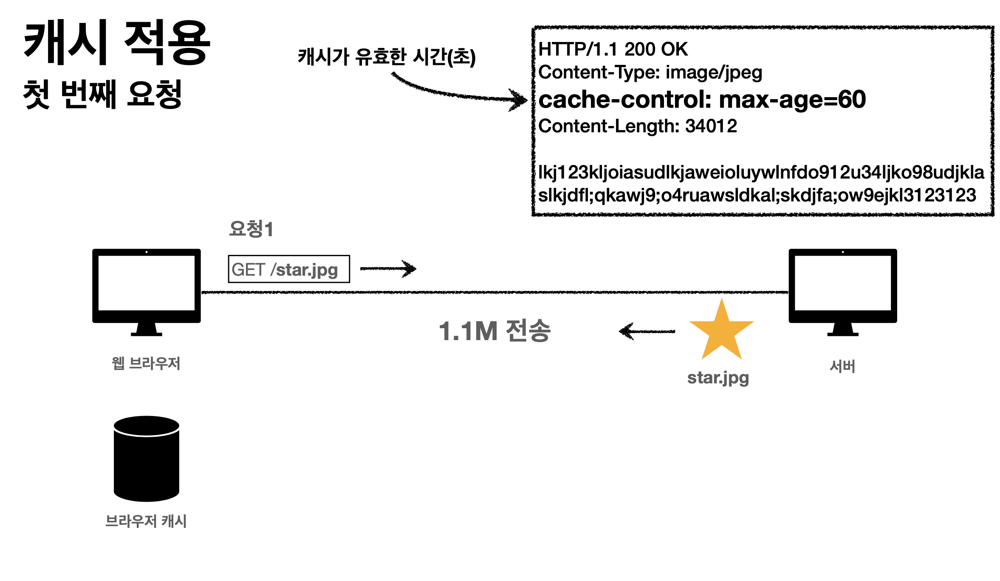
    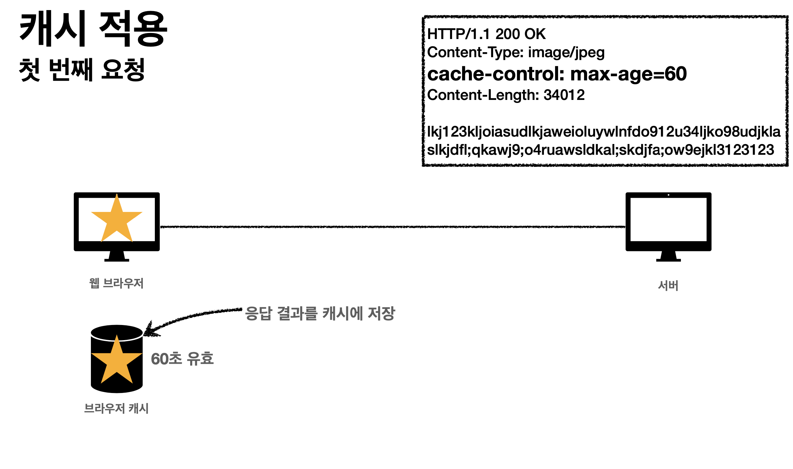
  - 두 번째 요청에서는 브라우저 캐시에서 조회해서 서버에 따로 요청을 보내지 않게 된다.
  - 세 번째 요청 : 시간 초과
    - 60초가 초과되었다면 당연히 다시 요청하게 된다.

그런데 cache-control: max-age가 초과되었다고 하더라도 서버에서 내려줘야 할 데이터 값이 바뀌지 않았다면 다시 다운로드 하는 것이 매우 비효율적이다.
이를 위해 검증헤더가 존재한다.

### 검증헤더와 조건부 요청

- Last-Modified
  - 서버가 데이터를 내려줄 때 이 헤더를 내려주게 되고, 클라이언트는 브라우저 캐시에 데이터만 저장할 뿐 아니라 이 헤더 값도 저장하게 된다.
- if-modified-since
  - 클라이언트는 Last-Modified값을 가지고 있다가 재요청이 발생할 때 if-modified-since 헤더에 해당 값을 넣어서 서버에 전송하게 된다.
  - 서버는 들어오는 요청의 if-modified-since 헤더와 해당 요청에 대한 콘텐츠의 Last-Modified를 비교하여 Last-modified가 더 이후의 날짜라면, 즉 서버의 콘텐츠가 변경되었다면 다운로드를 하도록 200요청을 내리게 되고, if-modified-since와 Last-modified가 일치한다면 즉, 변경이 되지 않았다면 304 Not modified로 응답을 내려주게 된다.
    - 이때 Http body값은 없다. 따라서 헤더 데이터에 해당하는 0.1M만 전송해주면 된다.
    - 클라이언트에서는 cache-controld을 갱신하면서 캐시에서 데이터를 불러와서 쓰게 된다.

### 검증헤더와 조건부 요청2

#### 검증헤더에는 2가지가 있다.

- Last-Modified
- ETag

#### 조건부 요청 헤더에도 2가지가 있다.

- If-Modified-Since
- If-None-Match
  - 커스텀 조건이 만족하면 200
  - 커스텀 조건이 만족하지 않으면 304

#### Last-Modified & If-Modified-Since 조합의 단점

- 1초 미만 단위로 캐시 조정이 불가능하다.
- 날짜 기반의 로직을 사용한다.
- 데이터를 수정했지만 다시 롤백한 경우 ( A -> B -> A가 된 경우), 데이터가 결과적으로는 변경되지 않았는데 Last-Modified는 갱신되는 문제
- 서버에서 별도의 캐시 로직을 관리하고 싶은 경우
  - ex) 스페이스나 주석처럼 영향이 없는 변경에서 캐시를 유지하고 싶은 경우

#### ETag 사용

- 최초의 요청에서 ETag값을 response로 받아서 cache-control과 함께 브라우저 캐시에 저장
- 재요청시 If-None-Match 에 ETag값을 담아서 서버에 전송
- 서버에서 콘텐츠가 가지고 있는 ETag값과 비교하여 일치하면 304, 일치하지 않으면 200으로 응답.
- **캐시 제어 로직을 서버에서 완전히 관리**하고 클라이언트 입장에서는 캐시 매커니즘을 알 수는 없다.
  - ex) 서버 배타 오픈 기간 동안 파일이 변경되도 ETag값 동일하게 유지, or 애플리케이션 배포 주기에 맞춰 ETag값 모두 갱신 등

### 캐시 제어 헤더

- Cache-Control
  - max-age : 보통 길게 잡음
  - no-cache : 데이터는 캐시해도 되지만 항상 Origin 서버에 검증하고 사용
  - no-store : 데이터도 저장(캐시) 하면 안됨
- Pragma
  - Pragma: no-cache
  - HTTP1.0 하위호환 위해 사용
- Expires
  - 캐시 만료일을 지정
  - 지금은 cache-control : max-age 사용이 권장되며, 함께 사용된다면 Expire는 무시됨

### 프록시 캐시

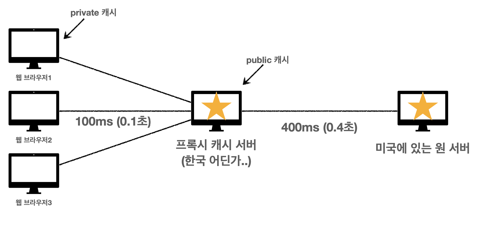

#### 프록시 캐시 관련 헤더

- cache-control: public
  - public 캐시인 cdn에 저장해도 됨
- cache-control: private
  - 사용자의 private 캐시에만 저장해야 함 ( 디폴트 값)
- cache-control: s-maxage
  - 프록시 캐시에만 적용되는 max-age
- Age: 60
  - origin에서 응답 후 프록시 캐시 내에 머문 시간(초)

### 캐시 무효화

- 브라우저가 자체적으로 캐싱을 하기도 하기 때문에 진짜로 캐싱이 안되게 하려면 아래와 같은 헤더들을 모두 추가해주어야 한다.

  - Cache-Control: no-cache, no-store, must-revalidate
  - Pragma: no-cache ( 하위 호환 위해서 )

- no-cache vs must-revalidate
  - no-cache는 프록시 캐시와 origin과의 네트웍이 일시적으로 문제 되서 origin으로부터 데이터를 못 받아왔을 경우 200으로 응답되도록 한다.
    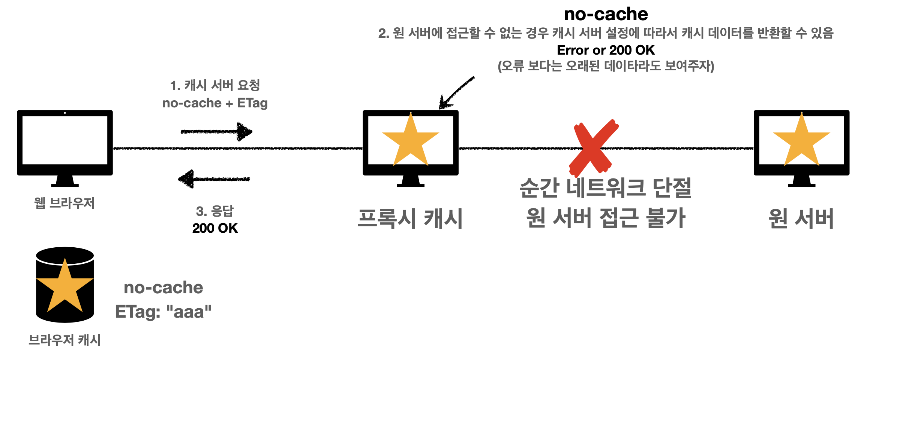
  - must-revalidate는 origin에 접근할 수 없는 경우 504 bad gateway가 발생하도록 되어 있음
    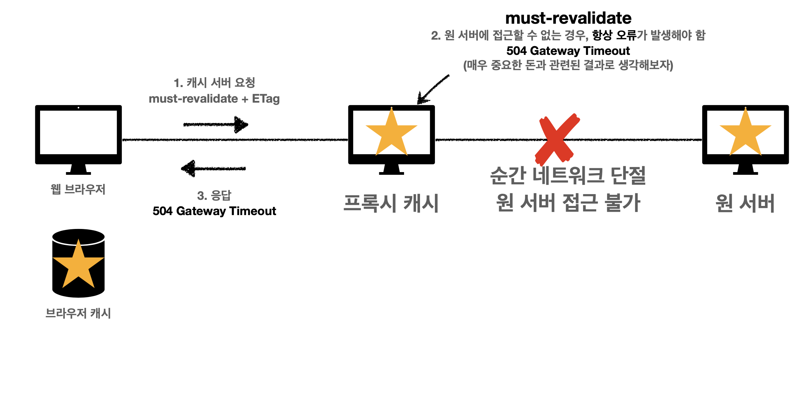
    - 통장 잔고와 같이 절대 캐시되서는 안되는 데이터는 no-cache에 더하여 must-revalidate까지 넣어주는 것이다.

## Reference

https://www.inflearn.com/course/http-%EC%9B%B9-%EB%84%A4%ED%8A%B8%EC%9B%8C%ED%81%AC/dashboard
