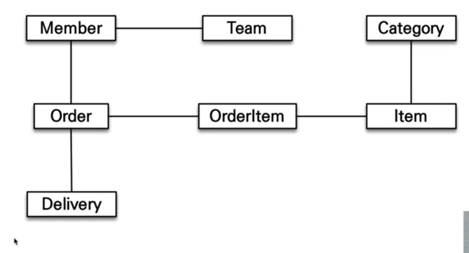

오늘 날 DB를 사용한다고 할 때 아직까지 대부분은 NoSQL보다는 RDB라고 불리는 관계형 데이터베이스를 사용한다.
즉, 개발자는 프로그래밍을 할 때 객체를 DB에 저장하는 작업, 반대로 DB를 객체로 불러오는 작업을 반복해야 만 했다.
개발자가 사실 상 SQL mapper 역할을 했어야만 했다는 것을 말한다.

실제 국내에서는 수 많은 개발업체들과 SI업계에서는 여전히 Mybatis를 사용하며 SQL에 대부분의 비즈니스 로직이 녹아 있다.

그렇다면 이러한 SQL 중심적 개발에는 어떤 문제가 있을까?
쉽게 생각할 수 있는 것은 SQL을 직접 짜는 것이 매우 귀찮은 반복적 작업이라는 것.
예컨대 필드가 추가 되면 INSERT, UPDATE, SELECT등 모든 SQL에 해당 필드가 들어가야 하는 곳을 찾아서 추가해주어야 할 것이다.

그러나 무엇보다도 RDB(관계형 데이터베이스)와 OOP(객체지향 프로그래밍)의 패러다임 불일치에서 오는 문제들이다.

## 패러다임의 불일치

관계형 DB가 나온 사상과 객체가 나온 사상이 다르기 때문에 발생하는 문제이다.

### 1. 상속

RDB와 OOP의 상속의 개념이 다르다. 정확히는 RDB에는 상속 개념이 없다. 유사한 개념이 아래와 같이 있긴하다.

하지만 데이터를 조회,저장한다고 할 때 처리하는 방식에서 매우 다른 것을 알 수 있다.


그 후 command + space 하여 'keychain Access' 를 열어서 아래와 같이 깃헙의 주소와 나의 깃헙 계정명을 적은 후 암호 란에 토큰 값을 복붙해주면 된다.

가령 Album을 저장한다고 해보자 아래와 같이 매우 귀찮다.

a. 객체 분해

b. INSERT INTO ITEM....

c. INSERT INTO ALBUM ....

​

Album을 조회한다고 해보자 마찬가지로 귀찮다.

- Album과 Item을 join하는 SQL작성 ( 다른 MOVIE를 조회한다고 해도 마찬가지..)

- 각각의 객체 생성

하지만 OOP, 즉 만약에 자바 컬렉션에서 조회한다고 가정하면? 간단하다. 이와 같이 객체지향적인 모델링을 SQL로 직접 짜려고 하면 매우 귀찮고 비효율적임을 알 수 있다. 이게 다 패러다임이 불일치해서 그런 것이다.

```java
Album album = list.get(albumId);
Item item = list.get(albumId);
```

<br>

### 2. 연관관계

RDB와 OOP는 데이터 간에 연관관계를 맺는 방법도 아래와 같이 다르다.

- 객체는 참조를 사용한다. ( member.getTeam() )

- 테이블은 외래키(FK)를 사용한다 ( join on member.team_id = team.team_id )

그리고 아래와 같이 객체는 Member는 Team을 참조할 수 있고, 그 반대는 불가능하지만

RDB에서는 TEAM_ID를 통해 MEMBER가 TEAM을, TEAM이 MEMBER를 참조할 수 있다는 차이가 있다.


객체는 자유롭게 객체 그래프를 탐색할 수 있어야 한다.
member.getTeam()처럼.
그런데 SQL을 직접 짜게 되면 Member.getOrder().getDelivery() 이런식으로 탐색을 할 수가 없다.

정확히 말하면 못한다기 보다는 처음 실행하는 SQL에 따라 탐색 범위가 결정되는데, 처음에 Member, Order, Delivery,....등 모든 데이터를 불러와두지 않았다고 하면 객체 그래프 탐색이 불가능하다는 것이다.

그리고 이는 Entity에 대한 신뢰 문제를 발생시킨다.

- 개발자가 눈으로 초기 SQL을 까보지 않고서는 객체 그래프 탐색이 가능한지 신뢰할 수 없다는 것이다. 그렇다고 모든 객체를 메모리에 불러와둘 수도 없는 노릇이다.



또한, RDB로 부터 SQL을 직접짜서 객체를 불러온다면 같은 식별자 값으로 데이터를 불러와도 생성되는 인스턴스는 서로 다를 것이고, 자바 컬렉션에서 객체를 하나 get한다면 동일한 id값이라면 동일한 인스턴스를 불러올 것이다. 즉 개발자가 객체답게 모델링을 할 수록 맵핑작업만 늘어나고 힘들어지는 구조이다.

<br>

### 3. 데이터 타입

: RDB에서 데이터를 저장하는 목적으로 만든 자료형과 프로그래밍 언어에서 사용하는 자료형이 다르다.

<br>

### 4. 데이터 식별방법

: RDB에서는 PK를 기준으로 데이터를 식별하지만, OOP에서는 객체의 참조값을 기준으로 데이터를 식별한다.

---

## JPA

위에서 언급한 패러다임의 불일치를 해소하기 위해 등장한 것이 ORM이며, 자바에서 사용하는 ORM 표준이 JPA이다. JPA는 아래 그림처럼 동작한다. JPA를 사용하면 생산성이 매우 높아진다. JPA를 사용하면 DB에 데이터를 넣고 빼는 것을 마치 자바 컬렉션에 데이터를 넣고 빼는 것처럼 사용할 수 있게 된다.


### 1. JPA의 상속 문제 해결

JPA는 위에서 언급했던 상속의 문제를 아주 간단히 해결한다. 직접 SQL을 2번 짜줄 필요가 없다.

- 저장

```java
jpa.persist(album);  //개발자가 이것만 하면!!
---
//JPA는 아래 2개 쿼리를 알아서 수행시킨다.
INSERT INTO ITEM ....
INSERT INTO ALBUM ....
```

- 조회

```java
jpa.find(albumId);  //개발자가 이것만 하면!!
---
//JPA는 아래 쿼리를 알아서 수행시킨다.
SELECT I.*, A.*
    FROM ITEM I
    JOIN ALBUM A ON I.ITEM_ID = A.ITEM_ID
```

<br>

### 2. JPA의 연관관계 문제 해결

JPA는 연관관계 문제를 해결함으로써 Entity에 대한 신뢰 문제를 해결시켜준다.

```java
//즉,SQL을 직접 확인해보지 않아도 아래와 같은 작업이 가능함을 보장한다
Member member = jpa.find(memberId);
member.getTeam().getOrder().getDelivery(); // 이게 가능!
```

<br>

### 3. JPA 데이터 식별

동일한 트랜잭션에서 조회한 엔티티가 같음을 보장한다.

```java
Member member1 = jpa.find(memberId);
Member member2 = jpa.find(memberId);

member1 == member2 //true !
```

<br>

### 4. JPA의 성능 최적화

JPA를 쓰더라도 성능 최적화를 통해 우수한 성능을 보장받을 수 있다.

<br>

1. 1차 캐시와 동일성 보장

- 같은 transaction에서 같은 Enitty를 반환
  : 캐싱을 통해 약간의 조회향상을 기대할 수 있다.

- DB isolation level이 "Read commit"이어도 앱 레벨에서 "Repeatable read"를 보장한다.

<br>

2. transaction을 지원하는 쓰기 지연

- jdbc batch sql 을 옵션을 통해 사용해서 한번에 SQL 전송.

- update/delete로 인한 row 락 시간 최소화하여 비즈니스 로직에 영향주지 않게 쓰기 지연하는 옵션 설정 가능. 마찬가지로 jdbc batch sql 이용.

<br>

3. 지연 로딩과 즉시 로딩

- 지연로딩(LAZY LOADING) : 객체가 실제 코드 상에서 쓰일 때 로딩하는 것

- 즉시로딩(EAGER LOADING) : 연관된 객체까지 JOIN을 통해 모두 로딩해두는 것

  <br>

만약 99% member를 사용할 때 team을 참조한다면, 즉시로딩으로 설정해주는 것이 좋으며 기본적으로는 LAZY LOADING으로 설정한다.

---

참고자료

- https://www.inflearn.com/course/ORM-JPA-Basic
