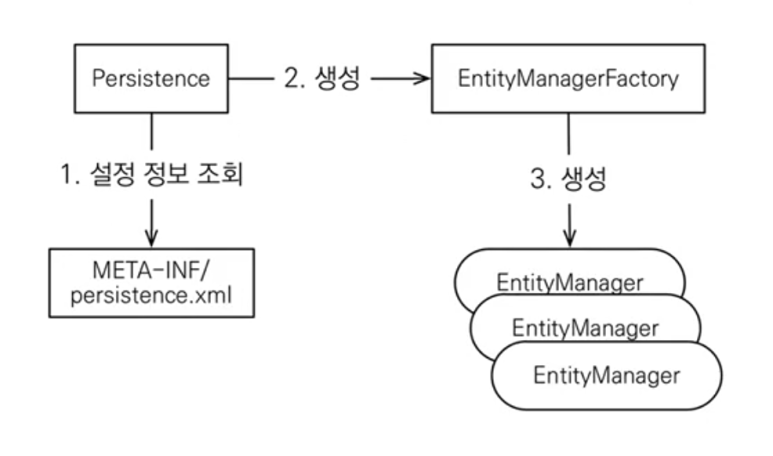

## JPA 구동 방식

**JPA는 아래와 같은 방식을 통해 동작한다.**



EntityMangerFactory는 하나만 사용해서 앱 전체에서 공유해서 사용하며

EntityManager는 thread간에 공유해서는 안된다.

**그리고 JPA의 모든 데이터 변경은 트랜잭션 안에서 실행해야 한다.**

​
<br>
순수 JPA만 설정했을 때 어떤 식으로 프로그래밍을 하게 되는 지 아래 코드를 통해서 살펴보자.

EntityManagerFactory를 생성하고, 이를 통해 EntityManager도 생성한다.

JPA의 모든 데이터 변경은 트랜잭션 안에서 실행되야 하기 때문에 EntityTransaction 객체를 생성하여 tranasaction의 begin, end를 관리해주어야 한다.

​<br>
아래 코드에서 순수 Jpa 프로그래밍을 어떻게 하는 지 알 수 있다.

특히 jpa에서 제공하는 수정 기능을 보면 jpa를 사용하면 정말 객체지향적으로 프로그래밍할 수 있음을 알 수 있다.

setName 메소드를 통해서 Entity객체를 수정했을 뿐인데, jpa가 entity가 변경됐는지를 transaction commit할 때 체크해서 변경됐으면 알아서 update문 날려준다.

```java
public class hellojpa {

    public static void main(String[] args) {
        EntityManagerFactory emf = Persistence.createEntityManagerFactory("hello");

        EntityManager em = emf.createEntityManager();

        EntityTransaction tx = em.getTransaction();
        tx.begin();

        try {
            //생성
            Member member = new Member();
            member.setId(2L);
            member.setName("Hello2");
            em.persist(member);   //실제는 이 4줄만 작성해주면 됨 나머지는 spring이 해줌.

            //수정
            Member findMember = em.find(Member.class, 1L);
            findMember.setName("Steady and Slow"); /자바 컬렉션처럼. 별도의 jpa 메소드 호출X

            tx.commit();
        } catch (Exception e) {
            tx.rollback();
        } finally {
            em.close();
        }
        emf.close();
    }
}
```

---

## JPQL

객체를 대상으로 하는 객체지향 쿼리 언어이며, JPA의 자체 문법을 따르고 각 DB에 맞게 dialect만 설정 변경해주면 JPA가 알아서 각 DB에 맞게 SQL을 생성하여 실행시켜 준다.

JPA를 사용하면 엔티티 객체를 중심으로 개발하게 되는데 검색 쿼리와 같이 SQL을 안 쓸 수는 없는 상황이 있는데 이 때 JPQL을 사용하는 것이다. JPQL이 일반 SQL과 다른 점은 테이블이 아닌 엔티티 객체를 대상으로 쿼리를 날린다는 것이다.

SQL문법과 유사하여 SELECT, FROM, WHERE,GROUP BY, HAVING, JOIN 등을 지원한다.

JPQL을 사용하면 아래와 같이 Member 엔티티를 대상으로 한 쿼리를 짤 수 있으며, dialect에 따라 limit을 쓸 것인지 rownum을 쓸 것인지 따위를 jpa가 알아서 SQL을 생성하여 DB에 요청하게 된다.

```java
public static void main(String[] args) {
        EntityManagerFactory emf = Persistence.createEntityManagerFactory("hello");

        EntityManager em = emf.createEntityManager();

        EntityTransaction tx = em.getTransaction();
        tx.begin();

        try {
            //JPQL
            List<Member> result = em.createQuery("select m from Member as m",Member.class)
                .setFirstResult(5)
                .setMaxResult(8)
                .getResultList();

            tx.commit();
        } catch (Exception e) {
            tx.rollback();
        } finally {
            em.close();
        }
        emf.close();
    }
```

<br>

JPQL을 구체적으로 어떻게 활용해야 하는 지에 대한 내용은 별도로 공부해야 하긴 하지만, SQL을 작성할 줄 아는 개발자라면 배우기 어렵지 않다.

---

참고자료

- https://www.inflearn.com/course/ORM-JPA-Basic
