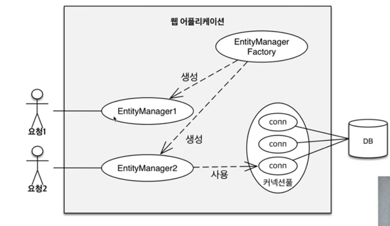
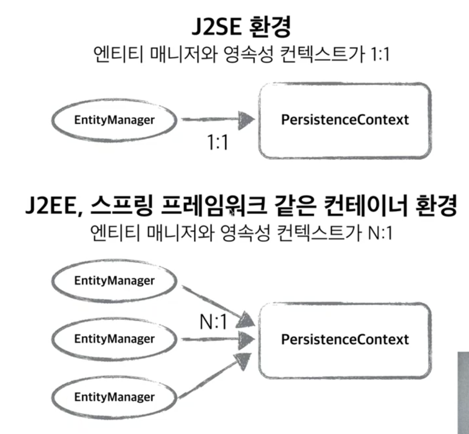
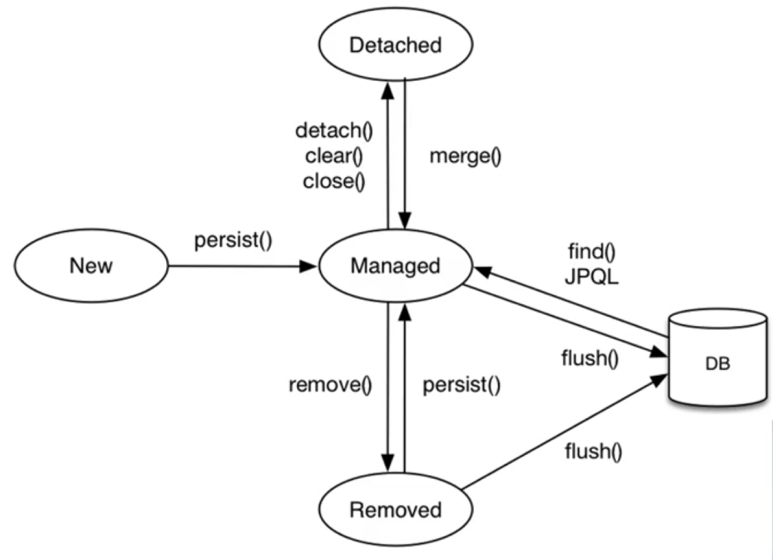
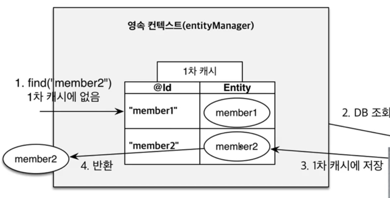
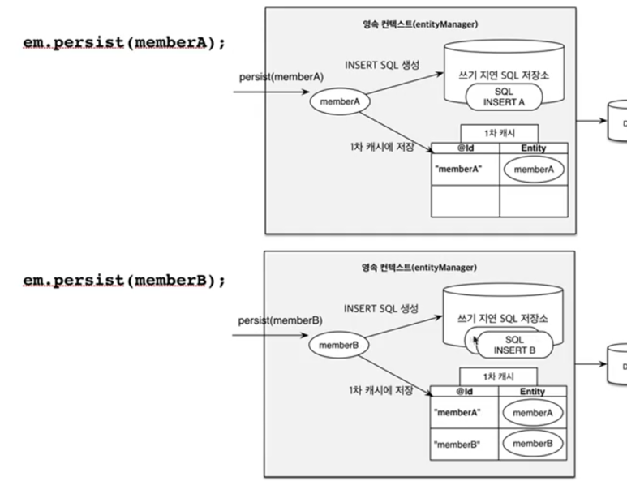
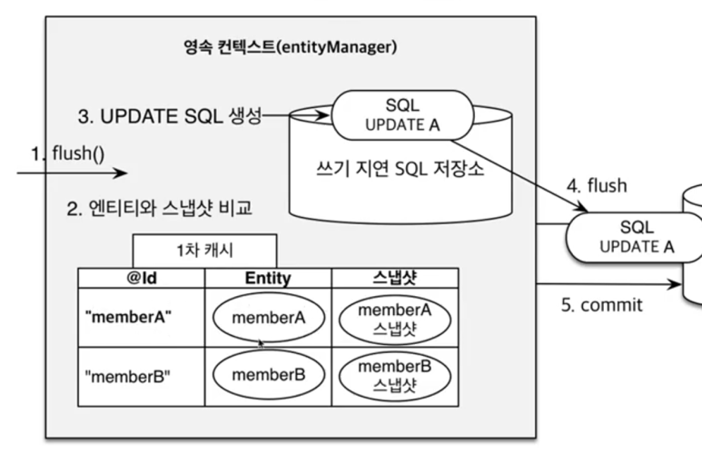

> 지난 글에서는 JPA 프로그래밍시, EntityManager를 생성하여 persist, set 등의 CRUD 작업을 수행하는 것을 알아보았다.
> 지난 글에선 설명하지 않았지만 EntityManager가 데이터를 persist 하게 되면 데이터는 '영속성 컨텍스트'에 저장되게 된다.
> JPA에서 가장 중요한 것은
>
> 1. 객체와 관계형 DB의 맵핑 문제,
> 2. 그리고 **영속성 컨텍스트**이다.

## 영속성 컨텍스트란?

영속성 컨텍스트를 이해하기에 앞서, EntityManager(이하 EM)와 EntityManagerFactory(이하 EMF)가 동작하는 방식에 대해서 먼저 이해해야 한다.

EMF는 고객의 요청이 올 때 마다 EM을 생성하고 EM은 내부적으로 DB 커넥션을 사용해서 DB를 사용한며, 이를 도식화하면 아래와 같다.



그렇다면 영속성 컨텍스트란 무엇인가?

"Entity를 영구 저장하는 환경"이라는 뜻이다.
영속성 컨텍스트는 논리적인 개념이며 또한 EM과 1대1로 대응하고, EM을 통해 접근/관리 한다.

우리가 앞서 JPA에서 아래와 같이 실행하면 JPA에서 DB에 객체를 저장한다 정도로 이해했지만

```java
em.persist(entity);
```

<br>

정확히는, 'EM을 통해 Entity를 영속성 컨텍스트에 저장한다' 는 것을 의미한다.
그리고 추후에 공부하겠지만 Spring에서는 EM과 영속성 컨텍스트가 아래와 같이 N:1로 생성된다. 



<br>


## 영속성 컨텍스트에서 엔티티의 생명주기

영속성 컨텍스트 내에서 Entity의 생명주기를 도식화하면 아래와 같다.
new, managed, detached, removed 의 4가지 상태가 존재한다.

<br>




### 1. 비영속 ( New / transient )

: Entity가 영속성 컨텍스트와 전혀 관계없는 상태를 말한다. 아래와 같은 코드에서는
EM을 통해 Entity에 아무런 조작도 하지 않은 상태이다. 

```java
// 객체 생성한 상태 
Member member = new Member();
member.setId(1);
member.setName("hello");
```

### 2. 영속 ( managed )

: 영속성 컨텍스트에 의해 관리되는 상태이며, persist 명령어를 통해 new -> managed 상태로 변경된다.
persist를 할 때 Entity가 영속성 컨텍스트에 저장되는 것이지, DB에 저장되는 것은 아님에 유의하자.

```java
Member member = new Member();
member.setId(1);
member.setName("hello");

em.persist(member); // 객체를 저장한 상태 (영속) 이 때 DB에 저장되는 것은 아니다. 
```

### 3. 준영속 ( detached )

: 영속성 컨텍스트에 저장되었다가 분리된 상태를 말한다. 
준영속 상태로 만드는 방법은 detach, clear, close가 있다. 

```java
//준영속 상태로 만드는 법 3가지
em.detach(member); //특정 entity만 준영속 상태로 전환
---
em.clear();  //영속성 컨텍스트 전체를 초기화
---
em.close(); //영속성 컨텍스트를 종료
```

### 4. 삭제 ( removed )

: 영속성 컨텍스트에서 삭제된 상태를 말한다.

```java
em.remove(member);
```

<br>

## 어플리케이션과 DB사이에 영속성 컨텍스트를 두는 이유

그렇다면 왜 Application과 DB사이에 영속성 컨텍스트라는 중간 계층을 두는 것일까?
바로 다음과 같은 이점이 있기 때문이다.

### 1. 1차 캐시

영속성 컨텍스트 내부에 존재하는 캐시를 의미하는데, 영속성 컨텍스트 내부에 존재하는 모든 Entity는 Map(key, value) 형태로 1차 캐시에 저장된다.
여기서 key는 @Id로 매핑한 식별자이고 value는 Entity 객체이다. 


(1) 아래의 코드에서 처음 id=1인 Member Entity를 persist시에 Entity는 1차 캐시에 저장되게 되고, 
만약에 그 후에 id=1인 Member를 find하게 되면 DB가 아닌 영속성 컨텍스트의 1차 캐시로부터 조회해오게 된다.
즉, 이 과정에서 DB에 대한 접근은 전혀 없다. 

(2) 또는, id=1인 Member Entity가 DB에 저장되어 있는 상태에서 이를 소스 상에서 불러오고 싶을 때, 
처음 불러올 때는 DB로부터 조회해와서 1차 캐시에 Entity로 저장하게 되고, 2번 째 동일한 Entity를 불러오게 되면
DB접근 없이 1차캐시로부터 조회해온다. 

```java
// (1) 
Member member = new Member();
member.setId(1);
member.setName("hello");

em.persist(member); //1차 캐시에 저장됨
Member findMember = em.find(Member.class, 1);  // 1차 캐시로부터 조회함(DB 접근 X)

// (2) 
Member findMember1 = em.find(Member.class, 1); // DB로부터 조회 (SQL 날림)
Member findMember2 = em.find(Member.class, 1); // 1차캐시로 부터 조회
```

<br>

이처럼 동일한 transaction안에서는 캐싱을 해주는 이점이 있으나, 말 그대로 개별 transaction안에서만 캐싱이 되고, transaction이 끝나면 영속성 컨텍스트를 지우기 때문에 엄청난 성능 이점이 있는 것은 아니다. 그러나 비즈니스 로직이 굉장히 복잡한 경우에 도움이 될 수 있다.



<br>

### 2. 동일성 보장

영속성 컨텍스트를 쓰게 되면 영속된 Entity의 동일성을 보장한다. 

마치 자바 컬렉션에서 객체를 꺼내온 것처럼. 이게 가능한 이유가 1차 캐시 덕분이다. 
즉 1차 캐시를 통해 repeatable read 등급의 트랜잭션 격리 수준을 DB가 아닌 애플리케이션 차원에서 제공한다. 

```java
Member member1 = em.find(Member.class, 1); // DB로부터 조회
Member member2 = em.find(Member.class, 1); // 1차 캐시에서 꺼내오는 동일한 Entity
System.out.print(member1 == member2) // true
```

### 3. Transactional write-behind ( 트랜잭션 쓰기 지연 )

persist를 하게 되면 바로 SQL을 DB로 날리는 것이 아니라, 2가지 동작을 하게 된다. 

(1) INSERT SQL을 생성하여 '쓰기 지연 SQL 저장소'에 저장한다.
(2) 1차 캐시에 저장한다. 



이렇게 쓰기 지연 SQL 저장소에 SQL을 계속 모아두다가 transaction.commit()을 하는 순간, 

'쓰기 지연 SQL 저장소'에 있던 쿼리들이 flush가 되면서 DB에 날라가고 커밋된다. 
> flush()는 영속성 컨텍스트의 변경 내용을 데이터베이스에 동기화하는 작업으로 등록, 수정, 삭제한 Entity 를 데이터베이스에 반영한다.

이렇듯 버퍼링을 모아서 write하기 때문에 **지연 쓰기를 통해 배치 쿼리를 짜는 경우에 이점**을 얻을 수 있다. 

### 4. Dirty Checking (변경 감지)

영속성 컨텍스트에는 이전 flush 때의 Entity 상태를 복사해서 저장해둔 스냅샷이 존재하며, 
flush 시점에 이전에 저장해둔 스냅샷과 Entity를 비교해 변경된 Entity를 찾는다. 

그리고 변경된 Entity를 찾아 각 Entity 객체에 대한 update SQL을 생성하여 '쓰기 지연 SQL 저장소'에 저장하고, 
한 꺼번에 DB로 쿼리를 날리면서 transaction을 커밋한다.

```java
Member member = em.find(Member.class, 1);
mebmer.setName("modified"); //이렇게만 해도 커밋 시 UPDATE문이 날라간다. 
```

<br>

> ## flush 란?
> 영속성 컨텍스트가 변경사항을 DB에 동기화하는 작업을 말하며 다음과 같은 경우에 flush가 발생한다.
> 1.  transaction commit 될 때
> 2.  EntityManager가 직접 flush() 호출할 때
> 3.  JPQL 쿼리가 실행될 때
> 

### 5. Lazy Loading ( 지연 로딩 )

Lazy Loading이란 실제 객체 대신 프록시 객체를 로딩해두고 해당 객체를 실제 사용할 때 영속성 컨텍스트를 통해 데이터를 불러오는 방법이다.
Lazy Loading을 통해 자바의 컬렉션처럼 DB를 사용하면서도 필요한 만큼의 데이터만 DB로부터 불러오도록 할 수 있다.

이에 대해선 추후에 더 알아보도록 하자.

---
참고자료
- https://www.inflearn.com/course/ORM-JPA-Basic