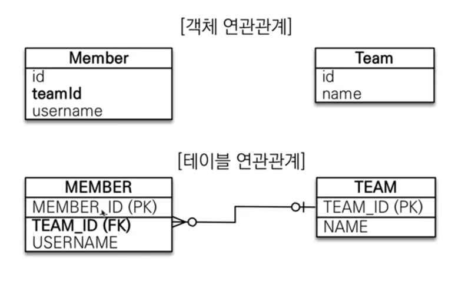
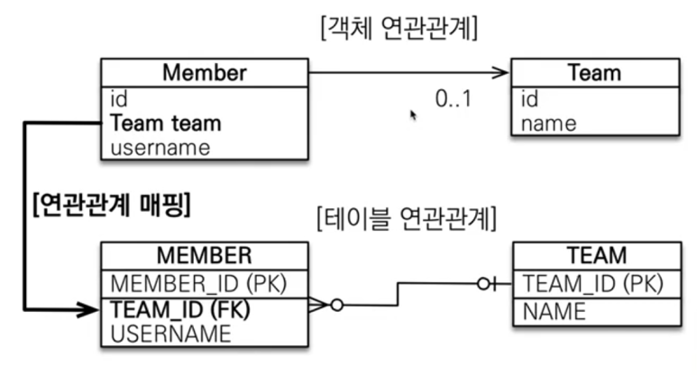
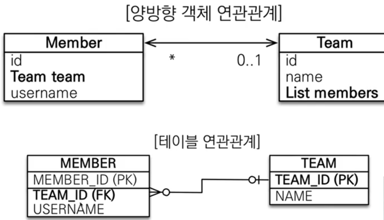
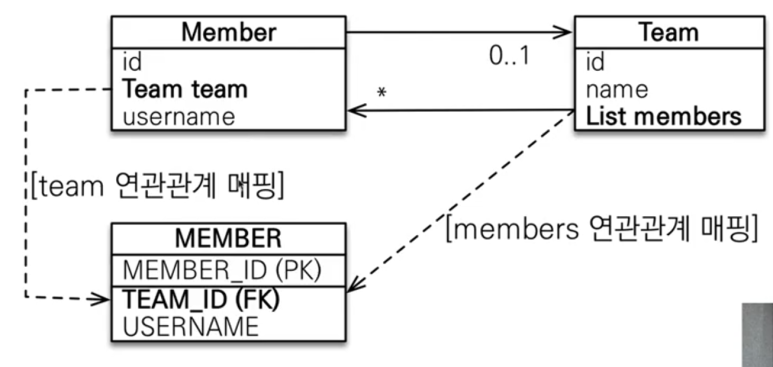
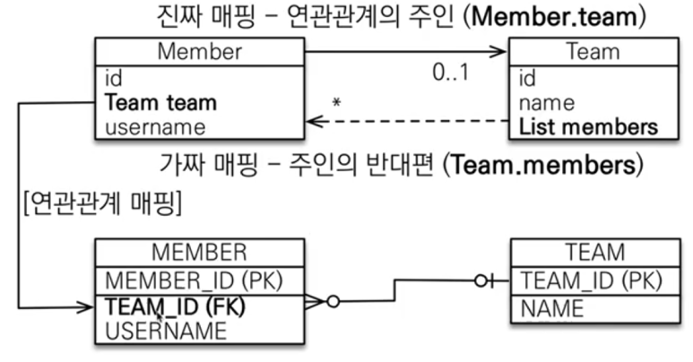

JPA 연관관계 매핑을 배우기에 앞서, 객체와 테이블의 연관관계를 맺는 방법이 다르다는 것을 이해해야 한다.
JPA 1. 에서 언급했듯이, 객체는 참조를 통해, 테이블은 FK를 통한 조인으로 연관관계를 맺는다. 

회원과 팀이 다대일 관계일 때 객체를 테이블에 맞추어 모델링 한다면 아래와 같을 것이다. 



<br>

그리고 이렇게 Entity 상에서 이렇게 매핑을 하게 되면 서로 연관된 데이터를 가져오고 싶을 때

```java
Member findMember = em.find(Member.class, member.getId());
Team findTeam = em.find(Team.class, findMember.getTeamId());
```
<br>

이렇게 Id를 통해서만 가져올 수 있게 된다. 그리고 이것은 객체지향스럽지 않은 방식이다. 
JPA에서는(ORM에선) 이를 어떻게 모델링 할 수 있을까? 
JPA에서는 단방향, 양방향 연관관계를 통해 객체지향적으로 프로그래밍이 가능하도록 해준다.


## 1. 단방향 연관관계



Entity 클래스에서 참고하고자 하는 다른 Entity 클래스의 참조형을 멤버변수로 선언하는데,
이 때 참조형으로 생성하는 Entity는 FK를 가지고 있지 않은 쪽 ( 'Many' 인 쪽 ) 이다.
즉 Team과 Member와의 관계에서는 Team이 될 것이다.

```java
@Entity
public class Member{
    @Id
    private Long id;
    @ManyToOne
    @JoinColumn(name="team_id")
    private Team team;
}
```

그러면 이제 우리는 객체지향적으로 아래와 같이 코드를 짤 수 있다.
즉, 객체 그래프 탐색이 가능하다.

```java
Member findMember = em.find(Member.class, member.getId());
Team findTeam = findMember.getTeam();  //이게 된다.
```

## 2. 양방향 연관관계 

위의 예에서는 Member.getTeam()은 할 수 있었지만, 즉 member가 team을 참조할 순 있었지만 

Team이 Member를 참조할 수는 없었다. 그래서 그걸 해보려면 아래와 같이 객체 연관관계 매핑 시에 Team 클래스에는 List members 가 추가되어야 한다. 

반면, 테이블 연관관계는 단방향 일 때와 차이가 없다. 테이블에서 FK로 연관관계를 맺을 때는 방향성이 없고 그냥 FK로 join걸면 서로 연관된 데이터를 모두 가져오게 된다. 



<br>

문제는 객체의 연관관계다. 객체에서는 Team에서 Member로 참조할 수 있게 하기 위해 Member 타입의 List를 넣어주어야 Team이 Member를 참조할 수 있다.

```java
@Entity
public class Team{
    @Id
    private Long id;
    @OneToMany(mappedBy="team")
    private List<Member> members = new ArrayList<>();
}
```

그러면 아래처럼 양방향으로 참조가 가능하게 된다. 

<br>

```java
Member findMember = em.find(Member.class, member.getId());
List<Member> members = findMember.getTeam().getMembers(); //이게 된다
```
<br>

### 그런데 mappedBy가 무엇인가?(연관관계의 주인)

객체와 테이블의 연관관계의 차이에 대해서 다시 짚어보자. 

* 1) 객체는 Member -> Team , Team -> Member 의 단방향 관계 2개로 양방향 관계를 맺는다.

     즉, 객체의 양방향 관계는 사실 서로 다른 단방향 관계 2개이다. 

* 2) 반면 테이블은 TEAM_ID 라는 1개의 값으로 양방향 관계를 맺는다. 

따라서 객체에서는 양방향 관계 중 Member의 team으로 FK를 관리할 지 Team의 members로 FK를 관리할 지를 정해주어야 한다.

- 객체의 두 관계 중 하나를 주인으로 지정(FK관리)해주어야 한다는 것이다.
- 주인이 아닌 쪽은 Read-only이며 따라서 Team의 members에 뭔가 데이터를 넣고 Team을 저장한다고 해서 Member 테이블에 데이터가 쌓이지 않을 것이다. 
- mappedBy 속성으로 주인을 지정해주어야 한다. 

<br>


<br>

그렇다면 누구를 주인으로 지정해주어야 할까?

비즈니스 중요성과 관계없이 무조건 FK가 있는 테이블 쪽 ( **N:1에서 N인 곳** ) 을 주인으로 정해야 한다.

<br>


<br>

### 양방향 매핑 시 가장 많이 하는 실수

1. 연관관계의 주인이 아닌 쪽에서 수정/저장을 하는 경우

    ```java
    Member member = new Member();
    member.setUserName("member1");
    em.persist(member);

    Team team = new Team();
    team.setName("TeamA");
    team.getMembers().add(member);
    em.persist(team);
    ```

    위와 같이 코드를 실행하면 member 테이블이 가지고 있는 FK인 team_id에 데이터가 저장되지 않는다. 앞서 말했듯, 연관관계의 주인이 아닌 쪽은 'Read-only'이기 때문이다.

    그렇기 때문에 아래와 같이 연관관계의 주인인 Member 클래스에서 team을 추가해주어야 한다.

    ```java
    Team team = new Team();
    team.setName("TeamA");
    //team.getMembers().add(member);
    em.persist(team);

    Member member = new Member();
    member.setUserName("member1");
    member.setTeam(team); // team_id 로 매핑됨. 
    em.persist(member);
    ```
<br>

2. 연관관계의 주인이 아닌 쪽에서 연관관계를 매핑하지 않는 경우

    아니 주인이 아닌 쪽에서는 연관관계 매핑을 하지말라며? 뭔 소리야? 라고 생각 할 수 있다.

    하지만 정확히는 위와 같이 연관관계의 주인이 아닌 쪽에서 사용해서 수정/저장을 하지 말라는 거지 이렇게 주인이 아닌 쪽에서 연관관계 매핑을 쓰지 말라는 뜻이 아니다. 

    오히려 2가지 이유로 양쪽 클래스 모두에 값을 설정해주어야 한다. 즉 Team에서도 아래와 같이 add Member를 해주어야 한다는 뜻이다. 

    ```java
    team.getMembers().add(member);
    ```

    - (1) 객체지향으로 생각해보면 team에도 add member를 해주고,member에도 team을 설정해주는게 맞다.

    - (2) **JPA에서는 영속성 컨텍스트의 1차캐시에서 먼저 값을 조회해오기 때문에 발생하는 이슈**가 있다.
        즉 DB가 아닌 1차캐시에서 데이터를 가져오게 되면 사실 상 순수 객체 상태기 때문에 양방향 매핑이 필요하다. 아래 코드를 살펴보자.
        <br>

        ```java
          Team team = new Team();
          team.setName("TeamA");
          em.persist(team);

          Member member = new Member();
          member.setUserName("member1");
          member.setTeam(team); // team_id 로 매핑됨. 
          em.persist(member);

          //team.getMembers().add(member); 이걸 주석해제 해주면 1차캐시 문제를 해결 가능
          // em.flush();
          // em.clear();   

          /* 위에서 저장된 team을 DB가 아닌 영속성 컨텍스트 내의 1차캐시로부터 불러온다. (flush, clear가 안되었다면)
          즉 반환되는 값은 순수 객체상태라고 보면 되고 따라서 team 객체의 member list는 비어 있을 것이다. 
          셋팅해준 적이 없으니깐. */
          Team findTeam = em.find(Team.class, team.getId());
          Lis<Member> members = findTeam.getMembers();
          for(Member m : members){
              System.out.println("m="+m.getUserName());  //아무것도 안찍힘. 
          }

        ```
        위 코드에서 Flush, clear를 해주지 않았다면 영속성 컨텍스트의 1차캐시로부터 team 객체를 가져오게 될 것이기 때문에 사실상 순수 team객체를 가지고 오는 것과 같고, team객체에는 member list에 대해서 설정해준 것이 아무것도 없기 때문에 null값을 반환하게 될 것이다. 
        
        따라서 이와 같은 문제 해결을 위해 주석을 해제하여 객체 간 서로 참조할 수 있게 아래와 같이 매핑해주어야 한다. 
        
        ```java
        team.getMembers().add(member);
        ```

        그리고 이를 쉽게 해주기 위해 **'양방향 편의 메소드'**를 설정해주면 좋다. 연관관계의 주인 쪽(Member)에 아래와 같이 setTeam메소드 대신 changeTeam으로 변경해주고 Member.changeTeam(team)시 Member와 Team쪽에서 모두 값이 매핑되도록 설정해준다. 

        ```java
        public changeTeam(Team team){
          this.team = team;
          team.getMembers().add(this);  //양방향 매핑. 
        }
        ```

        반대로 연관관계의 주인이 아닌 Team쪽에서 양방향 매핑되도록 편의 메소드 설정을 해줘도 된다. 
        그러나 **반드시 Member 또는 Team 둘 중 한 곳에서만** 편의 메소드를 설정해야 함에 주의하자.

        ```java
        public addMember(Member member){
          members.add(member);
          member.setTeam(this);
        }
        ```

        3) 양방향 매핑시 발생하는 무한 Loop
        toString이나 json 생성 라이브러리 사용 시에 순환 참조 문제가 발생한다.  즉 Member가 Team을 참조하고 Team안에는 또 Member가 있고 다시 그 Member안에 Team 참조...무한 반복되는 문제. toString은 쓰지 않는 것을 추천하고 json으로 controller에서 내려줄 때는 entity로 절대 반환하지 말고 DTO를 통해 response 주도록 해야 한다. 

---
오늘의 간단 정리
- 단방향 매핑만으로도 연관관계 매핑은 끝난다. 
- 양방향은 필요하면 추가하면 되고 편의메소드를 쓰면 됨. 
- 연관관계의 주인은 FK가 있는 곳이 기준이다. 
---

참고자료
- https://www.inflearn.com/course/ORM-JPA-Basic

​