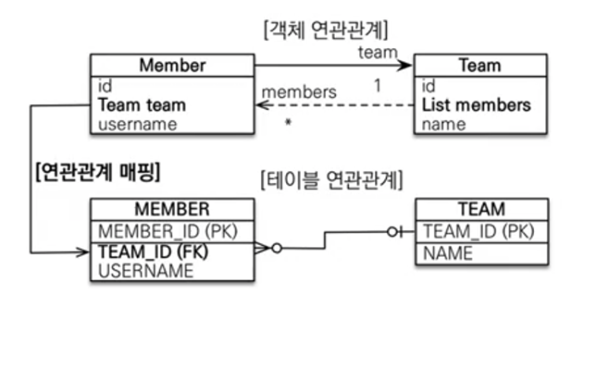

JPA에서 제공하는 다양한 연관관계 매핑하는 방법에 대해서 알아보기에 앞서,
연관관계를 매핑할 때 고려해야 할 요소는 3가지임을 기억하자. 

1. 다중성
- @ManyToOne -> 제일 많이 사용된다.
- @OneToMany -> 사용할 수는 있지만 ManyToOne의 양방향으로 커버 가능하다. 
- @OneToOne -> 가끔 
- @ManyToMany ->실무에서 안 씀

2. 단방향인가 양방향인가

3. 연관관계의 주인이 어느 쪽인가 

---

## 1. 다대일( ManyToOne )

다대일 관계는 가장 많이 사용되는 관계이다. 사실 상 거의 이것으로만 설계할 수 있다. 

다대일 관계의 특징은 FK를 '다' 쪽에서 관리하는 것이고, 연관관계의 주인도 '다' 쪽이라는 것이다. 

### 1. 단방향
<br>


### 2. 양방향 

설계는 다대일 단방향에서 끝났지만 만약에 Team 에서도 Member에 대한 조회를 하고 싶다면 OneToMany를 '일' 쪽인 Team에 추가하여 매핑해주면 된다. 연관관계의 주인은 Member이므로 조회만 된다는 점에 유의하자. 

<br>



## 2. 일대다( OneToMany )

일대다는 이제껏 봤던 ManyToOne 중심의 모델링과는 달리 실무에서 거의 쓰이지 않는다.
- 외래키를 반대 테이블에서 관리하고,
- 연관관계를 위해 추가적은 update문 실행이 필요하기 때문. 

### 1. 단방향

일대다 단방향에서 'One' 쪽이 연관관계의 주인이 된다. 그런데 FK를 '다' 쪽에서 관리하는 것은 다대일 관계와 같다. 이것은 db테이블 구조 상 변경 불가능한 것이기 때문임. 

<br>


<br>

'일' 쪽인 Team 클래스에서 JoinColumn을 team_id로 설정하면 된다. 

```java
@Entity
public class Team { 
    @Id
    private Long id;
    private String name;
    
    @OneToMany
    @JoinColumn(name="team_id"). //이걸 반드시 해줘야 함. 아니면 조인테이블 방식을 사용함.  
    private List<Member> members = new ArrayList<>();

}
```

그리고 아래와 같이 실행해주면 team, member 테이블 모두에 잘 등록된다. 

```java
Member member = new Member();
member.setUsername("member1");
em.persist(member);

Team team = new Team();
team.setName("teamA");
team.getMembers().add(member);  //update 쿼리가 한 번 더 나감
em.persist(team);
```

그러나 실무에서 테이블 수십개가 엮여서 돌아가는 상황에서 ManyToOne 단방향과 OneToMany 단방향을 혼용하는 것은 혼란스러울 수 있다. 그렇기 때문에 '다' 쪽을 연관관계의 주인으로 가져가고 

**필요시에만 ManyToOne 양방향을 사용하는 방식**으로 설계를 하는 것이 좋다. 

### 2. 양방향

공식스펙상에서는 없는 설계이지만, 

@JoinColumn의 옵션을 사용해서 설정가능하다. 그러나, 역시.. 다대일 양방향을 사용하자는 것이 결론이다. 
​
<br>


```java
@Entity
public class Member { 
    @Id
    private Long id;
    private String name;
    
    @ManyToOne
    @JoinColumn(name = "team_id", insertable=false, updatable=false)
    private Team team; 
}
```

### 3. 일대일(OneToOne)

일대일 관계에서 FK는 양쪽 어디에 있어도 상관없지만 '주 테이블'을 정해서 그쪽에 FK를 두면 된다. 

Member Locker의 경우 Memberrk 주테이블이 된다.

<br>


다대일 단방향과 아주 유사하다. 아래처럼 설정해주면 끝. 

```java
@Entity
public class Member { 
    @Id
    private Long id;
    private String name;

    @OneToOne
    @JoinColumn(name="locker_id")
    private Locker locker;

}
```
<br>


만약 Locker도 member를 참조하고 싶다면, (양방향이라면) 아래와 같이 하면 된다. 


<br>


```java
@Entity
public class Locker { 
    @Id
    private Long id;
    private String name;

    @OneToOne(mappedBy="locker");
    private Member member;

}
```
### 4. 다대다

실무에서 안 쓴다. 왜?

일단 JPA에서 ManyToMany를 지원하는 이유는 객체에서는 테이블과 달리 별도의 클래스 없이도 Member에서 Product List를 가질 수 있고, Product에서도 Member List를 가질 수 있는 다대다 관계가 가능하기 때문이다. 

<br>


그러나 실무에서는 쓰이지 않는데 연결 테이블이 연결만 하고 끝나지 않기 때문이다. 

아래 Member_Product 테이블과 같이 다른 속성이 포함되기 때문이다. 

<br>


<br>

따라서 실무에서는 다대다를 다대일 관계로 풀어내야 한다. 아래와 같이 Member_Product 연결 테이블을 Entity로 승격시키는 것이다.

<br>


---

참고자료
- https://www.inflearn.com/course/ORM-JPA-Basic