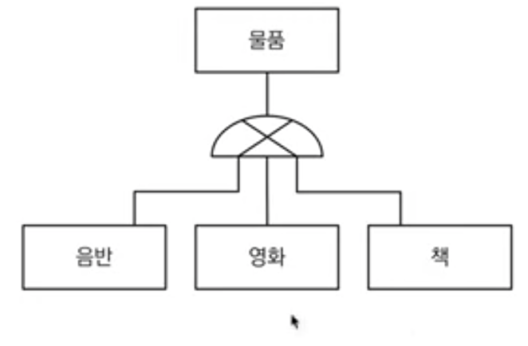
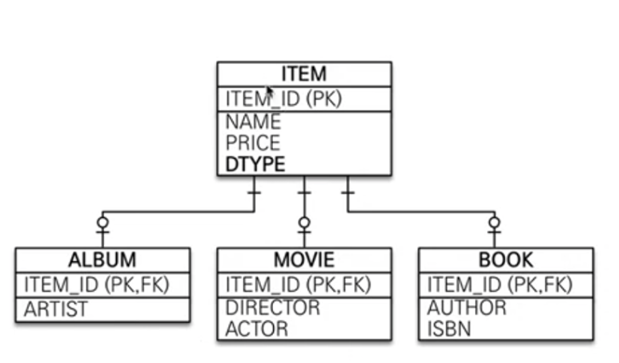
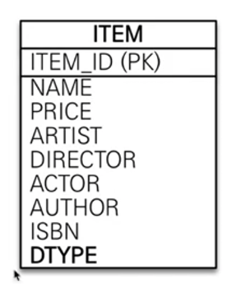
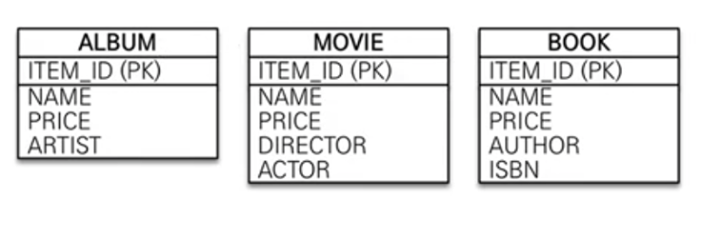

JPA에서 엔티티 간에 다양한 연관관계를 매핑하는 방법에 대해서 알아보았다.

이제는 조금 더 나아가 단순히 다대다, 다대일만의 관계가 아니라 JPA에서 상속관계를 어떻게 매핑하는 지에 대해서 알아보고자 한다.

그런데 생각해보면 관계형 데이터베이스에는 '상속'이라는 개념이 객체지향과는 달리 존재하지 않는다.

그렇지만 이와 유사한 **슈퍼타입, 서브타입 모델링 기법**이 있는데, JPA에서는 이를 사용해서 객체의 상속관계를 DB의 슈퍼타입/서브타입 관계로 매핑시켜준다. 

<br>


<br>

그리고 관계형 DB에서 슈퍼타입/서브타입 논리 모델링을 물리 모델링하고자 할 때 구현하는 방법은 크게 3가지이며
이 3가지 방식 중 어떤 방식을 선택해도 JPA에서 연관관계 매핑을 지원한다. 

<br>

## 1. 조인 전략

앨범 데이터 INSERT시 ITEM, ALBUM 테이블 각각에 데이터를 넣고 조회 시는 ITEM_ID로 ITEM, ALBUM을 조인해서 가져오는 방식이다.

이 때 ITEM 테이블에 어떤 서브타입인지를 구분하는 DTYPE 과 같은 컬럼이 필요하다.
<br>


<br>

JPA에서 연관관계를 매핑하려면 아래와 같이 하면 된다. 

```java
@Entity
@Inheritance(Strategy = InheritanceType.JOINED)
@DiscriminatorColumn 
public abstract class Item {

    @Id
    private Long id;
    private String name;
    private int price;

}
```
<br>

```java
@Entity
@DiscriminatorValue("A")
public class Album extends Item{

    private String director;
    private String artist;

}
```

그냥 위와 같이 매핑하여 실행하게 되면 JPA에서는 조인전략 매핑을 사용하여 테이블을 생성하게 되고 @Inheritance 어노테이션이 없다면 2번전략인 단일 테이블 전략을 디폴트로 해서 Item 테이블 하나만 만들어 버린다.  

이렇게하면 이제 Album만 persist 해줘도 Item, Album 모두에 INSERT가 실행되고 Album만 조회해도 Item, Album을 조인해서 데이터를 불러오는 것을 SQL 실행문을 통해서 확인할 수 있다. 

@DiscriminatorColumn 어노테이션을 Item 엔티티에 추가하게 되면 Item 테이블에 자동으로 DTYPE이라는 컬럼을 추가해주고, 디폴트로는 컬럼명을 'DTYPE', 값은 하위 엔티티명을 값으로 가지게 된다. 

이걸 변경해주고 싶으면 컬럼명은 @DiscriminatorColumn(name="abc") 이런 식으로 변경하면 되고

값은 하위 엔티티 클래스에서 @DiscriminatorValue를 써서 값을 설정해주면 된다.

위와 같이 설정할 경우 Item 테이블에 DTYPE 컬럼이 있고, Album일 경우에 컬럼값은 'A' 가 된다. 


### 장점 

-  정규화가 되어 있음
-  FK 참조 무결성 제약조건 활용 가능하다. 다른 테이블 입장에서도 album, movie, book과 같은 엔티티를 바라 볼 필요 없이 Item 엔티티만 바라보면 되기 때문에 좋다. 
-  정규화가 되어 있기 때문에 DB 저장공간의 중복 데이터 없이 효율적으로 저장된다. 


### 단점

- 조회 시 조인을 사용한다는 것
- 조회 쿼리가 복잡해진다.
- INSERT를 2번 수행해야 한다.


조인 전략이 정규화도 되고 설계가 깔끔하며 객체지향과도 잘 맞기 때문에 정석으로 보면 된다. 

단, 단일 테이블 전략과 비교했을 때는 성능이 약간 안나올 수도 있음 


## 2. 단일 테이블 전략

하나의 테이블로 합치고 DTYPE으로만 구분해주는 방식이다. 
자식 테이블 각각의 특성에 해당하는 컬럼들을 한 테이블로 합쳤기 때문에 데이터가 null인 컬럼이 다수 발생하게 된다. 

<br>



JPA에서 연관관계를 매핑하려면 아래와 같이,

@Inheritence 어노에티이션을 사용하지 않거나 SINGLE_TABLE로 설정해주면 된다.


```java
@Entity
@Inheritance(Strategy = InheritanceType.SINGLE_TABLE)
@DiscriminatorColumn 
public abstract class Item {

    @Id
    private Long id;
    private String name;
    private int price;

}
```

성능관점에서 INSERT, SELECT를 그냥 단순히 한 테이블로부터 해오면 되기 때문에 좋다. 


### ​장점

- 조인이 필요없어서 조회가 빠르다
- 조회 쿼리가 단순하다

### 단점

- 자식 엔티티가 매핑한 컬럼은 모두 nullable이어야 한다. 
- 테이블이 비대해질 수 있고, 그에 따라 조회 성능이 잘 안나올 수도 있다. 


## 3. 구현 클래스마다 테이블을 두는 전략

공통적인 컬럼도 각 테이블에 모두 두어 테이블을 각각 분리하는 방식이다. 

<br>


<br>

JPA에서 구현하려면 @Inheritance strategy를 TABLE_PER_CLASS로 설정한다.

이렇게 하면 Item 테이블은 생성하지 않고 하위 엔티티들에 대해서만(구현 클래스에 대해서만) 테이블을 생성한다. 

Item 테이블이 없기 때문에 DTYPE처럼 구분자가 필요없고, 따라서 @DiscriminatorColumn 어노테이션은 쓰지 않는다.

```java
@Entity
@Inheritance(Strategy = InheritanceType.TABLE_PER_CLASS)
public abstract class Item {

    @Id
    private Long id;
    private String name;
    private int price;

}
```
```java
@Entity
public class Album extends Item{

    private String director;
    private String artist;

}
```

언뜻 보기에는 좋은 전략같지만 데이터를 조회해올 때 굉장히 비효율적으로 동작한다.

```java
Item findItem = em.find(Item.class, movie.getId());
```


Album, Book, Movie 3개의 테이블에 대해서 UNION ALL하여 select를 수행해오기 때문에 이 전략은 실무에서 쓰면 안되는 전략이다.


### 장점

- 서브 타입 명확하게 구분해서 처리할 때 효과적 

- Not null 사용 가능


### 단점

- 여러 자식 테이블 함께 조회해야 할 때 성능 느림 ( UNION ALL 사용 )

- 자식 테이블을 통합해서 쿼리하기 어려움. 

- 변경의 관점에서 새로운 타입이 추가 될 때 많은 변경이 필요함. 

​정리하자면 상속관계가 단순하고 확장성이 없다고 본다면 '단일 테이블 전략'을 그 외에는 조인 전략을 사용하도록 하자. 

--- 

### @MappedSuperClass 어노테이션 활용하기

Item - Album, Book, Movie 와 같이 비즈니스적인 상속관계가 아니라, 엔티티 클래스의 공통속성만 모아서 처리하고 싶을 때 사용한다. 

가령 데이터의 생성일자와 생상자에 대한 속성을 공통처리하고 싶을 때 아래와 같이 BaseEntity를 만들고, 각 엔티티에서는 BaseEntity를 상속해주면 된다. 

---

### 참고자료
- https://www.inflearn.com/course/ORM-JPA-Basic