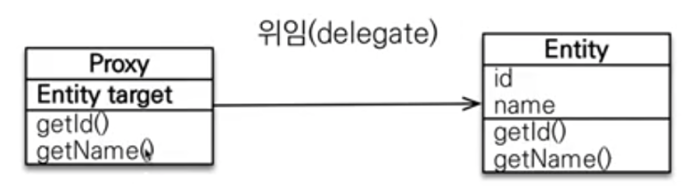

## 1. JPA에서 프록시란 무엇인가?

### 1) em.find vs em.getReference

em.find를 하게 되면 JPA가 실제 entity 객체를 반환하지만, 

em.getReference를 하게 되면 DB조회를 미루는 '프록시' entity 객체를 반환한다. 

프록시 객체는 실제 Entity 타깃 객체는 가지고 있지 않고, id값만 가지고 있는 비어있는 객체이다.  


프록시 객체는 실제 Entity를 상속해서 만들어지며, Hibernate가 내부적으로 만든다. 

실제 클래스와 겉 모양이 같기 때문에 사용하는 입장에서는 진짜 객체인지 프록시 객체인지 구분하지 않고 사용할 수 있다. 


프록시 객체는 실제 객체의 참조(target)를 보관하고, 프록시 객체를 호출하면 프록시 객체는 실제 객체의 메소드를 호출한다.

<br>

```java
Member member = em.getReference(Member.class, "id1");
membmer.getName();
```
<br>
 
이렇게 호출을 한다고 생각해보자. 

getName 호출하게 되면 MemberProxy객체에 target이 없기 때문에 JPA가 영속성 컨텍스트에 진짜 Member객체 가져오라고 초기화 요청을 하게 되고, 영속성 컨텍스트는 DB를 조회해서 실제 Member 엔티티 객체를 생성해준다.

그리고 Proxy와 진짜 객체를 연결해주어 getName()을 했을 때 target.getName()을 통해서 진짜 엔티티 객체로부터 값을 가져오게 된다. 



## 2. Proxy 객체의 특징

(1) 프록시 객체는 처음 사용할 때 한 번만 초기화 된다.

(2) 프록시 객체가 실제 entity로 바뀌는게 아니라 프록시 객체를 통해 실제 entity로 접근하게 되는 것이다.

(3) 프록시 객체는 원본 엔티티를 상속받은 객체기 때문에 타입 비교 시에 '==' 대신 'instance of'를 사용한다. 

  - JPA에서 타입 비교시 instance of 사용을 권장하는 이유임

(4) 영속성 컨텍스트에 찾는 엔티티가 이미 존재한다면, em.getReference 호출 시에도 실제 엔티티를 반환한다.

  - 반대로, 이미 getReference로 반환했다면 동일한 id로 find를 해도 proxy객체를 반환한다. 

  - JPA에서는 동일한 데이터에 대해서 '==' 비교를 true로 해주는 것이 보장되어야 하기 때문이다.

(5) 영속성 컨텍스트의 도움을 받을 수 없는 준영속 상태일 때 프록시를 초기화 시에 에러가 발생한다.(종종 발생!)

  - org.hibernate.LazyInitializationException 

​
## 3. 프록시 확인

(1) 프록시 인스턴스 초기화 여부 확인

- PersistenceUnitUtil.isLoaded(entity)

(2) 프록시 클래스 확인 방법

- entity.getClass()해서 찍어봐야 함

(3) 프록시 강제초기화

- Hibernate.initialize(entity) // JPA 표준에는 없음

- entity.getUserName() 이런식으로 실제 entity의 멤버값을 호출하면 강제 초기화 됨. 


----

그리고 이렇게 JPA의 Proxy에 대해  설명한 것은 즉시로딩과 지연로딩에 대해서 이해하기 위함이다. 


## 4. 지연 로딩(Lazy loading)

지연로딩을 사용해서 Team 엔티티에 대해서 ManyToOne 매핑을 한다고 하면, 아래와 같이 FetchType을 Lazy로 설정해준다.

```java
@Entity
public class Member {
    @Id
    private Long id;

    @ManyToOne(fetch = FetchType.LAZY)
    @JoinColumn(name = team_id)
    private Team team; 
}
```

그러면 JPA에서 member를 find했을 때 member 테이블만 select 해 온다.

```java
Member m = em.find(Member.class, member.getId()) // member 테이블만 select
```

아래를 실행하면 Team 프록시 객체를 반환함을 알 수 있다. 

```java
System.out.println("m=", m.getTeam().getClass());
```

아래와 같이 Team 엔티티의 실제 값을 조회오고자 할 때 그 시점에 JPA에서 Team 테이블에 대한 select 쿼리를 날려서 데이터를 조회해온다. 
```java
m.getTeam().getName(); // 이 시점에 select 쿼리 날림 
```

정리해보면 아래와 같다.


만약에 Member와 Team을 항상 같이 조회시킨다면 지연로딩이 아닌 즉시 로딩을 사용하는 것이 낫다.

## 5. 즉시 로딩 (Eager loading)

즉시 로딩을 하기 위해서는 ManyToOne의 fetchtype을 EAGER로 설정만 해주면 된다. 

```java
@Entity
public class Member {
    @Id
    private Long id;

    @ManyToOne(fetch = FetchType.EAGER)
    @JoinColumn(name = team_id)
    private Team team; 
}
```

이렇게 하면 em.find(member) 하면 Member와 Team에 대한 데이터를 조인해서 한 번에 다 가져오게 된다. 그래서 proxy객체를 사용하지 않게 된다. 

## 6. 실무에서 지연로딩만 쓰는 이유

### 1) 즉시 로딩을 사용하면 전혀 예상할 수 없는 SQL이 발생한다. 

1,2개 조인한다고 해서 문제가 없지만, 모두 EAGER로 되어 있고 5개 테이블이 연결되어 있다고 생각하면 find시 조인이 5개~10개 테이블이 한꺼번에 불러오는 문제가 발생한다. 

### 2) 즉시 로딩은 JPQL에서 N+1 문제를 일으킨다.

N+1 문제는 쿼리를 1개 날렸는데 그에 따른 따른 쿼리를 처음 날린 쿼리의 데이터 개수인 N개 만큼 더 실행시켜야 하는 문제이다. 예컨대 EAGER로 Team을 설정 후, JPQL을 통해 member를 조회해온다고 해보자.

```java
List<Members> members = em.createQuery("select m from Member m", Member.class);
    .getResultList();
```
그러면 select * from member 쿼리가 처음에 1번 호출되게 될 것이고, 

불러와놓고 보니 team이 EAGER로 설정되어 있기 때문에, member 각각에 대해서 team 데이터를 다 가지고 있어야 하기 때문에 아래와 같이 member각각에 설정된 team 데이터를 불러오기 위해 SQL문이 N번 호출되게 된다는 것이다. 

```sql
select ... from team where team_id = ?
```

그래서 Member와 Team을 항상 같이 조회해온다고 하더라도 그냥 fetchType은 LAZY로 해두고, JPQL에서 fetch join 같은 걸 아래처럼 사용하는 것이 안전하다. 

```java
List<Members> members = em.createQuery("select m from Member m join fetch m.team", Member.class);
    .getResultList();
```

<br>

따라서 ManyToOne, OneToOne 은 기본이 EAGER이므로 항상 LAZY로 설정해주어야 한다. 

---
### 참고자료
- https://www.inflearn.com/course/ORM-JPA-Basic