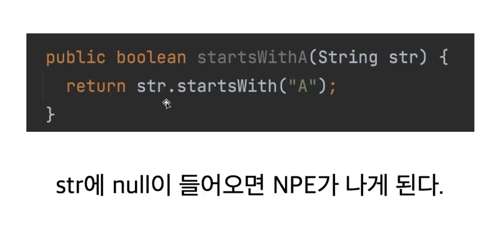

## 변수

#### var과 val

- 자바에서는 불변해야 하는 변수에 final과 같은 키워드를 사용하지만, 코틀린에서는 변수에는 var, 상수에는 val을 사용한다.

#### 자동 타입 추론

- 그러나 초기화를 하지 않고 선언만 하는 경우에는 명시적으로 type을 줘야 한다.

#### 선언과 초기화

- val 컬렉션에 element를 추가할 수 있다.
- <u>**모든 변수를 우선 val로 만들고 꼭 필요한 경우만 var로 선언한다.**</u>
- 자바의 long / Long 과 같은 구분이 없고 그냥 하나로 통일된다. 즉 primitive type, reference type의 구분이 따로 없고 boxing과 unboxing을 고려하지 않아도 되도록 kotlin이 내부적으로 알아서 처리한다.

#### nullable

- 자바는 Reference type은 null이 할당될 수 있지만 kotlin에서는 null이 들어갈 수 있는 변수라면 '타입?'를 사용함으로써 구분한다.
- 객체의 인스턴스화를 할 때 'new' 키워드를 사용하지 않는다.

---

## Null

#### Kotlin에서의 null체크
- 안전하지 않은 코드
  
- 고치는 방법
  - if null일 경우 exception 처리
  - if null일 경우 null 반환 ( return type : Reference type이어야 함)
  - if null일 경우 false 반환
  - Kotlin과 Java코드 비교
    
- Kotlin에서는 null일 수 있는 변수에 대해서는 바로 메소드 콜을 할 수 없게 컴파일 오류로 표시 되며 이 말은 반대로 nullable 하지 않은 변수는 메소드 콜을 하여도 NPE가 나지 않음을 보장한다는 뜻이다. 
#### Safe call과 Elvis 연산자
- Safe call을 쓰면 nullable한 변수도 '.'을 쓸 수 있게 해준다. 만약에 safe call을 쓴 변수에 Null이 들어우면 '.' 뒤를 포함하여 전체가 null이 반환되고 null이 아닌 경우에 '.' 뒤의 내용이 
실행된다.
- Elvis 연산자
  - safe call과 함께 사용되며 safe call을 사용한 변수가 null이면 null대신 사용할 값을 정의하는데 사용된다. 아래 코드의 경우 str변수가 null일 경우 0 이 프린트 된다. 
  ```kotlin
  val str: String? = null
  print(str?.length ?: 0)
  ``` 
- Safecall과 Elvis연산자를 활용하면 아래와 같이 좀 더 Kotlin스러운 코드로 변환할 수 있다.
  ```kotlin
  fun startsWithA1(str: String?): Boolean {
    return str?.startsWith("A")
      ?: throw IllegalArgumentException("null이 들어왔습니다")
  }
  ```
- Elvis 연산은 early return 에도 아래와 같이 활용된다. 
  
#### Null아님 단언
- nullable type이지만, null이 될 수 없는 경우 매번 safe call을 사용해주는 것이 번거롭기에 사용한다. 
  ```kotlin
  fun startsWith(str: String?): Boolean {
    return str!!.startsWith("A")
  }
  ```
#### 플랫폼 타입
- Kotlin에서 Java코드를 가져다 쓸 때 @Nullable, @NotNull의 어노테이션 표시가 없는 경우 플랫폼 타입이라고 하며 이런 코드의 사용은 유의해야 한다. 
  - Java 코드를 읽으면서 null가능성을 확인하거나 Kotlin으로 wrapping하여 자바코드를 가져오는 지점을 최소화 하기 

---

## Type
### 기본 타입
- Int, Long, Float, Double
- 코틀린은 선언된 값을 보고 타입을 추론한다. ex) '10L'이면 Long, '3.0f' 면 float , 명시 없으면 각각 int, double로 간주 
- 자바와 달리 타입변환은 암시적으로 되지 않고 명시적 타입변환 만이 가능하다. 
  - 따라서 'to타입' ( toLong, toDouble ) 을 사용해야 한다. 
- nullable 변수에 대해서는 적절한 처리가 필요하다. 
  - safe call, Elvis 연산 처리 

### 타입 캐스팅
- is, as 문
  
  - as는 is 검사가 선행되었다면 생략가능하다 (스마트 캐스트)
  - 잘못된 type으로 as를 할 경우 exception발생한다. 
  - !is 문
  - as? 문
    ```kotlin
    fun main() {
      printAgeIfPerson(null)
    }

    fun printAgeIfPerson(obj: Any?){
      val person = obj as? Person
      println(person?.age)
    }
    ```
      - as? 를 붙여주면 null이 아니라면 Person타입으로 변환, null이거나 Type이 맞지 않으면 전체가 null이된다. 따라서 person이 null이 될 수 있기 때문에 그 아래 코드에서 person을 참조할 때는 safe call을 써줘야 한다. 

### Kotlin의 특이한 타입
- Any 
  - 자바의 Object 역할
  - Any는 null이 포함될 수 없어 Any?를 써야 한다. 
  - equals, toString, hashCode 존재 
- Unit
  - 자바의 void 역할
  - void와 다르게 Unit은 그 자체로 타입 인자로 사용 가능하다. 
  - 함수형 프로그래밍에서 Unit은 단 하나의 인스턴스만 갖는 타입을 의미. 즉, 코틀린의 Unit은 실제 존재하는 타입이라는 것을 표현 
- Nothing
  - 함수가 정상적으로 끝나지 않았다는 것을 표현
  - 무조건 예외를 만들거나 무한 루프를 만드는 함수

### String interpolation / String indexing
- 자바에 비해 훨씬 간편해짐
- ${변수}
- ''' ''' , trimIndent() 활용 
- charAt(n)대신 바로 str[n] 이런식으로 쓸 수 있음 

## 연산자

### 단항, 산술 연산자
- 자바와 완전히 동일
  

### 비교 연산자 / 동등성, 동일성
- <, >, <=, >=, ==, ===
- 객체 비교 상황에서 비교연산자만 써도 내부적으로 compareTo를 자동 호출해준다. 
- 동등성 : 두 객체의 값이 같은가
  - 자바에서는 equals 
- 동일성 : 두 객체의 주소가 같은가 
  - 자바에서는 ==
- Kotlin에서는 동등성에 ==, 동일성에는 ===를 사용하며 '=='가 내부적으로 equals 메소드 호출한다.

### 논리 연산자
- 자바와 완전히 동일: &&, !, || 
- 코틀린에 있는 특이한 연산자
  - in, !in
  - a..b
    - a부터 b까지 범위 객체를 생성한다. 
  - a[i] 
  - a[i] = b

### 연산자 오버로딩
- 객체마다 직접 연산자를 정의할 수 있다.


### 참고자료

- https://www.inflearn.com/course/lecture?courseSlug=java-to-kotlin
- https://github.com/lannstark/java-to-kotlin-starter-guide
