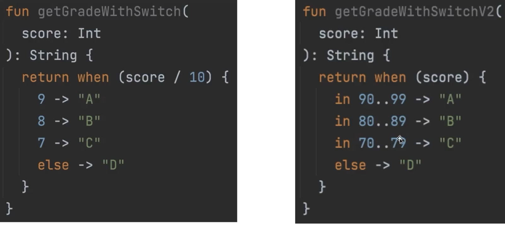

## 제어문
### If문, Expression 과 Statement
- 기본적인 if-else의 문법은 동일하다. 
- Java에서 if-else는 Statement이지만 Kotlin에서는 expression이다. 즉 삼항연산자 처럼 값을 리턴할 수 있다. 
  - 따라서 삼항연산자가 없음 
- in 연산자를 활용 가능
  ```kotlin
  fun example(score: Int){
    if ( score in 0..100 ){
      ...
    }
  }
  ```
### switch 와 when 
- switch case 문 대신에 when으로 kotlin에서는 대체되었으며 조건부를 다양하게 사용할 수 있다.
  
  - is 문, ..문 등 사용
  - `-1,0,1 -> println("-1 또는 0또는 1입니다")`와 같이도 쓸 수 있음 
  - when뒤에 소괄호없이 바로 조건부와 결과로만 when절을 구성할 수도 있다. 
    ```
    when{
      number == 0 -> println("test")
      else -> println("else")
      )
    }
    ```
- Enum 클래스, Sealed 클래스와 함께 사용할 경우 더욱 진가가 발휘된다. 

## 반복문
### for-each 문 ( 향상된 for문 )
- ':' 대신 'in'을 쓰는 정도만 다르다. 
### 전통적인 for문 
- in을 사용한여 범위를 표현한다. 
- progression, range를 활용한 등차수열을 쓴다. 
  - downTo, step 등의 표현

## 예외

### try catch finally 구문
- 자바와 기본적으로 동일
### Checked, Unchecked exception울 구분하지 않는다.
- 즉, 모두가 unchecked 이므로 throw를 쓸 일이 없다. 
### try with resources 
- try with resources 사라짐
- use문을 대신 사용한다. 

## 함수
### 함수 선언 문법
- public은 생략 가능 디폴트가 public이다. 
- Unit도 생략 가능 
- if else가 expression인 것과 함수가 하나의 결과 값이라면 아래와 같이 괄호 대신 =를 함수에 쓸 수 있다. 
  ```kotlin
  fun max(a: Int, b: Int): Int =
    if ( a > b ){
      a
    } else {
      b
    }
  ```
- 한 줄로 변경가능, 자동 type 추론과 block이 없음을 활용하면 아래와 같이 더 간결해질 수 있다.
  ```kotlin
  fun max(a: Int, b: Int) = if ( a > b ) a else b
  ```
### 디폴트 파라미터
### named argument
- 빌더를 직접 만들지 않고도 빌더의 장점을 지니게 된다.
### 같은 타입의 여러 파라미터 받기 ( 가변인자 )
- vararg 키워드 사용해야 하고 가변인자 함수를 배열과 함께 호출할 때는 '*'  ( 스프레드 연산자 )를 붙여줘야 한다. 
  ```kotlin
  printAll(*arrays)
  ```
  
### 참고자료

- https://www.inflearn.com/course/lecture?courseSlug=java-to-kotlin
- https://github.com/lannstark/java-to-kotlin-starter-guide
