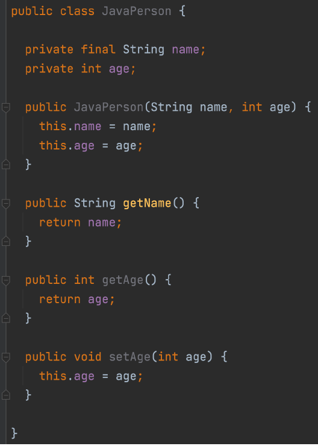

## 1. 클래스
- 클래스와 프로퍼티
- 생성자와 int
- 커스텀 getter, setter
- backing field

### 클래스와 프로퍼티
- Java의 경우 :  


- Kotlin의 경우
    - 생성자가 classname 옆에 오지만 생략가능하며, 생성자에서 field를 선언할 수 있기 때문에 중괄호를 오히려 생략할 수 있다. 
    - val, var로 선언만하면 됨
    ```kotlin
    class Person (
        val name = name
        val age = age
    )
    ```
    - getter, setter는 '.'을 통해서 바로 참조 가능

### 생성자와 init
- kotlin에서는 java의 constructor에서 보통 작성하던 검증 로직을 init에서 할 수 있다. 
 ```kotlin
    class Person (
        val name = name
        val age = age
    ) {

        init {
            if ( age < 0 ) {
                throw IllegalArgumentException("나이는 ${age}일 수 없다")
            }
        }
    }
 ```
- kotlin에서 주 생성자가 아닌 부 생성자는 클래스 내에서 constructor 키워드를 통해 구현되어야 한다.
    - 주 생성자는 반드시 존재해야 하지만 파라미터가 하나도 없는 경우 생략 가능
    - 부 생성저는 최종적으로 this(주생성자)를 호출해야 한다. 
        - 부 생성자에는 중괄호 block을 통해 코드를 삽입할 수 있다. 
    - 그러나 부 생성자는 일반적으로 사용되지 않고, 주로 default parameter가 권장되며 type converting의 경우에는 정적 팩토리 메소드를 사용이 권장된다. 
 ```kotlin
    class Person (
        val name = name
        val age = age
    ) {

        init {
            if ( age < 0 ) {
                throw IllegalArgumentException("나이는 ${age}일 수 없다")
            }
        }

        constructor(name: String): this(name, 1) {
            println("부 생성자")
        }
    }
 ```

### custom getter, setter
- custom getter는 객체의 속성을 나타내는 경우에 활용하면 좋다.
- backing field를 쓸 일은 잘 없다. ( field 예약어 )
- setter 자체를 지양하기 때문에 custom setter도 잘 안쓴다. 

```kotlin
    class Person (
        val name = name
        val age = age
    ) {

        init {
            if ( age < 0 ) {
                throw IllegalArgumentException("나이는 ${age}일 수 없다")
            }
        }

        val isAdult: Boolean
            get() = this.age >= 20  # custom getter
    }
 ```

## 2. 상속
- 상속(extends) or 구현(implement)이 ':' 로 대체되었다.
- 상위 클래스 상속을 구현할 때 생성자를 반드시 호출해야 한다.
- 중복되는 인터페이스 특정 시 아래와 같이 `super<타입>.함수` 사용
    ```kotlin
    class Penguin(
        species: String,
    ) : Animal(species, 2), Swimable, Flyable {
        override fun act() {
            super<Swimable>.act()
            super<Flyable>.act()
        }
    }
    ```
- 추상 멤버가 아니면 기본적으로 override가 불가하다. (open 필요)
    - 즉, 추상 클래스에서 override 하려는 property도 open이 필요하고, 
    - 상속이 필요한 일반 클래스도 open이 필요하다.
        ```kotlin
        open class Base(
            open val number: Int = 100
        ) {
            init {
                println("Base class")
            }
        }

        class Derived(
            override val number: Int
        ) : Base(number) {
            init {
                println("Derived class")
            }
        }
        ```
- 상위 클래스의 생성자 또는 초기화 블록에서 open property를 사용하면 얘기치 못한 버그가 생길 수 있음
- 상속관련 키워드 4가지 정리 
    - final : override 금지 ( 이게 default )
    - open: override 허용
    - abstract: 반드시 override 해야 함 
    - override : 어노테이션 대신 지시어로 바뀜

## 3. 접근제어 
- 자바와 코틀린의 가시성 제어
    - Kotlin에서는 패키지를 접근제어를 하는 기준에서 뺐다. 
    
- java에서 유틸성 코드 만들 때 abstract class + private constructor 써서 인스턴스화를 막았는데, kotlin에서는 파일 상단에 유틸 함수 선언해주면 되고, 다른 파일에서도 import해서 해당 유틸함수를 사용할 수 있다.  
    ```kotlin
    // StringsUtil.kt 예시

    package com.example.utils

    fun isEmpty(str: String?): Boolean {
        return str == null || str.isEmpty()
    }
    ```
    ```kotlin
    // MathUtil.kt 예시
    package com.example.utils

    fun maxOf(a: Int, b: Int): Int {
        return if (a > b) a else b
    }
    ```
    ```kotlin
    // util 사용 예시 
    package com.example

    //파일명이 아니라 `<패키지명>.util함수명` 으로 import해올 수 있다. 
    import com.example.utils.isEmpty
    import com.example.utils.maxOf 

    fun main() {
        val str = ""
        val result = isEmpty(str)
        println("String is empty: $result")

        val max = maxOf(5, 10)
        println("Max value: $max")
    }
    ```
    
### 4. Object 키워드
- static 함수와 변수
    - static 대신 companion object 사용
        - 즉, companion object는 클래스의 인스턴스와는 관계 없이 클래스와 연결된 메서드와 프로퍼티를 정의하는 데 사용되는데, 보통은 정적 팩토리 메소드로서 활용된다. 
        - companion object : 클래스와 '동행'하는 유일한 object로 이해
- 싱글톤
    - object 키워드를 클래스 앞에 선언 시 싱글톤 클래스가 됨. 
    ```kotlin
    object Singleton {
        var a: Int = 0
    }
    ```
- 익명 클래스
    ```kotlin
    fun main() {
        moveSomething(object : Movable {
            override fun move() {
                println("move")
            }

            override fun fly() {
                println("fly")
            }
        })
    }

    private fun moveSomething(movable: Movable) {
        movable.move()
        movable.fly()
    }
    ```

### 5. 중첩 클래스
- 중첩 클래스의 종류 ( Java 기준 )
    - static을 사용하는 클래스
    - static을 사용하지 않는 클래스
        - inner class
        - local class
        - 익명 클래스
    - 보통은 static을 사용하는 내부 클래스와 inner 클래스를 중첩 클래스로 다룬다. 
    - 권장되는 클래스는 static을 사용하는 중첩 클래스이다. 

- Kotlin에서는 이러한 가이드를 따르기 위해 클래스 안에 기본 클래스를 사용하면 외부 클래스에 대한 참조가 없다. 
    - 굳이 바깥 클래스를 참조하려면 inner class로 선언해야 함

- 정리하면 아래와 같다.


### 6. Kotlin의 다양한 클래스 종류
- Data class
- Enum class
- Sealed class, Sealed interface

### Data class
- DTO로 많이 사용됨 
- data class는 아래와 같이 선언만 하면 생성자, getter, euals, hashCode, toString 포함된다.
    ```kotlin
    data class PersonDto(
        val name: String,
        val age: Int,
    )
    ```
### Enum class
- java의 enum과 기본적으로 동일하지만, enum에 대한 분기 처리시 when을 사용해서 코드를 간결화 가능
- 컴파일러가 enum의 모든 type을 알고 있기 때문에 다른 타입에 대한 else로직을 작성하지 않아도 된다.
```kotlin
private fun handleCountry(country: Country) {
    when (country) {
        Country.KOREA -> TODO()
        Country.AMERICA -> TODO()
    }
}
```

### Sealed class
- 상속이 가능하도록 추상클래스를 만들고 싶지만 외부에서는 이 클래스를 상속받지 못하게 하고 싶을 경우에 사용된다. 
    - 즉 동일 파일(패키지) 내에서 Sealed class와 그에 대한 하위 클래스를 구현하고, 외부에서는 구현하지 못하도록 봉인하는 개념
    - 컴파일 타임 때 sealed class의 하위 클래스 타입을 모두 기억하기 때문에 enum과 같이 when 문 사용 시 else로직 작성하지 않아도 된다.
    - 추상화가 필요한 Entity 나 DTO에 sealed class를 활용하며 when 과 함께 주로 사용된다. 
```kotlin
sealed class HyundaiCar(
    val name: String,
    val price: Long
)

class Avante: HyundaiCar("avante", 1_000L)
class Sonata: HyundaiCar("sonata", 2_000L)
```


### 참고자료

- https://www.inflearn.com/course/lecture?courseSlug=java-to-kotlin
- https://github.com/lannstark/java-to-kotlin-starter-guide
