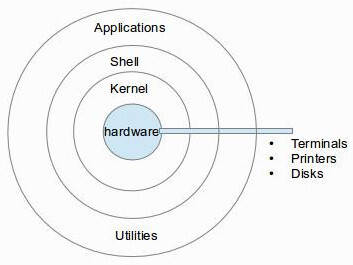

## 1. 쉘(Shell)
Shell vs Kernel 
쉘은 무엇이고 커널은 무엇인가? 

Kernel은 H/W를 제어하는 OS에서 가장 중요한 코어와 같은 역할이다. 



Shell은 유저가 직접 커널을 조작하는 것은 매우 어렵기 때문에 유저가 실행한 application을 kernel이 이해할 수 있는 형태로 변환시켜준다.
shell도 프로그램이기 때문에 종류가 한 개만 있는 것이 아니라 bash, zsh등 여려가지가 존재하며 `echo $0` 명령을 통해 현재 사용되고 있는 shell이 무엇인지 확인할 수 있다.

## 2. 쉘 스크립트(Shell script)
shell script의 맨 처음에는 `#!/bin/bash`를 적어줌으로써 bash 쉘을 사용하는 스크립트임을 명시한다.
- 예시 
  : 간단한 log파일 백업 스크립트
  ```bash
    #!/bin/bash
    if ! [ -d bak ]; then   # 현재 디렉토리에 bak이라는 디렉토리가 존재하지 않는다면
            mkdir bak       # bak 디렉토리 생성
    fi
    cp *.log bak            # 모든 .log파일을 bak 디렉토리 하위로 복사하기. 
  ```

## 3. 디렉토리 구조
리눅스 OS의 디렉토리는 기본적으로 아래와 같은 구조를 가진다.


  - https://www.thegeekstuff.com/2010/09/linux-file-system-structure/

- /sbin : system admin을 위한 실행가능한 bin파일들이 있음
- /etc : 설정 관련된 디렉토리
- /var : 여기 있는 파일들은 내용이 바뀔 수 있는 특성을 지닌다 log와 같이. 
- /tmp : 임시 파일들이 저장되며, OS 재부팅시 여기있는 파일들은 삭제 된다. 
- /home : user들의 홈 디렉토리가 모여있는 디렉토리
- /boot : 부트로더 관련 파일들
- /lib : /bin과 /sbin에서 공통적으로 사용하는 라이브러리들이 존재
- /opt : add-on 어플리케이션들 ( ex. htop, splunk 등 ) 을 여기에 설치한다. (opt의 뜻은 optional)
- /usr : 과거 이동식 디스크 용량의 부족으로 인해 있던 dir로서 현재에는 큰 의미없음.

## 4. 파일 찾는 법

### locate 명령
locate명령은 디렉토리가 아닌 database를 뒤져서 찾기 때문에 빠르다. 그 database는 mlocate이다. 
그리고 하루에 한 번 `updatedb` 라는 명령을 통해 하루에 한번 db를 업데이트 해준다.

### find 명령
- 현재 디렉토리 하위에서 test.txt 파일 찾아서 삭제하기 
```bash
find . -type f -name "test.txt" -exec rm -rf {} \;
```
  - '{}' 의 위치에 find에서 찾은 파일의 절대 경로가 입력된다. 
  - '\;' 는 -exec 명령의 끝을 의미함. 
  - 현재 디렉토리에서'만' 찾으려면 -maxdepth 1 옵션을 주면 된다.

- atime, mtime, ctime과 find 
  파일의 timestamp에는 3가지 종류가 있고, 일반적으로 `ls -al` 했을 때 나오는 timestamp는 mtime이다. 그러나 다른 timestamp도 활용될 수 있으니 알아두자.
  특히 파일의 생성일로부터 추적할 때는 ctime을 사용하는 것이 일반적이다. 

  - atime (Access Time):
    파일에 마지막으로 접근한 시간을 나타냄. 
    읽기나 실행과 같이 파일에 접근한 동작이 발생할 때 업데이트 된다. 
    주로 파일의 접근 패턴을 파악하거나 파일이 최근에 사용되었는지 여부를 확인하는 데 사용될 수 있다. 

    예시 ) 30일 이상 접근 되지 않은 파일 찾기
    ```bash
    find /path/to/directory -type f -atime +30
    ```
  - ctime (Change Time):
    파일의 상태가 마지막으로 변경된 시간을 나타낸다.
    파일의 메타데이터(권한, 소유자, 크기 등)가 변경되거나 파일 내용이 수정될 때 업데이트 된다. 
    주로 파일의 메타데이터 변경 여부를 감지하거나 파일의 변경 시점을 추적하는 데 사용된다.

    예시 ) 최근 3일 이내에 생성된 텍스트 파일 찾기 
    ```bash
    find /path/to/directory -type f -name "*.txt" -ctime -3
    ```

  - mtime (Modification Time):
    파일이 마지막으로 수정된 시간을 나타냅니다.
    파일 내용이 변경될 때 업데이트됩니다.
    주로 파일의 최근 수정 시간을 확인하여 파일 변경 여부를 감지하거나 동기화 작업 등에서 활용된다.

    예시 ) 100MB 이상의 크기를 가진 파일을 찾기
    ```bash
    find /path/to/directory -type f -size +100M -mtime -7
    ```

- 기타 find의 다양한 옵션 및 사용법은 인터넷에서 찾아서 사용하기
---


# 스터디 문제
각자의 /home/{사번}/week2에서 문제를 풀고 answer.txt 파일에 답안(1~4번 문제)을  작성해주세요 
처음 디렉토리는 /home/{사번}/week2인 것으로 가정합니다. 

1. 현재 사용되고 있는 shell을 확인하는 명령어는 무엇인가? 
2. Kernel과 Shell이 무엇인지에 대해서 간략히 서술하세요. 
3. root 유저로 switch user하여 /logfs/webserver 있는 파일 중 수정 된 지 370일이 경과한 로그 파일들을 찾아서 작성하세요
4. /logfs/webserver 디렉토리에서 access된지 1일 미만인 파일들을 찾아서 작성하세요
5. logout하고 week2 디렉토리 밑에 test.log, test.txt 파일을 만드세요. 그리고 source dir ~/week2에 있는 .log 확장자 파일을 destination dir ~/week2/dest로 복사하는 shell script를 작성하세요. script내에서 destination 디렉토리가 존재하지 않는다면 생성하는 명령도 포함시키세요. 
6. vi 편집 연습 
EXAMPLE 텍스트를 복사하여 example.txt를 만들어주세요. RESULT 텍스트를 복사하여 result.txt를 만들어주세요 
- 미션 1: 문자열 삽입
: "Lorem ipsum dolor sit amet" 다음에 "INSERTED STRING"을 삽입합니다.
- 미션 2: 문자열 삭제
: "Lorem"이라는 문자열을 삭제합니다.
- 미션 3: 단어 대체
: "consectetur"이라는 단어를 "REPLACED"로 대체합니다.
- 미션 4: 행 복사
: 텍스트의 마지막 줄을 복사하여 텍스트의 끝에 추가합니다.

미션들을 example.txt 수행 한 후에 diff example.txt result.txt한 결과가 일치해야 합니다 확인해보세요. 