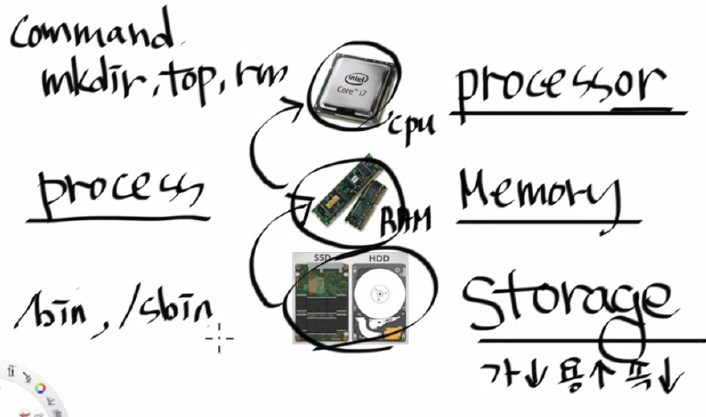
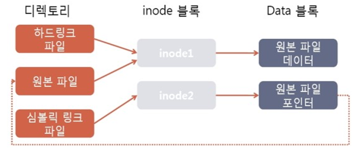

## 컴퓨터 구조 
storage로부터 프로그램을 읽어서 프로세스로서 메모리에 적재시키며 이를 processor인 CPU가 실행시킨다. 


## 프로세스 모니터링
- ps 사용법
- htop 사용법
  - Load average

## 프로세스의 실행
### 백그라운드 
  - Ctrl+Z : 프로세스를 백그라운드로 전환
  - jobs : 백그라운드에서 실행 중인 프로셋 확인 가능
  - fg : 백그라운드에서 실행 중인 프로세스를 포그라운드로 전환 
    - `fg %4` : 4번 job을 전환
    - 그냥 `fg`만 하게 되면 + 표시 되어있는 프로세스가 전환됨 
  - & : 백그라운드로 프로세스 실행 
  - bg : Stopped 된 백그라운드 프로세스를 다시 실행 시킴 

### 항상 실행 (데몬)
  - systemctl을 이용한 서비스 제어 : CentOS7부터는 'service'가 아닌 'systemctl' 사용 
  - /etc/init.d 디렉토리에는 데몬 실행 스크립트들이 모여있다. 
  - /etc/rc3.d 디렉토리에는 데몬 실행 스크립트에 대한 심볼링 링크가 모여있다. 
    - shell로 부팅되면 rc3. GUI로 부팅되면 rc5.d를 참조해야 한다. 
    - K로 시작하는 심볼링 링크는 부팅 시 기동되지 스크립트 
    - S로 시작하는 심볼링 링크는 부팅 시 기동되는 스크립트
    - K or S 뒤에 숫자는 실행의 우선순위이다. 

### 정기적 실행 (cron)
- crontab은 Linux에서 계정별로 관리된다. 
- 간단한 crontab 예시 
  ```bash
    # 매분마다 실행하는 예제
    * * * * * command

    # 매시 정각에 실행하는 예제
    0 * * * * command

    # 매일 오전 9시에 실행하는 예제
    0 9 * * * command

    # 매주 일요일 오전 10시 30분에 실행하는 예제
    30 10 * * 0 command

    # 매월 1일 오전 5시에 실행하는 예제
    0 5 1 * * command

    # 매년 1월 1일 오전 12시에 실행하는 예제
    0 0 1 1 * command

  ```
- 매 분 마다 일시를 date.log에 행을 추가하여 저장하되, stderr도 stdout형태로 출력하도록 하는 crontab 예시
  ```bash
  * * * * * date >> date.log > 2>&1
  ```

## Start up script
.bash_rc와 .bash_profile이 있는데 2개의 차이는 아래와 같다. 
- .bash_rc : shell을 열 때 마다 실행된다.
- .bash_profile : 사용자가 로그인 할 때 마다 실행된다

### alias
.bash_rc 또는 .bash_profile에 내가 원하는 대로 alias를 등록할 수 있다. 
- k = kubectl
- c = clear
- .. = cd .. 
- rm = rm -i

## inode와 링크 
리눅스에서 파일과 디렉토리는 파일 시스템 내에서 고유한 inode 번호를 할당받는다. 
inode(inode table)에서는 파일/디렉토리에 대한 메타데이터를 저장하며 실제 데이터 블록에 대한 포인터 정보를 가지고 있다. 
즉 바꿔 말하면, inode는 실제 파일의 데이터를 가지고 있는 것은 아니며 아래와 같은 데이터를 가지고 있다.
- 파일 형식 및 권한
- 소유자 및 그룹
- 파일 크기
- 데이터 블록 포인터: 파일의 실제 데이터 블록을 가리키는 포인터
- 생성/수정 시간
- 하드 링크 수
- 기타 메타데이터 : 파일의 기타 속성 및 메타데이터 정보를 저장한다.

### 심볼릭 링크와 하드링크 
- 심볼링(symbolic) 링크 생성: `ln -s`
  - 활용 사례
    -  mount된 nas와 같은 스토리지를 업무 디렉토리 (docroot)같은 곳에서 디렉토리 내에 존재하는 것처럼 표시하고 싶을 때 사용할 수 있다.
- 하드링크 생성 : `ln`
  - 하드링크 파일은 inode index가 원본 파일과 동일하기 때문에 수정/삭제 등의 동작이 함께 동작한다.
    - inode index보려면 ls명령에 '-i'옵션을 줘야 한다. 
  - 하드링크 생성은 매우 유의해야 하며 잘 안씀

심볼링 링크와 하드링크를 inode의 관점에서 이해하자면 아래 도식과 같다. 



----
# 스터디 문제 
각자의 /home/{사번}/week3에서 문제를 풀고 answer.txt 파일에 답안(1~4번 문제)을  작성해주세요 
처음 디렉토리는 /home/{사번}/인 것으로 가정합니다.

0. mkdir week3; cd week3;를 하고 시작해주세요. 
1. 프로그램과 프로세스의 차이점에 대해서 서술하세요. 
2. 서버 내 모든 경로에 대한 ls 결과를 output.txt에 저장하는 프로세스를 백그라운드로 실행시키는 명령을 작성하세요. 해당 프로세스를 stop시키려면 어떻게 해야 하는 지 작성하세요. (root 필요)
3. 데몬을 관리하기 위해 사용되는 command는 어떤 것이 있으며 CentOS7, Ubuntu16 이후로 사용되는 command는 그 중에 무엇인가? 
4. 해당 서버가 부팅 시 실행되는 데몬 스크립트 3개와 부팅 시 실행되지 않는 데몬 스크립트 3개가 무엇인지 작성하세요 ( root필요, 스크립트 경로 포함할 것 ) 
5. 다시 본인의 계정으로 logout하세요
  - 5-1) echo "CPU USAGE: $(top -bn1 | awk '/Cpu/ {print $2}') DATE: $(date)" 명령은 현재의 cpu usage와 date값을 조회해주는 명령어이다. 이를 활용하여 매 분 마다 해당 명령을 실행시켜서 week3디렉토리 밑의 cpu-monitoring-minute.log파일에 저장하는 crontab을 작성하세요.
  - 5-2 ) crontab이 정상적으로 등록되었는 지 확인하는 명령을 작성하세요 
  - 5-3) cpu-monitor.log 파일에 매 분마다 실제로 로그가 추가되는 지 확인하기 위해 실행하는 명령을 작성하세요
6. 
  - 6-1) touch 명령어를 활용하여 access1.log ~ access5.log 5개 파일을 week3밑에 생성하세요. 
  - 6-2) 매일 오후 8시 30분에 /home/{본인사번}/week3 하위에 존재하는 모든 .log 파일을 삭제하는 crontab을 작성하세요.
7. rm 명령 시 바로 삭제를 실행시키지 않고 사용자에게 확인요청 후 컨펌하여 삭제할 수 있도록 rm 명령에 대한 alias를 등록하세요. 
