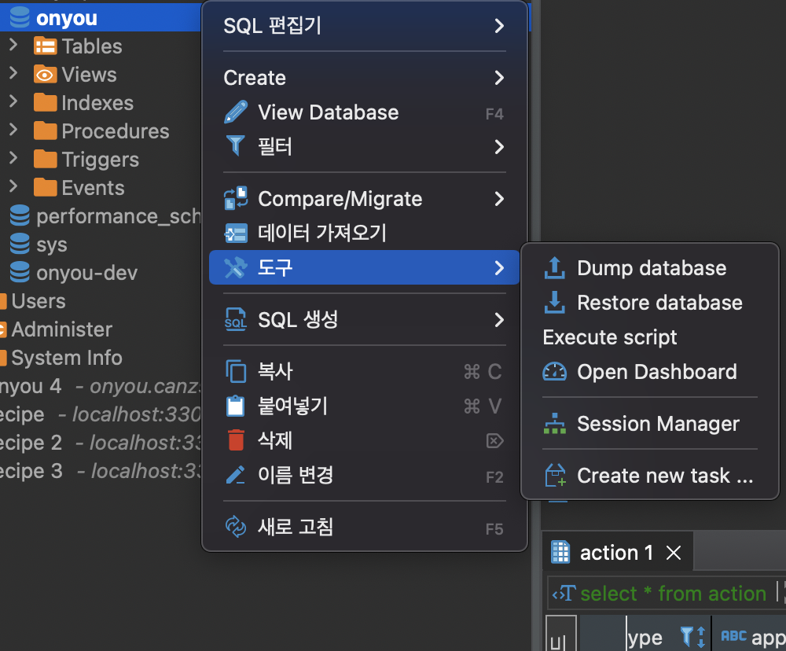
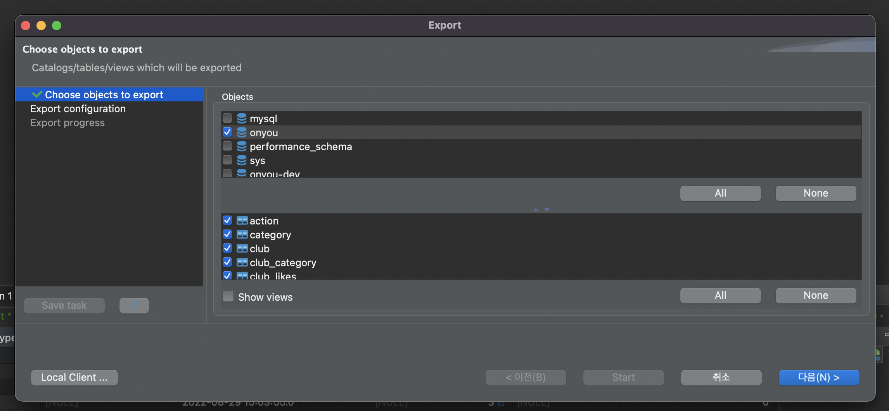
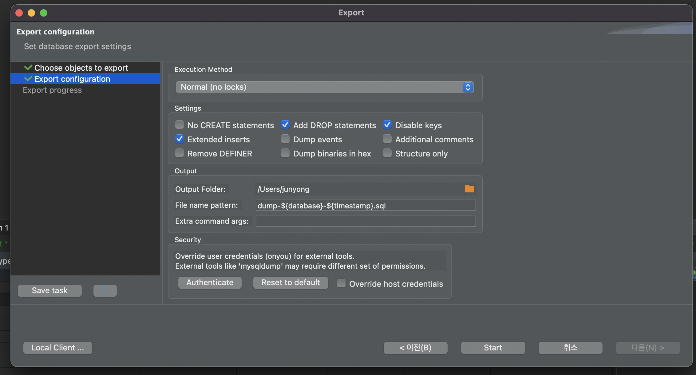
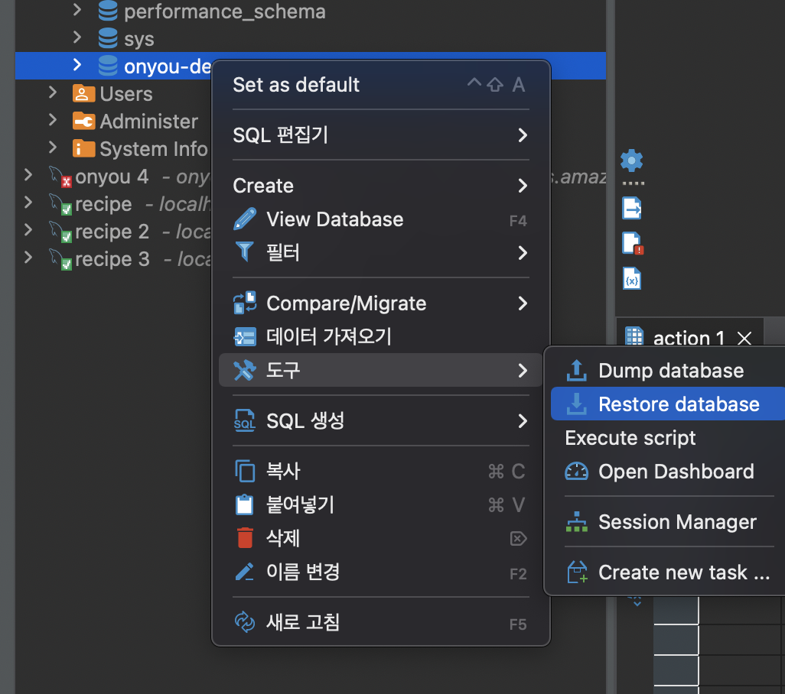
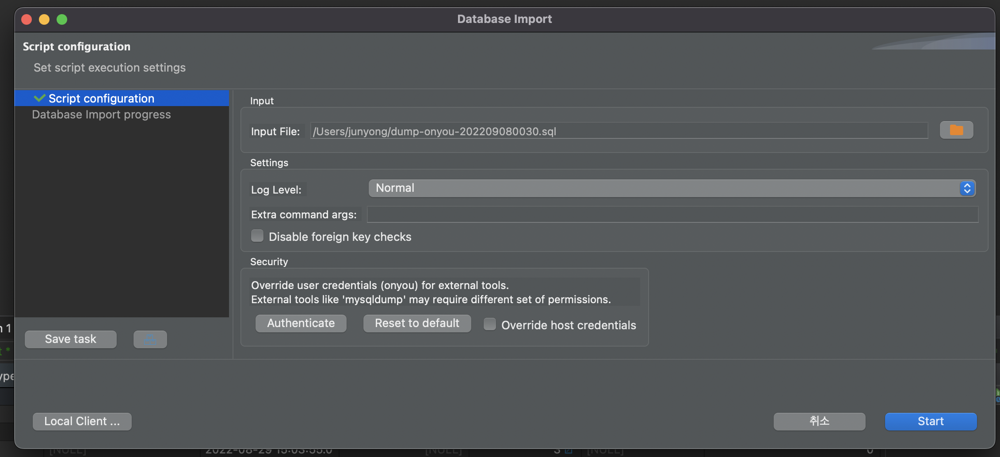

기존에 MySQL 환경에서 1개 database로만 운영하던 서비스에 dev용 database를 추가하기 위해 DBeaver에서 dump하여 복사한 방법을 알아보자.

먼저 복사하려는 대상 db에서 우클릭하여 'dump database'를 선택한다. 

그 후 정확한 DB와 모든 table들을 선택한 후 다음

output 폴더를 지정해주고 local client를 설정해준 이후 'Start' 버튼을 눌러 dump하면 끝이다.

그 후 dev용 database (나의 경우 onyou-dev) 를 생성한 다음 우클릭하여 Restore database를 선택한다.

기존 db에서 dump로 생성했던 sq을 선택하고 'Start' 눌러주면 끝이다. 

