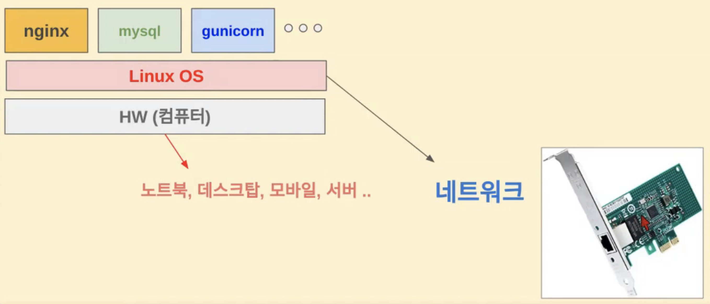

### 리눅스의 네트워크 처리



리눅스 OS는 네트워크 카드를 포함한 하드웨어를 관리하는 역할을 한다.
OS 위에서 실행되는 application이 하드웨어(여기선 네트웍) 사용하기 위해서는 Linux kernel에 systemcall을 보내야 하고, 가장 많이 open, read, write와 같은 systemcall이 사용된다.
<br>
<br>
네트웍 자원을 사용할 때는 open대신 socket이라는 systemcall을 사용하게 되며 read 명령은 receive, write명령은 send의 역할을 하게 된다. 
이외에도 네트워크 처리함수들은 Linux kernel에 내장되어 있다. 
<br>
<br>
L2~L4의 처리를 리눅스의 네트웍 함수들을 사용하여 소프트웨어적으로 처리할 수도 있지만 하드웨어에 내장된 기능을 통해 '하드웨어 오프로드'로 더 빨리 처리할수도 있다. 
<br>
Ethernet frame에서 붙는 mac주소의 destination은 내부망(LAN)에서는 실제 목적지 컴퓨터의 mac주소가 맞지만, WAN에서는 Gateway의 mac주소가 destination이 되어 나간다. 

- 관련 명령어
  ```
  # 현재 network card 정보 확인하기
  sudo lshw -C network

  # 제조 회사 확인하기
  sudo lshw -C network | grep vendor
  ```

### HTTP 통신
- curl 명령을 통한 http request Get 요청 header (-I option)
  ```
  curl -vI www.google.com 2>&1 | grep "> "
  ```
- curl 명령을 통한 http response Get 응답 header (-I option)
  ```
  curl -vI www.google.com 2>&1 | grep "< "
  ```
