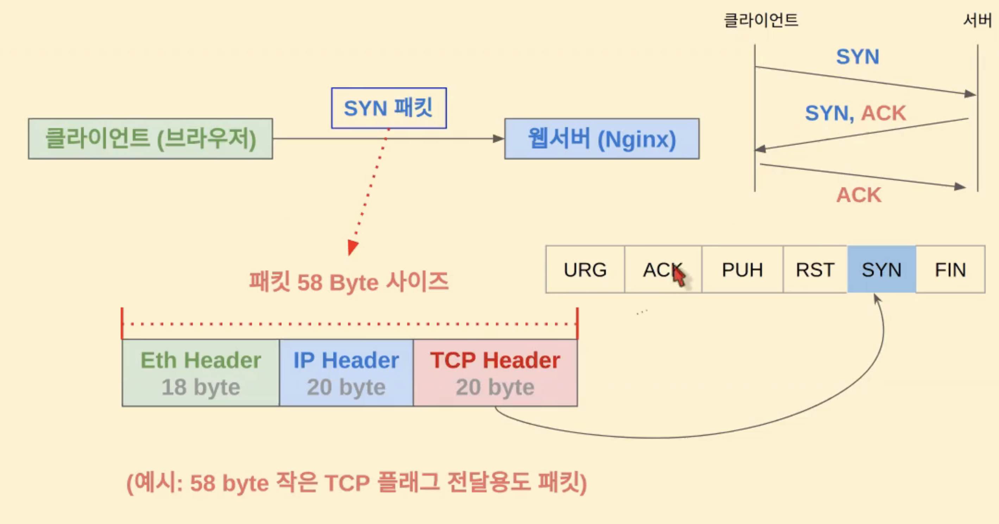
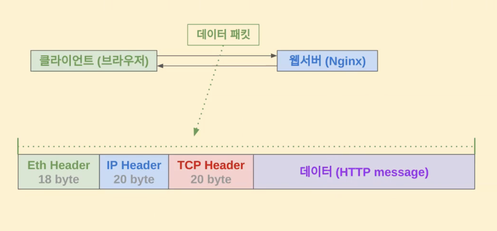
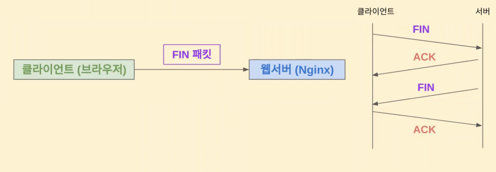
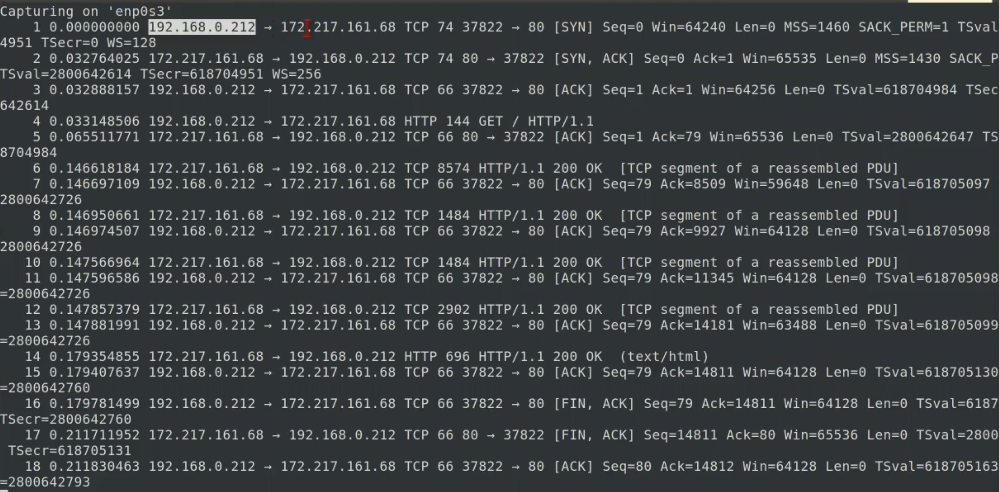
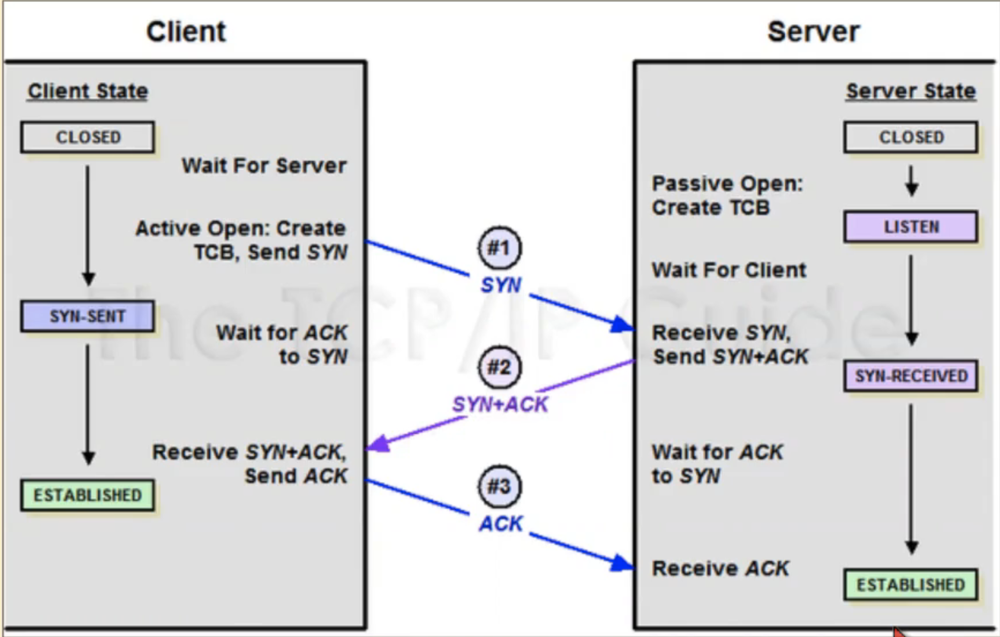
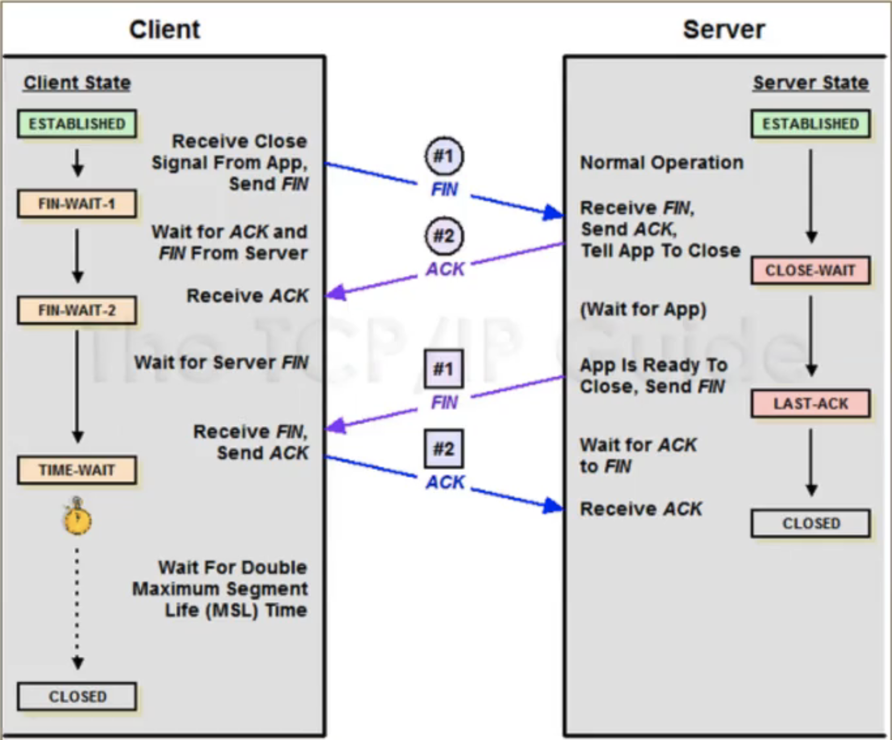

## TCP란?
- Transmission Control Protocol
- L4 계층 통신
- TCP의 가장 중요한 키워드는 "커넥션"이다. 통신 전에 커넥션을 맺고 통신이 끝나면 커넥션을 해지한다.
- HTTP 통신을 할 때도 TCP/IP 통신을 기반으로 한다. 

### TCP 통신의 과정 
- 연결 : 3 way handshaking
  
  - 데이터가 없는 Ethernet header, IP header, TCP Header로만 이루어진 SYN 패킷을 보낸다. 이 떄 TCP Header에 SYN으로 표시되어 있다. 
  - 그 이후의 SYN,ACK 와 ACK 패킷도 마찬가지이다. 
- 데이터 통신 
  
  - HTTP 통신이라고 가정하면, HTTP 헤더/바디를 포함한 message 데이터가 추가된 데이터 패킷을 주고 받는다. 
- 해지 : 4 way handshaking 
  
  - 해지도 연결과 마찬가지로 데이터가 없는 FIN, ACK 패킷을 주고받음으로써 연결을 해지한다. 

<br>

- L7의 프로토콜에 따라 다르지만 데이터 통신이 오고가는 과정에서 계속 3 way handshake를 하는 것이 아니다. 
- 데이터 패킷 1개만 보내기 위해서 통신을 한다고 하면 총 몇개의 패킷을 보내야 하는가? 
  - 3 + 1 + 4 = 총 8개의 패킷을 주고 받게 된다. 이는 비효율적으로 보일 수 있다. 

### TCP 통신 추적 실습
```bash
# 80 포트 기준으로 필터링하여 TCP/IP 통신과정 캡쳐하기 
sudo tshark -i {network interface명} "tcp port 80"

# 다른 터미널에서 curl 실행
curl www.google.com
```
- 캡쳐 결과 분석하기
  
  <br>
  - 제일 처음에 1,2,3번행에서 3 way handshake가 이루어짐을 알 수 있다. 
    - Len=0이라는 것은 data길이가 0이라는 것이다. 
  - `ACK`가 연결/해지에서만 쓰이는게 아니라 통신 시에 데이터를 받으면 다 ACK로 보내준다. 
  - TCP segment of a reassembled PDU 는 HTTP 통신 시에 tcp 패킷을 나눠서 송신하는데 수신 시에 segment를 재조립하여 전체 메시지 또는 데이터 스트림을 얻게 된다. 즉, `TCP segment of a reassembled PDU` 메시지는 수신된 TCP 세그먼트가 TCP PDU의 재조립된 일부임을 의미한다.
  - 마지막에 [FIN, ACK], [FIN, ACK]는 4 way handshake의 과정과 동일한 절차는 맞으나 약간 다른 방식으로 진행된 것임 

#### HTTP 통신의 특성
- 연결을 맺고, 데이터를 보내고, 연결을 끊는다. 그렇기에 TCP 연결/해지를 위한 패킷을 여러번 주고받음으로써 그에 대한 네트웍 오버헤드는 있을 수 있으나, 서버 입장에서는 소켓을 클라이언트를 위해 계속 물고 있지 않아도 되기 때문에 오히려 서버 자원의 관점에서는 더 효율적이다. 

#### 연결/해지의 Client/Server 상태 들여다보기
- **3 way handshake 연결에 따른 서버 상태**
  
  <br>
- **4 way handshake 해지에 따른 서버 상태**
   
  <br>
  - FIN을 받은 Client에서 왜 바로 CLOSED 상태로 되지 않고 TIME WAIT이라는 상태를 두는가? 네트웍 지연이나 패킷이 유실되어 재전송되는 예외 상황을 위해 기다리기 위함이다. 
  

---

### netstat을 통한 TCP/IP 추적 실습
- `netstat -antp` 명령으로 network 상태를 볼 수 있는데, 상태가 너무 빨리 변화하기 때문에 이를 추적하기 위해서 아래 스크립트를 사용해본다.
  ```bash
  # netstat-log.sh 생성

  #!/bin/bash
  while true
  do
    netstat -antp | tee -a test.log
    sleep 0.1
  done

  # netstat-log.sh 실행하기
  ./netstat-log.sh 

  # 다른 터미널에서 curl로 테스트하기
  curl www.google.com

  # netstat 로그 결과에서 TCP 연결상태값 변화과정 확인하기
  vi test.log
  ```
