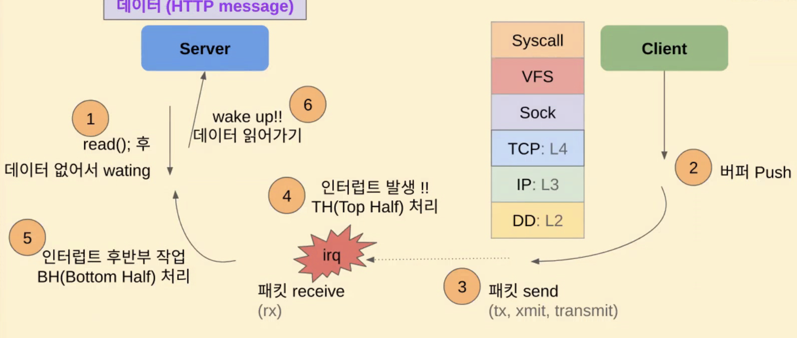
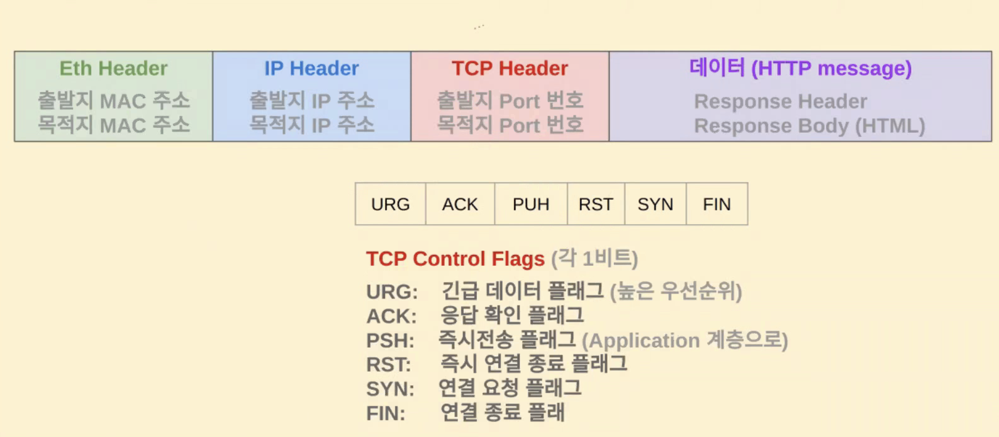
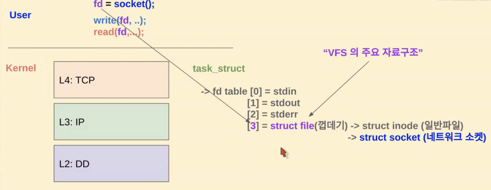
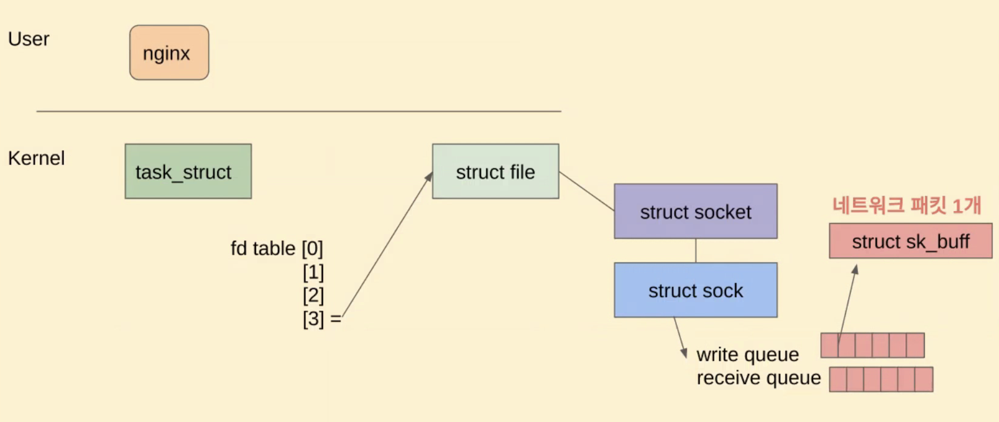

## 네트워크 I/O 과정
- ESTABLISHED 그 이후.. Client와 Server는 서로 데이터 패킷을 주고 받게 된다. 



- 송신 측에서 socker 버퍼에 패킷을 집어넣는다. 
- 패킷이 목적지에 도착하면 목적지인 수신 측 컴퓨터는 하드웨어 디바이스들이 직접 접근할 수 있는 메모리의 **DMA 영역에 패킷을 저장한 이후에, CPU에 irq(interrupt 요청)를 보내서** 패킷이 도착함을 알린다. 
- hard irq, soft irq 과정 ( hi, si )
  - hard irq에서는 간단한 작업만을 하게 된다. interrupt를 통해 CPU를 깨우고, ISR이 해당 인터럽트에 대한 처리를 하게 함과 동시에 network stack에 event를 발생시켜 수신된 패킷이 있음을 알린다. (+flag set 정도)
  - soft irq는 네트웍 스택에 의해 스케줄링 되며 스케줄에 따라 CPU가 soft interrupt handler를 실행시켜 수신된 패킷을 처리한다. 
    - 수신한 패킷 파싱, 헤더 분석, 검증(MAC, IP, PORT)이 이 때 일어난다. 
  - 위와 같이 실제 패킷 헤더를 까서 검증하는 등의 대부분의 절차는 si에서 일어난다. 따라서 top 명령에서도 hi보다는 si가 높다. 디도스 공격이 왔다라고 하면 si가 높아질 것이다. 
- soft interrupt handler에서 패킷 분석이 끝난 후에 이를 Socket 레이어에 전달하여 서버를 wake up 해주고 데이터를 가져가게 한다.  

<br>

3,4 way handshaking과 같은 패킷을 주고 받을 때도 위의 시나리오와 동일하지만, 6번과정만 없다고 보면 된다.

### 패킷 구조와 TCP control flag


- PSH 플래그는 어떤 경우인가? socket마다 send 버퍼, receive버퍼가 있어서 커널 레벨에서 버퍼가 채워질 때까지 기다릴 수 있다. PSH 플래그를 set하면 버퍼에서 대기하지 않고 바로 어플리케이션 서버로 wake up 요청이 들어가게 된다. 


### Socket 통신 내부 구조


- socket() systemcall은 file을 open하는 것과 마찬가지로 file descriptor를 반환한다. 그리고 process마다 가지고 있는 fd table에 이를 추가가 되는 형태이다. 
    > 프로세스가 파일을 열면, OS는 새로운 fd를 할당해주고, 파일을 닫을 때는 해당 파일 디스크립터를 해제한다. fd table 통해 각 fd에 연결된 파일 or 소켓 등의 정보를 추적하여 프로세스가 I/O 리소스에 접근할 수 있다.
    > 왜 socket()은 file descriptor를 반환하는가? 리눅스에서는 네트웍 자원을 포함하여 모든 리소스를 사용할 때 VFS를 통해서 하기 떄문이다.
- open() syscall이든 socket() syscall이든 fd table에 VFS의 주요 자료구조인 `struct file`이라는 구조체를 만들어주는 것은 매한가지이며 fd는 이 구조체를 가리키는 참조이다. 파일이라면 struct file이 struct inode와 연결될 것이고 socket이라면 struct socket이 연결될 것이라는 차이점이 있다. 


    > 하나의 프로세스가 여러개의 socket을 유지할 수 있다. 
    >  - process 당 fd table은 1개이지만 process가 열 수 있는 file의 개수는 여러 개임과 같은 맥락이다.(fd도 여러개)
    >  -  process가 open할 수 있는 파일의 개수를 확인하려면 아래 명령을 실행해보면 기본적으로는 1024임을 알 수 있다.
    >  - `ulimit -a | grep "open file"`
    >    - 관련 에러: `"Too many open file"` -> 파일이라는 단어를 보더라도 클라이언트와의 소켓 커넥션과 연관지어 생각할 수 있어야 한다. 



- struct socket도 자세히 들여다보면 struct sock으로 구성되어 있고, 이것이 우리가 말하는 "socket"의 실체이다. struct sock은 receive/read queue를 가지고 있고 해당 큐에서 패킷을 보관한다. 
  ```C
  #include <net/sock.h>

  struct sock {
      // 다양한 소켓 관련 필드들...

      struct sk_buff_head sk_receive_queue;  // 수신 큐 (Read Queue)
      struct sk_buff_head sk_write_queue;    // 전송 큐 (Write Queue)

      // 다양한 소켓 관련 필드들...
  };
  ```
- 리눅스 커널에서 패킷은 sk_buff라는 구조체에 저장하며 아래와 같이 구성되어 있다.
  ```C
  struct sk_buff {
      // 패킷의 데이터를 저장하는 버퍼
      unsigned char *data;
      
      // 버퍼의 길이
      unsigned int len;

      // 네트워크 계층의 정보, 전송 계층의 정보, 애플리케이션 계층의 정보 등을 포함하는 다양한 필드들...
      
      // 다음 패킷을 가리키는 포인터 (리스트 구조체로 구성된 큐에서 사용됨)
      struct sk_buff *next;
  };
  ```
