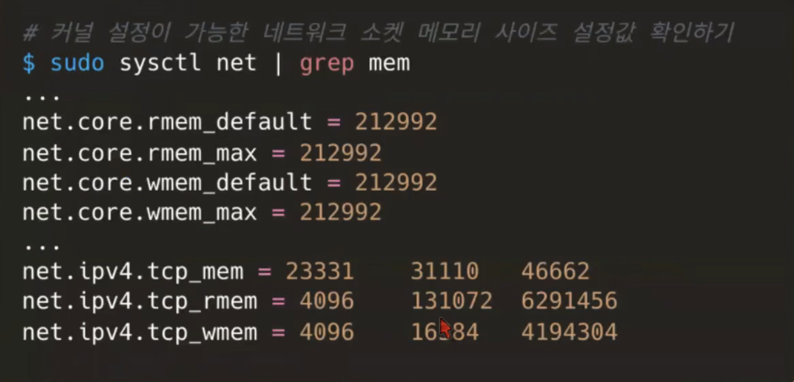
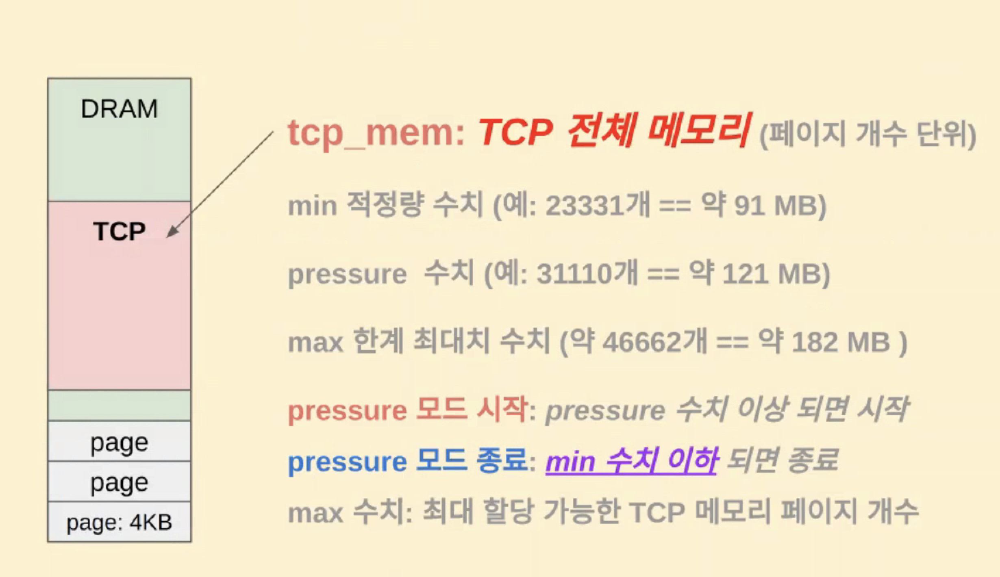
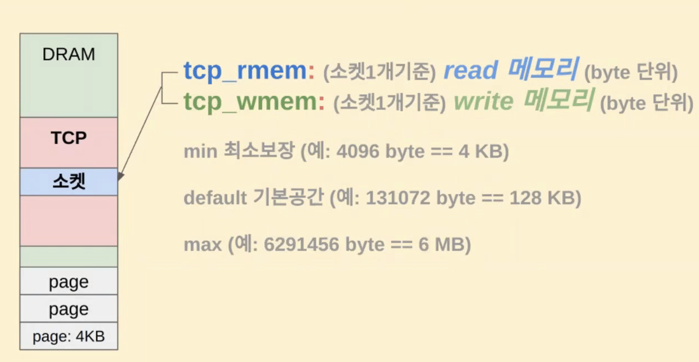
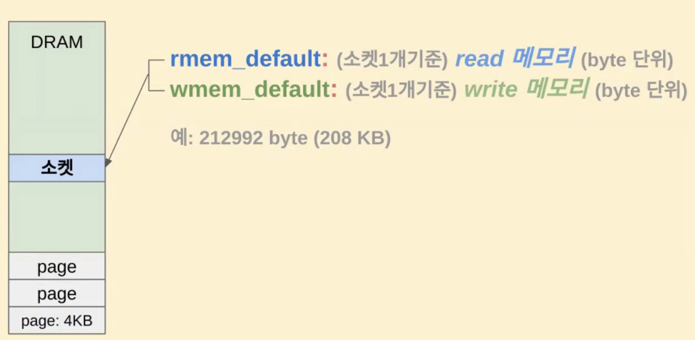

### 네트워크 소켓 메모리 공간을 결정하는 커널 설정

kernel parameter를 runtime에 설정할 수 있게 해주는 sysctl 명령 활용


<br>

- net.core.\*는 tcp,icmp등 프로토콜 관계없이 모든 통신과 관련한 설정
- net.ipv4.tcp.\* 는 tcp관련 소켓 메모리 설정 값이다.
- 이들 설정값의 단위는 다 byte단위가 아니라 어떤건 page단위(보통 4kb), 어떤 건 byte단위이다.



- 첫 번째 그림에서 보면 tcp 메모리 관련해서 하나의 값만 있는게 아니라 3개의 값이 존재한다. 이것은 min, pressure, max 수치이다.
  - 커널을 pressure모드로 설정할 수가 있는데, 커널 내부적으로 tcp에서 메모리를 사용할 때 메모리 할당 전에 pressure모드인지 아닌지를 체크한다. pressure mode이면 pressure수치를 사용한다.
  - 커널이 pressure모드이면 리소스 활용을 최소화하고 안 쓰는 메모리 공간을 여유 메모리공간으로 할당하는 등 리소스를 타이트하게 관리하기 위한 모드이다.



- tcp_rmem, wmem은 소켓 1개 기준의 사이즈를 정의하며 byte단위이다.
- 다운로드가 많다고 하면 read buffer를 넉넉하게 둔다면 퍼포먼스를 개선할 수 있다.



- net.core.rmem_default, wmem_default는 tcp_rmem,wmem이 설정이 안됐을 때의 디폴트 값이면서 udp, icmp 등의 소켓 통신에 대해서도 별도의 프로토콜 별 설정이 없을 때에 대한 디폴트 값이다.

---

### OS 셋팅시 권장 커널 파라미터

- sysctl -a 명령으로 확인

```bash
# 재전송 패킷을 보내는 주기
net.ipv4.tcp_keepalive_intvl = 15
# 손실된 TCP 상태 감지 시간 설정
net.ipv4.tcp_keepalive_probes = 5
# keep alive 시간
net.ipv4.tcp_keepalive_time=30

# FIN 타임아웃을 시간을 줄여 FD를 빠르게 확보
net.ipv4.tcp_fin_timeout=10

# TCP 연결에 문제가 있을 때 연결을 재시도하는 횟수
net.ipv4.tcp_retries1=3
# TCP 연결을 끊기 전에 재시도하는 횟수
net.ipv4.tcp_retries2=3

# 사용할 수 있는 포트 범위를 설정
net.ipv4.ip_local_port_range= 1024 65000
# TCP 수신 버퍼크기 최대값 설정
net.core.rmem_max=16777216
# TCP 수신 버퍼크기 기본값 설정
net.core.rmem_default=262144
# TCP 전송 버퍼크기 최대값 설정
net.core.wmem_max=16777216
# TCP 전송 버퍼크기 기본값 설정
net.core.wmem_default=262144

# 65kb 이상의 큰 TCP 윈도우 스케일링 사용
net.ipv4.tcp_window_scaling=1

# 소켓 재사용 안함:0
net.ipv4.tcp_timestamps=0

# SYNC 패킷을 전송한 후 일부 ACK를 받지 못했을 경우 선택적으로 받지 못한 ACK 패킷을 받는지 여부
net.ipv4.tcp_sack=0

# ESTABLISHED 상태의 소켓 수
net.core.somaxconn=50000

# 각 네트워크 장치 별로 커널이 처리하도록 쌓아두는 queue의 크기
net.core.netdev_max_backlog=65535

# SYN_RECEIVED 상태의 소켓 최대값
net.ipv4.tcp_max_syn_backlog=65535
```
