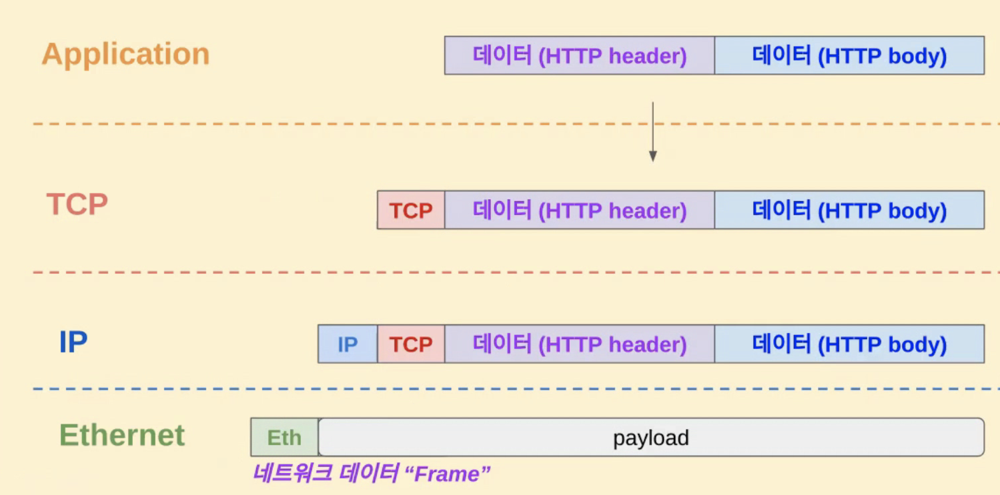
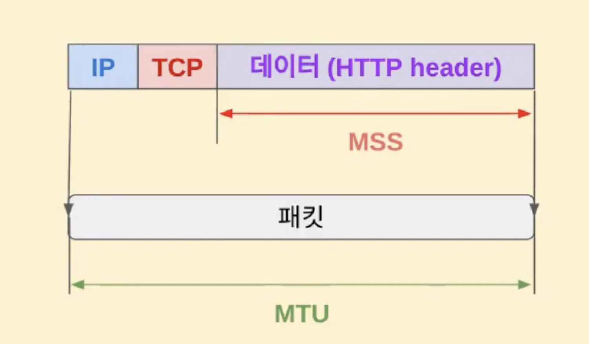
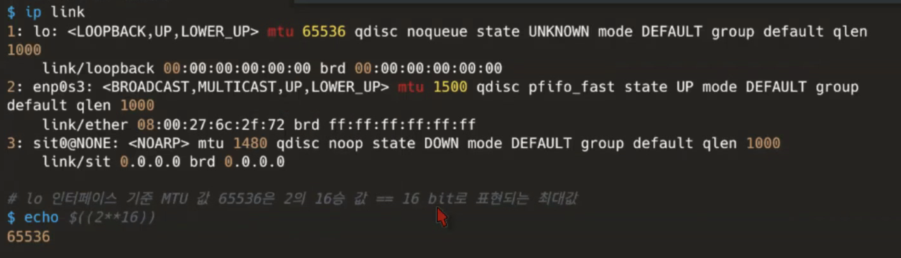
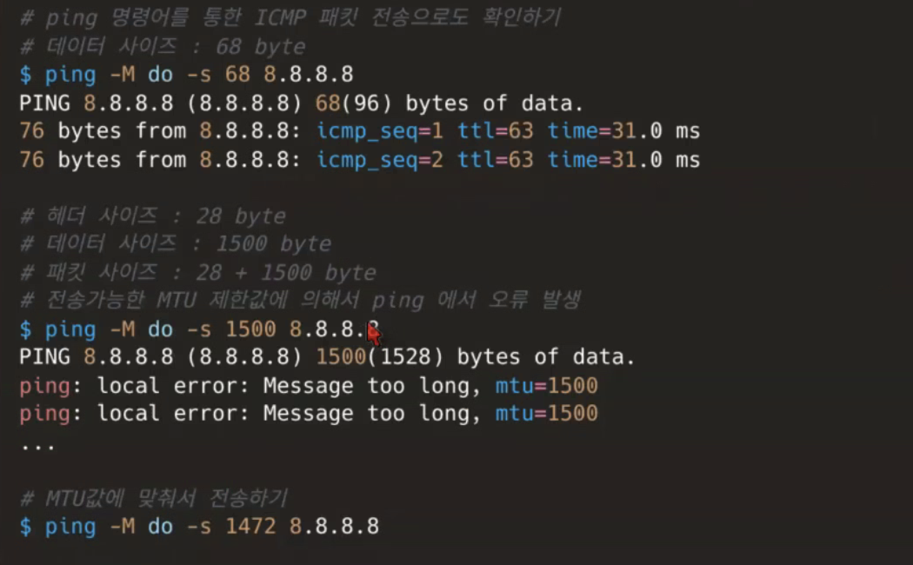
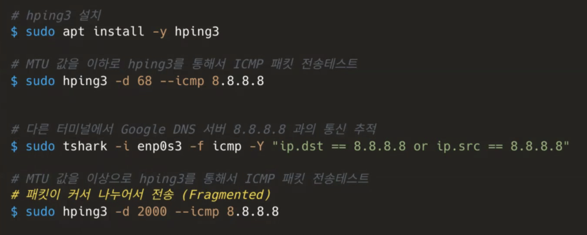

### MSS란?

- L4계층의 개념이며 Maximum segment size의 약자로서 TCP에서 전송할 수 있는 사용자 payload 크기
  - TCP header를 제외한 payload만의 크기이다. 그리고 payload는 각 네트웍 계층에 따라 상대적인 개념이다. (ex. L4에서는 http 헤더가 payload. L3에서는 tcp헤더도 payload)
     
    
     
    - 그리고 전 layer에 걸쳐서 ethernet frame을 포함하여 패킷은 sk_buff 구조체로 리눅스 커널 내부에서는 관리된다.
  - MSS는 말 그대로 최대치를 의미하며 이것 보다 큰 데이터는 fragment로 조각을 내서 전송한다.

### MTU란?

- L3계층의 개념이며 Maximum Transmission Unit의 약자로서 네트욱에서 전송할 수 있는 최대 패킷 크기이다.
- 라우터 마다 이 설정이 다를 수 있다. 예컨대 내 PC는 1000byte가 MTU여서 1000byte를 보냈더라도 중간에 어떤 라우터의 MTU가 700이면 패킷을 쪼개서 700을 먼저 보내고 300을 보내게 된다.

#### MTU값 확인하기

- enp0s3 의 mtu가 1500임을 확인가능

#### MTU값 계산하면서 ping 날려보기

- s옵션을 통해 68byte짜리 패킷 전송
- MTU값 보다 큰 패킷에 대해서는 쪼개서 전송되어야 하지만 ping이라는 프로그램에서 MTU값이 넘는 패킷에 대해서 전송하지 않는 것이다.
- icmp헤더(28byte)까지 고려하여 1472로 size를 설정해서 패킷을 보내면 전송은 되지만 구글서버에서 응답을 안해주는 걸 확인가능

#### MTU/MSS값 계산하면서 hping3 날려보기

- hping3에서는 MTU값보다 패킷이 커도 나누어서 전송함을 확인가능("IPv4 Fragmented IP Protocol ..." 메시지를 tshark에서 확인 가능)하지만 여전히 구글 서버로부터 응답은 되지 않음
- MTU를 68에서 점점 늘려가다보면 구글에서 MTU 사이즈를 어디까지 응답해주는지 확인 가능하다.

---

### 통신 시 MTU와 MSS size의 결정

- MTU 값은 OS에서 수동으로 설정하지 않고 Path MTU Discovery라는 과정을 통해서 최적화된 size로 결정한다.
- MSS 값은 통신하는 양측 호스트의 아래와 같은 협상 과정을 통해 결정된다.
  - 1. 클라이언트와 서버가 TCP 연결 시 서로 SYN / SYN-ACK 패킷을 교환한다.
  - 2. 해당 패킷들의 TCP헤더에 양쪽 호스트의 MSS값이 포함되어 있다.
    - 그리고 이 때 양 호스트가 서로 주고 받는 MSS의 값은 호스트 OS의 MTU값에 의해 동적으로 결정된다.
  - 3. 두 호스트 중 작은 쪽의 MSS값을 채택한다.
