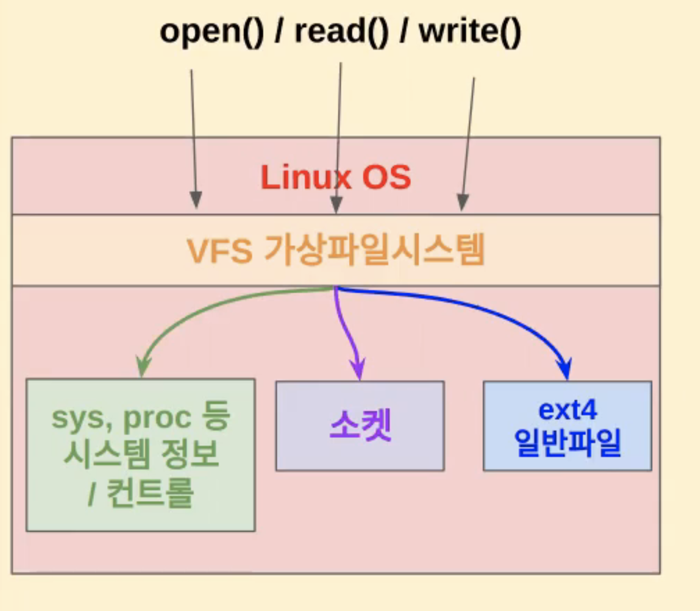
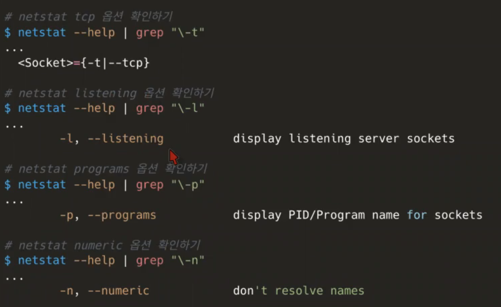
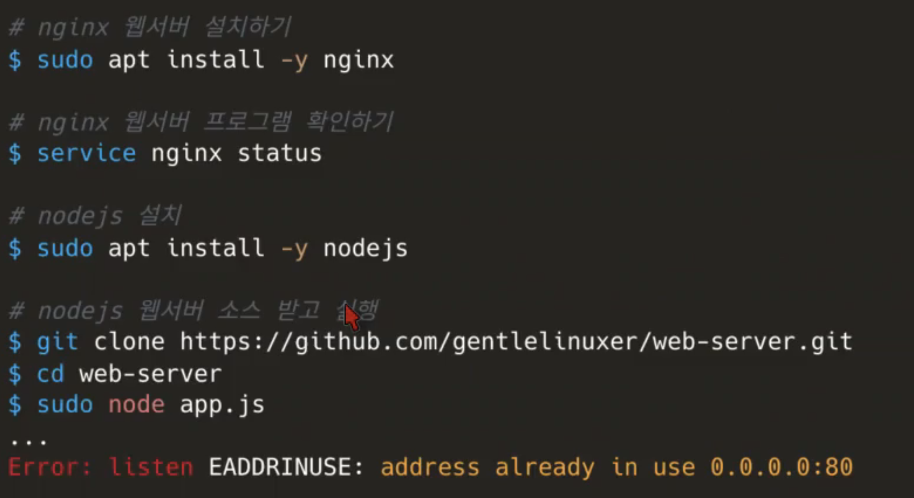
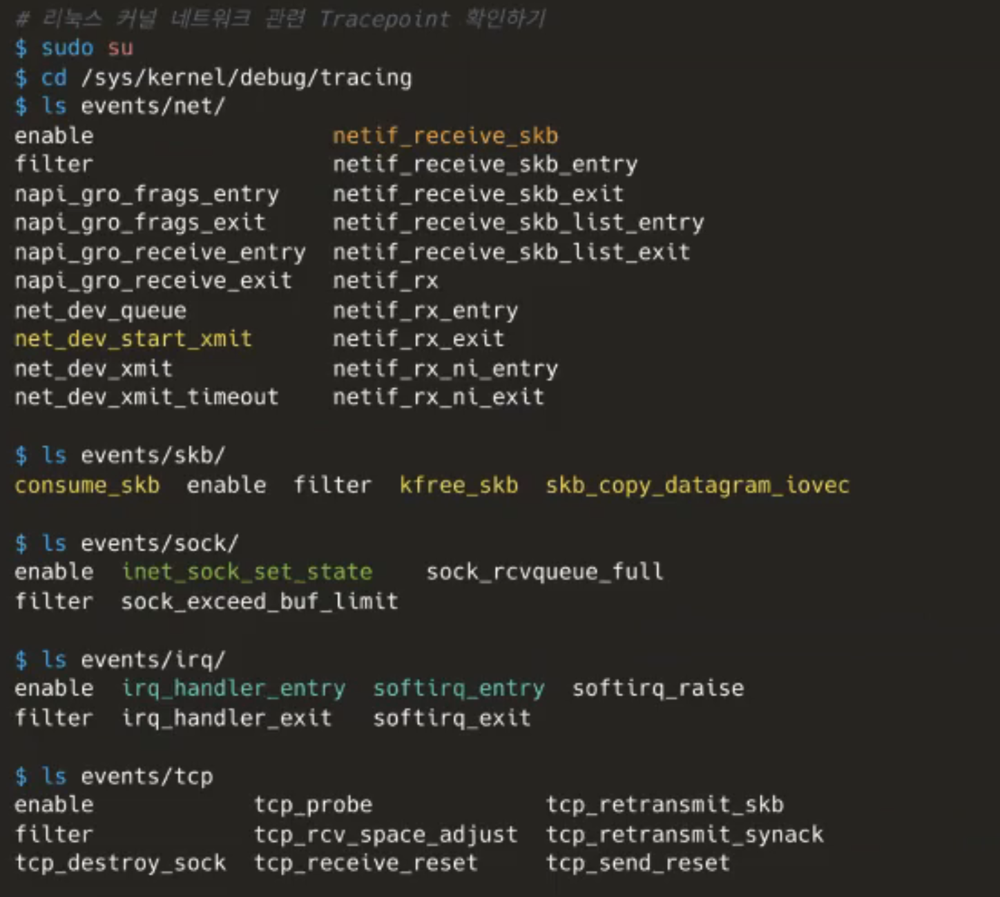

## 리눅스 VFS

- systemcall 중 가장 많이 쓰이는 것은 open, read, write이다. 리눅스에서는 모든 자원을 VFS를 통해 파일처럼 쓰고 읽을 수 있게 되어 있기 떄문이다.
  <br>
  <br>
  

- file들이 반드시 ssd,hdd에 저장된게 아니라 메모리에 연결된 것들도 있고, 네트웍도 파일이다.

  ```bash
  # 일반 파일(ext4) 예시
  file hello.txt
  stat hello.txt
  # 디스크를 다루는 가상 파일 예시
  file /dev/sda
  stat /dev/sda
  # 시스템을 다루는 가상 파일 예시
  file /proc/1/comm
  stat /proc/1/comm

  file /run/snap.socket
  stat /run/snap.socket
  ```

* df -h 했을 때 Filesystem이 tmpfs로 나오는 건 메모리에 연결된 것이며, /run 디렉토리가 이에 해당함을 확인할 수 있다.
* /proc 하위에 있는 파일들도 procfs라는 Filesystem을 사용하며 이는 커널이 메모리에 동적으로 데이터를 저장한다.

---

## 리눅스 네트워크 도구

### hping3 명령어

- hping3의 옵션을 사용하여 다양한 테스트 가능
  - fast
  - faster
  - flood : 보낼 수 있는 만큼 응답기다리지 않고 많이 보내기 (ddos공격 시 활용 가능)

```bash
#hping3 설치
sudo apt install hping3

#TCP/IP 통신 SYN 패킷 보내기 위한 옵션 확인
hping3 --help | grep syn

#TCP/IP 통신 SYN 패킷 보내기 위한 옵션 확인
hping3 --help | grep syn

#daum, naver는 ICMP 응답을 안해주기 때문에 SYN 패킷 전송함으로써 응답 테스트
hping3 -S www.daum.net -p 80

# 더 빠르게 테스트 (1초 안에 10개 패킷 전송)
hping3 -S www.daum.net -p 800 --fast
```

### iptables 명령어

- blacklist 관리 가능

```bash
# 내 localhost IP 주소 기반으로 UDP 차단 규칙 추가하기
iptables -I OUTPUT -s localhost -d localhost -p udp --sport 7000 -dport 8000 -j DROP

# iptables 설정 확인하기
iptables -L -n

# 다른 터미널에서 확인하기
hping3 --udp 127.0.0.1 -s 7000 -p 8000 --fast

# 위 iptables 설정 삭제하기
iptables -D OUTPUT -s localhost -d localhost -p udp --sport 7000 --dport 8000 -j DROP

# 다른 터미널에서 재확인
iptables -L -n
hping3 --udp 127.0.0.1 -s 7000 -p 800 --fast
```

- 3번째 단계에서 hping3 패킷을 보낼 떄 규칙이 설정되어 있으면 hping3 자체가 권한 없음으로 에러가 발생함을 확인할 수 있다. 규칙을 제거하면 hping3가 다시 잘 통신된다.

### nslookup, dig 명령어

- domain Name을 ip주소로 변환

```bash
# dig 명령을 통해 공인ip 알아내기
dig TXT +short o-o.myaddr.l.google.com @ns1.google.com
# 또 다른 공인ip 알아내는 방법
curl ifconfig.me
```

### nmap 명령어

- 네트웍 스캐닝 도구 : 현재 LAN에서 사용하고 있는 ip, 열려있는 포트도 확인 가능
- 주로 특정 서버에 어떤 포트가 열려있는지 확인하기 위해 사용한다.
- 하기는 상대방 서버를 스캐닝하는 방법

```bash
# nmap.org 웹서버 TCP connection 스캐징
nmap -sT nmap.org

# 자세한 정보를 포함해서 확인하기
nmap -sT -v nmap.org

# daum.net.org 웹서버 TCP connection 스캐닝
nmap -sT -v daum.net
```

### iftop 명령어

- 네트워크 I/O 트래픽 모니터링

```bash
# root 권한이 있어야 실행 가능
sudo iftop
```

### bmon 명령어

- 네트워크 I/O 트래픽 모니터링
- 좀 더 GUI처럼 볼 수 있음

```bash
# 네트워크 모니터링
bmon
# Hping으로 테스트후 bmon 모니터링 해보기
hping3 localhost --fast
```

### dstat 명령어

- 네트워크 I/O 트래픽 모니터링

```bash
# 네트워크 모니터링 테스트
dstat
# 테스트
hping3 localhost --fast
```

### traceroute 명령어

- 네트워크 통신 중에 거친 라우터 경로 확인

```bash
# traceroute
traceroute google.com
# 도메인 네임 생략하고 ip주소로만 확인하기
traceroute -n google.com
```

### ss 명령어

- 네트워크 소켓 상태 확인하는 명령어

```bash
# ss 명령어 실행
ss | less

# TCP 소켓 기준 확인
ss --help | grep tcp
ss -t

# LISTEN 중인 소켓 포함 확인
ss -ta

# 도메인 이름 대신 ip주소로 확인
ss -nta

# LISTEN 중인 것만 추려서 보기
ss -ntl

# 프로세스 정보 함꼐 확인
sudo ss -ntlp
```

### netstat 명령어

- 네트워크 상태 확인하기 위한 툴

```bash
whatis netstat

# 현재 TCP 네트웍 연결 상태 확인하기
sudo netstat -t

# 현재 TCP 네트웍 listening 중인 소켓 확인
sudo netstat -tl

# 현재 TCP 네트웍 listening 중인 소켓의 프로세스 명칭 확인
sudo netstat -tlp

# 현재 TCP 네트웍 listenting 중인 소켓의 프로세스 ip 확인
sudo netstat -tlpn
```

- netstat의 옵션 확인
  <br>
  <br>
  

- netstat 명령을 통해 80 포트를 물고 있는 프로세스를 찾기
  <br>
  <br>
  

### 리눅스 커널 tracepoint 명령어

리눅스 커널에서는 네트웍 패킷 처리 시점마다 아래와 같은 디렉토리에 event를 남김으로써 tracing을 할 수 있게 해준다. 그 중에 실제 들여다볼 만한 부분만 색칠처리되어 있음.
<br>



### /sys/kernel/debug/tracing 디렉토리 하위의..

- events/net 디렉토리
  - net_dev_start_xmit : 패킷이 외부로 나갈 때 event
  - netif_receive_skb : 패킷이 내부로 들어올 때 event
- events/skb 디렉토리

  - 제대로 패킷을 다 썼을 때는 consume event로 해지가 되고 문제/오류가 생겼을 땐 kfree event
  - skb_copy_datagram_ioevc 는 패킷을 가져갈 때 (userspace가 wake up되서 커널로부터 패킷을 가져갈 때) 발생하는 이벤트

- events/sock 디렉토리

  - inet_sock_set_state
    : socket 상태에 대한 이벤트

    ```bash
    echo 1 > events/sock/inet_sock_set_state/enable
    cat trace_pipe

    # 위와 같이 해놓고 다른 터미널에서 ssh 접속을 연결하거나 끊어보면 커넥션 연결/해지에 대한 socket상태 확인 가능
    ssh <테스트 대상 ip>
    ```

- events/irq 디렉토리
  - irq_handler_entry : top half 처리 event
  - softirq_entry : bottom half 처리 event

* tracepoint event들을 활용하여 추적하는 공통 방법

  ```bash
  # 반드시 root로 진행 필요
  # 리눅스 커널 네트웍 관련 tracepoint 확인하기
  cd /sys/kernel/debug/tracing

  # Tracepoint 확인 방법
  echo 1 > events/"Tracepoint 명칭"/enable

  # 이벤트 발생기준 Backtrace 함수호출과정 추적
  echo 1 > options/stacktrace

  # Tracepoint 결과 확인하기
  cat trace

  # 연달아서 이어서 확인하기
  cat trace_pipe

  # Tracepoint 종료 방법
  echo 0 > events/enable
  echo 0 > options/staccktrace
  echo > trace
  ```
