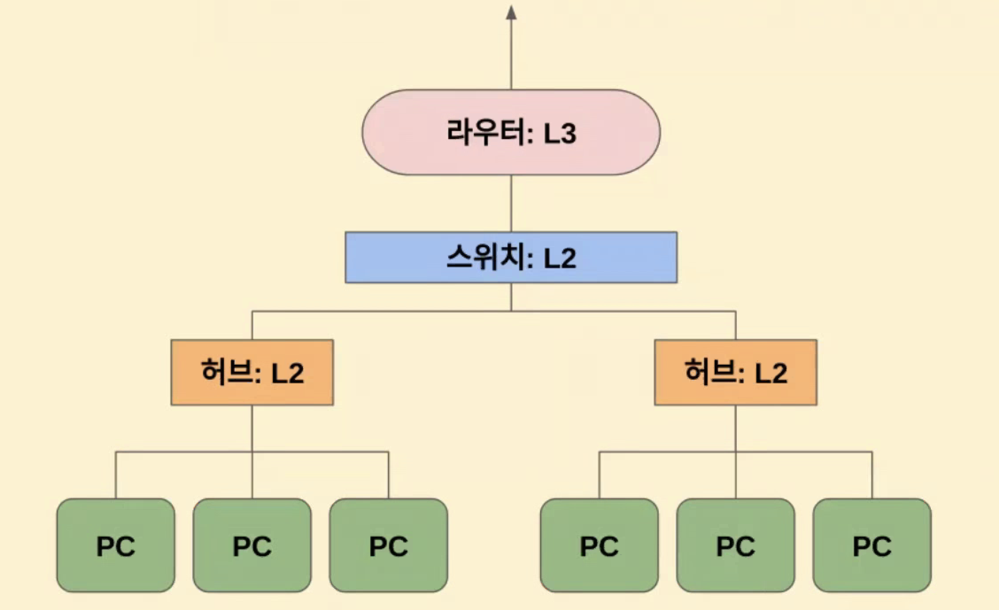
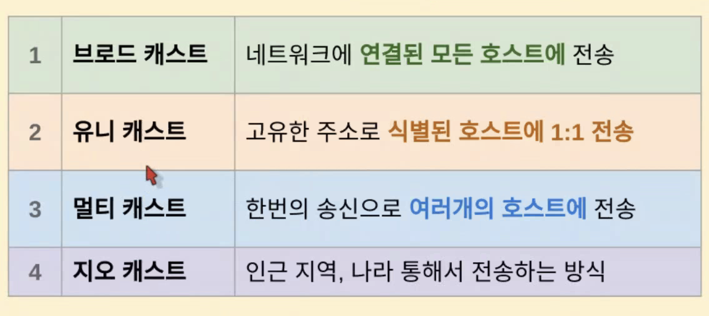
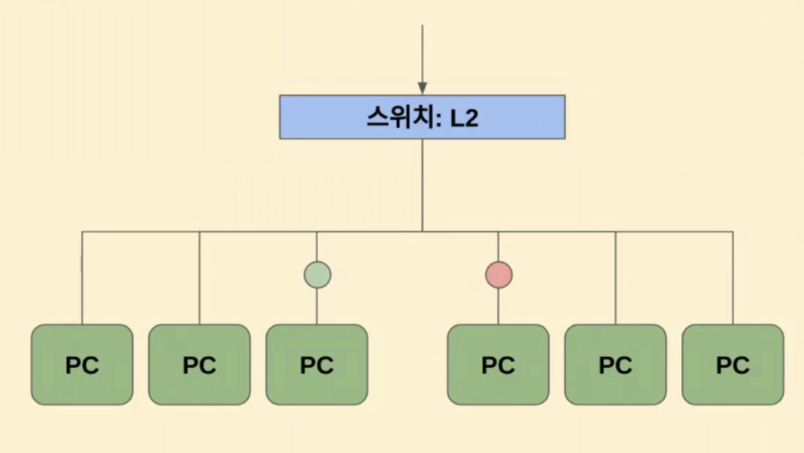
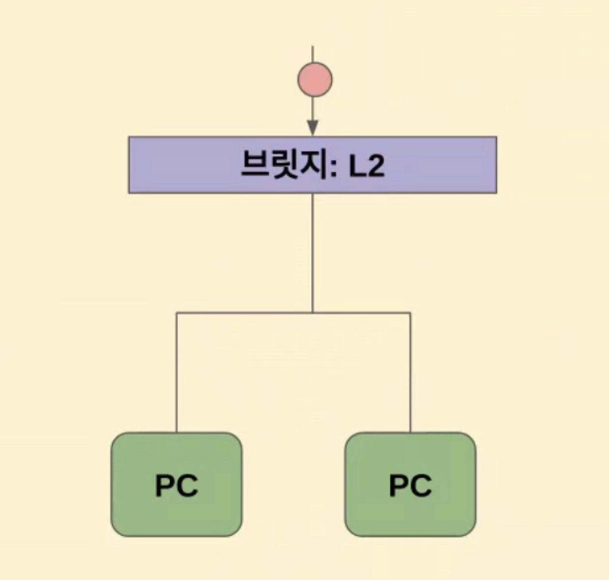
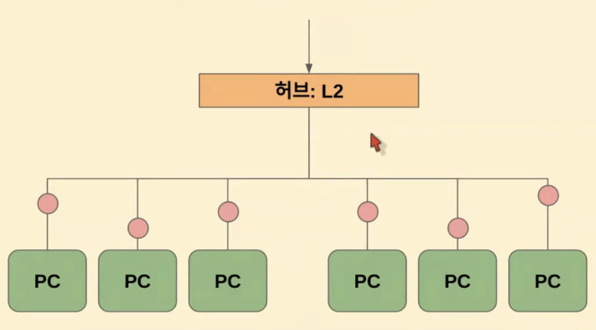
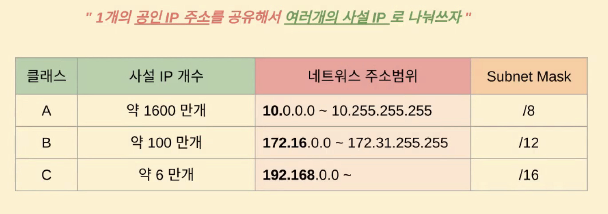
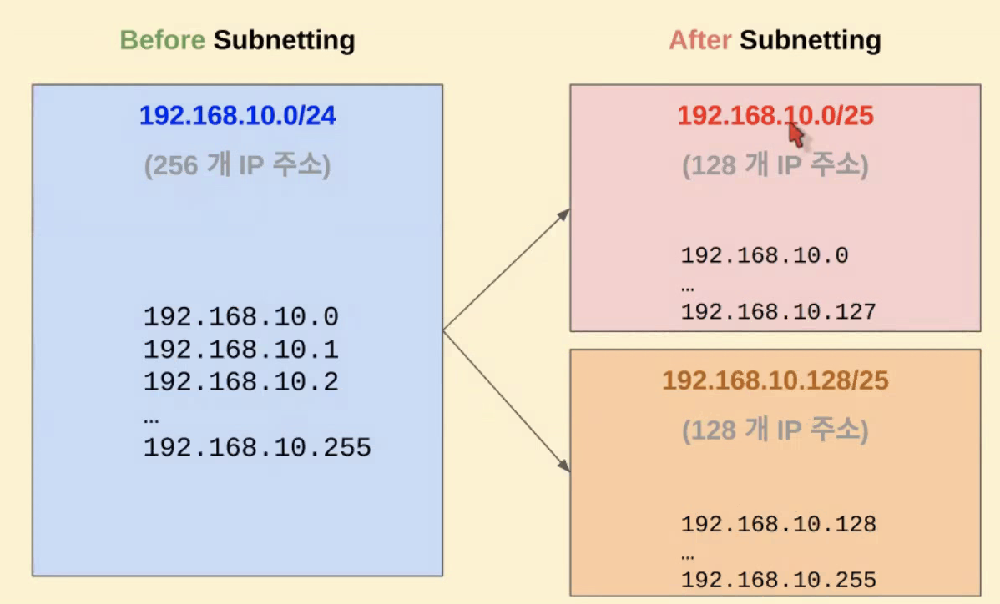
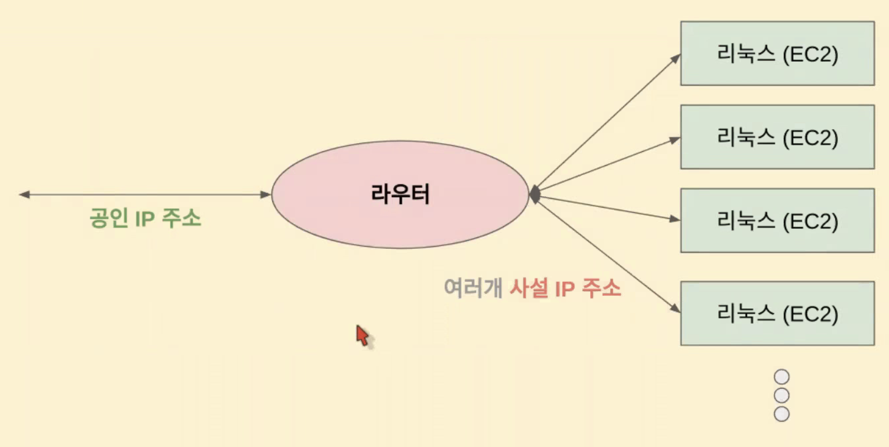
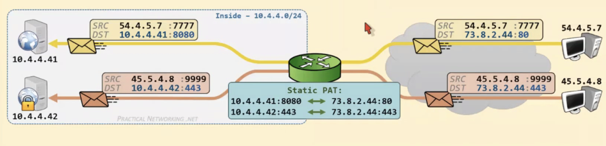
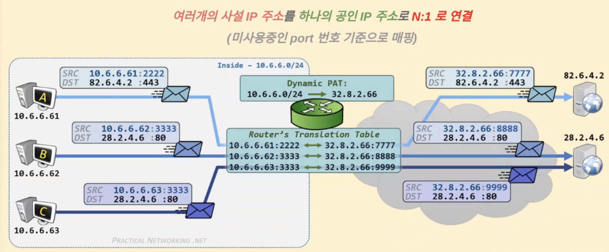

## 네트워크 장비와 구조

- 라우터 L3: IP주소 기반으로 다른 네트워크와의 연결 장비
  
- 스위치 L2: 여러 컴퓨터 통신연결장비 (오류검사, 빠른 속도, 멀티포트 브릿지 )
  
- 브릿지 L2: 컴퓨터와 컴퓨터간의 통신연결 장비로 허브보다 스마트하다. 브로드캐스트가 아니라 목적지 pc에 전달해준다.
  
- 허브 L2: 단순 브로드 캐스트를 하는 통신연결 장비 ('깡통허브')이며 실제로는 헙 잘 안쓰고 스위치를 많이 쓴다.
  

## IPv4 주소

- 32bit로 2^32승(약 42억개)의 ip 수용 가능
- 본래는 ip주소는 모든 host에 하나씩 할당 해주는 것이 목적이었으나 ip주소가 부족해짐. 그런데 어떻게 할당해주는가?
  - 클래스 단위로 할당한다.
  - A클래스는 8bit, B클래스는 16bit, C클래스는 24bit을 네트웍 주소로 사용하고, 나머지 bit을 host주소에 할당해준다. 그러나 클래스 방식으로 ip를 할당하는 방식은 A~C클래스 사이에서 애매한 부분이 있어 비효율이 발생하므로 이제는 CIDR 방식으로 할당한다.
    

### Private network

- ip주소가 부족함에 따라 private network로 ip를 할당하며 규약에 따라 아래와 같은 3가지 대역을 사용한다.
  

### Subnet

- subnet의 실제 가용 주소 범위는 32-{subnet mask bit}이다.
  

### NAT ( Network Address Translation )

#### 정적 NAT

- 사설 ip와 공인 ip를 1:1로 매핑
  - 공인ip 변경에 유연하게 대처하기 위한 목적 또는 원래는 사설망이었는데 퍼블릭하게 노출시키는 목적으로 사용됨
- 정적 PAT
  - 사설 ip:port와 공인 ip:port를 1대1로 매핑하여 사용하는 방식이기 때문에 동일 공인ip에 대해서 포트를 variation하여 여러 사설 ip:port로 매핑할 수 있음
    
- 동적 PAT
  - 가장 범용적으로 많이 쓰이는 구조임
    
- 동적 NAT
  - 공인 ip주소가 1개가 아니라 여러개를 지니고 사설ip와 매핑하는 구조

### CIDR ( Classless inter-domain routing )

- 연속된 주소범위 C클래스를 여러개로 묶어서 (supernetting ) VLSM(가변 길이 서브넷 마스크)를 방법을 활용하여 'host ip/subnetmask'로 표현하여 ip할당한다.
