- 전체적인 쿠버네티스 네트웍 구조는 Service를 통해 pod를 노출시키되, service는 L4영역까지만 담당하고, 
L7의 역할을 하는 ingress를 Loadbalancer type service와 연결시켜서 사용하게 되는 구조이다. 

- 멀티 노드 클러스터를 외부에 노출하기 위해서 Loadbalancer를 꼭 써야 하는 것은 아니다. 물론 그렇게 할 수도 있지만, 
특정 워커 노드들에 ingressgateway를 고정으로 박아두고, nodePort로 오픈한 다음, 앞 단에 로드 밸런서를 두고 해당 node의 ip : port로 로드밸런싱되도록 설정할 수도 있다. 

- rolling update 배포
  - 모니터링 : watch -n 0.1 옵션 사용으로 실시간 확인 가능
  ```bash
  watch -n 0.1 kubectl get po,rs,deploy -o wide
  ```
  - 롤백
  ```
  kubectl rollout undo <deploy name>
  # 특정 버전으로 롤백
  kubectl rollout undo <deploy name> --to-revision 2
  ```

### k8s 네트웍 용어
- NAT : 내부망을 위한 ip 주소로 변환
- SNAT : 패킷이 내부에서 외부로 나갈 때 Source ip주소를 고정(public) ip로 변환
- DNAT : 패킷이 외부에서 내부로 들어올 때 Destination ip 주소를 내부 ip주소로 변환 ( ex. 로드밸런서 )
- ip_forwarding (net.ipv4.ip_forward) : 해당 값은 현재 리눅스서버가 라우팅역할을 할 수 있게 할 것인지에 대한 enable 여부를 정하는 것. 
- rr(round robin) : 로드밸런서의 동작모드 중 하나 

### kube-proxy
- kube-proxy는 k8s 내부 네트웍을 처리하기 위해 사용되며 커널 내의 NetFilter를 활용한다.
- userspace, iptables, IPVS모드가 있다.


### 도커 네트웍의 구조
- 컨테이너마다 Network namespace를 생성한다.
- Bridge network interface를 생성한다.
- 가상 cable인 veth pair를 만들어서 컨테이너의 network interface와 bridge인 docker0를 연결한다.
- 해당 veth에 ip주소를 할당한다. ( 곧 컨테이너의 ip가 된다)
- prerouting chain에 rule을 추가함으로써 iptable에 포트 포워딩을 위한 NAT table entry 생성한다.

-> 그리고 이 모든 과정은 'bridge'라는 binary를 통해서 일괄 설정된다.

### CNI ( container network interface )
- 도커에서는 Bridge라는 binary를 통해 이를 설정하지만, 다른 컨테이너 런타임에서는 다른 binary를 사용할 것이다. CNI는 런타임의 종류와 상관없이 네트웍 환경을 구성하기 위한 표준이며, bridge와 같은 프로그램은 CNI plugin 의 종류이다.  
- 컨테이너 생성 시 바로 네트웍에 연결하는 위와 같은 작업을 해줘야 하기에 컨테이너 생성을 책임지는 kubelet관련 설정에 어떤 CNI plugin을 사용할 지 정의된다. 
- CNI는 IPAM 역할을 하며 pod와 service가 어떤 ip대역을 사용할 지 정책을 설정할 수 있다. 
#### Weavenet
- weave peer라는 agent가 dameonset으로 모든 노드에 생성되며 이는 pod간 통신의 중계자 역할을 한다.
- weve peer는 kube-apiserver에 주기적으로 pod 및 node 상태를 request함으로써 어떤 pod가 어떤 node에 존재하는 지에 대한 정보를 얻어와 보관함으로써 
- Weavenet과 같은 CNI은 클러스터에 overlay network 을 구성하게 되며, weave peer는 overlay network bridge를 각 노드에서 생성한다.


=======
title: 'Docker 네트워크 구조'
date: '2024-02-27 11:00:00'
author: jjunyong
tags: network
categories: Linux 클라우드
---

- super user 권한 없이 docker 사용하기

```bash
sudo usermod -aG docker {계정명}
```

- docker에서 컨테이너 생성하고 내부로 들어가기

```bash
docker run --rm -it ubuntu:16.04 /bin/bash

# 컨테이너 내부에서 리눅스 버전 확인
cat /etc/issue
```

### 컨테이너란?

- 컨테이너는 독립된 리눅스 환경이다.
- 컨테이너는 단일 프로세스이다.
  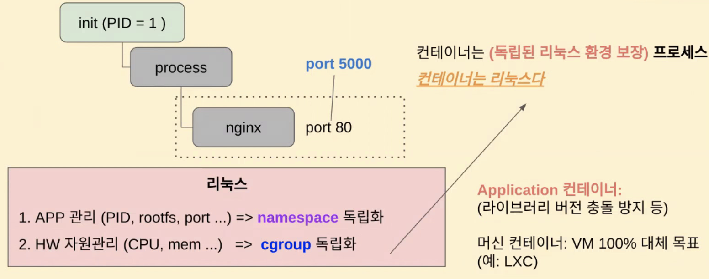

### Docker 구조

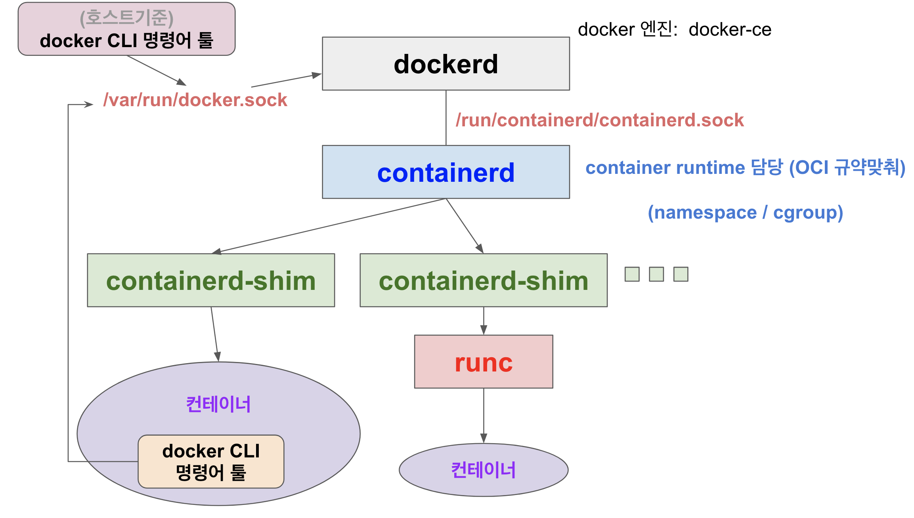

- 부모 프로세스가 1번인 daemon 프로세스의 형태로 dockerd는 구동된다.
- docker CLI 명령은 dockerd에 전달된다. 전달하는 방식은 /var/run/docker.sock
- containerd가 container runtime이며 /run/containerd/containerd.sock 을 통해서 dockerd와 통신한다.
- docker 컨테이너 내부에서 CLI명령을 사용하고자 하면 전체 컨테이너에 대한 정보를 dockerd를 통해서 알아내야 하기 때문에 호스트의 /var/run/docker.sock를 도커 컨테이너 내에서 참조할 수 있도록 마운트되어야 한다.
- dockerd, docker CLI 프로세스는 아래와 같이 tmpfs 파일 시스템 즉, 메모리에 올라간 docker.sock과 통신함으로써 빠른 I/O 속도를 가져간다.
  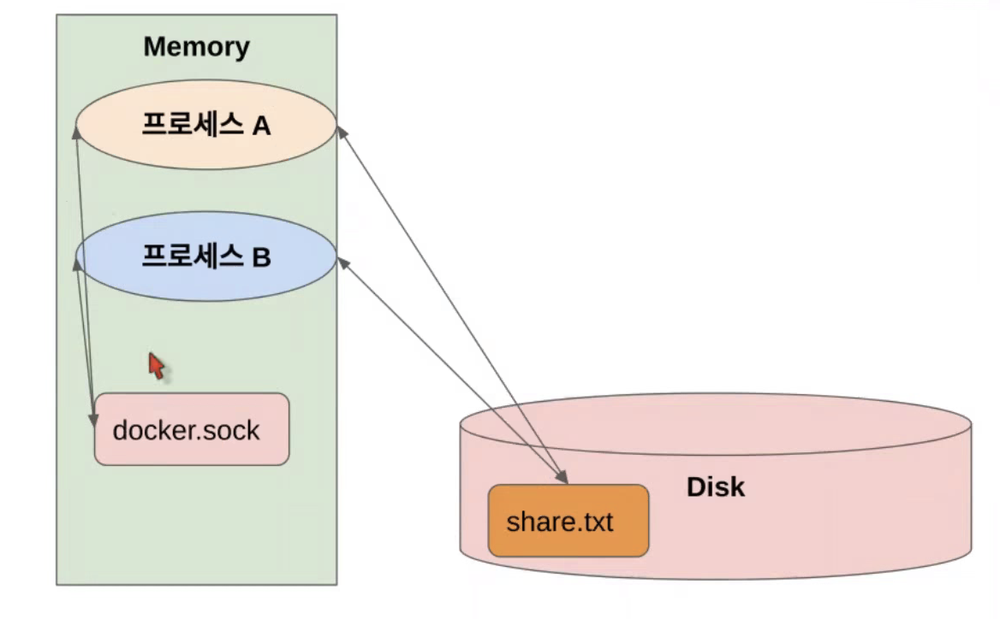

### Docker in Docker

- docker CLI, dockerd, containerd, containerd-shim 기동 중인지에 대한 확인
- 컨테이너 내부에서 docker사용 실습 ( docker in docker )
  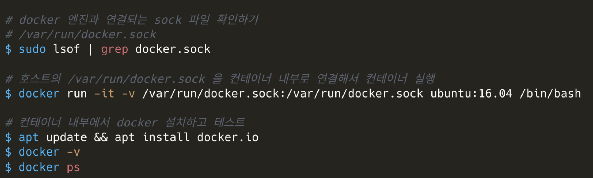

---

## 도커 네트워크 구조

- docker0라는 브릿지/스위치 장비를 sw적으로 구현하고 있다고 보면 됨.
- 컨테이너는 네트웍에서 개별 컴퓨터로 보면 되는데, network interface가 host에 1개기 때문에 가상의 veth를 통해서 컨테이너들에 각각의 network interface를 부여하게 됨
  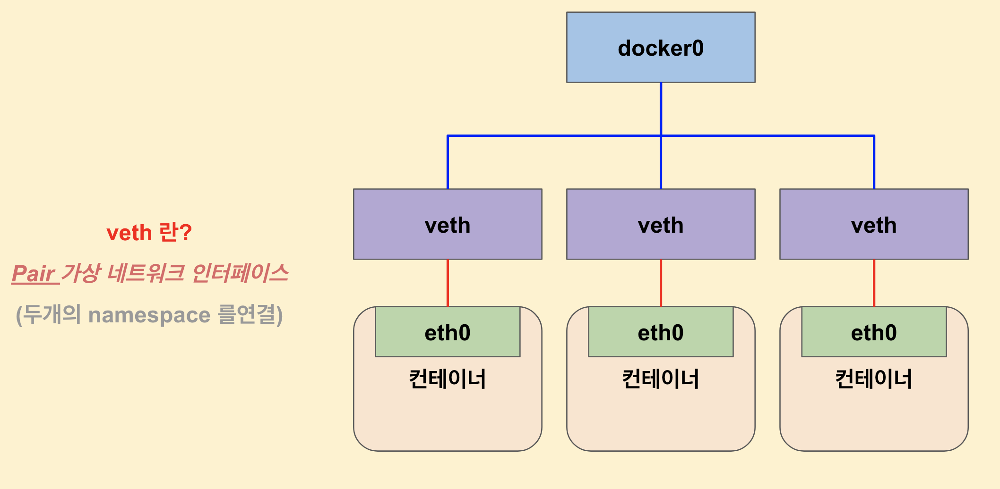
- 도커 네트워크 확인하기

```bash
docker network ls
```

- 다양한 컨테이너와 docker0 브릿지 연결확인하기
  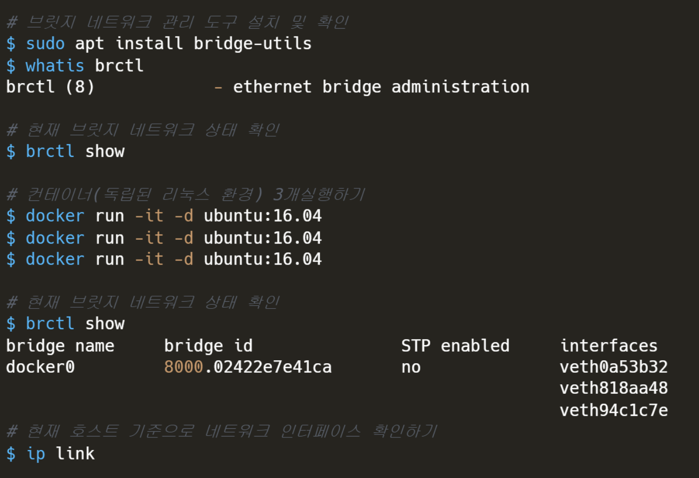

- 컨테이너의 gateway인 docker0 ip주소 확인하기
  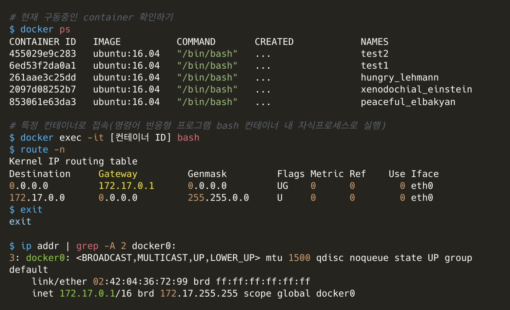

- 컨테이너 내의 네트워크 인터페이스 eth0 확인하기
  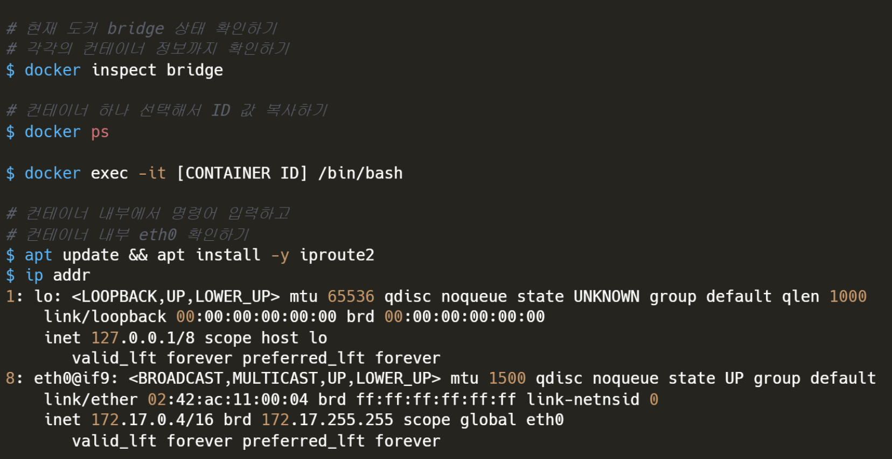

- 여러 컨테이너의 네트워크 ip주소 확인하기
  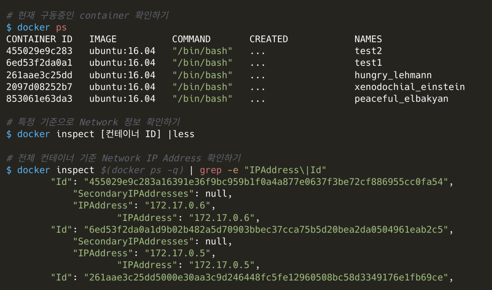

- 컨테이너 간의 네트웍 통신 테스트
  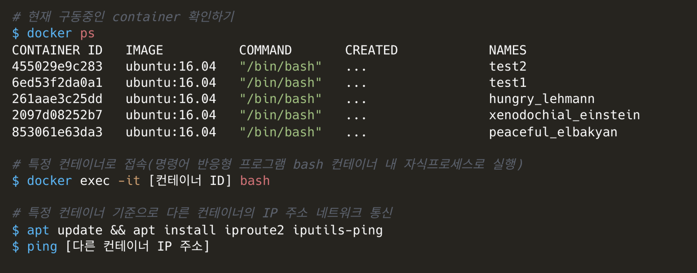

- 독립된 네트워크 생성 후 2개의 컨테이너 통신
  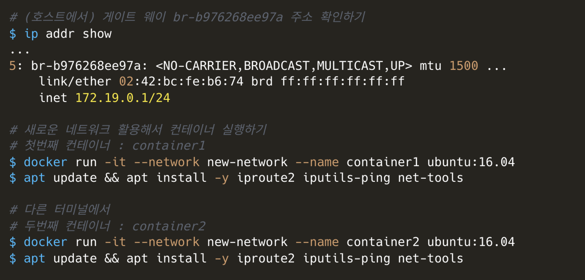
  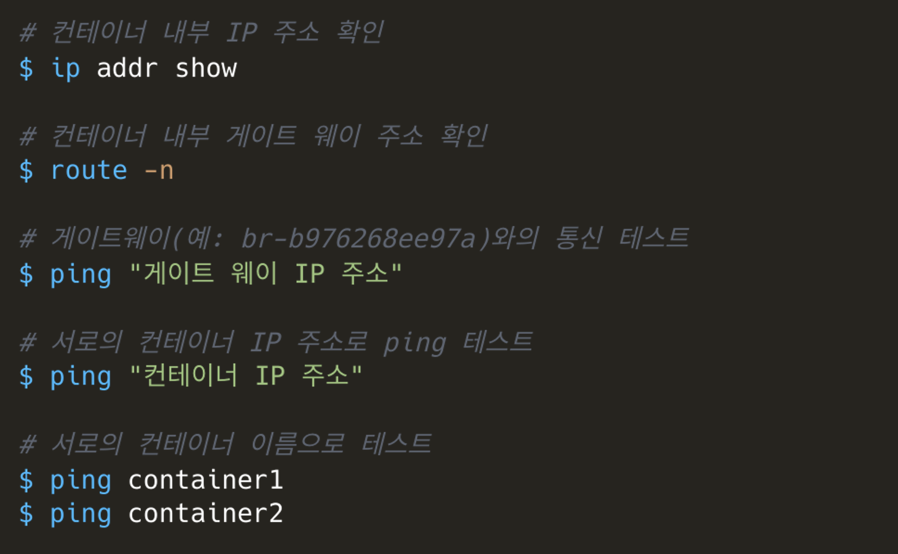

- 독립된 네트워크 생성 후 2개의 컨테이너 통신 문제해결
  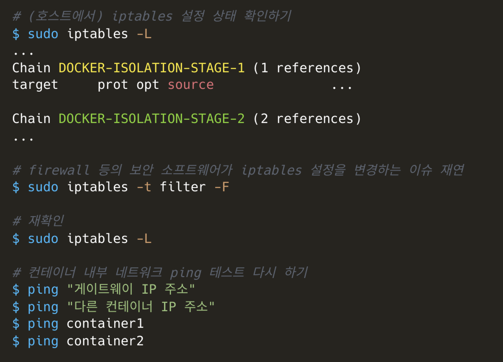
  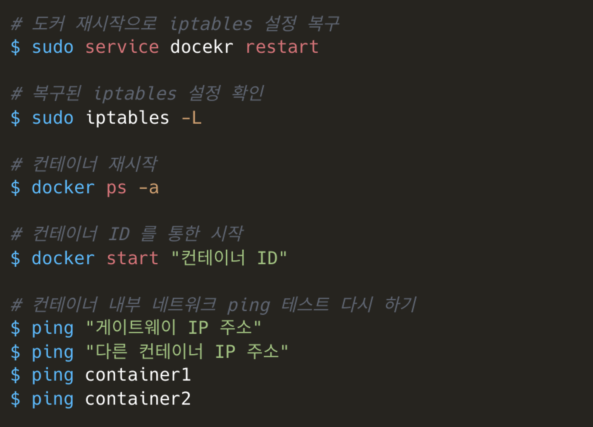

- 새로운 독립된 네트워크 vs 기본 네트워크 비교
  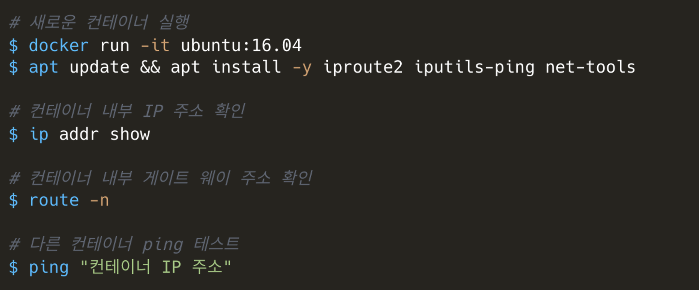
  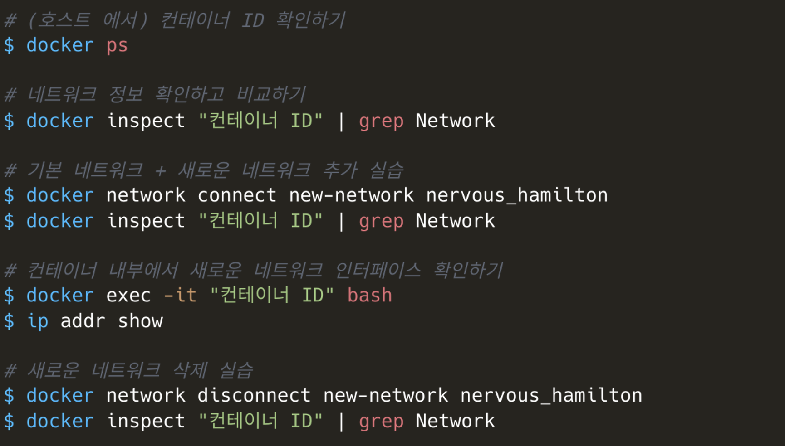
>>>>>>> b0d776309854376c9f22aaa6572d7ec1fedd3ada
