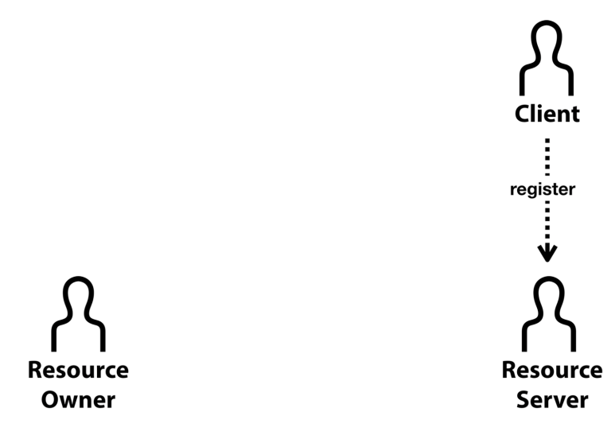
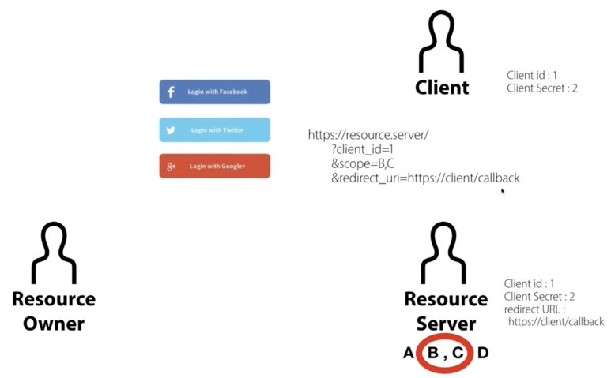
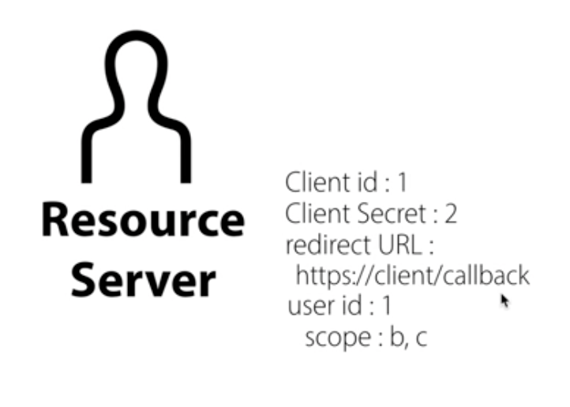
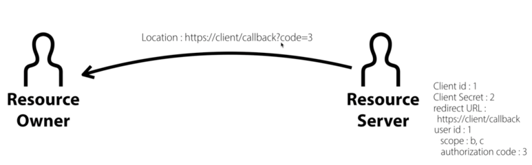
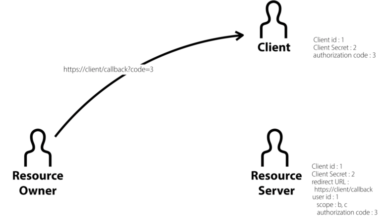
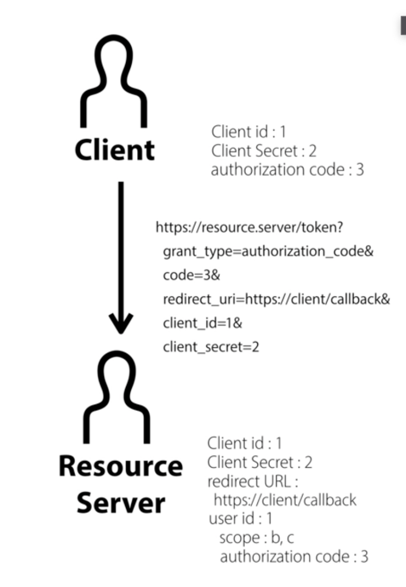
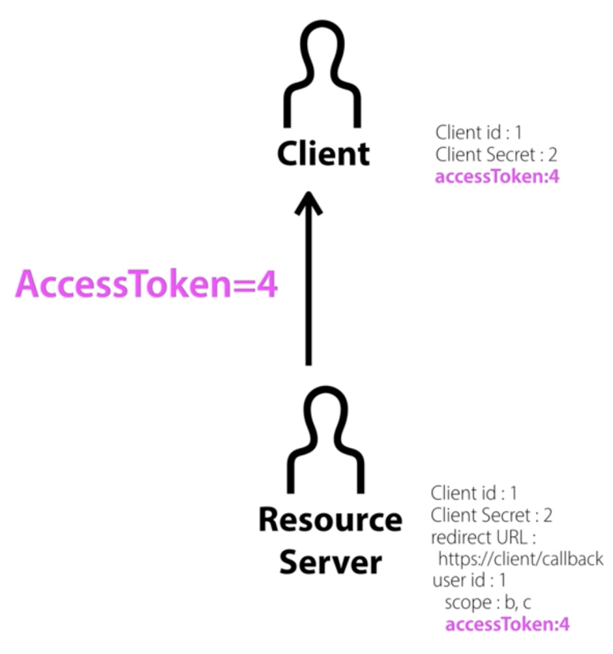
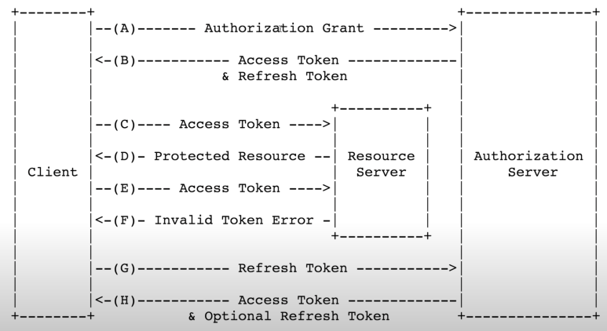

OAuth는 어떤 시스템에서 그 시스템의 사용자들이 Google, Facebook, KaKao talk과 같은 서비스에 직접 연결하지 않고도 시스템을 통해 각 서비스(Google,Facebook등) 의 기능을 이용하고 싶은 욕구로 인해 등장한 개념이다.
 

이 때 시스템이 사용자들의 서비스 계정정보를 모두 가지고 있다면 해당 문제가 쉽게 해결 되겠지만, 그것은 보안 상 매우 취약한 방법이다. 왜냐하면,

1. 사용자 입장에서는 처음 보는 시스템에 자신의 카카오 계정정보를 맡겨야 되는 것이고,

2. 시스템 입장에서도 사용자들의 카카오 계정정보를 가지고 있는 것 자체가 부담이다.

3. 서비스 입장에서도 자신들의 사용자 정보를 신뢰할 수 없는 '시스템'에게 맡기는 것은 말도 안된다.

 

> **그래서 우리에겐 OAuth가 필요하다.​**

 

OAuth에는 앞서 말한 것처럼 사용자, 시스템, 서비스 3가지의 주체가 있고,

OAuth에서는 이를 각각 Resource owner(사용자), Client(시스템), Resource server(서비스) 라고 부른다.

클라이언트가 사용자가 아닌 '시스템' 임에 유의하자.

### 1. OAuth 등록

가장 먼저 클라이언트가 먼저 리소스서버를 이용하기 위해서는 사전에 승인을 얻어두어야 한다.

이 세 가지를 리소스서버는 공통적으로 받는다.

1. client id : app 식별자

2. client secret : 비밀번호

3. authorized redirect url

: 리소스서버가 권한 부여해주는 과정에서 authorized code를 전달해주는데 그걸 전달받고 싶은 경로를 적어주면 된다. ex) https://onyou.com/callback

 

### 2. 리소스 오너의 승인

가령 리소스 오너(사용자) 가 앱에서 '카카오로 로그인하기' 버튼을 눌렀을 때,

1. https://kakao-server/?client_id=xxxxyyyy&scope=qqqq&redirect_uri=https://onyou.com/callback

이런 식으로 리소스 오너가 리소스 서버에게 client id, scope, redirect_url가 포함된 url로 호출하게 된다.

여기서 scope이란 리소스 서버의 어떤 기능을 쓸 것인지(ex. sns 글쓰기, 구글 캘린더 등) 에 대한 내용이라고 이해하면 된다.

​

2. 리소스 서버(카카오 서버)는 해당 리소스 오너가 로그인이 된 상태인지 아닌지를 확인 하고, 로그인 하지 않은 상태이면 로그인 화면을 띄워준다.

​

3. 카카오 로그인이 성공하면, 그제서야 리소스 서버는 url에서 요청한 client_id값이 존재하는 지를 확인하고,

해당 client_id값에 대응하는 redirect url이 정확히 요청되었는지를 확인한다. 다르면 여기서 작업이 끝나고,

같다면 어떤 scope을 어떤 클라이언트가 요청하고 있으니 허용할 것인지를 사용자에게 묻는다.

4. 허용하고 나면 리소스 서버는 아래와 같이 어떤 클라이언트에서 어떤 리소스 오너가 어떤 scope을 허용했는 지에 대한 정보를 아래와 같이 저장하고 있게 된다.

 

### 3. 리소스 서버의 승인

1. 정보의 저장과 동시에 리소스 서버는 리소스 오너가 승인하게 되면 redirect url로 auth code 값을 전달하게 된다.

2. 그러면 redirect url을 통해 클라이언트를 호출하게 되고 클라이언트는 auth code 값을 가지게 된다.

3. 클라이언트는 받아온 auth code 값, client secret, redirect url, client_id 등의 정보를 리소스 서버에게 보내게 되고,

### 4. accessToken 발급

리소스 서버는 모든 정보가 일치하는 지 확인 후 드디어! accessToken을 발급한다.

이 accessToken을 이용해 리소스 서버는 어떤 클라이언트의 어떤 유저가 어떤 scope을 사용할 것인지에 대한 것을 알 수 있다.

### 5. RefreshToken

accessToken은 수명이 있기 때문에 수명이 다 했을 때 API를 호출해도 API가 데이터를 주지 않는다.

그러면 accessToken을 다시 발급 받을 때 위의 모든 과정을 다시 거칠 수는 없으므로 OAuth에서는 refreshToken이란 것을 활용한다.

OAuth 표준에서 제공하는 프로세스는 아래와 같은데, 기본적으로 초기 accessToken을 발급할 때 RefreshToken을 함께 발급하고, 중간에 accessToken이 invalid되게 되면 클라이언트에서 refreshToken을 리소스서버에게 보내서(정확히는 Auth서버) accessToken을 재 발급하는 형식이다.

즉, accessToken은 계속 갱신되지만 refreshToken은 초기에 받은 것을 계속 refresh필요할 때마다 쓰는 경우가 있고 때로는 새로운 accessToken 받을 때 refreshToken도 새로 발급해주는 서비스도 있다.

---

OAuth는 이해는 되는데 3자간에 왔다갔다 하는게 많아서 헷갈리니깐 여러 번 읽고 여러 번 머리에서 그려봐야 될 것 같다.

그래도 정리하니깐 속이 시원하다.

참고자료

- https://www.youtube.com/watch?v=hm2r6LtUbk8&list=PLuHgQVnccGMA4guyznDlykFJh28_R08Q-&index=1 (갓고잉님의 OAuth강의)
