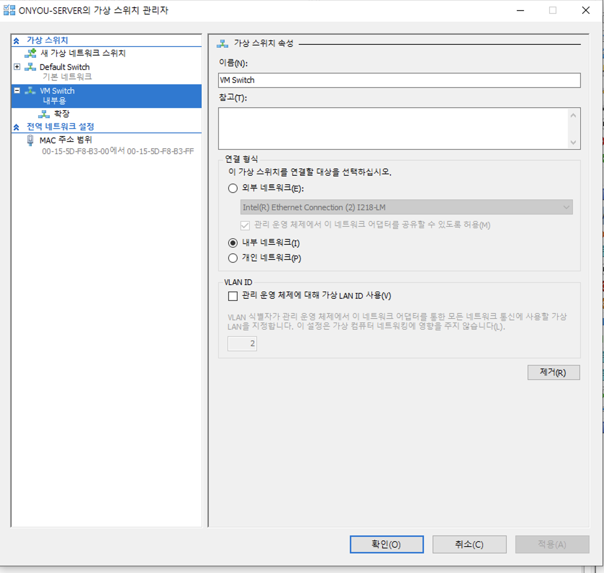
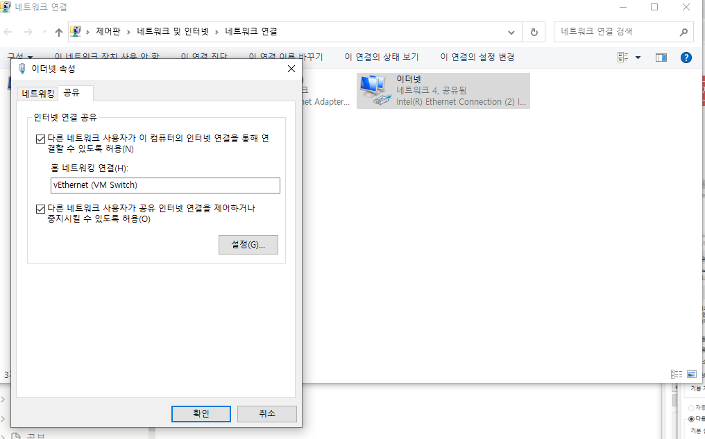

# 1. 서버/VM 구축

## 1. 서버 셋팅

### 1) 공유기 설정

- 공유기 어드민 콘솔에 접근하여 DDNS 설정, 포트포워딩, 고정IP 할당을 해준다. 공유기 콘솔에 접근 하는 방법은 공유기 제조사 마다 다른데, 나의 경우는 tplink라서 192.168.0.1로 접근 가능
- 고정 IP 설정
    - 공유기 콘솔에 들어가면 연결된 서버에 고정 ip를 할당
- 포트포워딩 설정
    - 할당된 고정 ip에 포트포워딩을 설정한다. 예를 들어 공유기로 8080 포트로 들어왔을 때 서버의 9090포트로 포워딩 되도록 설정하는 것이다.
- 동적 DNS 설정 ( DDNS )
    - 실제 공유기의 공인 ip는 변동되기 때문에 동적 DNS 설정을 통해 ‘aaa.tplinkdns.com’ 이런 도메인으로 외부에서 서버로 접속 할 수 있도록 해주어야 한다.
- 여기까지 하면 aaa.tplinikdns.com:8080으로 접속했을 때, 내 서버가 설치된 공유기의 8080포트로 접속이 되게 되고, 고정ip와 포트포워딩 설정을 통해 LAN내에 존재하는 내 서버의 9090포트로 접속되게 되는 것이다.

## 2. Hyper-V로 VM 설치

[https://keyhyuk-kim.medium.com/hyper-v-환경에서-쿠버네티스-master-worker-클러스터-구축하기-b7aead20132f](https://keyhyuk-kim.medium.com/hyper-v-%ED%99%98%EA%B2%BD%EC%97%90%EC%84%9C-%EC%BF%A0%EB%B2%84%EB%84%A4%ED%8B%B0%EC%8A%A4-master-worker-%ED%81%B4%EB%9F%AC%EC%8A%A4%ED%84%B0-%EA%B5%AC%EC%B6%95%ED%95%98%EA%B8%B0-b7aead20132f)

### 가상 스위치 설정하기

default switch는 호스트 서버가 재부팅될 때 마다 ip가 변경되므로, Hyper-V에서 새로운 가상 스위치를 생성하여 VM들이 해당 스위치를 선택하도록 해주어야 한다. 또한 호스트 서버의 네트웍 설정에서 가상 스위치의 ip와 subnet mask를 설정해주어야 한다.

- Hyper-V 가상 스위치 설정
    - 내부 네트워크로 선택
    
    
    
- 이더넷 속성 - 공유 에서 아래와 같이 설정하여 LAN과 ip대역을 고융하도록 설정한다.
    
    
    

### VM 생성하기
Hyper-V에서 '새로 만들기' 통해서 VM 생성하면 됨. 
VM 생성 시, 
- 2세대 VM으로 생성
- VM마다 정적으로 메모리를 지정해서 할당하였음. 
- 가상 스위치를 위에서 설정한 '내부' 가상 스위치 설정
- controlplane은 VM, disk 모두 C드라이브에서 설치하였으며, worker 노드는 hard disk는 D드라이브에 .vhdx 할당함. 

### CentOS 7.9설치하기

하기 링크를 따라 설치하면 됨 신경 써야 할 부분은, 
- Timezone 서울로 설정
- Disk 설정
- Network interface 설정
- VM에 OS 설치되는 동안 root 및 기타 admin계정 설정 가능. 

[https://da2uns2.tistory.com/entry/Hyper-V-Hyper-V에-CentOS-설치하기](https://da2uns2.tistory.com/entry/Hyper-V-Hyper-V%EC%97%90-CentOS-%EC%84%A4%EC%B9%98%ED%95%98%EA%B8%B0)


### VM 고정 IP 설정
'내부' 가상 스위치의 ip 및 서브넷 마스크를 기준으로 하여 VM에 동적(DHCP)으로 ip가 할당되지만, 내가 원하는 것은 k8s 클러스터 구축이고 
이를 위해서는 각 노드의 ip는 고정되어 있어야 한다. k8s apiserver ip가 계속 바뀌면 안되니깐. 
따라서 CentOS 7.9 기준으로 아래와 같이 각 VM에서 ip를 설정해주었고, 외부와의 연결을 위해 DNS 설정도 해주어야 한다. 

- sudo vi /etc/sysconfig/network-scripts/ifcfg-eth0 에서 아래와 같이 내용 추가 ( controlplane 기준 )
```
    BOOTPROTO=static
    IPADDR=192.168.X.Y
    NETMASK=255.255.255.0
    GATEWAY=192.168.X.1
    DNS1=8.8.8.8
    DNS2=8.8.4.4
```
    
- 위와 같이 설정 후 sudo systemctl restart network 명령을 실행하면 고정ip가 VM에 할당된다.

이렇게 VM 설정, OS 설치 및 네트웍 설정이 끝나면 K8S 설치를 시작한다. 