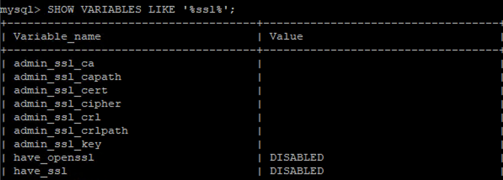
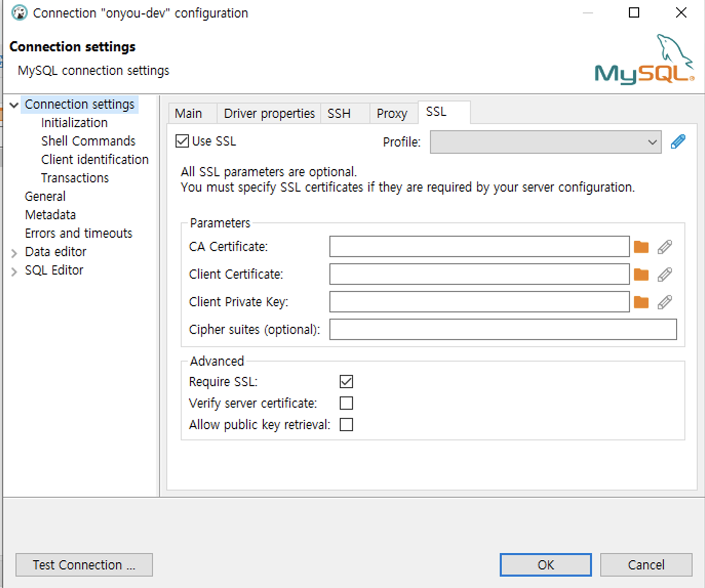

# MySQL 8.0 설치

### 1. 설치가능한 MySQL repository 확인
www.mysql.com/products/community/

### 2. MySQL Repository 설치 

1에서 확인한 yum, CentOS 7버전에 해당하는 repository를 찾아서 설치한다. 직접 찾아서 설치하지 않으면 outdate 될 수 있기 때문에 반드시 mysql홈페이지에서 직접 repostiory찾아야 한다. 
```bash
sudo yum install -y https://dev.mysql.com/get/mysql80-community-release-el7-3.noarch.rpm
```

### 3. MySQL 설치
```bash
yum install -y mysql-server

# mysql version 확인
mysqld -V
```

### 4. MySQL 서버 시작 및 셋팅
```bash
systemctl enable mysqld && systemctl start mysqld && systemctl status mysqld
```

- 아래 명령을 통해 설치된 mysql서버의 root 계정 비밀번호를 알아 낼 수 있음
  - `grep 'temporary password' /var/log/mysqld.log`

### MySQL Secure installation : MySQL 보안 강화하기 
`mysql_secure_installation` 명령을 통해 mysql이 권장하는 보안 관련된 기본 설정을 셋팅한다.
이 과정에서 mysql에서는 root비밀번호 변경을 요청하니까 위에서 알아낸 password를 입력하고 변경하면 된다.
- 나중에 직접 root계정 비번만 변경하려면 아래와 같이 하면 됨 
  - root계정 비밀번호 재설정
    - `ALTER USER 'root'@'localhost' IDENTIFIED BY '{root 비번}';`

- 아래 명령을 통해 mysql에 root로 접속
  - `mysql -u root -p`

- SSL/TLS 설정을 확인한다.
  - `SHOW VARIABLES LIKE '%ssl%';`
  - 확인해보면 have_openssl, have_ssl이 다음과 같이 DISABLE되어 있음을 알 수 있다.
    
  - '/s' 명령을 통해서도 확인 가능하다.
    ```
    mysql> \s
    --------------
    mysql  Ver 8.0.33 for Linux on x86_64 (MySQL Community Server - GPL)

    Connection id:          19
    Current database:
    Current user:           root@localhost
    SSL:                    Not in use
    Current pager:          stdout
    Using outfile:          ''
    Using delimiter:        ;
    Server version:         8.0.33 MySQL Community Server - GPL
    Protocol version:       10
    Connection:             Localhost via UNIX socket
    Server characterset:    utf8mb4
    Db     characterset:    utf8mb4
    Client characterset:    utf8mb4
    Conn.  characterset:    utf8mb4
    UNIX socket:            /var/lib/mysql/mysql.sock
    Binary data as:         Hexadecimal
    Uptime:                 13 min 49 sec

    Threads: 2  Questions: 21  Slow queries: 0  Opens: 150  Flush tables: 3  Open tables: 69  Queries per second avg: 0.025
    --------------
    ```
- 기본적으로 /var/lib/mysql 디렉토리에 보면 SSL/TLS 인증서와 key파일이 mysql설치와 함께 생성되었음을 확인할 수 있지만 없는 경우라면 아래 명령어를 실행하면 생성된다.
  - `mysql_ssl_rsa_setup --uid=mysql`

이렇게 하고 나서 mysql을 재기동하면 SSL이 적용되었음을 확인할 수 있다. 만약에 MySQL이 정상적으로 적용되었다면 위의 확인 과정에서 have_ssl, have_openssl이 'YES'상태로 변경되어야 하며 다음 명령을 통해 mysql 접속이 가능해야 한다.
```
mysql -u root -p --ssl-mode=required
```

### 업무 Database 및 계정 생성
  - `CREATE DATABASE '{DB명}';`
- 계정 생성 
  - `CREATE USER '{계정명}'@'%' IDENTIFIED BY '{password}`;
    - '%'로 해줬기 때문에 외부 어디서든 해당 계정을 통해 DB 접속가능
  - 계정에 대한 권한 부여
    - `GRANT ALL PRIVILEGES ON {계정명}.* to '{계정명}'@'%' WITH GRANT OPTION;`
    - `GRANT ALL PRIVILEGES ON '{DB명}'.* TO '{계정명}'@'%';`
    - `flush privileges;`

### MySQL 접속하기 
MySQL 서버를 접속하려는 dbeaver 클라이언트에서는 SSL 탭에서 'Verify server certificate'를 해제하고 'Require SSL'을 선택한다. 
- mysql서버에서 자체 인증한 인증서이고 CA에서 발급받은게 아니기 때문에 Verify server certificate를 해제 해주는 것이다. 



- 호스트 서버에서 DB서버 접속할 수 있도록 DB서버에서 방화벽을 해제하는 정책을 설정한다.  
  ```bash
  sudo firewall-cmd --zone=public --add-rich-rule='rule family="ipv4" source address="<NAT switch IP>" port port="3306" protocol="tcp" accept' 
  sudo firewall-cmd --runtime-to-permanent # 영구적으로 해당 룰 적용
  ```

### 5. DB구성 및 데이터 마이그레이션
- Source DB에 dbeaver로 접속하여 [데이터베이스] - [도구] - [새로운 task] - [MySQL dump] 를 활용하여 현재 데이터베이스의 dump를 떠서 저장한다. 
- Destination DB의 local에서 root계정으로 접근하여 migration을 위한 임시계정을 생성하여 super권한을 부여한 후, 마이그레이션 하고자 하는 DB에 대한 권한도 추가한다. 
  ```
  GRANT ALL PRIVILEGES ON `{DB명}`.* TO 'migrationuser'@'%';
  ```
- 생성한 DB에서 [우클릭] - [도구] - [Execute Script]에서 Source DB에서 dump 떠둔 .sql파일을 실행시킨다. 


성공적으로 resotre 됐다는 메시지가 뜨면 끝이다.

오늘의 결론 : AWS 최고

---
## 참고자료
- https://arctype.com/blog/mysql-ssl/
