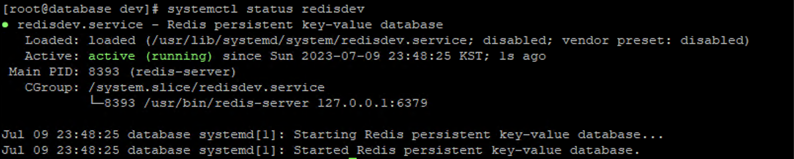

## Redis 설치
```bash
sudo yum install epel-release # EPEL 저장소 설치 
sudo yum install https://rpms.remirepo.net/enterprise/remi-release-7.rpm #Remi 저장소 설치
sudo yum update 
sudo yum --enablerepo=remi install redis  # Redis 패키지 설치 
```
remmi repo를 사용하지 않고 그냥 yum install하게 되면 redis3버전이 latest이므로 반드시 remi repo를 사용해야 한다. 

## Redis 실행
```bash
sudo systemctl start redis # Redis 실행
sudo systemctl enable redis # 부팅 시 시작되도록 설정 
```

## Redis 구축

## 개발계 Redis 설정
redis를 설치한 현 상태에서는 systemctl 명령어로 단일 'redis' 서비스만 관리할 수 있다. 나는 개발계용 redisdev service부터 운영용 redis1, redis2, redis3 service를 관리하고 싶은 상황이다.
따라서 최초에 실행 한 redis를 redisdev라는 서비스로 띄우고, 관련된 설정도 수정하고자 한다. 
- 기존에 실행되고 있는 redis service를 내린다. `systemctl stop redis`
-  /usr/lib/systemd/system/redis.service -> redisdev.service로 명칭 변경
- /etc/redis.conf의 이름을 redisdev.conf로 변경하고, 해당 파일 내에 redis 관련된 path를 변경한다. 변경 한 경로의 디렉토리는 반드시 생성해주어야 할 뿐만 아니라 권한 또한 redis 계정이 접근 가능하도록 **chown을 이용하여 반드시 redis 계정의 권한으로 변경해주어야 한다.**
  - log 파일 저장 dir 변경 : /var/log/redis/redis.log -> /var/log/redis/dev/redis.log
  - redis data dir 변경 : /var/lib/redis -> /var/lib/redis/dev
- redisdev.service 를 편집하여 /etc/redis.conf가 아닌 /etc/redisdev.conf를 참조하여 redis를 실행 하도록 설정한다. 
- `systemctl daemon-reload` 하여 변경사항이 적용되도록 하고, `systemctl start redisdev` 를 실행하여 변경된 설정으로 개발용 redis가 정상 기동 하는 지를 확인한다. 
  - log와 dump.rdb파일 생성 확인 : dump.rdb파일 생성 확인하려면 다시 재기동 해보면 된다. 
  

### 개발계 Redis 데이터 이관 
- 기존 redis 서버에 redis-cli로 접속하여 'SAVE'라는 명령을 입력하면 redis의 데이터 디렉토리에 dump.rdb라는 파일이 저장된다. 
  - redis의 데이터 디렉토리는 redis.conf에서 'dir /path' 형태로 확인 가능하다.
- 덤프 뜬 dump.rdb파일을 이관 대상의 redis 서버의 데이터 디렉토리(나의 경우 위에서 /var/lib/redis/dev로 설정)에 옮겨 두고 redis를 재기동하면 데이터가 redis에 올라갔음을 확인할 수 있다. 
- redis 버전 호환이 안되면 이관이 잘 안된다. 나도 이관 대상 서버에 아무 생각없이 yum으로 최신 버전 redis를 설치했는데 yum에서 패키지관리를 안해주고 있었고 그게 redis3 버전이었어서 기존의 redis7에서 추출한 dump.rdb를 data directory에 위치시키고 기동 했을 때 redis가 정상적으록 기동이 안됐었다. 반드시 최초 설치 때 이관 될 서버는 기존 서버 대비 동일한 버전 혹은 상위 버전의 redis가 설치되도록 하자. 


----
## Redis 설정
kubernetes 클러스터 내에 띄워져 있는 모든 application pod에서 db서버에 설치 된 redis가 접속가능하도록 하기 위해서, redis를 pod로 띄우진 않았지만 redis 전용 service를 생성하여 redis서버로 로드밸런싱 되도록 한다. 
- /etc/redis.conf 설정 수정
  - bind 192.168.212.0/24 설정 추가 : k8s 모든 노드 대역으로부터의 access를 허용
  - 'protected-mode yes' -> 'protected-mode no'로 수정
  - sudo systemctl restart redis 재기동
- ExternalName 타입의 redis-service 생성
  - 아래 예시와 같이 redis
  ```yaml
  apiVersion: v1
  kind: Service
  metadata:
    name: redis-service
  spec:
    type: ExternalName
    externalName: <redis server ip>
    ports:
      - port: 6379
  ```
  - spring application.yaml에서는 아래와 같이 redis-service를 host로 지정만 해주면 됨
  ```yaml
  spring:
  redis:
    host: redis-service
  ```
여기까지 하면 redis 설치/실행 및 k8s 클러스터 application pod에서의 redis 접속 환경까지 설정되었다. 
