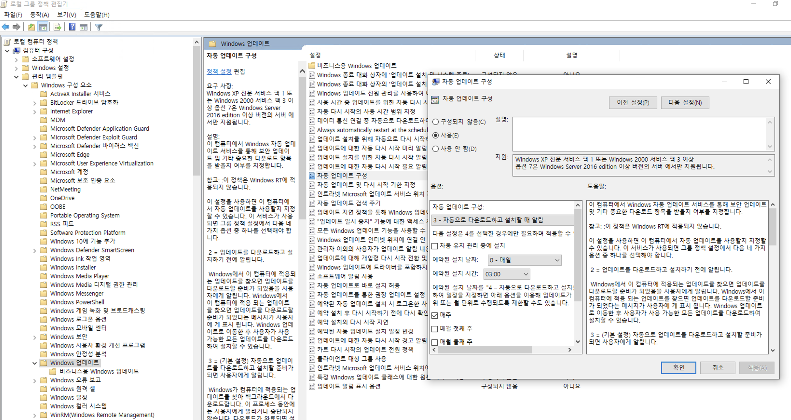
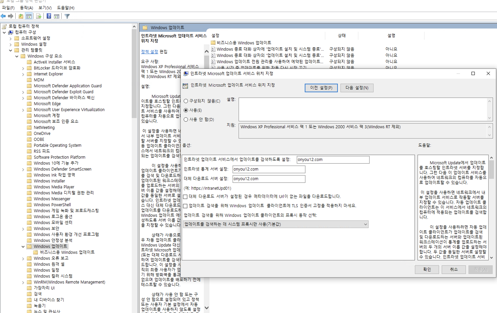
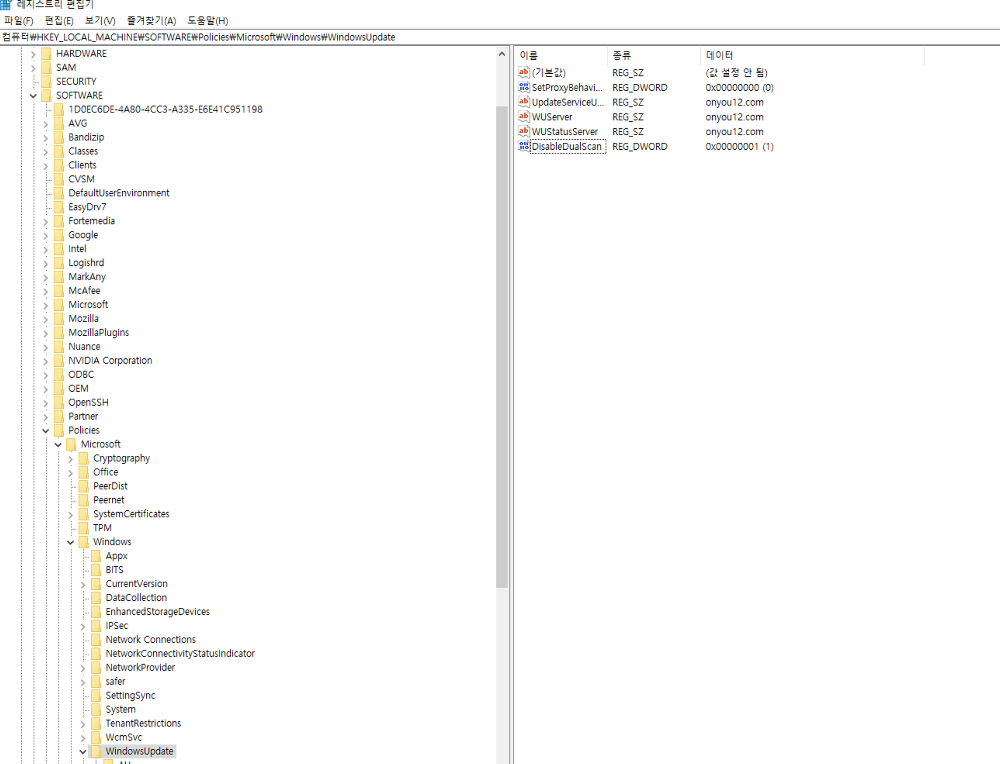

홈 서버로 API 서버를 운영 중에 이벤트 뷰어 상에서 Windows 자동 업데이트 및 Kernel power 이벤트로 자꾸 서버가 재부팅되며 운영 상에 문제가 발생하였다.
이를 해결하기 위한 방법에 대한 글이다.

## 윈도우 OS 자동 재부팅 방지
- 관련 이벤트 : 1074
- 기존에는 아래와 블로그 글과 같은 해결 방법을 통해 자동 업데이트 차단이 가능했으나 이제는 불가능하다.
  - https://igotit.tistory.com/entry/%EC%9C%88%EB%8F%84%EC%9A%B0-10-%EC%9E%90%EB%8F%99%EC%97%85%EB%8D%B0%EC%9D%B4%ED%8A%B8-%EC%9E%90%EB%8F%99%EC%9E%AC%EB%B6%80%ED%8C%85-%EB%B0%A9%EC%A7%80-%EC%84%A4%EC%A0%95%ED%95%98%EA%B8%B0

### Window 10 프로 홈서버 OS 자동 업데이트 방지 방법 업뎃
#### 1. gpedit.msc 로 그룹 정책 편집기 열기 
- 컴퓨터 구성 - 관리 템플릿 - Windows 구성 요소 - Windows 업데이트에서 '자동 업데이트 구성'을 선택한 후 '사용 안함' 을 '사용'으로 바꿔주고, 정책을 3번 : 자동으로 다운로드 하고 설치할 때 알림' 으로 설정해 준다. 이렇게 하면 자동으로 업데이트를 다운 받지만, 설치 자체는 사용자의 동의 하에 수동으로 할 수 있게 된다. 

  

#### 2-1. 인트라넷 환경인 것 처럼 설정하기
- 위와 같이 자동 업데이트 설정을 변경하기만 해도 OS 업데이트로 인한 재부팅을 대부분 방지 할 수 있지만, 위와 동일 경로에서 '인트라넷 Microsoft 업데이트 서비스 위치 지정'을 하게 되면 업데이트 소스를 인터넷 MS 클라우드가 아닌 인트라넷으로부터 받아오게 설정할 수 있다. 그리고 여기에 존재하지 않는 dummy 도메인을 적어주게 되면 OS 업데이트 자체를 방지할 수 있다. 

  
- 정책 바로 적용하기 : cmd 관리자 권한으로 열고 `gpupdate /force` 실행 

#### 2-2. DualScan 비활성화 하기
- 그런데 2-1과 같이 정책 설정을 하더라도, Windows는 기본적으로 'DualScan' 이라는 것이 있어서 인트라넷에서 못 받아오면 다시 MS 클라우드로부터 가져오도록 시도하게 되는데, Registry 편집기에서 HKEY_LOCAL_MACHINE\SOFTWARE\Policies\Microsoft\Windows\WindowsUpdate 위치에 DWORD로 'DisableDualScan' 값을 1로 하여 키를 추가하게 되면 DualScan이 차단되어서 반드시 인트라넷 도메인으로부터만 업데이트를 시도하게 되고 그건 실재하지 않는 주소이기에 OS 업데이트가 원천 차단되게 된다. 

  
   

- 레지스트리는 정책과 달리 반드시 서버를 재부팅해줘야만 변경사항이 적용된다! 

### 이벤트 41 : Kernel-power 
이거는 파워 공급 불안정이 이유일 수도 있고, 다른 하드웨어적인 이유일 수도 있어서 원인 파악이 매우 어렵다. 
콘센트를 바꿔 꽂아보라는 얘기가 있는데 시도해봐야 할듯. 

---
## 참고자료
- 이벤트 뷰어를 통해 OS 다운 관련 이벤트 확인하기 : https://m.blog.naver.com/toruin84/222376936262
- https://coolenjoy.net/bbs/tip/409629
- https://www.youtube.com/watch?v=OlGY64Usez0
  - 마지막 단계의 '전원 문제 마법사' 는 실행하고 나서 불필요하게 오히려 절전 모드로 변경된다던가 하는 설정 변경이 자동 적용되어버렸는지 검수하고 복구 필요할 수도 있음. 
