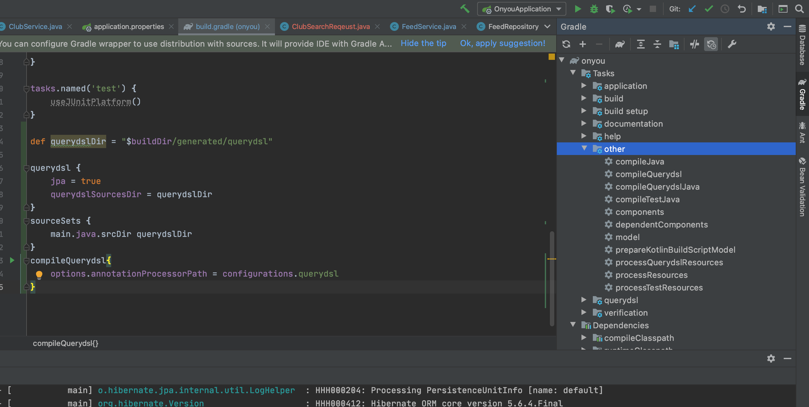

## 1. QueryDSL이란? 
**QueryDSL은 Java 코드로 쿼리를 짜서 DB에 접근하는 방식이다.** 

기존 데이터 접근 방식인 jdbcTemplate, Mybatis 와 같은 방법에서는 직접 SQL 쿼리를 짜야만 했다. 

JPA에서는 Spring data jpa를 통해서 조회 조건이 간단한 쿼리 같은 경우에는 별도의 쿼리를 짜지 않고도 DB로부터 데이터를 불러 올 수 있었다.

그러나 복잡한 조회가 필요할 경우 불가피하게 JPQL을 통해서 아래와 같이 쿼리를 직접 짜야 했다. 

```java
public void jpql(){
  String username = "jang";
  String query = "select m from Memberqwer m where m.username = :username";
  List<Member> result = em.createQuery(query, Member.class).getResultList();
}
```

그러나 QueryDSL을 사용하면 아래와 같이 자바코드의 형태로 쿼리를 짤 수 있고 여러가지 장점이 있다.

  - 컴파일 타임에서 에러를 잡을 수 있다.
  - 코드 자동 완성의 도움을 받을 수 있다.
  - 동적쿼리를 편하게 짤 수 있도록 도움을 준다.
  - 메소드를 뽑아 낼 수 있어 재사용이 가능하다. 
  - parameter 바인딩을 자동으로 해준다. 


```java
public void querydsl(){
  String username = "jang";
  List<Member> result = queryFactory
        .select(member)
        .from(member)
        .where(usernameeq(username))
        .fetch();
}

private BooleanExpression usernameEq(String username){
  return member.username.eq(username);
}
```

<br>

Spring data JPA와 QueryDSL을 함께 활용하면 RDB를 사용한 개발환경에서 
개발자는 자바를 통해 쿼리를 자유롭게 짤 수 있고, 핵심 비즈니스 로직에 집중할 수 있게 된다. 


## 2. 환경설정 ( gradle )

기존에 jpa를 사용하던 스프링부트 프로젝트 기준으로 아래와 같은 내용을 build.gradle에 추가해주면 된다.

```groovy
// 1. queryDsl version 정보 추가
buildscript {
    ext {
        queryDslVersion = "5.0.0"
    }
}

plugins {
    id 'org.springframework.boot' version '2.6.3'
    id 'io.spring.dependency-management' version '1.0.11.RELEASE'
    // 2. querydsl plugins 추가
    id "com.ewerk.gradle.plugins.querydsl" version "1.0.10"
    id 'java'
}

//...

dependencies {
    // 3. querydsl dependencies 추가
    implementation "com.querydsl:querydsl-jpa:${queryDslVersion}"
    implementation "com.querydsl:querydsl-apt:${queryDslVersion}"
    //...
}

test {
    useJUnitPlatform()
}
/*
 * 4. queryDSL 설정 추가
 */
// querydsl에서 사용할 경로 설정
def querydslDir = "$buildDir/generated/querydsl"
// JPA 사용 여부와 사용할 경로를 설정
querydsl {
    jpa = true
    querydslSourcesDir = querydslDir
}
// build 시 사용할 sourceSet 추가
sourceSets {
    main.java.srcDir querydslDir
}
// querydsl 컴파일시 사용할 옵션 설정
compileQuerydsl{
    options.annotationProcessorPath = configurations.querydsl
}
// querydsl 이 compileClassPath 를 상속하도록 설정
configurations {
    compileOnly {
        extendsFrom annotationProcessor
    }
    querydsl.extendsFrom compileClasspath
}
```

이렇게 설정하고, intellij 우측의 gradle 탭의 [other] 디렉토리 하위의 compileQuerydsl을 더블 클릭 해보자. 



<br>

그러면 $buildDir/generated/querydsl 디렉토리 하위에 Q로 시작하는 클래스 파일들이 생성되는 것을 확인할 수 있다.
앞으로 빌드할 때도 compileQuerydsl의 작업까지 포함해서 수행해주게 될 것이다. 끝~!


