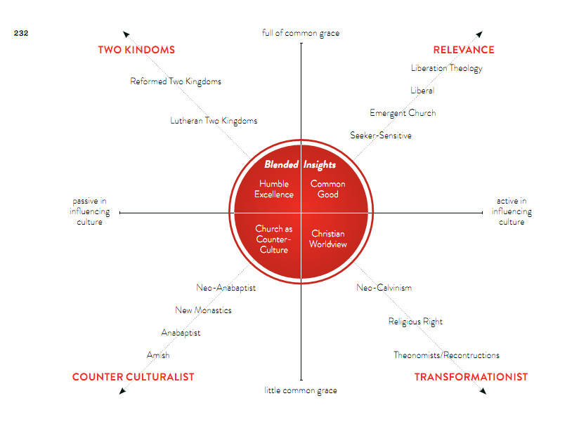

Part5-1까지 잘 정리하다가 갑자기 책의 마무리다..
사실 Part6에서8은 실제 사역에 대한 부분이라 읽으면서도 나로서는 크게 와 닿는 내용은 없었고, 함께 하는 사람들도 비슷한 느낌을 공유했던 것 같다.
그래서 목사님께 Part6~8에 대한 마무리 강의를 요청했고 간단한 나눔, 그리고 목사님의 간증, 비전 ( ? ) 같은 생각을 들었다. 
들으면서 들었던 생각은 목사님의 비전은 정말 크고 길다는 것, 그리고 그렇기에 시광교회는 아직도 갈 길이 멀며 나는 그 속에서 무엇을 할 수 있을까라는 생각이었다. 

 
미처 다 정리하지 못한 Part5-2,5-3을 간단히 요약하자면, 팀 켈러 목사님은 기독교 세계관 안에서도 나뉘어 있는 여러가지 문화관('여러가지 모델들')에 대해서 설명한다. 
아래 그림은 이를 총망라하여 정리한 것이다.

 
 

왼쪽에 있는 모델들은 문화에 참여하고 변혁하려는 시도들이 혼합주의와 타협으로 연결된다고 생각하며, 따라서 그리스도인들에게 문화를 변화시키기 보다는 "교회가 되라"라고 요구한다.
오른쪽에 있는 모델들이 왼쪽에 있는 모델을 바라볼 때 '이원론과 도피' 라고 비판할 수 있다. 
그림의 아래쪽에 위치한 모델들은 일반 은총을 그다지 믿지 않고 세상과 하나님 나라의 가치간에 근본적 차이가 있다고 생각한다. 위쪽에 있는 모델들은 반면, 문화 속에서 비신자들과의 공통지대를 찾으려는 것에 훨씬 적극적이다. 

팀켈러에 따르면 기독교 안에서도 문화를 바라보는 다양한 관점과 모델들이 존재하지만, 크게 4가지 모델로서 분류하였다.
#### 1. 반문화주의 모델 (Counter culturalist)
- 극단적으로는 amish 공동체와 같이 기본적으로 문화를 배척하고 죄악시 하는 모델이다. 문화에 영향을 끼치는 것, 일반은총에 있어 모두 소극적이다. 
- **<u>복음적 관점(blended insight)로서의 반문화주의 모델은 '대항문화로서의 교회'를 제시할 수 있는 것이다.</u>**
#### 2. 적절성 모델 (Relevance)
  - 반문화주의와는 반대 개념으로 볼 수 있으며, 문화를 적극적으로 수용하는 모델이다. 시대의 문화와 상호작용하는 구도자 중심 교회에서부터 극단적으로가면 해방신학을 포함하는 모델이다. 
  - **<u>복음적 관점(blended insight)로서의 적절성 모델은 교회가 세상에서 '공공선' 을 구현하는 데 힘 쓰는 것이라고 할 수 있겠다.</u>**
#### 3. 두 왕국 모델 (Two kingdoms)
- 두 왕국 모델은 하나님이 전 세계를 통치하지만 보편적 왕국과 구속적 왕국이라는 별개의 방법으로 통치하신다고 보는 관점이다. 
  - 보편적 왕국에 따르면 그리스도인들은 비신자인 이웃과 함께 하나님의 일반 은총에 따라 삶을 영위하는 공동 시민으로서 일해야 한다. 즉 공동의 나라에서 이웃들을 사랑하고 섬기는 것이다. 
  - 구속적 왕국에 따르면 오직 그리스도인들만이 이 왕국의 구성원이며 이들은 일반 은총이 아닌 하나님 말씀의 특별 계시를 통해서만 통치를 받는다.
  - 두 왕국 모델은 개혁주의자들로부터 지지를 받지만, 신칼빈주의자들이 주장하는 아브라함 카이퍼의 변혁주의 모델과는 상당히 다르다. 두 왕국 모델은 "일상적으로 업무를 행하는 독특한 기독교적 방식"을 찾지 말라고 하며, 신자들은 구별적인 기독교 문화를 창조하지는 않는다 라고 말한다. 정치, 경제의 이념과 관련해서도 매우 중립적으로 바라본다. 
- 두 왕국 모델은 크게 루터교 두 왕국과 개혁주의 두 왕국으로 나눠볼 수 있다.
  - 루터는 두 왕국을 세상과 교회의 영역으로 구분 짓지 않고, 육적 영역과 영적 영역으로 나누었다. 루터에게 가시적 교회는 실제로 보편적 왕국의 일부로 간주되고, 비가시적 교회는 신자들의 신비적 연합으로 보았다. 즉 루터는 교회와 정부의 현격한 분리를 믿지는 않는 반면, 개혁주의 두 왕국 모델을 따르는 이들은 반드시 분리가 필요하다고 보았다. 
  - 개혁주의 두 왕국 모델 내에서도 교회가 세상을 변혁하려는 목적을 가져서는 안되지만 그리스도인 개별 신자들은 윌리엄 윌버포스와 같이 세상 속 소금이 되어 사회를 변화시키려고 애써야 한다고 주장하는 견해와 그것까지 반대하는 견해로 갈리기도 한다. 
- **<u>복음적 관점(blended insight)로서의 두 왕국 모델은 교회 또는 신자가 세상에서 비그리스도인과 함께 일반 은총 아래 보편적 왕국을 이루어가는 '탁월성'과 비그리스도인들에게 주어진 일반 은총의 빛 으로부터 겸손히 배울 줄 아는 '겸손'의 덕목을 갖추는 것이라고 할 수 있겠다.</u>**

#### 4. 변혁주의 모델 (Transformationist)
- 변혁주의 모델은 그리스도인과 교회는 세상에서의 직업과 삶의 영역을 통해 문화에 관여하고 문화를 바꿔야 한다는 견해이다. 아브라함 카이퍼로 대표되는 신칼빈주의자들이 해당 견해를 받아들인다. 
- 카이퍼는 그리스도인들은 삶의 모든 영역에서 그리스도인으로서 구별되게 생각하고 행동해야 하며 그 모든 문화적 행동들이 신앙적 가치의 집합을 전제로 이루어진다고 보았다. 또한 그리스도인으로서 기독교 신앙을 의식하고 살아간다면 이 신앙으로 인해 모든 일들이 영향을 받을 것이고, 문화를 만드는 나의 작업이 사회에 어떤 방식으로든 영향을 끼칠 수 밖에 없고, 그렇기에 결과적으로 그리스도인은 문화를 바꾸게 되는 것이라고 보았다. 
- 어떻게 변혁할 것인가에 대해서는 정치를 통해 변화시켜야 한다고 보는 종교적 우/좌파가 있고 교육을 통한 변혁을 얘기하는 신칼빈주의자들이 있다. how? 에서 어떤 방식을 취하느냐에 따라 똑같이 세상과 문화를 그리스도인이 변혁해야 한다는 입장에서도 매우 극단적으로 다른 양상을 보일 수 있겠다는 생각이 든다. 
- **<u>변혁주의 모델로부터는 복음적 관점(blended insight)에서 기독교 세계관을 바탕으로 적극적으로 세상을 살아가는 자세를 배울 수 있겠다.</u>**

 

개인적으로는 그리스도인으로서 때로는 같은 신자임에도 불구하고 위의 여러가지 모델들이 보여주듯이 너무나 다양한 신앙의 색깔과 가치관을 마주하게 될 때 같은 그리스도인이라는 것이 공허하게 느껴지기도 한다.
그러나 극단에 치우지지 않고 4가지 모델을 복음적 관점에서 건강하게 수용한다면 구도자들에게 거부감 없이 복음을 전하고 세상의 공공선에 기여하면서도 대항문화를 제시할 수 있는 교회를 세워갈 수 있을 것이다. 그리고 그리스도인 개인의 삶에서도 세상의 문화를 수용하고 적극적으로 비그리스도인으로부터 배우고 소통하되, 한편으로는 하나님 나라를 소망하며 세상의 빛과 소금이 되어 부르신 곳에서 조금씩 세상을 변화시키는 자로서의 복음중심적 삶을 제시할 수 있을 것이다. 

---

## 센터처치 소회
도시 선교에 대한 반감, 호기심, 의문 등 다양한 이유로 시작된 도사까(도시를 사랑할 수 있을까) 모임은 센터처치를 읽으며 나를 포함하여 구성원들이 도시 선교에 대한 복음적, 성경신학, 실제적 근거와 비전을 얻을 수 있도록 도와주었다. 특히 반감을 가지고 있던 나의 도시선교에 대한 생각이 많이 바뀌었을 뿐만 아니라 나아가 내가 속한 시광교회의 비전과 현재에 대해 고민하고 나눌 수 있는 좋은 기회이기도 했다. 책의 내용이 워낙 방대하고 명시적으로, 함축적으로 담고 있는 신학적 내용이 너무 많아서 완전히 소화하기엔 어려운 책임이 분명하지만 반대로 팀 켈러 목사님의 신학과 목회 철학, 도시 선교에 대한 비전 등에 대해서 가장 압축적으로 배울 수 있는 좋은 책임에는 틀림없는 것 같다. 책 한권 읽고 아는 체 하는 인간이 가장 무식하고 무섭다고 하지만, 이 책의 내용을 기반으로 책에서 언급된 여러가지 개념과 내용에 대해서 top-down 방식으로 찾아가면서 더 공부한다면 나 같은 평신도 입장에서는 신학을 공부하기에 아주 좋은 지침서가 될 수 있을 것 같다. 