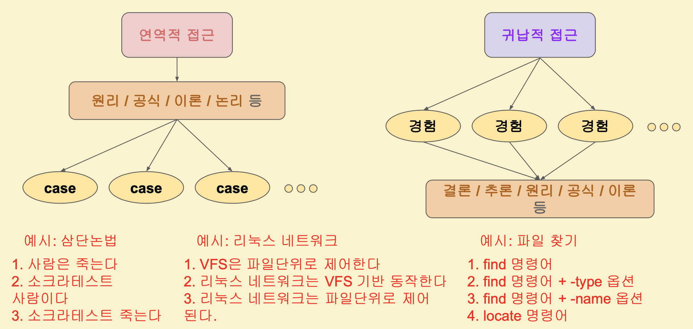

## 문제란 무엇인가? 
- 문제란 목표와 현 상황의 차이(Gap)이다.
  - 따라서 단순히 에러 메시지가 어떻다에서 그치지 않고 목표를 정확하게 잘 정의하는 것이 중요하다. 

### 문제 해결의 다양한 접근 방법 1 : "문제의 현상과 원인은 다르다"
예를 들어 보자.
- 문제의 현상 : 파일 생성 오류 
  - 파일 생성 오류가 나는 것은 root cause가 아니라 현상이다. 따라서 이에 대한 원인을 하나씩 찾아나가는 것이 중요하다.

### 문제 해결의 다양한 접근 방법 2 : "잘게 쪼개고 구체화하라"
- 절차, 단계, 열거, 관찰, 점검
  - 리눅스 / 네트웍이 어떻게 원래 돌아가는 지 알아야 절차와 단계, 열거를 할 수 있다.
  - 2~3 depth까지는 왜 되는지? 에 대해서 알아야 한다. 

### 문제 해결의 다양한 접근 방법 3 : "연역적 접근 vs 귀납적 접근"

- 연역적 접근 방식 만으로는 변수와 예외가 너무 많기에 해결이 안될 수도 있다. 따라서 경험을 기반으로 한 귀납적 접근 방식을 통한 해결 도출이 필요할 수 있다.
- 그러나 문제의 scope을 결정 짓기 위해서는 연역적 접근 방식이 매우 도움이 된다. 

### 문제 해결의 다양한 접근 방법 4 : "근본원인 ( root cause ) 를 찾자"

---

## 리눅스 패키지
### 패키지란 ? 
- 다양한 프로그램들을 어떻게 관리할 것인가? 
  - vim 패키지 : vim 프로그램을 위한 여러가지 파일들의 '묶음' 이다. 

#### 배포판 버전과 코드명을 확인하는 방법
- 배포판에 따라 코드명이 달라지고 이에 따른 문제가 발생할 수 있다. 따라서 배포판을 확인하는 것은 중요하다. 

#### apt와 apt-get의 차이점
- apt는 apt-get, apt-cache 를 한 번에 다룰 수 있게 사용자 편리 목적으로 만들어짐
- apt는 내부적으로 apt-get을 사용하게 되고 apt-get을 사용 시 세부적인 옵션까지 더 활용가능 하다. 

#### 패키지 관리 구조
패키지 관리의 구조를 파악하고 있어야 문제 상황에 대해서 어떤 scope에서 문제가 발생했는 지 알 수 있다. 

- /etc/apt/source.list에 보면 여러 url이 존재하고 이 url을 근거로 공식 패키지 저장소에서 패키지를 가져오게 된다. 
  - Redhat기준으로는 /etc/yum.repos.d/
  - source.list.d 는 외부 패키지 저장소에 대한 정보를 가지고 있고 여기서 404와 같은 오류가 발생할 가능성이 있다.
- /var/lib/apt/lists, /var/cache/dnf/*/repodata 에 패키지 정보를 캐시로 담고 있다.
  - `apt-get-update` 명령을 하게 되면 이 경로를 채워주게 된다.
  - `apt-cache search nodejs` 와 같은 명령을 하게 되면 이 경로에서 가져오게 된다. 
  
- /var/cache/apt/archives, /var/cache/dnf/*/packages
  - apt-install하면 이 경로에 패키지 파일이 설치되게 되고, redhat계열에서는 packages 경로에 패키지가 임시로 설치되었다가 사라진다. 

### 패키지 관련 문제 사례 

#### 패키지 락 
- 자동 upgrade 가 crontab등으로 인해 진행 중이었을 때 명시적으로 apt-get upgrade 명령을 하게 되면 패키지 관리자가 동기화 문제로 인해 락을 건다. 
- 무조건 락 파일을 지우는 것은 문제가 될 수도 있다. 
- 권한

#### apt install 도중에 생기는 사례
- 

- 의존 패키지를 삭제하게 되면 그걸 의존하고 있는 다른 패키지에서 문제가 발생할 수 있다. `--fix-broken`

#### apt install 통해 받을 수 없거나 동작에 문제가 있는 경우

- 이 때 문제점은, 의존성 패키지까지 확인하여 모두 수동으로 받아야 한다. 

#### 패키지가 어디에 설치되는지 모를 경우 : tree 활용

#### 어디에 설치되는지 모를 경우

- df -h가 안찼을 경우 df -i 를 확인하여 파일의 개수가 많아서 inode가 다 찼는지도 확인해야 한다. 
#### 디스크 용량 확보 tip 
  - 

####