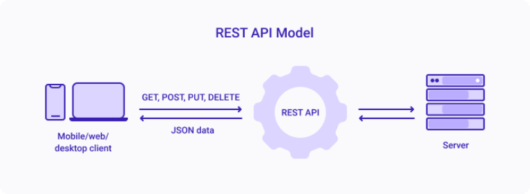

REST에 대해서 웹 문서들을 살펴보면 여러가지 표현들로 설명하고 있는데, 그것을 조합해서 내가 이해하기 쉽게 정의하자면 아래와 같다.

**_"REST API란 HTTP Method를 사용하여 HTTP URI 형태로 명시된 리소스를 처리(CRUD) 하도록 설계된 클라이언트와 서버 간의 통신 방식이다"_**



클라이언트가 GET, POST, PUT, DELETE 등의 HTTP 메소드를 통해 URI로 서버에 요청하게 되면 서버는 해당되는 리소스에 대한 CRUD를 처리하고 클라이언트에 JSON 데이터를 반환한다.

---

## REST API의 구성 요소

**1. Resource**

: REST에서는 resource의 정보를 표현할 수 있어야 하며 이를 위해 URI를 사용한다.

**2. Method**

: resource에 대한 행위를 표현하며, HTTP의 GET(조회), POST(추가), PUT(수정), DELETE(삭제) 메소드를 사용한다.

**3. Representaion**

: REST에서 representation(표현)이란 클라이언트가 서버로 부터 받는 JSON 데이터를 말한다

<br>
예를 들어통해 이해해보자.
학사 관리 시스템 서버에 강의(class)과 학생(student)에 대한 REST 요청을 할 경우 아래와 같이 요청할 수 있다. 
<br>

'/api' 는 모든 REST API 요청에 대해서 서버 단에서 공통적으로 설정하는 경로라고 가정하자. (GET, POST), (PUT, DELETE) 에서 보듯이 동일한 URI이지만 다른 HTTP 메소드를 사용함으로써 서버에 다른 CRUD 작업을 요청할 수 있다.

- 강의, 학생 리스트 출력

  - 강의 리스트 : [GET] https://{serviceRoot}/api/classes

  - 1번 강의의 학생 리스트 : [GET] https://{serviceRoot}/api/classes/1/students

- 강의, 학생 추가

  - 강의 추가 : [POST] https://{serviceRoot}/api/classes

  - 2번 강의의 학생 추가 [POST] https://{serviceRoot}/api/classes/2/students

- 특정 강의, 학생 수정

  - 3번 강의 수정 : [PUT] https://{serviceRoot}/api/classes/3

  - 2번 학생 수정 : [PUT] https://{serviceRoot}/api/students/2

- 특정 강의 삭제

  - 3번 강의 삭제 : [DELETE] https://{serviceRoot}/api/classes/2

  - 2번 학생 삭제 : [DELETE] https://{serviceRoot}/api/students/2

---

## REST API의 제약조건 (feat. RESTful하다는 것은?)

Resource, Method, Representation을 모두 사용하여 REST API를 설계한다고 해서 모두 RESTful한 것은 아니다. 아래의 REST API 설계 원칙을 지켜야 비로소 **'API가 RESTful하게 설계되었다'** 고 말할 수 있을 것이다.

1. 클라이언트 - 서버 구조

2. Stateless

Stateless하다는 것은 서버가 클라이언트의 status를 저장 하지 않는다(영향받지 않는다)는 뜻이다. 그래서 클라이언트의 어떤 상태(대표적으로 쿠키,세션과 같은 인증 관련 상태)와 상관없이 A 클라이언트나 B 클라이언트는 'stateless 한 API' 로 부터는 동일한 결과값을 기대할 수 있다는 것이다.

3. Cacheable

REST API는 cacheable해야하며 HTTP를 사용하기 때문에 HTTP cache를 사용하여 이를 충족한다. (Last-modified tag, E-tag)

4. Layered System

API 서버와 관련된 내용이다. REST API의 서버는 로드밸런싱 혹은 암호화 등을 이유로 여러 계층으로 구성될 수 있고, 클라이언트는 중간에 어떤 서버가 있는지 알 수 없다. 대표적으로 3-tier architecrue가 있다.

5. Uniform Interface

   대부분의 REST API는 이 조건을 만족시키지 못하는 경우가 많다. Uniform interface는 4가지를 만족시켜야 하는데 첫 번째 2개는 쉽게 만족되지만 문제는 c,d 2가지를 만족시켜야 하기 때문이다.

   a. Identification of resources (URI를 통해 만족)

   b. Manipulation of resources through representations(HTTP 메소드 + URI를 통해 만족)

   c. Self-descriptive message

   request, response는 모두 그 자체로 스스로를 설명할 수 있어야 한다는 것이다. 그런데 REST의 창시자인 Roy는 이 기준을 꽤나 높게 생각하는 것 같다. 가령 아래와 같은 response 는 self-descriptive하지 않은 것으로 본다.

   ```javascript
   HTTP/1.1 200 OK [ { "op": "remove", "path": "/a/b/c" } ]
   ```

   -> Roy는 이 response는 self-descriptive하지 않다고 볼 것이다. Content-type이 명시되어 있지 않기 때문이다. Content-Type: application/json을 적어주는 것에서 더 나아가서 아래처럼 Content-Type: application/json-patch+json 라고 명세해주어야 비로소 self-descriptive해진단다. 그 외에도 Header의 어려가지 meta 데이터를 최대한 많이 명기해주는 것이 self-descriptive함을 충족시키는데 기여한다.

   ```javascript
   HTTP/1.1 200 OK
   Content-Type: application/json-patch+json
   [ { "op": "remove", "path": "/a/b/c" } ]
   ```

   e. Hypermedia as engine of application state (HATEOAS)
   HATEOAS란 어플리케이션의 상태는 Hyperlink를 통해 전이되어야 한다는 것이다. 이를 만족하기 위해서는 response를 아래와 같이 Link 헤더를 통해 이 리소스와 hyperlink로 연결된 다른 리소스를 가리킬 수 있는 형태로 설계 해주어야 한다.
   <br>

   ```javascript
   HTTP/1.1 200 OK
   Content-Type: application/json
   Link: </articles/1>; rel="previous",
         </articles/3>; rel="next";

   {
     "title": "The second article",
     "contents": "blah blah..."
   }
   ```

   이렇게 만족하기 까다로운 Uniform interface를 REST 원칙에서 고집하는 이유는 바로 '독립적 진화와 상호운용성에 대한 집착' 때문이다.

  <br>

REST API의 설계 원칙 혹은 제약조건은 위 6가지이지만, 이 모든 원칙을 지키는 REST API는 많지 않다. Microsoft에서 2016년에 발표한 REST API 설계 가이드도 아래 원칙을 모두 준수하지는 않는다. 1~4번의 경우는 HTTP 만 잘 따르더라도 보장되지만, Uniform interface는 Self-descriptive와 HATEOAS를 지키지 못해 준수하지 못하게 되는 경우가 많다. 그래도 위와 같은 원칙을 잘 지켜서 설계된 REST API를 우리는 "RESTful하다" 라고 표현한다. 반대로 말하면 현업에서 쓰이는 대부분의 REST API는 self-descriptive와 HATEOAS 원칙을 지키지 못해 완벽히 RESTful하지는 못하다.

---

## 실용적인 REST API 설계 규칙

이제 원칙적인 이야기에서 벗어나 어떻게 하면 RESTful하면서도 실용적인 REST API를 설계할 수 있는 지에 대한 규칙들을 알아보자.

1. URI 설계시에는 소문자를 사용해라

   host는 대소문자를 구분하지 않지만, path는 case-sensitive하기 때문에 대소문자를 섞어서 작성하게 되면 서로 다른 경로가 될 수 있어 소문자로 통일하는 것이 좋다.

2. URI 가독성을 위해 언더바(\_)나 camelCase 대신 hypen(-)을 사용해라

3. URI에 파일 확장자가 포함되어선 안된다.

4. URI 설계 시에 명사를 활용하고 동사를 사용하는 것은 좋지 않지만, CRUD가 아닌 어떤 특정한 동작을 요구할 경우에는 마지막 prefix에 동사를 쓰는 것은 괜찮다.

   ```
   # example
   http://{serviceRoot}/api/{resource paths}/runTestCases
   ```

5. Query parameter를 활용해라

   URI의 쿼리는 collection / store 결과를 페이징 또는 필터링하기 위해 사용된다.

   - 필터링 Ex) GET /classes?professor='Mr.Jang'

   - 페이징 Ex) GET /students?pageSize=10&pageStartIndex=12 // 12번째부터 10개 데이터를 받겠다는 뜻

     - pageSize : Response에 리턴 될 데이터(element)의 양을 지정

     - pageStartIndex : Index의 0으로 시작될 부분을 지정

​

6. Header를 통해 meta 데이터를 전달해라

   Request의 예시를 보자, 아래와 같이 students리소스에 대해서 html 또는 xml으로만 응답을 받겠다고 요청할 수 있다. 만약에 서버에서 이 미디어 타입을 지원할 수 없다면, 406 상태코드로 response해주어야 한다.

   ```
   GET /students HTTP/1.1
   Host: example.org
   Accept:text/html,application/xml
   ```

   Response의 경우, 아래와 같은 meta 데이터를 클라이언트에 전달 할 수 있다.

   ```
   Last-Modified: Tue, 15 Nov 1994 12:45:26 GMT
   Content-Length: 348
   ```

7) response에 HTTP 상태코드를 전달해라

   200부터 503에 이르기까지 HTTP 에서 정의한 다양한 HTTP 상태코드를 각 요청에 대한 서버의 상황에 맞게 응답해주어야 한다.

---

### 참고자료

- 보다 자세하고 구체적인 REST API 설계 규칙을 원한다면 이 책 (http://www.yes24.com/Product/Goods/8807236)을 참고하자. 굳이 책을 살 필요없이 목차에 규칙이 다 나와있기 때문에 목차 정리만으로도 대부분의 REST API의 설계 규칙들을 정리할 수 있을 것 같다.

* https://www.theteams.kr/teams/371/post/64360 ( RESTful API를 설계하기 위한 디자인 팁 )
* https://www.youtube.com/watch?v=RP_f5dMoHFc ( 그런 REST API로 괜찮은가 )
* https://changrea.io/Web/rest-api-design-1/ ( REST API와 설계원칙 )

​
